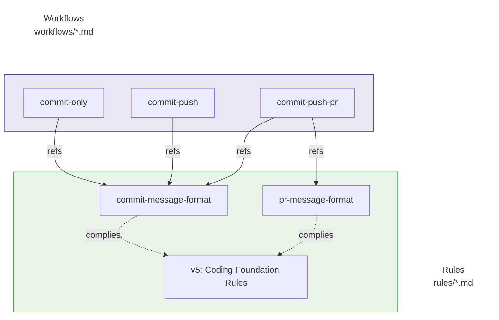
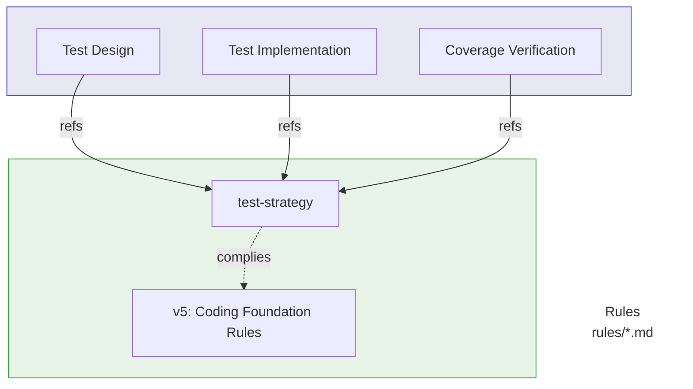

# Guide to Separating Rules and Workflows

This document explains how to separate **rules (custom instructions)** and  
**workflows (custom commands)** in this repository, and how to use them effectively.

## Terminology

- **Rules**  
  Files that define how the model should behave or format outputs.  
  These are always loaded as part of the agent's context.
  - **Windsurf**: `.windsurf/rules/*.md`
  - **Antigravity**: `.agent/rules/*.md`
  - Examples: commit message rules, PR message rules, test strategy rules.

- **Workflows**  
  Files that define frequently used Git operations or development flows.  
  These are invoked explicitly as commands (e.g. `/commit-only`, `/commit-push`).
  - **Windsurf**: `.windsurf/workflows/*.md`
  - **Antigravity**: `.agent/workflows/*.md`
  - Examples: commit-only, commit+push, commit+push+PR creation.

## Basic Policy

1. **Rules define “what” and “how to write it”**
   - Rules specify message formats (titles, summaries, sections), required fields, and forbidden patterns.
   - Examples:
     - `commit-message-format.md`: Defines the format for commit messages  
       (Prefix + summary + bullet-list body), language selection (`language`),  
       and the requirement to base messages on the actual diff.
     - `pr-message-format.md`: Defines the structure of PR titles and bodies  
       (Overview / Changes / Technical details / Tests / Related issues).
     - `test-strategy.md`: Defines how to design tests (equivalence classes, boundary values,  
       Given/When/Then comments, coverage goals, etc.).

2. **Workflows define “how to execute safely”**
   - Workflows describe concrete command sequences such as `git add`, `git commit`, `git push`,  
     and optional quality checks.
   - They **do not** restate the detailed rules; instead they point to rule files.
   - Examples:
     - `commit-only.md`: Minimal flow to commit local changes  
       (`git add -A` → `git commit -m "$MSG"`), assuming `MSG` follows `commit-message-format.md`.
     - `commit-push.md`: Template for commit + push, including branch checks and optional quality checks.
     - `commit-push-pr.md`: Template for commit + push + PR creation using AI (MCP) or `gh pr create`,
       assuming commit and PR messages follow their respective rule files.

3. **Project-specific policies live in rules or README/CONTRIBUTING, not in workflows**
   - Examples of project policies:
     - “No direct commits to main”
     - “Allowed prefixes for titles”
     - “Required sections in PR descriptions”
   - Workflows should show **examples** of how to apply those policies, but the normative definition  
     belongs in rule files or project docs (README/CONTRIBUTING).

## Examples of Rule Files

- `commit-message-format.md`
  - Basic format: `<Prefix>: 
` + bullet-list body.
  - Language selection via `language` (e.g. `language = "ja"`).
  - Messages must be based on the actual diff (`git diff` / `git diff --cached`).
  - Prohibits vague summaries and commits that only weaken checks without real improvement.

- `pr-message-format.md`
  - PR title format: `<Prefix>: 
`.
  - Body structure with sections like Overview, Changes, Technical details, Tests, Related issues.
  - Requires using diffs, commit history, and issue information as inputs to generate messages.
  - Forbids unstructured long walls of text and vague titles.

- `test-strategy.md`
  - Requires a test perspective table (equivalence and boundary cases).
  - Requires Given/When/Then comments in tests.
  - Defines how to handle exceptions, errors, and coverage targets.

## Examples of Workflow Commands

- `commit-only.md`
  - Minimal flow: confirm diff → `git add -A` → `git commit -m "$MSG"`.
  - Explicitly states that the **content** of `MSG` must follow `commit-message-format.md`.

- `commit-push.md`
  - Flow: branch check → optional quality checks (lint/test/build) → commit → push.
  - Quality checks are shown as comments only (e.g. `./scripts/lint.sh`), to avoid locking in a stack.

- `commit-push-pr.md`
  - Flow: branch check → optional quality checks → commit → push → PR creation.
  - Assumes:
    - Commit messages follow `commit-message-format.md`.
    - PR messages follow `pr-message-format.md`.
  - Shows examples using AI (MCP) and GitHub CLI, while keeping details project-agnostic.

## Relationship between Rules and Workflows

### Commit and PR Workflows

### Test Strategy

> **Note**: `test-strategy.md` is only applied when creating or updating test code.

## Best Practices Summary

- **Rule files (.md)**:
  - Define formats, required sections, and forbidden patterns.
  - Capture the “quality gates” the project wants to enforce.

- **Workflow files (.md)**:
  - Define practical command sequences and execution order.
  - Link to rule files instead of duplicating their content.
  - Keep examples generic and stack-agnostic (avoid hard-coding npm, specific repo URLs, etc.).

- **For OSS distribution**:
  - Make rule files broadly reusable:
    - Use `language` and prefix lists that can be easily tuned per project.
  - Keep workflows as templates:
    - Show safe defaults (branch checks, optional quality checks), but let adopters plug in their own scripts.

