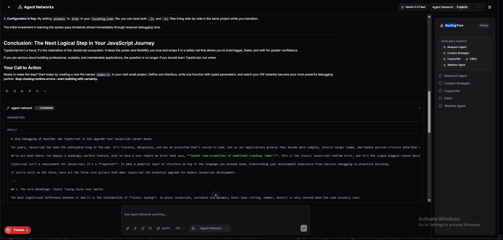
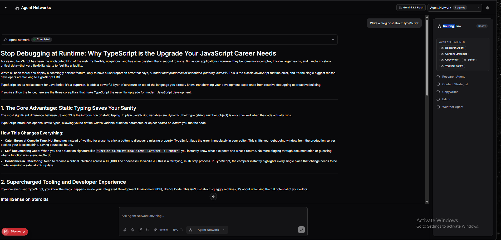
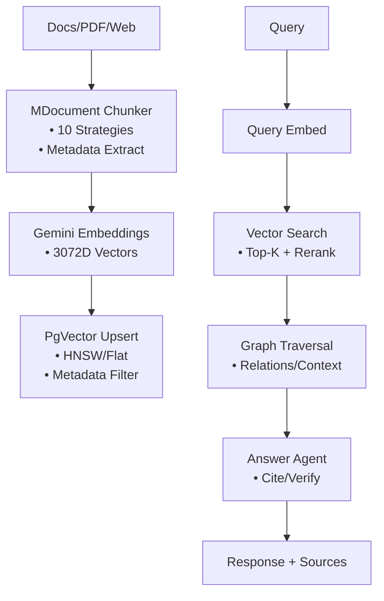
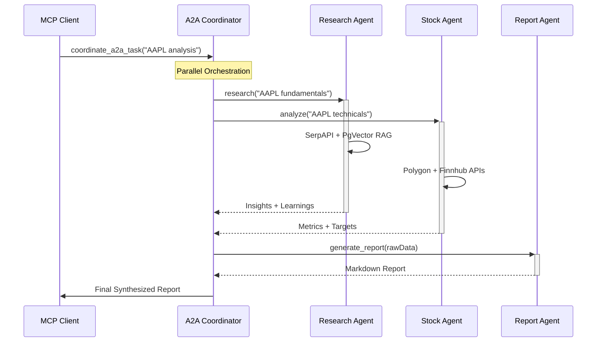
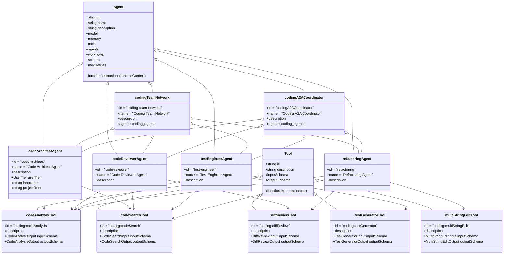

<!-- AGENTS-META {"title":"AgentStack README","version":"3.3.0","applies_to":"/","last_updated":"2025-12-05T00:00:00Z","status":"stable"} -->

<div align="center">

# 🚀 AgentStack




<!-- Core Project Badges -->
[](https://nodejs.org/)
[](https://www.typescriptlang.org/)
[](https://nextjs.org/)
[](https://react.dev/)
[](LICENSE)

<!-- Stats Badges -->
[](src/mastra/agents)
[](src/mastra/tools)
[](src/mastra/workflows)
[](src/mastra/networks)
[](ui/)

<!-- Quality Badges -->
[](https://vitest.dev/)
[](https://zod.dev/)
[](https://eslint.org/)

<!-- Repository Links -->
[](https://github.com/ssdeanx/AgentStack)
[](https://gitmcp.io/ssdeanx/AgentStack)
[](https://wakatime.com/badge/user/7a2fb9a0-188b-4568-887f-7645f9249e62/project/e44412f3-9bcc-4661-b79d-23160d90dfe0)

**AgentStack** is a **production-grade multi-agent framework** built on Mastra, delivering **34+ enterprise tools**, **38 specialized agents**, **10 workflows**, **4 agent networks**, **64 UI components** (30 AI Elements + 34 base), and **A2A/MCP orchestration** for scalable AI systems. Focuses on **financial intelligence**, **RAG pipelines**, **observability**, **secure governance**, and **AI chat interfaces**.

<!-- Mastra Ecosystem -->
[](https://www.npmjs.com/package/@mastra/core)
[](https://www.npmjs.com/package/@mastra/pg)
[](https://www.npmjs.com/package/@mastra/rag)
[](https://www.npmjs.com/package/@mastra/memory)
[](https://www.npmjs.com/package/@mastra/ai-sdk)

<!-- AI/ML Stack -->
[](https://www.npmjs.com/package/@ai-sdk/google)
[](https://www.npmjs.com/package/@ai-sdk/react)
[](https://langfuse.com/)
[](https://github.com/pgvector/pgvector)

<!-- LLM Providers -->
[](https://ai.google.dev/)
[](https://openai.com/)
[](https://anthropic.com/)

</div>

## 🎯 **Why AgentStack?**

| Feature                      | AgentStack                                           | LangChain     | CrewAI        | AutoGen    |
| ---------------------------- | ---------------------------------------------------- | ------------- | ------------- | ---------- |
| **Production Observability** | ✅ **Full Arize/Phoenix tracing + custom scorers**   | ⚠️ Partial    | ❌ Basic      | ❌ Limited |
| **Financial Tools**          | ✅ **Polygon/Finnhub/AlphaVantage (20+ endpoints)**  | ❌ None       | ❌ None       | ❌ None    |
| **RAG Pipeline**             | ✅ **PgVector HNSW + rerank + graphRAG**             | ⚠️ External   | ❌ Basic      | ❌ None    |
| **Multi-Agent**              | ✅ **A2A MCP + parallel orchestration**              | ⚠️ Sequential | ✅ Sequential | ✅ Custom  |
| **Governance**               | ✅ **JWT/RBAC + path traversal + HTML sanitization** | ❌ Custom     | ❌ None       | ❌ None    |
| **TypeScript**               | ✅ **Zod schemas everywhere**                        | ⚠️ JS/TS mix  | ⚠️ JS focus   | ❌ Python  |
| **UI Components**            | ✅ **64 AI Elements + shadcn/ui**                    | ❌ None       | ❌ None       | ❌ None    |
| **Tests**                    | ✅ **97% Vitest coverage**                           | ⚠️ Partial    | ❌ Sparse     | ⚠️ Partial |

**Built for production**: Secure, observable, testable agents with **zero-config** PgVector RAG + **enterprise financial APIs**.

## ✨ **Core Capabilities**

- **💰 Financial Intelligence**: 20+ tools (Polygon quotes/aggs/fundamentals, Finnhub analysis, AlphaVantage indicators)
- **🔍 Semantic RAG**: PgVector (3072D embeddings) + MDocument chunking + rerank + graph traversal
- **🤖 38 Agents**: Research → Learn → Report → Edit → Analyze (stock/crypto/copywriter/evaluator/data pipeline/business-legal/charting/image)
- **📋 10 Workflows**: Weather, content, financial reports, document processing, research synthesis, learning extraction
- **🌐 4 Agent Networks**: Primary routing, data pipeline, report generation, research pipeline
- **🔌 A2A/MCP**: MCP server coordinates parallel agents (research+stock→report)
- **🎨 64 UI Components**: AI Elements (30 chat/reasoning/canvas components) + shadcn/ui (34 base primitives)
- **📊 Full Observability**: Arize/Phoenix traces + 10+ custom scorers (diversity/quality/completeness)
- **🛡️ Enterprise Security**: JWT auth, RBAC, path validation, HTML sanitization, secrets masking
- **⚡ Extensible**: Model registry (Gemini/OpenAI/Anthropic), Zod schemas everywhere

## 🏗️ **Architecture**


## 📊 **System Flowchart**

```mermaid
flowchart TD
    A[app/chat] -->|components|< B[chat-header.tsx]
    A -->|components|< C[chat-messages.tsx]
    A -->|components|< D[chat-input.tsx]
    A -->|config|< E[agents.ts]
    A -->|providers|< F[chat-context.tsx]
    
    G[app/networks] -->|components|< H[network-header.tsx]
    G -->|components|< I[network-messages.tsx]
    G -->|config|< J[networks.ts]
    G -->|providers|< K[network-context.tsx]
    
    L[app/workflows] -->|components|< M[workflow-canvas.tsx]
    L -->|components|< N[workflow-header.tsx]
    L -->|config|< O[workflows.ts]
    L -->|providers|< P[workflow-context.tsx]
    
    Q[app/dashboard] -->|components|< R[dashboard.tsx]
    Q -->|components|< S[agent-list.tsx]
    Q -->|providers|< T[dashboard-context.tsx]
    
    U[lib] -->|hooks|< V[use-mastra.ts]
    U -->|hooks|< W[use-dashboard-queries.ts]
    U -->|utils|< X[utils.ts]
    U -->|client|< Y[mastra-client.ts]
    
    Z[src/types] -->|api|< AA[mastra-api.ts]
    
    AB[src/mastra/index.ts] -->|imports|< AC[agents/*]
    AB -->|imports|< AD[tools/*]
    AB -->|imports|< AE[workflows/*]
    AB -->|imports|< AF[networks/*]
    AB -->|imports|< AG[config/*]
    
    style A fill:#e8f5e9,stroke:#81c784
    style G fill:#e8f5e9,stroke:#81c784
    style L fill:#e8f5e9,stroke:#81c784
    style Q fill:#e8f5e9,stroke:#81c784
    style U fill:#e3f2fd,stroke:#64b5f6
    style Z fill:#e3f2fd,stroke:#64b5f6
    style AB fill:#fff3e0,stroke:#ff9800
```

## 🔄 **RAG Pipeline (Production-Grade)**



## 🤝 **A2A Multi-Agent Flow**



## 🚀 **Quick Start**

### Prerequisites

- **Node.js ≥20.9.0**
- **PostgreSQL + pgvector** (for RAG/Memory)
- **API Keys**: `.env` (Gemini/SerpAPI/Polygon/etc.)

### Clone & Install

```bash
git clone https://github.com/ssdeanx/AgentStack.git
cd AgentStack
npm ci
```

### Setup `.env`

```bash
cp .env.example .env
# Add your keys (Gemini, SerpAPI, Polygon, etc.)
```

### Run Dev Server

```bash
# Terminal 1: Start Mastra backend (agents/tools/workflows at :4111)
npm run dev

# Terminal 2: Start Next.js frontend (at :3000)
npm run dev:next
```

### Next.js + Mastra Client SDK

The frontend uses `@mastra/client-js` to interact with agents:

```typescript
// lib/mastra-client.ts
import { MastraClient } from "@mastra/client-js";

export const mastraClient = new MastraClient({
  baseUrl: process.env.NEXT_PUBLIC_MASTRA_API_URL || "http://localhost:4111",
});

// Usage in client components
const agent = mastraClient.getAgent("weatherAgent");
const response = await agent.stream({
  messages: [{ role: "user", content: "Hello" }],
});
```

**Pages:**

- `/` - Landing page with agent overview
- `/test` - Server action demo (SSR)
- `/chat` - Client SDK demo (streaming)

### MCP Server (A2A)

```bash
npm run mcp-server  # http://localhost:6969/mcp
```

### Production

```bash
npm run build
npm run start
```

## 📁 **Structure**

```bash
╭─────────────────────────────── AgentStack ───────────────────────────────╮
│ Files: 574 | Size: 6.3MB                                                 │
│ Top Extensions: .tsx (197), .ts (190), .md (138), .mdx (15), .json (8)   │
╰──────────────────────────────────────────────────────────────────────────╯
AgentStack

├──   app/ (173 files, 878.7KB)
│   ├──   about/ (410.0B)
│   │   └── page.tsx
│   ├──   api/ (6 files, 6.6KB)
│   │   ├──   chat/
│   │   │   └── route.ts
│   │   ├──   chat-extra/ (581.0B)
│   │   │   └── route.ts
│   │   ├──   completion/ (449.0B)
│   │   │   └── route.ts
│   │   ├──   contact/ (2.2KB)
│   │   │   └── route.ts
│   │   └──   v0/ (445.0B)
│   │       └── route.ts
│   ├──   api-reference/ (5 files, 38.0KB)
│   │   ├──   agents/ (8.2KB)
│   │   │   └── page.mdx
│   │   ├──   openapi-schema/ (13.6KB)
│   │   │   └── page.mdx
│   │   ├──   tools/ (7.1KB)
│   │   │   └── page.mdx
│   │   ├──   workflows/ (8.8KB)
│   │   │   └── page.mdx
│   │   └── page.tsx
│   ├──   blog/ (4 files, 13.4KB, all .tsx)
│   │   ├──   hello-world-agentstack/ (9.1KB)
│   │   │   └── page.mdx
│   │   ├──   session-summary/ (2.1KB)
│   │   │   └── page.tsx
│   │   └── layout page
│   ├──   careers/ (418.0B)
│   │   └── page.tsx
│   ├──   changelog/ (417.0B)
│   │   └── page.tsx
│   ├──   chat/ (27 files, 175.7KB)
│   │   ├──   components/ (16 files, 93.5KB, all .tsx)
│   │   │   └── agent-artifact         agent-inline-citation  agent-sources          agent-web-preview
│   │   │       agent-chain-of-thought agent-plan             agent-suggestions      chat-header
│   │   │       agent-checkpoint       agent-queue            agent-task             chat-input
│   │   │       agent-confirmation     agent-reasoning        agent-tools            chat-messages
│   │   ├──   config/ (7 files, 50.4KB, all .ts)
│   │   │   └── agents            google-models     ollama-models     openrouter-models
│   │   │       anthropic-models  models            openai-models
│   │   ├──   helpers/ (6.6KB)
│   │   │   └── tool-part-transform.ts
│   │   ├──   providers/ (16.8KB)
│   │   │   └── chat-context.tsx
│   │   └── AGENTS.md page.tsx
│   ├──   components/ (30 files, 218.5KB, all .tsx)
│   │   └── about-content         contact-form          landing-hero          privacy-content
│   │       api-components        docs-layout           landing-stats         sidebar
│   │       api-reference-content docs-nav              landing-testimonials  strip-frontmatter
│   │       blog-data             examples-list         landing-trust         terms-content
│   │       blog-layout           footer                navbar                tools-list
│   │       blog-list             landing-agents        networks-list         workflows-list
│   │       careers-content       landing-cta           page-header
│   │       changelog-list        landing-features      pricing-tiers
│   ├──   contact/ (409.0B)
│   │   └── page.tsx
│   ├──   dashboard/ (44 files, 162.4KB)
│   │   ├──   _components/ (8 files, 26.9KB)
│   │   │   └── data-table.tsx       empty-state.tsx      index.ts             sidebar.tsx
│   │   │       detail-panel.tsx     error-fallback.tsx   loading-skeleton.tsx stat-card.tsx
│   │   ├──   agents/ (9 files, 15.2KB, all .tsx)
│   │   │   ├──   _components/ (6 files, 11.9KB)
│   │   │   │   └── agent-details.tsx   agent-list-item.tsx agent-tools-tab.tsx
│   │   │   │       agent-evals-tab.tsx agent-list.tsx      index.ts
│   │   │   └── error   loading page
│   │   ├──   logs/ (3 files, 11.2KB, all .tsx)
│   │   │   └── error   loading page
│   │   ├──   memory/ (3 files, 17.2KB, all .tsx)
│   │   │   └── error   loading page
│   │   ├──   observability/ (3 files, 18.1KB, all .tsx)
│   │   │   └── error   loading page
│   │   ├──   telemetry/ (3 files, 11.1KB, all .tsx)
│   │   │   └── error   loading page
│   │   ├──   tools/ (3 files, 11.1KB, all .tsx)
│   │   │   └── error   loading page
│   │   ├──   vectors/ (3 files, 15.0KB, all .tsx)
│   │   │   └── error   loading page
│   │   ├──   workflows/ (3 files, 14.1KB, all .tsx)
│   │   │   └── error   loading page
│   │   └── AGENTS.md     error.tsx     layout.tsx    loading.tsx   page.tsx      providers.tsx
│   ├──   docs/ (13 files, 90.5KB, all .tsx)
│   │   ├──   ai-sdk/ (13.5KB)
│   │   │   └── page.mdx
│   │   ├──   components/ (8.1KB)
│   │   │   └── page.mdx
│   │   ├──   configuration/ (8.6KB)
│   │   │   └── page.mdx
│   │   ├──   core-concepts/ (7.6KB)
│   │   │   └── page.mdx
│   │   ├──   getting-started/ (2 files, 7.5KB)
│   │   │   └── 1.tsx    page.mdx
│   │   ├──   prompts/kiro-lite/ (9.8KB)
│   │   │   └── page.mdx
│   │   ├──   rag/ (8.3KB)
│   │   │   └── page.mdx
│   │   ├──   runtime-context/ (9.9KB)
│   │   │   └── page.mdx
│   │   ├──   security/ (9.1KB)
│   │   │   └── page.mdx
│   │   ├──   ui/ (6.8KB)
│   │   │   └── page.mdx
│   │   └── layout page
│   ├──   examples/ (413.0B)
│   │   └── page.tsx
│   ├──   login/ (6.4KB)
│   │   └── page.tsx
│   ├──   networks/ (11 files, 82.1KB)
│   │   ├──   components/ (7 files, 63.8KB, all .tsx)
│   │   │   └── network-agents        network-header        network-input         network-routing-panel
│   │   │       network-chat          network-info-panel    network-messages
│   │   ├──   config/ (4.4KB)
│   │   │   └── networks.ts
│   │   ├──   providers/ (9.2KB)
│   │   │   └── network-context.tsx
│   │   └── AGENTS.md page.tsx
│   ├──   pricing/ (412.0B)
│   │   └── page.tsx
│   ├──   privacy/ (418.0B)
│   │   └── page.tsx
│   ├──   terms/ (410.0B)
│   │   └── page.tsx
│   ├──   test/ (7 files, 4.1KB)
│   │   └── AGENTS.md      chat-extra.tsx completion.tsx page.tsx
│   │       action.ts      chat.tsx       form.tsx
│   ├──   tools/ (401.0B)
│   │   └── page.tsx
│   ├──   workflows/ (12 files, 60.7KB)
│   │   ├──   components/ (8 files, 28.8KB, all .tsx)
│   │   │   └── workflow-actions     workflow-header      workflow-input-panel workflow-node
│   │   │       workflow-canvas      workflow-info-panel  workflow-legend      workflow-output
│   │   ├──   config/ (13.0KB)
│   │   │   └── workflows.ts
│   │   ├──   providers/ (10.8KB)
│   │   │   └── workflow-context.tsx
│   │   └── AGENTS.md page.tsx
│   └── AGENTS.md   globals.css layout.tsx  page.tsx
├──   docs/ (12 files, 339.7KB)
│   ├──   adr/ (1.6KB)
│   │   └── 0001-why-pgvector-and-gemini-embeddings.md
│   ├──   components/ (5 files, 36.5KB, all .md)
│   │   └── app-chat-documentation      app-networks-documentation  lib-documentation
│   │       app-dashboard-documentation app-workflows-documentation
│   └── ai-elements_aisk-urls.md                   kiro-lite.prompt.md
│       api-small.md                               runtimeContext.md
│       ⭐️ api.md
├──   hooks/ (6 files, 5.6KB, all .ts)
│   └── index             use-debounce      use-local-storage use-media-query   use-mounted       use-utils
├──   lib/ (7 files, 34.6KB, all .ts)
│   ├──   hooks/ (2 files, 24.2KB, all .ts)
│   │   └── use-dashboard-queries use-mastra
│   ├──   types/ (5.4KB)
│   │   └── mastra-api.ts
│   └── auth                    client-stream-to-ai-sdk mastra-client           utils
├──   src/ (206 files, 2.7MB)
│   ├──   components/ai-elements/ (30 files, 153.5KB, all .tsx)
│   │   └── artifact         confirmation     edge             model-selector   prompt-input     suggestion
│   │       canvas           connection       image            node             queue            task
│   │       chain-of-thought context          inline-citation  open-in-chat     reasoning        tool
│   │       checkpoint       controls         loader           panel            shimmer          toolbar
│   │       code-block       conversation     message          plan             sources          web-preview
│   └──   mastra/ (176 files, 2.5MB)
│       ├──   a2a/ (3 files, 13.4KB)
│       │   └── AGENTS.md               a2aCoordinatorAgent.ts  codingA2ACoordinator.ts
│       ├──   agents/ (30 files, 192.5KB)
│       │   └── AGENTS.md                          excalidraw_validator.ts
│       │       acpAgent.ts                        for await (const part of result.md
│       │       businessLegalAgents.ts             image.ts
│       │       calendarAgent.ts                   image_to_csv.ts
│       │       codingAgents.ts                    knowledgeIndexingAgent.ts
│       │       contentStrategistAgent.ts          learningExtractionAgent.ts
│       │       copywriterAgent.ts                 package-publisher.ts
│       │       csv_to_excalidraw.ts               recharts.ts
│       │       dane.ts                            reportAgent.ts
│       │       dataExportAgent.ts                 researchAgent.ts
│       │       dataIngestionAgent.ts              researchPaperAgent.ts
│       │       dataTransformationAgent.ts         scriptWriterAgent.ts
│       │       documentProcessingAgent.ts         sql.ts
│       │       editorAgent.ts                     stockAnalysisAgent.ts
│       │       evaluationAgent.ts                 weather-agent.ts
│       ├──   config/ (29 files, 252.4KB)
│       │   ├──   vector/ (11 files, 108.0KB)
│       │   │   └── AGENTS.md     chroma.ts     couchbase.ts  opensearch.ts qdrant.ts     s3vectors.ts
│       │   │       astra.ts      cloudflare.ts lance.ts      pinecone.ts   registry.ts
│       │   └── AGENTS.md         gemini-cli.ts     mongodb.ts        processors.ts     upstashMemory.ts
│       │       README.md         google.ts         openai.ts         role-hierarchy.ts vertex.ts
│       │       anthropic.ts      index.ts          openrouter.ts     tracing.ts
│       │       copilot.ts        logger.ts         pg-storage.ts     upstash.ts
│       ├──   data/ (10 files, 1020.7KB)
│       │   └── AGENTS.md                      diamond.excalidraw             sample_dataset.csv
│       │       circle.excalidraw              example-text-arrows.excalidraw ⭐️ test.excalidraw
│       │       diagram (5).json               pencil.excalidraw
│       │       diagram.excalidraw             relationship.excalidraw
│       ├──   experiments/ (8.6KB)
│       │   └── agent-experiments.ts
│       ├──   mcp/ (6 files, 34.6KB)
│       │   └── AGENTS.md     index.ts      mcp-client.ts prompts.ts    resources.ts  server.ts
│       ├──   networks/ (6 files, 27.6KB)
│       │   └── AGENTS.md                  dataPipelineNetwork.ts     reportGenerationNetwork.ts
│       │       codingTeamNetwork.ts       index.ts                   researchPipelineNetwork.ts
│       ├──   policy/ (2 files, 7.0KB)
│       │   └── AGENTS.md acl.yaml
│       ├──   scorers/ (11 files, 52.3KB)
│       │   └── AGENTS.md                  financial-scorers.ts       structure.scorer.ts
│       │       csv-validity.scorer.ts     index.ts                   tone-consistency.scorer.ts
│       │       custom-scorers.ts          script-scorers.ts          weather-scorer.ts
│       │       factuality.scorer.ts       sql-validity.scorer.ts
│       ├──   tools/ (60 files, 753.7KB)
│       │   ├──   tests/ (15 files, 145.8KB, all .ts)
│       │   │   └── copywriter-agent-tool.test       json-to-csv.tool.test
│       │   │       csv-to-json.tool.test            serpapi-academic-local.tool.test
│       │   │       data-file-manager.test           serpapi-news-trends.tool.test
│       │   │       data-validator.tool.test         serpapi-search.tool.test
│       │   │       document-chunking.tool.test      serpapi-shopping.tool.test
│       │   │       editor-agent-tool.test           weather-tool.test
│       │   │       evaluateResultTool.test          web-scraper-tool.test
│       │   │       extractLearningsTool.test
│       │   └── AGENTS.md                      document-chunking.tool.ts      pdf-data-conversion.tool.ts
│       │       AGENTS.md.bak                  editor-agent-tool.ts           pdf.ts
│       │       alpha-vantage.tool.ts          evaluateResultTool.ts          pg-sql-tool.ts
│       │       arxiv.tool.ts                  execa-tool.ts                  pnpm-tool.ts
│       │       browser-tool.ts                extractLearningsTool.ts        polygon-tools.ts
│       │       calendar-tool.ts               financial-chart-tools.ts       semantic-utils.ts
│       │       code-analysis.tool.ts          find-references.tool.ts        serpapi-academic-local.tool.ts
│       │       code-chunking.ts               find-symbol.tool.ts            serpapi-config.ts
│       │       code-search.tool.ts            finnhub-tools.ts               serpapi-news-trends.tool.ts
│       │       copywriter-agent-tool.ts       fs.ts                          serpapi-search.tool.ts
│       │       csv-to-json.tool.ts            github.ts                      serpapi-shopping.tool.ts
│       │       data-file-manager.ts           index.ts                       test-generator.tool.ts
│       │       data-processing-tools.ts       json-to-csv.tool.ts            weather-tool.ts
│       │       data-validator.tool.ts         jwt-auth.tool.ts               ⭐️ web-scraper-tool.ts
│       │       diff-review.tool.ts            multi-string-edit.tool.ts      write-note.ts
│       ├──   types/ (2 files, 1.2KB, all .ts)
│       │   └── excalidraw-to-svg.d svgjson.d
│       ├──   workflows/ (14 files, 180.8KB)
│       │   └── AGENTS.md                       financial-report-workflow.ts    spec-generation-workflow.ts
│       │       changelog.ts                    learning-extraction-workflow.ts stock-analysis-workflow.ts
│       │       content-review-workflow.ts      new-contributor.ts              telephone-game.ts
│       │       content-studio-workflow.ts      repo-ingestion-workflow.ts      weather-workflow.ts
│       │       document-processing-workflow.ts research-synthesis-workflow.ts
│       └── AGENTS.md index.ts
├──   tests/ (3 files, 2.5KB, all .ts)
│   ├──   test-results/ (1.0KB)
│   │   └── test-results.json
│   └── api-chat-r.test       docs-hello-world.test
├──   ui/ (34 files, 91.4KB, all .tsx)
│   └── accordion     button        command       input-group   popover       separator     textarea
│       alert         card          dialog        input         progress      sheet         theme-toggle
│       avatar        carousel      dropdown-menu label         radio-group   skeleton      tooltip
│       badge         checkbox      helpers       layout        scroll-area   switch        typography
│       button-group  collapsible   hover-card    link          select        tabs
└── .blackboxrules           components.json          networksCustomToolv1.png prettier.config.js
    .env.example             eslint.config.cjs        networksv1.png           read_pdf_parse.js
    .gitignore               globalSetup.ts           next.config.ts           testSetup.ts
    .markdownlint.json       instrumentation.ts       ⭐️ package-lock.json     tsconfig.json
    AGENTS.md                llms.txt                 package.json             vitest.config.ts
    README.md                mdx-components.tsx       postcss.config.mjs
```

## 🛠️ **Development**

1. **New Tool**: `src/mastra/tools/my-tool.ts` → `createTool({zodSchema, execute})`
2. **New Agent**: `src/mastra/agents/my-agent.ts` → Compose tools + Zod instructions
3. **Test**: `npm test` (97% coverage) or `npx vitest src/mastra/tools/tests/my-tool.test.ts`
4. **Lint**: `npm run lint`

## 🔧 **Configuration**

| Env Var                        | Purpose                               | Required      |
| ------------------------------ | ------------------------------------- | ------------- |
| `PG_CONNECTION`                | Postgres + PgVector RAG               | ✅            |
| `GOOGLE_GENERATIVE_AI_API_KEY` | Gemini LLM/Embeddings                 | ✅            |
| `SERPAPI_API_KEY`              | Search/News/Shopping (10+ tools)      | ✅            |
| `POLYGON_API_KEY`              | Stock/Crypto quotes/aggs/fundamentals | ✅            |
| `PHOENIX_ENDPOINT`             | Arize/Phoenix tracing                 | Observability |

**Full**: `.env.example` + `src/mastra/config/AGENTS.md`

## 🧪 **Testing (97% Coverage)**

```bash
npm test                    # All tests
npm run coverage            # LCOV report
npx vitest -t "polygon"     # Filter (e.g., financial tools)
```

- **Vitest + Zod**: Schema validation + mocks
- **API Mocks**: Financial/search tools fully mocked

## 🔒 **Security & Governance**

- **JWT Auth**: `jwt-auth.tool.ts` + RBAC
- **Path Traversal**: `validateDataPath()` everywhere
- **HTML Sanitization**: JSDOM + Cheerio (script/strip events)
- **Secrets Masking**: `maskSensitiveMessageData()`
- **Rate Limiting**: Built into financial APIs

## 📊 **Observability (Production-Ready)**

```bash
Arize/Phoenix Exporters:
├── Traces: 100% (spans/tools/agents)
├── Scorers: 10+ (diversity/quality/task-completion)
├── Metrics: Latency/errors/tool-calls
└── Sampling: Always-on + ratio (30-80%)
```

**Custom Scorers**: Source diversity, completeness, creativity, response quality.

## 🌐 **Integrations Matrix**

| Category             | Tools                                                  | Agents                                    |
| -------------------- | ------------------------------------------------------ | ----------------------------------------- |
| **🔍 Search**        | SerpAPI (News/Trends/Shopping/Scholar/Local/Yelp)      | ResearchAgent                             |
| **💰 Financial**     | Polygon (10+), Finnhub (6+), AlphaVantage (indicators) | StockAnalysis, CryptoAnalysis             |
| **📄 RAG**           | PgVector chunk/rerank/query/graph                      | Retrieve/Rerank/Answerer                  |
| **📝 Content**       | PDF→MD, Web Scraper, Copywriter/Editor                 | CopywriterAgent, EditorAgent, ReportAgent |
| **🎨 Visual**        | CSV↔Excalidraw, SVG/XML process                       | csvToExcalidrawAgent, imageToCsvAgent     |
| **🌐 Orchestration** | A2A MCP Server                                         | a2aCoordinatorAgent                       |
| **💻 UI**            | AI Elements (30), shadcn/ui (19), Radix primitives     | Chat/Reasoning/Canvas interfaces          |

## 🚀 **Advanced Usage**

### Custom Agent

```ts
// src/mastra/agents/my-agent.ts
import { Agent } from '@mastra/core/agent'
export const myAgent = new Agent({
    id: 'my-agent',
    tools: { polygonStockQuotesTool, pgQueryTool },
    instructions: 'Analyze stocks with Polygon + RAG...',
    model: googleAI, // From model registry
    memory: pgMemory,
})
// Auto-registers in index.ts
```

### MCP/A2A Client

```bash
# Start server
npm run mcp-server

# Use in Cursor/Claude
# coordinate_a2a_task({task: "AAPL analysis", agents: ["research", "stock"]})
```

## 🤝 **Contributing**

1. **Fork**: `https://github.com/ssdeanx/AgentStack`
2. **Setup**: `npm ci && npm test`
3. **Add**: Tool/Agent + Zod schema + Vitest
4. **PR**: `npm test` + coverage >95%

**Guidelines**:

- **Zod Everywhere**: Input/output schemas
- **Stateless Tools**: Agents orchestrate
- **Mock APIs**: 100% test coverage
- **Trace Everything**: Arize spans

## 📚 **Resources**

- **[UI Components](ui/AGENTS.md)**: 34 shadcn/ui base components
- **[AI Elements](src/components/ai-elements/AGENTS.md)**: 30 AI chat/reasoning/canvas components
- **[Agents Catalog](src/mastra/agents/AGENTS.md)**: 38 agents
- **[Tools Matrix](src/mastra/tools/AGENTS.md)**: 34+ tools
- **[Workflows](src/mastra/workflows/AGENTS.md)**: 10 multi-step workflows
- **[Networks](src/mastra/networks/AGENTS.md)**: 4 agent networks
- **[Config Guide](src/mastra/config/AGENTS.md)**: Setup + env vars
- **[MCP/A2A](src/mastra/mcp/AGENTS.md)**: Multi-agent federation
- **[Scorers](src/mastra/scorers/AGENTS.md)**: 10+ eval metrics

## 🏆 **Roadmap**

- [x] **Financial Suite**: Polygon/Finnhub/AlphaVantage (✅ Live)
- [x] **RAG Pipeline**: PgVector + rerank/graph (✅ Live)
- [x] **A2A MCP**: Parallel orchestration (✅ Live)
- [x] **10 Workflows**: Sequential, parallel, branch, loop, foreach, suspend/resume (✅ Live)
- [x] **4 Agent Networks**: Routing and coordination (✅ Live)
- [x] **UI Components**: AI Elements + shadcn/ui (64 components) (✅ Live)
- [ ] **Chat Interface**: Full agent chat UI with AI Elements
- [ ] **LangSmith/Phoenix**: Eval dashboards
- [ ] **Docker/Helm**: K8s deploy
- [ ] **OpenAI/Anthropic**: Model parity

---

⭐ **Star [ssdeanx/AgentStack](https://github.com/ssdeanx/AgentStack)**
🐦 **Follow [@ssdeanx](https://x.com/ssdeanx)**
📘 **[Docs](https://agentstack.ai)** (Coming Q1 2026)

_Last updated: 2025-12-05 | v3.3.0_

## 🧠 **Agent/Tool Relationships**

