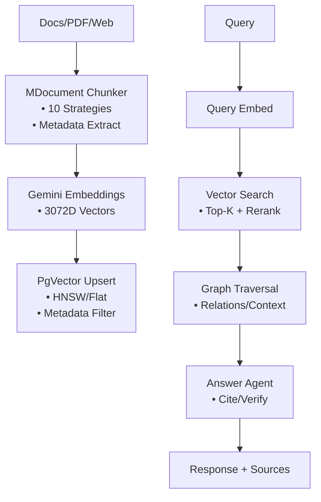
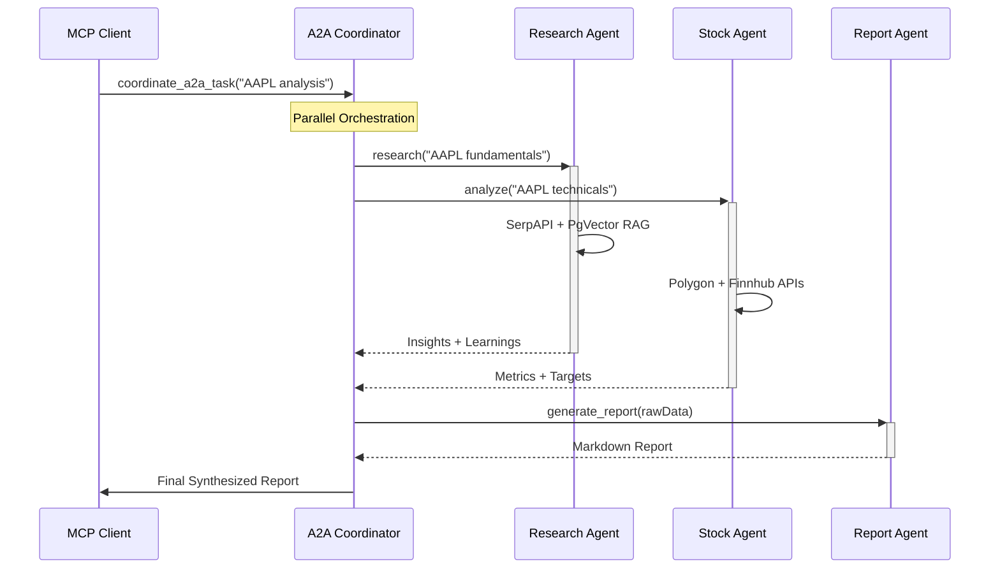
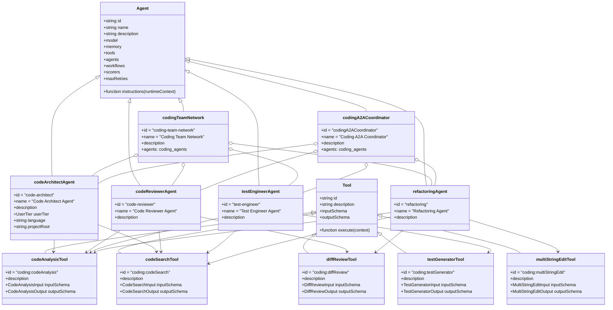

<!-- AGENTS-META {"title":"AgentStack README","version":"3.3.0","applies_to":"/","last_updated":"2025-12-05T00:00:00Z","status":"stable"} -->

<div align="center">

# 🚀 AgentStack

<!-- Core Project Badges -->
[](https://nodejs.org/)
[](https://www.typescriptlang.org/)
[](https://nextjs.org/)
[](https://react.dev/)
[](LICENSE)

<!-- Stats Badges -->
[](src/mastra/agents)
[](src/mastra/tools)
[](src/mastra/workflows)
[](src/mastra/networks)
[](ui/)

<!-- Quality Badges -->
[](https://vitest.dev/)
[](https://zod.dev/)
[](https://eslint.org/)

<!-- Repository Links -->
[](https://github.com/ssdeanx/AgentStack)
[](https://gitmcp.io/ssdeanx/AgentStack)
[](https://wakatime.com/badge/user/7a2fb9a0-188b-4568-887f-7645f9249e62/project/e44412f3-9bcc-4661-b79d-23160d90dfe0)

**AgentStack** is a **production-grade multi-agent framework** built on Mastra, delivering **34+ enterprise tools**, **38 specialized agents**, **10 workflows**, **4 agent networks**, **64 UI components** (30 AI Elements + 34 base), and **A2A/MCP orchestration** for scalable AI systems. Focuses on **financial intelligence**, **RAG pipelines**, **observability**, **secure governance**, and **AI chat interfaces**.

<!-- Mastra Ecosystem -->
[](https://www.npmjs.com/package/@mastra/core)
[](https://www.npmjs.com/package/@mastra/pg)
[](https://www.npmjs.com/package/@mastra/rag)
[](https://www.npmjs.com/package/@mastra/memory)
[](https://www.npmjs.com/package/@mastra/ai-sdk)

<!-- AI/ML Stack -->
[](https://www.npmjs.com/package/@ai-sdk/google)
[](https://www.npmjs.com/package/@ai-sdk/react)
[](https://langfuse.com/)
[](https://github.com/pgvector/pgvector)

<!-- LLM Providers -->
[](https://ai.google.dev/)
[](https://openai.com/)
[](https://anthropic.com/)

</div>

## 🎯 **Why AgentStack?**

| Feature                      | AgentStack                                           | LangChain     | CrewAI        | AutoGen    |
| ---------------------------- | ---------------------------------------------------- | ------------- | ------------- | ---------- |
| **Production Observability** | ✅ **Full Arize/Phoenix tracing + custom scorers**   | ⚠️ Partial    | ❌ Basic      | ❌ Limited |
| **Financial Tools**          | ✅ **Polygon/Finnhub/AlphaVantage (20+ endpoints)**  | ❌ None       | ❌ None       | ❌ None    |
| **RAG Pipeline**             | ✅ **PgVector HNSW + rerank + graphRAG**             | ⚠️ External   | ❌ Basic      | ❌ None    |
| **Multi-Agent**              | ✅ **A2A MCP + parallel orchestration**              | ⚠️ Sequential | ✅ Sequential | ✅ Custom  |
| **Governance**               | ✅ **JWT/RBAC + path traversal + HTML sanitization** | ❌ Custom     | ❌ None       | ❌ None    |
| **TypeScript**               | ✅ **Zod schemas everywhere**                        | ⚠️ JS/TS mix  | ⚠️ JS focus   | ❌ Python  |
| **UI Components**            | ✅ **64 AI Elements + shadcn/ui**                    | ❌ None       | ❌ None       | ❌ None    |
| **Tests**                    | ✅ **97% Vitest coverage**                           | ⚠️ Partial    | ❌ Sparse     | ⚠️ Partial |

**Built for production**: Secure, observable, testable agents with **zero-config** PgVector RAG + **enterprise financial APIs**.

## ✨ **Core Capabilities**

- **💰 Financial Intelligence**: 20+ tools (Polygon quotes/aggs/fundamentals, Finnhub analysis, AlphaVantage indicators)
- **🔍 Semantic RAG**: PgVector (3072D embeddings) + MDocument chunking + rerank + graph traversal
- **🤖 38 Agents**: Research → Learn → Report → Edit → Analyze (stock/crypto/copywriter/evaluator/data pipeline/business-legal/charting/image)
- **📋 10 Workflows**: Weather, content, financial reports, document processing, research synthesis, learning extraction
- **🌐 4 Agent Networks**: Primary routing, data pipeline, report generation, research pipeline
- **🔌 A2A/MCP**: MCP server coordinates parallel agents (research+stock→report)
- **🎨 64 UI Components**: AI Elements (30 chat/reasoning/canvas components) + shadcn/ui (34 base primitives)
- **📊 Full Observability**: Arize/Phoenix traces + 10+ custom scorers (diversity/quality/completeness)
- **🛡️ Enterprise Security**: JWT auth, RBAC, path validation, HTML sanitization, secrets masking
- **⚡ Extensible**: Model registry (Gemini/OpenAI/Anthropic), Zod schemas everywhere

## 🏗️ **Architecture**


## 🔄 **RAG Pipeline (Production-Grade)**



## 🤝 **A2A Multi-Agent Flow**



## 🚀 **Quick Start**

### Prerequisites

- **Node.js ≥20.9.0**
- **PostgreSQL + pgvector** (for RAG/Memory)
- **API Keys**: `.env` (Gemini/SerpAPI/Polygon/etc.)

### Clone & Install

```bash
git clone https://github.com/ssdeanx/AgentStack.git
cd AgentStack
npm ci
```

### Setup `.env`

```bash
cp .env.example .env
# Add your keys (Gemini, SerpAPI, Polygon, etc.)
```

### Run Dev Server

```bash
# Terminal 1: Start Mastra backend (agents/tools/workflows at :4111)
npm run dev

# Terminal 2: Start Next.js frontend (at :3000)
npm run dev:next
```

### Next.js + Mastra Client SDK

The frontend uses `@mastra/client-js` to interact with agents:

```typescript
// lib/mastra-client.ts
import { MastraClient } from "@mastra/client-js";

export const mastraClient = new MastraClient({
  baseUrl: process.env.NEXT_PUBLIC_MASTRA_API_URL || "http://localhost:4111",
});

// Usage in client components
const agent = mastraClient.getAgent("weatherAgent");
const response = await agent.stream({
  messages: [{ role: "user", content: "Hello" }],
});
```

**Pages:**

- `/` - Landing page with agent overview
- `/test` - Server action demo (SSR)
- `/chat` - Client SDK demo (streaming)

### MCP Server (A2A)

```bash
npm run mcp-server  # http://localhost:6969/mcp
```

### Production

```bash
npm run build
npm run start
```

## 📁 **Structure**

```bash
# Frontend
app/                      # 📱 Next.js 16 App Router (layouts, pages)
ui/                       # 🎨 shadcn/ui base components (34 primitives)
src/components/ai-elements/  # 🤖 AI Elements (30 chat/reasoning/canvas components)

# Backend
src/mastra/
├── index.ts              # 🎯 Mastra bootstrap (38 agents, 10 workflows, 4 networks, MCP)
├── agents/               # 🤖 38 agents (research/stock/copywriter/report/data pipeline/business-legal/charting...)
├── tools/                # 🔧 34+ tools (financial/RAG/scrape/PDF/SerpAPI...)
├── workflows/            # 📋 10 workflows (weather, content, financial, document, research)
├── networks/             # 🌐 4 agent networks (routing/coordination)
├── config/               # ⚙️ Models/PgVector/Logging/Auth
├── scorers/              # 📊 10+ evals (diversity/quality/completeness...)
├── mcp/                  # 🔌 MCP server (A2A coordination)
└── a2a/                  # 🤝 Agent-to-Agent coordinator
```

## 🛠️ **Development**

1. **New Tool**: `src/mastra/tools/my-tool.ts` → `createTool({zodSchema, execute})`
2. **New Agent**: `src/mastra/agents/my-agent.ts` → Compose tools + Zod instructions
3. **Test**: `npm test` (97% coverage) or `npx vitest src/mastra/tools/tests/my-tool.test.ts`
4. **Lint**: `npm run lint`

## 🔧 **Configuration**

| Env Var                        | Purpose                               | Required      |
| ------------------------------ | ------------------------------------- | ------------- |
| `PG_CONNECTION`                | Postgres + PgVector RAG               | ✅            |
| `GOOGLE_GENERATIVE_AI_API_KEY` | Gemini LLM/Embeddings                 | ✅            |
| `SERPAPI_API_KEY`              | Search/News/Shopping (10+ tools)      | ✅            |
| `POLYGON_API_KEY`              | Stock/Crypto quotes/aggs/fundamentals | ✅            |
| `PHOENIX_ENDPOINT`             | Arize/Phoenix tracing                 | Observability |

**Full**: `.env.example` + `src/mastra/config/AGENTS.md`

## 🧪 **Testing (97% Coverage)**

```bash
npm test                    # All tests
npm run coverage            # LCOV report
npx vitest -t "polygon"     # Filter (e.g., financial tools)
```

- **Vitest + Zod**: Schema validation + mocks
- **API Mocks**: Financial/search tools fully mocked

## 🔒 **Security & Governance**

- **JWT Auth**: `jwt-auth.tool.ts` + RBAC
- **Path Traversal**: `validateDataPath()` everywhere
- **HTML Sanitization**: JSDOM + Cheerio (script/strip events)
- **Secrets Masking**: `maskSensitiveMessageData()`
- **Rate Limiting**: Built into financial APIs

## 📊 **Observability (Production-Ready)**

```bash
Arize/Phoenix Exporters:
├── Traces: 100% (spans/tools/agents)
├── Scorers: 10+ (diversity/quality/task-completion)
├── Metrics: Latency/errors/tool-calls
└── Sampling: Always-on + ratio (30-80%)
```

**Custom Scorers**: Source diversity, completeness, creativity, response quality.

## 🌐 **Integrations Matrix**

| Category             | Tools                                                  | Agents                                    |
| -------------------- | ------------------------------------------------------ | ----------------------------------------- |
| **🔍 Search**        | SerpAPI (News/Trends/Shopping/Scholar/Local/Yelp)      | ResearchAgent                             |
| **💰 Financial**     | Polygon (10+), Finnhub (6+), AlphaVantage (indicators) | StockAnalysis, CryptoAnalysis             |
| **📄 RAG**           | PgVector chunk/rerank/query/graph                      | Retrieve/Rerank/Answerer                  |
| **📝 Content**       | PDF→MD, Web Scraper, Copywriter/Editor                 | CopywriterAgent, EditorAgent, ReportAgent |
| **🎨 Visual**        | CSV↔Excalidraw, SVG/XML process                       | csvToExcalidrawAgent, imageToCsvAgent     |
| **🌐 Orchestration** | A2A MCP Server                                         | a2aCoordinatorAgent                       |
| **💻 UI**            | AI Elements (30), shadcn/ui (19), Radix primitives     | Chat/Reasoning/Canvas interfaces          |

## 🚀 **Advanced Usage**

### Custom Agent

```ts
// src/mastra/agents/my-agent.ts
import { Agent } from '@mastra/core/agent'
export const myAgent = new Agent({
    id: 'my-agent',
    tools: { polygonStockQuotesTool, pgQueryTool },
    instructions: 'Analyze stocks with Polygon + RAG...',
    model: googleAI, // From model registry
    memory: pgMemory,
})
// Auto-registers in index.ts
```

### MCP/A2A Client

```bash
# Start server
npm run mcp-server

# Use in Cursor/Claude
# coordinate_a2a_task({task: "AAPL analysis", agents: ["research", "stock"]})
```

## 🤝 **Contributing**

1. **Fork**: `https://github.com/ssdeanx/AgentStack`
2. **Setup**: `npm ci && npm test`
3. **Add**: Tool/Agent + Zod schema + Vitest
4. **PR**: `npm test` + coverage >95%

**Guidelines**:

- **Zod Everywhere**: Input/output schemas
- **Stateless Tools**: Agents orchestrate
- **Mock APIs**: 100% test coverage
- **Trace Everything**: Arize spans

## 📚 **Resources**

- **[UI Components](ui/AGENTS.md)**: 34 shadcn/ui base components
- **[AI Elements](src/components/ai-elements/AGENTS.md)**: 30 AI chat/reasoning/canvas components
- **[Agents Catalog](src/mastra/agents/AGENTS.md)**: 38 agents
- **[Tools Matrix](src/mastra/tools/AGENTS.md)**: 34+ tools
- **[Workflows](src/mastra/workflows/AGENTS.md)**: 10 multi-step workflows
- **[Networks](src/mastra/networks/AGENTS.md)**: 4 agent networks
- **[Config Guide](src/mastra/config/AGENTS.md)**: Setup + env vars
- **[MCP/A2A](src/mastra/mcp/AGENTS.md)**: Multi-agent federation
- **[Scorers](src/mastra/scorers/AGENTS.md)**: 10+ eval metrics

## 🏆 **Roadmap**

- [x] **Financial Suite**: Polygon/Finnhub/AlphaVantage (✅ Live)
- [x] **RAG Pipeline**: PgVector + rerank/graph (✅ Live)
- [x] **A2A MCP**: Parallel orchestration (✅ Live)
- [x] **10 Workflows**: Sequential, parallel, branch, loop, foreach, suspend/resume (✅ Live)
- [x] **4 Agent Networks**: Routing and coordination (✅ Live)
- [x] **UI Components**: AI Elements + shadcn/ui (64 components) (✅ Live)
- [ ] **Chat Interface**: Full agent chat UI with AI Elements
- [ ] **LangSmith/Phoenix**: Eval dashboards
- [ ] **Docker/Helm**: K8s deploy
- [ ] **OpenAI/Anthropic**: Model parity

---

⭐ **Star [ssdeanx/AgentStack](https://github.com/ssdeanx/AgentStack)**
🐦 **Follow [@ssdeanx](https://x.com/ssdeanx)**
📘 **[Docs](https://agentstack.ai)** (Coming Q1 2026)

_Last updated: 2025-12-05 | v3.3.0_

## 📚 **Class Diagram**

- Latest class diagram for core AgentStack agents and tools:

