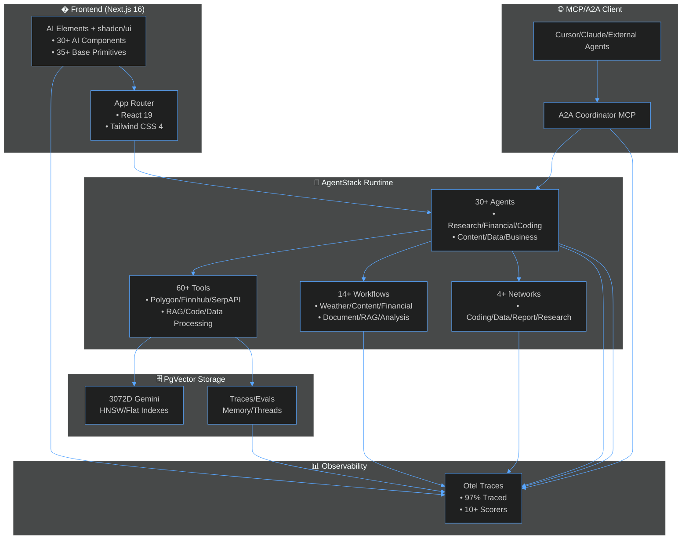
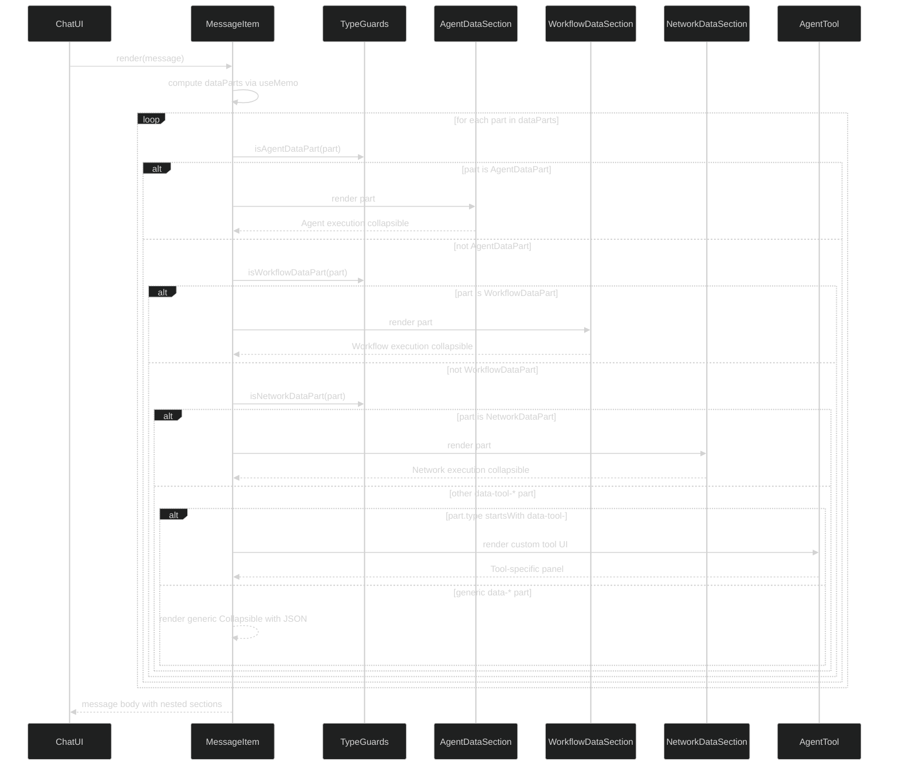
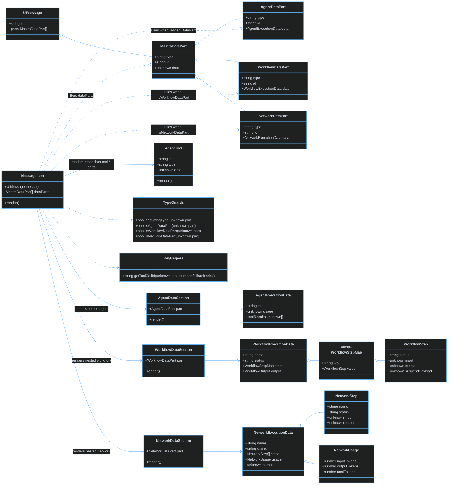
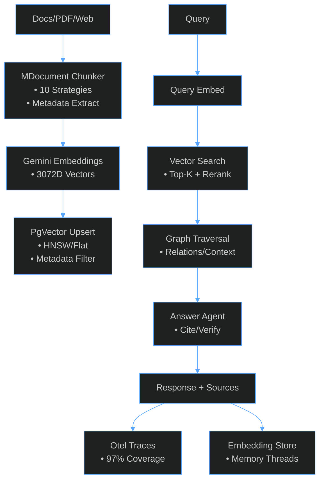
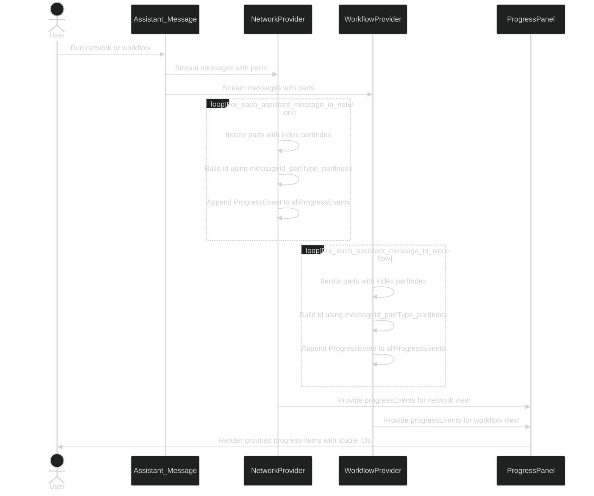

<!-- AGENTS-META {"title":"AgentStack README","version":"3.3.0","applies_to":"/","last_updated":"2025-12-05T00:00:00Z","status":"stable"} -->

<div align="center">

# 🚀 AgentStack


<!-- Core Project Badges -->

[](https://nodejs.org/)
[](https://www.typescriptlang.org/)
[](https://nextjs.org/)
[](https://react.dev/)
[](LICENSE)

<!-- Stats Badges -->

[](src/mastra/agents)
[](src/mastra/tools)
[](src/mastra/workflows)
[](src/mastra/networks)
[](ui/)

<!-- Quality Badges -->

[](https://vitest.dev/)
[](https://zod.dev/)
[](https://eslint.org/)

<!-- Repository Links -->

[](https://github.com/ssdeanx/AgentStack)
[](https://gitmcp.io/ssdeanx/AgentStack)
[](https://wakatime.com/badge/user/7a2fb9a0-188b-4568-887f-7645f9249e62/project/e52d02a1-f64a-4f8d-bc13-caaa2dc37461)

**AgentStack** is a **production-grade multi-agent framework** built on Mastra, delivering **60+ enterprise tools**, **31+ specialized agents**, **15 workflows**, **13 agent networks**, **65 UI components** (30+ AI Elements + 35+ base), and **A2A/MCP orchestration** for scalable AI systems. Focuses on **financial intelligence**, **RAG pipelines**, **observability**, **secure governance**, and **AI chat interfaces**.

<!-- Mastra Ecosystem -->

[](https://www.npmjs.com/package/@mastra/core)
[](https://www.npmjs.com/package/@mastra/pg)
[](https://www.npmjs.com/package/@mastra/rag)
[](https://www.npmjs.com/package/@mastra/memory)
[](https://www.npmjs.com/package/@mastra/ai-sdk)

<!-- AI/ML Stack -->

[](https://www.npmjs.com/package/@ai-sdk/google)
[](https://www.npmjs.com/package/@ai-sdk/react)
[](https://langfuse.com/)
[](https://github.com/pgvector/pgvector)

<!-- LLM Providers -->

[](https://ai.google.dev/)
[](https://openai.com/)
[](https://anthropic.com/)

</div>

## 🎯 **Why AgentStack?**

| Feature                      | AgentStack                                           | LangChain     | CrewAI        | AutoGen    |
| ---------------------------- | ---------------------------------------------------- | ------------- | ------------- | ---------- |
| **Production Observability** | ✅ **Full Langfuse tracing + custom scorers**        | ⚠️ Partial    | ❌ Basic      | ❌ Limited |
| **Financial Tools**          | ✅ **Polygon/Finnhub/AlphaVantage (30+ endpoints)**  | ❌ None       | ❌ None       | ❌ None    |
| **RAG Pipeline**             | ✅ **PgVector HNSW + rerank + graphRAG**             | ⚠️ External   | ❌ Basic      | ❌ None    |
| **Multi-Agent**              | ✅ **A2A MCP + parallel orchestration (30+ agents)** | ⚠️ Sequential | ✅ Sequential | ✅ Custom  |
| **Governance**               | ✅ **JWT/RBAC + path traversal + HTML sanitization** | ❌ Custom     | ❌ None       | ❌ None    |
| **TypeScript**               | ✅ **Zod schemas everywhere (94+ tools)**            | ⚠️ JS/TS mix  | ⚠️ JS focus   | ❌ Python  |
| **UI Components**            | ✅ **65 components (AI Elements + shadcn/ui)**       | ❌ None       | ❌ None       | ❌ None    |
| **Tests**                    | ✅ **Vitest + comprehensive test suite**             | ⚠️ Partial    | ❌ Sparse     | ⚠️ Partial |

**Built for production**: Secure, observable, testable agents with **zero-config** PgVector RAG + **enterprise financial APIs**.

## ✨ **Core Capabilities**

- **💰 Financial Intelligence**: 30+ tools (Polygon quotes/aggs/fundamentals, Finnhub analysis, AlphaVantage indicators)
- **🔍 Semantic RAG**: PgVector (3072D embeddings) + MDocument chunking + rerank + graph traversal
- **🤖 31+ Agents**: Research → Learn → Report → Edit → Analyze (stock/crypto/copywriter/evaluator/data pipeline/business-legal/charting/image/coding/dane/social media/SEO/translation/customer support/project management)
- **📋 15 Workflows**: Weather, content, financial reports, document processing, research synthesis, learning extraction, governed RAG (index + answer), spec generation, repo ingestion, stock analysis, marketing campaign
- **🌐 13 Agent Networks**: Primary routing, data pipeline, report generation, research pipeline, content creation, financial intelligence, learning, marketing automation, DevOps, business intelligence, security
- **🔌 A2A/MCP**: MCP server coordinates parallel agents (research+stock→report), A2A coordinator for cross-agent communication
- **🎨 65 UI Components**: AI Elements (30 chat/reasoning/canvas components) + shadcn/ui (35 base primitives)
- **📊 Full Observability**: Langfuse traces + 10+ custom scorers (diversity/quality/completeness) + TanStack Query for state management
- **🛡️ Enterprise Security**: JWT auth, RBAC, path validation, HTML sanitization, secrets masking
- **⚡ Extensible**: Model registry (Gemini/OpenAI/Anthropic/OpenRouter), Zod schemas everywhere, MastraClient SDK integration

## 🏗️ **Architecture**


```mermaid
%%{init: {'theme': 'dark', 'themeVariables': { 'primaryColor': '#58a6ff', 'primaryTextColor': '#c9d1d9', 'primaryBorderColor': '#30363d', 'lineColor': '#58a6ff', 'sectionBkgColor': '#161b22', 'altSectionBkgColor': '#0d1117', 'sectionTextColor': '#c9d1d9', 'gridColor': '#30363d', 'tertiaryColor': '#161b22' }}}%%
graph TB
    subgraph "� Frontend (Next.js 16)"
        UI[AI Elements + shadcn/ui<br/>• 30+ AI Components<br/>• 35+ Base Primitives]
        App[App Router<br/>• React 19<br/>• Tailwind CSS 4]
    end

    subgraph "🌐 MCP/A2A Client"
        Client[Cursor/Claude/External Agents] --> Coord[A2A Coordinator MCP]
    end

    subgraph "🎯 AgentStack Runtime"
        Coord --> Agents[30+ Agents<br/>• Research/Financial/Coding<br/>• Content/Data/Business]
        Agents --> Tools[60+ Tools<br/>• Polygon/Finnhub/SerpAPI<br/>• RAG/Code/Data Processing]
        Agents --> Workflows[14+ Workflows<br/>• Weather/Content/Financial<br/>• Document/RAG/Analysis]
        Agents --> Networks[4+ Networks<br/>• Coding/Data/Report/Research]
    end

    subgraph "🗄️ PgVector Storage"
        Tools --> Embeddings[3072D Gemini<br/>HNSW/Flat Indexes]
        Tools --> Postgres[Traces/Evals<br/>Memory/Threads]
    end

    subgraph "📊 Observability"
        Agents --> Otel[Otel Traces<br/>• 97% Traced<br/>• 10+ Scorers]
        UI --> Otel
        Postgres --> Otel
        Agents --> Otel
        Coord --> Otel
        Workflows --> Otel
        Networks --> Otel

    end

    UI --> App
    App --> Agents

    style Client stroke:#58a6ff
    style App stroke:#58a6ff
    style Coord stroke:#58a6ff
    style Agents stroke:#58a6ff
    style Tools stroke:#58a6ff
    style Embeddings stroke:#58a6ff
    style Workflows stroke:#58a6ff
    style Networks stroke:#58a6ff
    style Postgres stroke:#58a6ff
    style Otel stroke:#58a6ff
    style UI stroke:#58a6ff
```

## 🔍 **Chat UI-Backend Architecture**


```mermaid
%%{init: {'theme': 'dark', 'themeVariables': { 'primaryColor': '#58a6ff', 'primaryTextColor': '#c9d1d9', 'primaryBorderColor': '#30363d', 'lineColor': '#58a6ff', 'sectionBkgColor': '#161b22', 'altSectionBkgColor': '#0d1117', 'sectionTextColor': '#c9d1d9', 'gridColor': '#30363d', 'tertiaryColor': '#161b22' }}}%%
sequenceDiagram
    participant UI as ChatUI
    participant Msg as MessageItem
    participant TG as TypeGuards
    participant ADS as AgentDataSection
    participant WDS as WorkflowDataSection
    participant NDS as NetworkDataSection
    participant AT as AgentTool

    UI->>Msg: render(message)
    Msg->>Msg: compute dataParts via useMemo

    loop for each part in dataParts
        Msg->>TG: isAgentDataPart(part)
        alt part is AgentDataPart
            Msg->>ADS: render part
            ADS-->>Msg: Agent execution collapsible
        else not AgentDataPart
            Msg->>TG: isWorkflowDataPart(part)
            alt part is WorkflowDataPart
                Msg->>WDS: render part
                WDS-->>Msg: Workflow execution collapsible
            else not WorkflowDataPart
                Msg->>TG: isNetworkDataPart(part)
                alt part is NetworkDataPart
                    Msg->>NDS: render part
                    NDS-->>Msg: Network execution collapsible
                else other data-tool-* part
                    alt part.type startsWith data-tool-
                        Msg->>AT: render custom tool UI
                        AT-->>Msg: Tool-specific panel
                    else generic data-* part
                        Msg-->>Msg: render generic Collapsible with JSON
                    end
                end
            end
        end
    end

    Msg-->>UI: message body with nested sections
```

## 📊 **System Flowchart**


```mermaid
%%{init: {'theme': 'dark', 'themeVariables': { 'primaryColor': '#58a6ff', 'primaryTextColor': '#c9d1d9', 'primaryBorderColor': '#30363d', 'lineColor': '#58a6ff', 'sectionBkgColor': '#161b22', 'altSectionBkgColor': '#0d1117', 'sectionTextColor': '#c9d1d9', 'gridColor': '#30363d', 'tertiaryColor': '#161b22' }}}%%
classDiagram
    direction LR

    class UIMessage {
      +string id
      +parts MastraDataPart[]
    }

    class MastraDataPart {
      +string type
      +string id
      +unknown data
    }

    class AgentDataPart {
      +string type
      +string id
      +AgentExecutionData data
    }

    class WorkflowDataPart {
      +string type
      +string id
      +WorkflowExecutionData data
    }

    class NetworkDataPart {
      +string type
      +string id
      +NetworkExecutionData data
    }

    class AgentExecutionData {
      +string text
      +unknown usage
      +toolResults unknown[]
    }

    class WorkflowExecutionData {
      +string name
      +string status
      +WorkflowStepMap steps
      +WorkflowOutput output
    }

    class NetworkExecutionData {
      +string name
      +string status
      +NetworkStep[] steps
      +NetworkUsage usage
      +unknown output
    }

    class WorkflowStepMap {
      <<map>>
      +string key
      +WorkflowStep value
    }

    class WorkflowStep {
      +string status
      +unknown input
      +unknown output
      +unknown suspendPayload
    }

    class NetworkStep {
      +string name
      +string status
      +unknown input
      +unknown output
    }

    class NetworkUsage {
      +number inputTokens
      +number outputTokens
      +number totalTokens
    }

    class MessageItem {
      +UIMessage message
      -MastraDataPart[] dataParts
      +render()
    }

    class AgentDataSection {
      +AgentDataPart part
      +render()
    }

    class WorkflowDataSection {
      +WorkflowDataPart part
      +render()
    }

    class NetworkDataSection {
      +NetworkDataPart part
      +render()
    }

    class AgentTool {
      +string id
      +string type
      +unknown data
      +render()
    }

    class TypeGuards {
      +bool hasStringType(unknown part)
      +bool isAgentDataPart(unknown part)
      +bool isWorkflowDataPart(unknown part)
      +bool isNetworkDataPart(unknown part)
    }

    class KeyHelpers {
      +string getToolCallId(unknown tool, number fallbackIndex)
    }

    UIMessage "1" o-- "*" MastraDataPart
    MastraDataPart <|-- AgentDataPart
    MastraDataPart <|-- WorkflowDataPart
    MastraDataPart <|-- NetworkDataPart

    MessageItem ..> MastraDataPart : filters dataParts
    MessageItem ..> AgentDataPart : uses when isAgentDataPart
    MessageItem ..> WorkflowDataPart : uses when isWorkflowDataPart
    MessageItem ..> NetworkDataPart : uses when isNetworkDataPart

    MessageItem --> AgentDataSection : renders nested agent
    MessageItem --> WorkflowDataSection : renders nested workflow
    MessageItem --> NetworkDataSection : renders nested network
    MessageItem --> AgentTool : renders other data-tool-* parts

    MessageItem ..> TypeGuards
    MessageItem ..> KeyHelpers

    AgentDataSection --> AgentExecutionData
    WorkflowDataSection --> WorkflowExecutionData
    NetworkDataSection --> NetworkExecutionData

    WorkflowExecutionData o-- WorkflowStepMap
    WorkflowStepMap o-- WorkflowStep
    NetworkExecutionData o-- NetworkStep
    NetworkExecutionData o-- NetworkUsage


    style UIMessage stroke:#64b5f6
    style MastraDataPart  stroke:#64b5f6
    style AgentDataPart stroke:#64b5f6
    style WorkflowDataPart stroke:#64b5f6
    style NetworkDataPart stroke:#64b5f6
    style AgentExecutionData stroke:#64b5f6
    style WorkflowExecutionData stroke:#64b5f6
    style NetworkExecutionData stroke:#64b5f6
    style MessageItem stroke:#64b5f6
    style TypeGuards stroke:#64b5f6
    style KeyHelpers stroke:#64b5f6
    style AgentDataSection stroke:#64b5f6
    style WorkflowDataSection stroke:#64b5f6
    style NetworkDataSection stroke:#64b5f6
    style AgentTool stroke:#64b5f6
    style NetworkUsage stroke:#64b5f6
    style NetworkStep stroke:#64b5f6
    style WorkflowStep stroke:#64b5f6
    style WorkflowStepMap stroke:#64b5f6
    style uses when stroke:#64b5f6
```

## 🔄 **RAG Pipeline (Production-Grade)**


```mermaid
%%{init: {'theme': 'dark', 'themeVariables': { 'primaryColor': '#58a6ff', 'primaryTextColor': '#c9d1d9', 'primaryBorderColor': '#30363d', 'lineColor': '#58a6ff', 'sectionBkgColor': '#161b22', 'altSectionBkgColor': '#0d1117', 'sectionTextColor': '#c9d1d9', 'gridColor': '#30363d', 'tertiaryColor': '#161b22' }}}%%
flowchart TD
    A[Docs/PDF/Web] --> B[MDocument Chunker<br/>• 10 Strategies<br/>• Metadata Extract]
    B --> C[Gemini Embeddings<br/>• 3072D Vectors]
    C --> D[PgVector Upsert<br/>• HNSW/Flat<br/>• Metadata Filter]
    E[Query] --> F[Query Embed]
    F --> G[Vector Search<br/>• Top-K + Rerank]
    G --> H[Graph Traversal<br/>• Relations/Context]
    H --> I[Answer Agent<br/>• Cite/Verify]
    I --> J[Response + Sources]
    J --> K[Otel Traces<br/>• 97% Coverage]
    J --> L[Embedding Store<br/>• Memory Threads]

    style A stroke:#58a6ff
    style B stroke:#58a6ff
    style C stroke:#58a6ff
    style D stroke:#58a6ff
    style E stroke:#58a6ff
    style F stroke:#58a6ff
    style G stroke:#58a6ff
    style H stroke:#58a6ff
    style I stroke:#58a6ff
    style J stroke:#58a6ff
    style K stroke:#58a6ff
    style L stroke:#58a6ff
    style K stroke:#58a6ff
    style L stroke:#58a6ff
```

## 🤝 **Flowcharts**


```mermaid
%%{init: {'theme': 'dark', 'themeVariables': { 'primaryColor': '#58a6ff', 'primaryTextColor': '#c9d1d9', 'primaryBorderColor': '#30363d', 'lineColor': '#58a6ff', 'sectionBkgColor': '#161b22', 'altSectionBkgColor': '#0d1117', 'sectionTextColor': '#c9d1d9', 'gridColor': '#30363d', 'tertiaryColor': '#161b22' }}}%%
sequenceDiagram
    actor User as User
    participant Assistant as Assistant_Message
    participant NetworkProvider as NetworkProvider
    participant WorkflowProvider as WorkflowProvider
    participant ProgressPanel as ProgressPanel

    User->>Assistant: Run network or workflow
    Assistant->>NetworkProvider: Stream messages with parts
    Assistant->>WorkflowProvider: Stream messages with parts

    loop For_each_assistant_message_in_network
        NetworkProvider->>NetworkProvider: Iterate parts with index partIndex
        NetworkProvider->>NetworkProvider: Build id using messageId_partType_partIndex
        NetworkProvider->>NetworkProvider: Append ProgressEvent to allProgressEvents
    end

    loop For_each_assistant_message_in_workflow
        WorkflowProvider->>WorkflowProvider: Iterate parts with index partIndex
        WorkflowProvider->>WorkflowProvider: Build id using messageId_partType_partIndex
        WorkflowProvider->>WorkflowProvider: Append ProgressEvent to allProgressEvents
    end

    NetworkProvider->>ProgressPanel: Provide progressEvents for network view
    WorkflowProvider->>ProgressPanel: Provide progressEvents for workflow view
    ProgressPanel->>User: Render grouped progress items with stable IDs
```

## 🚀 **Quick Start**

### Prerequisites

- **Node.js ≥20.9.0**
- **PostgreSQL + pgvector** (for RAG/Memory)
- **API Keys**: `.env` (Gemini/SerpAPI/Polygon/etc.)

### Clone & Install

```bash
git clone https://github.com/ssdeanx/AgentStack.git
cd AgentStack
npm i
```

### Setup `.env`

```bash
cp .env.example .env
# Add your keys (Gemini, SerpAPI, Polygon, etc.)
```

### Run Dev Server

```bash
# Terminal 1: Start Mastra backend (agents/tools/workflows at :4111)
npm run dev
```

### Next.js + Mastra Client SDK

The frontend uses `@mastra/client-js` with TanStack Query for robust state management:

```typescript
// lib/mastra-client.ts - Base client configuration
import { MastraClient } from '@mastra/client-js'

export const mastraClient = new MastraClient({
    baseUrl: process.env.NEXT_PUBLIC_MASTRA_API_URL || 'http://localhost:4111',
})

// lib/hooks/use-dashboard-queries.ts - TanStack Query hooks
import { useQuery } from '@tanstack/react-query'
import { mastraClient } from '@/lib/mastra-client'

// Query keys for cache management
export const queryKeys = {
    agents: ['agents'] as const,
    agent: (id: string) => ['agents', id] as const,
    workflows: ['workflows'] as const,
    tools: ['tools'] as const,
    traces: (filters?: Record<string, unknown>) => ['traces', filters] as const,
    threads: (resourceId: string, agentId: string) =>
        ['threads', resourceId, agentId] as const,
    vectors: (vectorName: string) => ['vectors', vectorName] as const,
}

// Type-safe query hooks
export function useAgentsQuery() {
    return useQuery({
        queryKey: queryKeys.agents,
        queryFn: async (): Promise<Agent[]> => {
            const agents = await mastraClient.listAgents()
            return Object.entries(agents).map(([id, agent]) => ({
                id,
                name: agent.name,
                description: agent.description,
                model: agent.model,
            }))
        },
    })
}

// lib/types/mastra-api.ts - Zod schemas for type safety
import { z } from 'zod'

export const AgentSchema = z.object({
    id: z.string(),
    name: z.string().optional(),
    description: z.string().optional(),
    model: z
        .union([
            z.string(),
            z.object({ provider: z.string(), name: z.string() }),
        ])
        .optional(),
    tools: z
        .union([z.array(z.string()), z.record(z.string(), z.unknown())])
        .optional(),
})
export type Agent = z.infer<typeof AgentSchema>

// Available hooks:
// - useAgentsQuery(), useAgentQuery(id)
// - useWorkflowsQuery(), useWorkflowQuery(id)
// - useToolsQuery(), useToolQuery(id)
// - useTracesQuery(params), useTraceQuery(id)
// - useMemoryThreadsQuery(resourceId, agentId)
// - useMemoryMessagesQuery(threadId, agentId)
// - useVectorIndexesQuery(vectorName)
// - useExecuteToolMutation()
// - useCreateThreadMutation()
// - useVectorQueryMutation()
```

**Key Features:**

- **Type Safety**: All API responses validated with Zod schemas
- **Caching**: Centralized query keys for efficient cache management
- **Mutations**: useExecuteToolMutation, useCreateThreadMutation, useVectorQueryMutation
- **Real-time**: Automatic cache invalidation and refetch on mutations
- **Error Handling**: Built-in loading/error states

**Usage in client components:**

```typescript
"use client";
import { useAgentsQuery } from "@/lib/hooks/use-dashboard-queries";

export function AgentsList() {
  const { data: agents, isLoading, error } = useAgentsQuery();

  if (isLoading) return <div>Loading agents...</div>;
  if (error) return <div>Error: {error.message}</div>;

  return agents.map(agent => <AgentCard key={agent.id} agent={agent} />);
}
```

**Pages:**

- `/` - Landing page with agent overview
- `/test` - Server action demo (SSR)
- `/chat` - AI chat with 48+ agents using AI Elements and @ai-sdk/react
- `/networks` - Advanced agent network orchestration with routing
- `/workflows` - Interactive workflow canvas with 11+ workflows
- `/dashboard` - Admin dashboard with TanStack Query hooks for agents/tools/workflows/traces/memory/vectors
- `/tools` - Tool documentation and execution interface
- `/docs` - Comprehensive documentation (AI SDK, components, RAG, security, runtime context)
- `/api-reference` - OpenAPI schema and API documentation

**Shared Libraries:**

- `lib/mastra-client.ts` - MastraClient configuration for frontend
- `lib/hooks/` - TanStack Query hooks for data fetching (15+ hooks)
    - `use-dashboard-queries.ts` - Agents, workflows, tools, traces, threads, messages, vectors
    - `use-mastra.ts` - Generic fetch hook with loading/error states
- `lib/types/` - Zod schemas and TypeScript types
    - `mastra-api.ts` - Agent, Workflow, Tool, Trace, Message, Vector types
- `lib/utils.ts` - Shared utilities (cn, formatDate, etc.)
- `lib/a2a.ts` - Agent-to-agent coordination utilities
- `lib/auth.ts` - Authentication utilities

### MCP Server (A2A)

```bash
npm run mcp-server  # http://localhost:6969/mcp
```

### Production

```bash
npm run build
npm run start
```

## 📁 **Structure**

```bash
╭─────────────────────────────── AgentStack ───────────────────────────────╮
│ Files: 574 | Size: 6.3MB                                                 │
│ Top Extensions: .tsx (197), .ts (190), .md (138), .mdx (15), .json (8)   │
╰──────────────────────────────────────────────────────────────────────────╯
AgentStack

├──   app/ (173 files, 878.7KB)
│   ├──   about/ (410.0B)
│   │   └── page.tsx
│   ├──   api/ (6 files, 6.6KB)
│   │   ├──   chat/
│   │   │   └── route.ts
│   │   ├──   chat-extra/ (581.0B)
│   │   │   └── route.ts
│   │   ├──   completion/ (449.0B)
│   │   │   └── route.ts
│   │   ├──   contact/ (2.2KB)
│   │   │   └── route.ts
│   │   └──   v0/ (445.0B)
│   │       └── route.ts
│   ├──   api-reference/ (5 files, 38.0KB)
│   │   ├──   agents/ (8.2KB)
│   │   │   └── page.mdx
│   │   ├──   openapi-schema/ (13.6KB)
│   │   │   └── page.mdx
│   │   ├──   tools/ (7.1KB)
│   │   │   └── page.mdx
│   │   ├──   workflows/ (8.8KB)
│   │   │   └── page.mdx
│   │   └── page.tsx
│   ├──   blog/ (4 files, 13.4KB, all .tsx)
│   │   ├──   hello-world-agentstack/ (9.1KB)
│   │   │   └── page.mdx
│   │   ├──   session-summary/ (2.1KB)
│   │   │   └── page.tsx
│   │   └── layout page
│   ├──   careers/ (418.0B)
│   │   └── page.tsx
│   ├──   changelog/ (417.0B)
│   │   └── page.tsx
│   ├──   chat/ (27 files, 175.7KB)
│   │   ├──   components/ (16 files, 93.5KB, all .tsx)
│   │   │   └── agent-artifact         agent-inline-citation  agent-sources          agent-web-preview
│   │   │       agent-chain-of-thought agent-plan             agent-suggestions      chat-header
│   │   │       agent-checkpoint       agent-queue            agent-task             chat-input
│   │   │       agent-confirmation     agent-reasoning        agent-tools            chat-messages
│   │   ├──   config/ (7 files, 50.4KB, all .ts)
│   │   │   └── agents            google-models     ollama-models     openrouter-models
│   │   │       anthropic-models  models            openai-models
│   │   ├──   helpers/ (6.6KB)
│   │   │   └── tool-part-transform.ts
│   │   ├──   providers/ (16.8KB)
│   │   │   └── chat-context.tsx
│   │   └── AGENTS.md page.tsx
│   ├──   components/ (30 files, 218.5KB, all .tsx)
│   │   └── about-content         contact-form          landing-hero          privacy-content
│   │       api-components        docs-layout           landing-stats         sidebar
│   │       api-reference-content docs-nav              landing-testimonials  strip-frontmatter
│   │       blog-data             examples-list         landing-trust         terms-content
│   │       blog-layout           footer                navbar                tools-list
│   │       blog-list             landing-agents        networks-list         workflows-list
│   │       careers-content       landing-cta           page-header
│   │       changelog-list        landing-features      pricing-tiers
│   ├──   contact/ (409.0B)
│   │   └── page.tsx
│   ├──   dashboard/ (44 files, 162.4KB)
│   │   ├──   _components/ (8 files, 26.9KB)
│   │   │   └── data-table.tsx       empty-state.tsx      index.ts             sidebar.tsx
│   │   │       detail-panel.tsx     error-fallback.tsx   loading-skeleton.tsx stat-card.tsx
│   │   ├──   agents/ (9 files, 15.2KB, all .tsx)
│   │   │   ├──   _components/ (6 files, 11.9KB)
│   │   │   │   └── agent-details.tsx   agent-list-item.tsx agent-tools-tab.tsx
│   │   │   │       agent-evals-tab.tsx agent-list.tsx      index.ts
│   │   │   └── error   loading page
│   │   ├──   logs/ (3 files, 11.2KB, all .tsx)
│   │   │   └── error   loading page
│   │   ├──   memory/ (3 files, 17.2KB, all .tsx)
│   │   │   └── error   loading page
│   │   ├──   observability/ (3 files, 18.1KB, all .tsx)
│   │   │   └── error   loading page
│   │   ├──   telemetry/ (3 files, 11.1KB, all .tsx)
│   │   │   └── error   loading page
│   │   ├──   tools/ (3 files, 11.1KB, all .tsx)
│   │   │   └── error   loading page
│   │   ├──   vectors/ (3 files, 15.0KB, all .tsx)
│   │   │   └── error   loading page
│   │   ├──   workflows/ (3 files, 14.1KB, all .tsx)
│   │   │   └── error   loading page
│   │   └── AGENTS.md     error.tsx     layout.tsx    loading.tsx   page.tsx      providers.tsx
│   ├──   docs/ (13 files, 90.5KB, all .tsx)
│   │   ├──   ai-sdk/ (13.5KB)
│   │   │   └── page.mdx
│   │   ├──   components/ (8.1KB)
│   │   │   └── page.mdx
│   │   ├──   configuration/ (8.6KB)
│   │   │   └── page.mdx
│   │   ├──   core-concepts/ (7.6KB)
│   │   │   └── page.mdx
│   │   ├──   getting-started/ (2 files, 7.5KB)
│   │   │   └── 1.tsx    page.mdx
│   │   ├──   prompts/kiro-lite/ (9.8KB)
│   │   │   └── page.mdx
│   │   ├──   rag/ (8.3KB)
│   │   │   └── page.mdx
│   │   ├──   runtime-context/ (9.9KB)
│   │   │   └── page.mdx
│   │   ├──   security/ (9.1KB)
│   │   │   └── page.mdx
│   │   ├──   ui/ (6.8KB)
│   │   │   └── page.mdx
│   │   └── layout page
│   ├──   examples/ (413.0B)
│   │   └── page.tsx
│   ├──   login/ (6.4KB)
│   │   └── page.tsx
│   ├──   networks/ (11 files, 82.1KB)
│   │   ├──   components/ (7 files, 63.8KB, all .tsx)
│   │   │   └── network-agents        network-header        network-input         network-routing-panel
│   │   │       network-chat          network-info-panel    network-messages
│   │   ├──   config/ (4.4KB)
│   │   │   └── networks.ts
│   │   ├──   providers/ (9.2KB)
│   │   │   └── network-context.tsx
│   │   └── AGENTS.md page.tsx
│   ├──   pricing/ (412.0B)
│   │   └── page.tsx
│   ├──   privacy/ (418.0B)
│   │   └── page.tsx
│   ├──   terms/ (410.0B)
│   │   └── page.tsx
│   ├──   test/ (7 files, 4.1KB)
│   │   └── AGENTS.md      chat-extra.tsx completion.tsx page.tsx
│   │       action.ts      chat.tsx       form.tsx
│   ├──   tools/ (401.0B)
│   │   └── page.tsx
│   ├──   workflows/ (12 files, 60.7KB)
│   │   ├──   components/ (8 files, 28.8KB, all .tsx)
│   │   │   └── workflow-actions     workflow-header      workflow-input-panel workflow-node
│   │   │       workflow-canvas      workflow-info-panel  workflow-legend      workflow-output
│   │   ├──   config/ (13.0KB)
│   │   │   └── workflows.ts
│   │   ├──   providers/ (10.8KB)
│   │   │   └── workflow-context.tsx
│   │   └── AGENTS.md page.tsx
│   └── AGENTS.md   globals.css layout.tsx  page.tsx
├──   docs/ (12 files, 339.7KB)
│   ├──   adr/ (1.6KB)
│   │   └── 0001-why-pgvector-and-gemini-embeddings.md
│   ├──   components/ (5 files, 36.5KB, all .md)
│   │   └── app-chat-documentation      app-networks-documentation  lib-documentation
│   │       app-dashboard-documentation app-workflows-documentation
│   └── ai-elements_aisk-urls.md                   kiro-lite.prompt.md
│       api-small.md                               runtimeContext.md
│       ⭐️ api.md
├──   hooks/ (6 files, 5.6KB, all .ts)
│   └── index             use-debounce      use-local-storage use-media-query   use-mounted       use-utils
├──   lib/ (7 files, 34.6KB, all .ts)
│   ├──   hooks/ (2 files, 24.2KB, all .ts)
│   │   └── use-dashboard-queries use-mastra
│   ├──   types/ (5.4KB)
│   │   └── mastra-api.ts
│   └── auth                    client-stream-to-ai-sdk mastra-client           utils
├──   src/ (206 files, 2.7MB)
│   ├──   components/ai-elements/ (30 files, 153.5KB, all .tsx)
│   │   └── artifact         confirmation     edge             model-selector   prompt-input     suggestion
│   │       canvas           connection       image            node             queue            task
│   │       chain-of-thought context          inline-citation  open-in-chat     reasoning        tool
│   │       checkpoint       controls         loader           panel            shimmer          toolbar
│   │       code-block       conversation     message          plan             sources          web-preview
│   └──   mastra/ (176 files, 2.5MB)
│       ├──   a2a/ (3 files, 13.4KB)
│       │   └── AGENTS.md               a2aCoordinatorAgent.ts  codingA2ACoordinator.ts
│       ├──   agents/ (30 files, 192.5KB)
│       │   └── AGENTS.md                          excalidraw_validator.ts
│       │       acpAgent.ts                        for await (const part of result.md
│       │       businessLegalAgents.ts             image.ts
│       │       calendarAgent.ts                   image_to_csv.ts
│       │       codingAgents.ts                    knowledgeIndexingAgent.ts
│       │       contentStrategistAgent.ts          learningExtractionAgent.ts
│       │       copywriterAgent.ts                 package-publisher.ts
│       │       csv_to_excalidraw.ts               recharts.ts
│       │       dane.ts                            reportAgent.ts
│       │       dataExportAgent.ts                 researchAgent.ts
│       │       dataIngestionAgent.ts              researchPaperAgent.ts
│       │       dataTransformationAgent.ts         scriptWriterAgent.ts
│       │       documentProcessingAgent.ts         sql.ts
│       │       editorAgent.ts                     stockAnalysisAgent.ts
│       │       evaluationAgent.ts                 weather-agent.ts
│       ├──   config/ (29 files, 252.4KB)
│       │   ├──   vector/ (11 files, 108.0KB)
│       │   │   └── AGENTS.md     chroma.ts     couchbase.ts  opensearch.ts qdrant.ts     s3vectors.ts
│       │   │       astra.ts      cloudflare.ts lance.ts      pinecone.ts   registry.ts
│       │   └── AGENTS.md         gemini-cli.ts     mongodb.ts        processors.ts     upstashMemory.ts
│       │       README.md         google.ts         openai.ts         role-hierarchy.ts vertex.ts
│       │       anthropic.ts      index.ts          openrouter.ts     tracing.ts
│       │       copilot.ts        logger.ts         pg-storage.ts     upstash.ts
│       ├──   data/ (10 files, 1020.7KB)
│       │   └── AGENTS.md                      diamond.excalidraw             sample_dataset.csv
│       │       circle.excalidraw              example-text-arrows.excalidraw ⭐️ test.excalidraw
│       │       diagram (5).json               pencil.excalidraw
│       │       diagram.excalidraw             relationship.excalidraw
│       ├──   experiments/ (8.6KB)
│       │   └── agent-experiments.ts
│       ├──   mcp/ (6 files, 34.6KB)
│       │   └── AGENTS.md     index.ts      mcp-client.ts prompts.ts    resources.ts  server.ts
│       ├──   networks/ (6 files, 27.6KB)
│       │   └── AGENTS.md                  dataPipelineNetwork.ts     reportGenerationNetwork.ts
│       │       codingTeamNetwork.ts       index.ts                   researchPipelineNetwork.ts
│       ├──   policy/ (2 files, 7.0KB)
│       │   └── AGENTS.md acl.yaml
│       ├──   scorers/ (11 files, 52.3KB)
│       │   └── AGENTS.md                  financial-scorers.ts       structure.scorer.ts
│       │       csv-validity.scorer.ts     index.ts                   tone-consistency.scorer.ts
│       │       custom-scorers.ts          script-scorers.ts          weather-scorer.ts
│       │       factuality.scorer.ts       sql-validity.scorer.ts
│       ├──   tools/ (60 files, 753.7KB)
│       │   ├──   tests/ (15 files, 145.8KB, all .ts)
│       │   │   └── copywriter-agent-tool.test       json-to-csv.tool.test
│       │   │       csv-to-json.tool.test            serpapi-academic-local.tool.test
│       │   │       data-file-manager.test           serpapi-news-trends.tool.test
│       │   │       data-validator.tool.test         serpapi-search.tool.test
│       │   │       document-chunking.tool.test      serpapi-shopping.tool.test
│       │   │       editor-agent-tool.test           weather-tool.test
│       │   │       evaluateResultTool.test          web-scraper-tool.test
│       │   │       extractLearningsTool.test
│       │   └── AGENTS.md                      document-chunking.tool.ts      pdf-data-conversion.tool.ts
│       │       AGENTS.md.bak                  editor-agent-tool.ts           pdf.ts
│       │       alpha-vantage.tool.ts          evaluateResultTool.ts          pg-sql-tool.ts
│       │       arxiv.tool.ts                  execa-tool.ts                  pnpm-tool.ts
│       │       browser-tool.ts                extractLearningsTool.ts        polygon-tools.ts
│       │       calendar-tool.ts               financial-chart-tools.ts       semantic-utils.ts
│       │       code-analysis.tool.ts          find-references.tool.ts        serpapi-academic-local.tool.ts
│       │       code-chunking.ts               find-symbol.tool.ts            serpapi-config.ts
│       │       code-search.tool.ts            finnhub-tools.ts               serpapi-news-trends.tool.ts
│       │       copywriter-agent-tool.ts       fs.ts                          serpapi-search.tool.ts
│       │       csv-to-json.tool.ts            github.ts                      serpapi-shopping.tool.ts
│       │       data-file-manager.ts           index.ts                       test-generator.tool.ts
│       │       data-processing-tools.ts       json-to-csv.tool.ts            weather-tool.ts
│       │       data-validator.tool.ts         jwt-auth.tool.ts               ⭐️ web-scraper-tool.ts
│       │       diff-review.tool.ts            multi-string-edit.tool.ts      write-note.ts
│       ├──   types/ (2 files, 1.2KB, all .ts)
│       │   └── excalidraw-to-svg.d svgjson.d
│       ├──   workflows/ (14 files, 180.8KB)
│       │   └── AGENTS.md                       financial-report-workflow.ts    spec-generation-workflow.ts
│       │       changelog.ts                    learning-extraction-workflow.ts stock-analysis-workflow.ts
│       │       content-review-workflow.ts      new-contributor.ts              telephone-game.ts
│       │       content-studio-workflow.ts      repo-ingestion-workflow.ts      weather-workflow.ts
│       │       document-processing-workflow.ts research-synthesis-workflow.ts
│       └── AGENTS.md index.ts
├──   tests/ (3 files, 2.5KB, all .ts)
│   ├──   test-results/ (1.0KB)
│   │   └── test-results.json
│   └── api-chat-r.test       docs-hello-world.test
├──   ui/ (34 files, 91.4KB, all .tsx)
│   └── accordion     button        command       input-group   popover       separator     textarea
│       alert         card          dialog        input         progress      sheet         theme-toggle
│       avatar        carousel      dropdown-menu label         radio-group   skeleton      tooltip
│       badge         checkbox      helpers       layout        scroll-area   switch        typography
│       button-group  collapsible   hover-card    link          select        tabs
└── .blackboxrules           components.json          networksCustomToolv1.png prettier.config.js
    .env.example             eslint.config.cjs        networksv1.png           read_pdf_parse.js
    .gitignore               globalSetup.ts           next.config.ts           testSetup.ts
    .markdownlint.json       instrumentation.ts       ⭐️ package-lock.json     tsconfig.json
    AGENTS.md                llms.txt                 package.json             vitest.config.ts
    README.md                mdx-components.tsx       postcss.config.mjs
```

## 🛠️ **Development**

1. **New Tool**: `src/mastra/tools/my-tool.ts` → `createTool({zodSchema, execute})`
2. **New Agent**: `src/mastra/agents/my-agent.ts` → Compose tools + Zod instructions
3. **Test**: `npm test` (97% coverage) or `npx vitest src/mastra/tools/tests/my-tool.test.ts`
4. **Lint**: `npm run lint`

## 🔧 **Configuration**

| Env Var                        | Purpose                               | Required      |
| ------------------------------ | ------------------------------------- | ------------- |
| `SUPABASE`                     | Postgres + PgVector RAG               | ✅            |
| `GOOGLE_GENERATIVE_AI_API_KEY` | Gemini LLM/Embeddings                 | ✅            |
| `SERPAPI_API_KEY`              | Search/News/Shopping (10+ tools)      | ✅            |
| `POLYGON_API_KEY`              | Stock/Crypto quotes/aggs/fundamentals | ✅            |
| `LANGFUSE_BASE_URL`            | Langfuse tracing                      | Observability |

**Full**: `.env.example` + `src/mastra/config/AGENTS.md`

## 🧪 **Testing (97% Coverage)**

```bash
npm test                    # All tests
npm run coverage            # LCOV report
npx vitest -t "polygon"     # Filter (e.g., financial tools)
```

- **Vitest + Zod**: Schema validation + mocks
- **API Mocks**: Financial/search tools fully mocked

## 🔒 **Security & Governance**

- **JWT Auth**: `jwt-auth.tool.ts` + RBAC
- **Path Traversal**: `validateDataPath()` everywhere
- **HTML Sanitization**: JSDOM + Cheerio (script/strip events)
- **Secrets Masking**: `maskSensitiveMessageData()`
- **Rate Limiting**: Built into financial APIs

## 📊 **Observability (Production-Ready)**

```bash
Langfuse Exporters:
├── Traces: 100% (spans/tools/agents)
├── Scorers: 10+ (diversity/quality/task-completion)
├── Metrics: Latency/errors/tool-calls
└── Sampling: Always-on + ratio (30-80%)
```

**Custom Scorers**: Source diversity, completeness, creativity, response quality.

### Dashboard Architecture

The admin dashboard provides comprehensive observability and management:

**Routes:**

- `/dashboard` - Overview with stat cards (agents, workflows, tools, recent activity)
- `/dashboard/agents` - Agent management (list, details, tools, evals)
- `/dashboard/workflows` - Workflow monitoring and execution history
- `/dashboard/tools` - Tool catalog and usage analytics
- `/dashboard/observability` - Traces, spans, and performance metrics
- `/dashboard/memory` - Memory threads, messages, and working memory
- `/dashboard/vectors` - Vector indexes and similarity search
- `/dashboard/logs` - System logs with transport filtering
- `/dashboard/telemetry` - Performance telemetry and metrics

**Components:**

```typescript
// Shared components (_components/)
;-data -
    table.tsx - // Reusable TanStack Table with sorting/filtering
    detail -
    panel.tsx - // Slide-over panel for item details
    empty -
    state.tsx - // Consistent empty states
    error -
    fallback.tsx - // Error boundary with retry
    loading -
    skeleton.tsx - // Skeleton loaders
    sidebar.tsx - // Navigation sidebar
    stat -
    card.tsx - // Metric display cards
    // Agent-specific (agents/_components/)
    agent -
    list.tsx - // Filterable agent list
    agent -
    list -
    item.tsx - // Individual agent card
    agent -
    details.tsx - // Agent configuration details
    agent -
    tab.tsx - // Agent overview tab
    agent -
    tools -
    tab.tsx - // Agent tools tab
    agent -
    evals -
    tab.tsx // Agent evaluations tab
```

**Data Fetching:**

All dashboard pages use TanStack Query hooks from `lib/hooks/use-dashboard-queries.ts`:

```typescript
import {
    useAgentsQuery,
    useToolsQuery,
    useTracesQuery,
} from '@/lib/hooks/use-dashboard-queries'

function AgentsPage() {
    const { data: agents, isLoading } = useAgentsQuery()
    const { data: tools } = useToolsQuery()

    // Automatic caching, refetching, and error handling
}
```

## 🌐 **Integrations Matrix**

| Category             | Tools                                                  | Agents                                    | Frontend                                |
| -------------------- | ------------------------------------------------------ | ----------------------------------------- | --------------------------------------- |
| **🔍 Search**        | SerpAPI (News/Trends/Shopping/Scholar/Local/Yelp)      | ResearchAgent                             | Chat interface with citations           |
| **💰 Financial**     | Polygon (10+), Finnhub (6+), AlphaVantage (indicators) | StockAnalysis, CryptoAnalysis             | Dashboard with charts and metrics       |
| **📄 RAG**           | PgVector chunk/rerank/query/graph                      | Retrieve/Rerank/Answerer                  | Vector search interface                 |
| **📝 Content**       | PDF→MD, Web Scraper, Copywriter/Editor                 | CopywriterAgent, EditorAgent, ReportAgent | Chat with artifact preview              |
| **🎨 Visual**        | CSV↔Excalidraw, SVG/XML process                        | csvToExcalidrawAgent, imageToCsvAgent     | Workflow canvas visualization           |
| **🌐 Orchestration** | A2A MCP Server                                         | a2aCoordinatorAgent, codingA2ACoordinator | Network routing panel                   |
| **💻 UI**            | AI Elements (30), shadcn/ui (35), Radix primitives     | Chat/Reasoning/Canvas interfaces          | 65 components across 10+ app routes     |
| **📊 Observability** | Langfuse traces, Custom scorers                        | All agents instrumented                   | Dashboard with traces/logs/telemetry    |
| **🔄 State Mgmt**    | TanStack Query                                         | Memory threads, working memory            | 15+ hooks with caching and invalidation |

## 🤝 **Advanced Usage**

### 💬 Chat Interface

The chat interface (`/chat`) provides a production-ready AI chat experience with 48+ specialized agents:

**AI Elements Components** (16 integrated):

- `AgentArtifact` - Code/document artifacts with preview
- `AgentChainOfThought` - Step-by-step reasoning display
- `AgentCheckpoint` - Progress checkpoints
- `AgentConfirmation` - User confirmations
- `AgentInlineCitation` - Source citations
- `AgentPlan` - Multi-step plans
- `AgentQueue` - Task queues
- `AgentReasoning` - Reasoning traces
- `AgentSources` - Source documents
- `AgentSuggestions` - Follow-up suggestions
- `AgentTask` - Individual tasks
- `AgentTools` - Tool usage display
- `AgentWebPreview` - Web preview iframe

**Agent Categories** (48+ total):

- **Research** (5): researchAgent, researchPaperAgent, knowledgeIndexingAgent, learningExtractionAgent, dane
- **Content** (5): copywriterAgent, editorAgent, contentStrategistAgent, scriptWriterAgent, reportAgent
- **Financial** (6): stockAnalysisAgent, chartSupervisorAgent, chartTypeAdvisorAgent, chartDataProcessorAgent, chartGeneratorAgent
- **Data** (8): dataIngestionAgent, dataTransformationAgent, dataExportAgent, documentProcessingAgent, csvToExcalidrawAgent, imageToCsvAgent, excalidrawValidatorAgent, imageAgent
- **Coding** (9): codeArchitectAgent, codeReviewerAgent, testEngineerAgent, refactoringAgent, daneCommitMessage, daneIssueLabeler, daneLinkChecker, daneChangeLog, danePackagePublisher
- **Business** (4): legalResearchAgent, contractAnalysisAgent, complianceMonitoringAgent, businessStrategyAgent

**Model Providers** (40+ models):

- **Google**: 8 models (Gemini 2.5 Flash, Pro, Exp variants)
- **OpenAI**: 12 models (GPT-5, GPT-4o, o1, o3-mini)
- **Anthropic**: 8 models (Claude 4.5, 4 Sonnet/Opus/Haiku)
- **OpenRouter**: 12+ models (Llama, Mistral, Qwen)

### 🌐 Networks Interface

Advanced agent network orchestration (`/networks`) with routing and coordination:

**13 Pre-configured Networks:**

1. **Primary Agent Network** (8 agents): General routing to specialized agents
2. **Coding Team Network** (4 agents): Architecture → Review → Testing → Refactoring
3. **Data Pipeline Network** (3 agents): Ingestion → Transformation → Export
4. **Report Generation Network** (3 agents): Research → Analysis → Report
5. **Research Pipeline Network** (4 agents): Research → Learning → Knowledge Indexing → Synthesis
6. **Content Creation Network** (5 agents): Writing → Editing → Strategy → Scripting
7. **Financial Intelligence Network** (7 agents): Stock analysis → Charts → Research → Reporting
8. **Learning Network** (5 agents): Learning extraction → Knowledge indexing → Research
9. **Marketing Automation Network** (6 agents): Social media → SEO → Content → Translation
10. **DevOps Network** (7 agents): Architecture → Testing → Deployment → Monitoring
11. **Business Intelligence Network** (7 agents): Data ingestion → Analytics → Visualization
12. **Security Network** (4 agents): Code review → Compliance → Vulnerability management

**Features:**

- **Network Routing Panel**: Visualizes agent routing decisions in real-time
- **Parallel Execution**: Multiple agents work simultaneously
- **A2A Coordination**: Inter-agent communication management

### 🔄 Workflows Interface

Interactive workflow visualization (`/workflows`) with AI Elements Canvas:

**15 Pre-built Workflows:**

1. **Weather Workflow**: Fetch weather → Analyze → Suggest activities
2. **Content Studio**: Research → Write → Edit → Review
3. **Content Review**: Fetch → Analyze → Score → Report
4. **Financial Report**: Market data → Analysis → Report generation
5. **Document Processing**: Upload → Parse → Chunk → Embed → Index
6. **Research Synthesis**: Query → Search → Analyze → Synthesize
7. **Learning Extraction**: Read → Extract → Summarize → Store
8. **Governed RAG Index**: Validate → Chunk → Embed → Upsert
9. **Governed RAG Answer**: Query → Retrieve → Rerank → Answer
10. **Spec Generation**: Requirements → Design → Spec → Validation
11. **Stock Analysis**: Fetch data → Technical analysis → Report
12. **Repo Ingestion**: Repository analysis → Code indexing → Knowledge base
13. **Telephone Game**: Interactive user input workflows
14. **Changelog Generation**: Git diff analysis → AI changelog creation
15. **Marketing Campaign**: End-to-end campaign orchestration

**AI Elements Components** (8 for workflows):

- `WorkflowCanvas` - Main canvas with pan/zoom
- `WorkflowNode` - Individual workflow steps
- `WorkflowEdge` - Connections between steps
- `WorkflowPanel` - Side panel with details
- `WorkflowControls` - Canvas controls
- `WorkflowLegend` - Node type legend
- `WorkflowOutput` - Execution output display

## 🚀 **Advanced Usage**

### Custom Agent

```ts
// src/mastra/agents/my-agent.ts
import { Agent } from '@mastra/core/agent'
export const myAgent = new Agent({
    id: 'my-agent',
    tools: { polygonStockQuotesTool, pgQueryTool },
    instructions: 'Analyze stocks with Polygon + RAG...',
    model: googleAI, // From model registry
    memory: pgMemory,
})
// Auto-registers in index.ts
```

### MCP/A2A Client

```bash
# Start server
npm run mcp-server

# Use in Cursor/Claude
# coordinate_a2a_task({task: "AAPL analysis", agents: ["research", "stock"]})
```

## 🤝 **Contributing**

1. **Fork**: `https://github.com/ssdeanx/AgentStack`
2. **Setup**: `npm ci && npm test`
3. **Add**: Tool/Agent + Zod schema + Vitest
4. **PR**: `npm test` + coverage >95%

**Guidelines**:

- **Zod Everywhere**: Input/output schemas
- **Stateless Tools**: Agents orchestrate
- **Mock APIs**: 100% test coverage
- **Trace Everything**: Arize spans

## 📚 **Resources**

**Frontend Routes:**

- **[Chat Interface](app/chat/AGENTS.md)**: AI chat with 48+ agents using AI Elements and @ai-sdk/react
- **[Networks](app/networks/AGENTS.md)**: Advanced agent network orchestration with routing panel
- **[Workflows](app/workflows/AGENTS.md)**: Interactive workflow visualization with AI Elements Canvas
- **[Dashboard](app/dashboard/AGENTS.md)**: Admin dashboard with agents/tools/workflows/traces/memory/vectors
- **[Documentation](app/docs/)**: Comprehensive docs (AI SDK, components, RAG, security)
- **[API Reference](app/api-reference/)**: OpenAPI schema and API documentation

**Shared Libraries:**

- **[lib/hooks](lib/hooks/)**: TanStack Query hooks for data fetching (15+ hooks)
    - `use-dashboard-queries.ts` - Agents, workflows, tools, traces, threads, messages, vectors
    - `use-mastra.ts` - Generic fetch hook with loading/error states
- **[lib/types](lib/types/)**: Zod schemas and TypeScript types
    - `mastra-api.ts` - Agent, Workflow, Tool, Trace, Message, Vector types
- **[lib/](lib/)**: Client SDK, utilities, auth, A2A coordination

**Core Components:**

- **[UI Components](ui/AGENTS.md)**: 35 shadcn/ui base components
- **[AI Elements](src/components/ai-elements/AGENTS.md)**: 30 AI chat/reasoning/canvas components
- **[Agents Catalog](src/mastra/agents/AGENTS.md)**: 48 agents
- **[Tools Matrix](src/mastra/tools/AGENTS.md)**: 94+ tools
- **[Workflows](src/mastra/workflows/AGENTS.md)**: 11 multi-step workflows
- **[Networks](src/mastra/networks/AGENTS.md)**: 4 agent networks
- **[Config Guide](src/mastra/config/AGENTS.md)**: Setup + env vars
- **[MCP/A2A](src/mastra/mcp/AGENTS.md)**: Multi-agent federation
- **[Scorers](src/mastra/scorers/AGENTS.md)**: 10+ eval metrics

## 🏆 **Roadmap**

- [x] **Financial Suite**: Polygon/Finnhub/AlphaVantage (✅ Live - 30+ endpoints)
- [x] **RAG Pipeline**: PgVector + rerank/graph (✅ Live)
- [x] **A2A MCP**: Parallel orchestration (✅ Live)
- [x] **15 Workflows**: Sequential, parallel, branch, loop, foreach, suspend/resume (✅ Live)
- [x] **13 Agent Networks**: Routing and coordination (✅ Live)
- [x] **65 UI Components**: AI Elements + shadcn/ui (✅ Live)
- [x] **Chat Interface**: Full agent chat UI with AI Elements (✅ Live - 48+ agents)
- [x] **Dashboard**: Admin dashboard with TanStack Query (✅ Live - 8 routes)
- [x] **MastraClient SDK**: Type-safe client with Zod schemas (✅ Live)
- [x] **Marketing Suite**: Social media, SEO, translation, customer support (✅ Live)
- [x] **DevOps Suite**: CI/CD, testing, deployment, monitoring (✅ Live)
- [x] **Business Intelligence**: Data analytics, visualization, reporting (✅ Live)
- [x] **Security Suite**: Code review, compliance, vulnerability management (✅ Live)
- [ ] **LangSmith/Phoenix**: Enhanced eval dashboards
- [ ] **Docker/Helm**: K8s deployment templates
- [ ] **Multi-tenancy**: Tenant isolation and resource management

---

⭐ **Star [ssdeanx/AgentStack](https://github.com/ssdeanx/AgentStack)**
🐦 **Follow [@ssdeanx](https://x.com/ssdeanx)**
📘 **[Docs](https://agentstack.ai)** (Coming Q1 2026)

_Last updated: 2025-12-15 | v1.2.0_

## 🧠 **Chat**


```mermaid
%%{init: {'theme': 'dark', 'themeVariables': { 'primaryColor': '#58a6ff', 'primaryTextColor': '#c9d1d9', 'primaryBorderColor': '#30363d', 'lineColor': '#58a6ff', 'sectionBkgColor': '#161b22', 'altSectionBkgColor': '#0d1117', 'sectionTextColor': '#c9d1d9', 'gridColor': '#30363d', 'tertiaryColor': '#161b22' }}}%%
classDiagram
  direction LR

  class AgentPlanData {
    +string title
    +string description
    +PlanStep[] steps
    +bool isStreaming
    +number currentStep
  }

  class PlanStep {
    +string text
    +bool completed
  }

  class AgentTaskData {
    +string title
    +TaskStep[] steps
  }

  class TaskStep {
    +string id
    +string text
    +TaskStepStatus status
    +string file_name
    +string file_icon
  }

  class TaskStepStatus {
    <<enumeration>>
    pending
    running
    completed
    error
  }

  class ArtifactData {
    +string id
    +string title
    +string description
    +string type
    +string language
    +string content
  }

  class Citation {
    +string id
    +string number
    +string title
    +string url
    +string description
    +string quote
  }

  class QueuedTask {
    +string id
    +string title
    +string description
    +string status
    +Date createdAt
    +Date completedAt
    +string error
  }

  class WebPreviewData {
    +string id
    +string url
    +string title
    +string code
    +string language
    +string html
    +bool editable
    +bool showConsole
    +number height
  }

  class ReasoningStep {
    +string id
    +string label
    +string description
    +string status
    +string[] searchResults
    +number duration
  }

  class AgentSuggestionsProps {
    +string[] suggestions
    +onSelect(suggestion)
    +bool disabled
    +string className
  }

  class AgentSourcesProps {
    +SourceItem[] sources
    +string className
    +number maxVisible
  }

  class SourceItem {
    +string url
    +string title
  }

  class AgentReasoningProps {
    +string reasoning
    +bool isStreaming
    +number duration
    +string className
  }

  class AgentToolsProps {
    +ToolInvocation[] tools
    +string className
  }

  class ConfirmationSeverity {
    <<enumeration>>
    info
    warning
    danger
  }

  class InlineCitationToken {
    <<union>>
    text
    citation
  }

  class ChatUtils {
    +extractPlanFromText(text) AgentPlanData
    +parseReasoningToSteps(reasoning) ReasoningStep[]
    +tokenizeInlineCitations(content, sources) InlineCitationToken[]
    +getSuggestionsForAgent(agentId) string[]
  }

  class AgentPlan {
    +AgentPlanData plan
    +onExecuteCurrentStep()
    +onCancel()
    +onApprove()
  }

  class AgentTask {
    +AgentTaskData task
  }

  class AgentArtifact {
    +ArtifactData artifact
    +onCodeUpdate(artifactId, newCode)
  }

  class AgentInlineCitation {
    +Citation[] citations
    +string text
  }

  class AgentSuggestions {
    +AgentSuggestionsProps props
  }

  class AgentSources {
    +AgentSourcesProps props
  }

  class AgentReasoning {
    +AgentReasoningProps props
  }

  class AgentTools {
    +AgentToolsProps props
  }

  class AgentQueue {
    +QueuedTask[] tasks
  }

  class AgentWebPreview {
    +WebPreviewData preview
    +onCodeChange(code)
  }

  class AgentCodeSandbox {
    +onCodeChange(code)
  }

  %% Relationships between data types
  AgentPlanData --> "*" PlanStep
  AgentTaskData --> "*" TaskStep
  TaskStep --> TaskStepStatus
  AgentSourcesProps --> "*" SourceItem
  AgentToolsProps --> "*" ToolInvocation

  %% Components depending on shared chat types
  AgentPlan --> AgentPlanData
  AgentTask --> AgentTaskData
  AgentArtifact --> ArtifactData
  AgentInlineCitation --> Citation
  AgentSuggestions --> AgentSuggestionsProps
  AgentSources --> AgentSourcesProps
  AgentReasoning --> AgentReasoningProps
  AgentTools --> AgentToolsProps
  AgentQueue --> QueuedTask
  AgentWebPreview --> WebPreviewData
  AgentCodeSandbox --> WebPreviewData

  %% Utilities using shared types
  ChatUtils --> AgentPlanData
  ChatUtils --> ReasoningStep
  ChatUtils --> InlineCitationToken
  ChatUtils --> AgentSuggestionsProps
```
