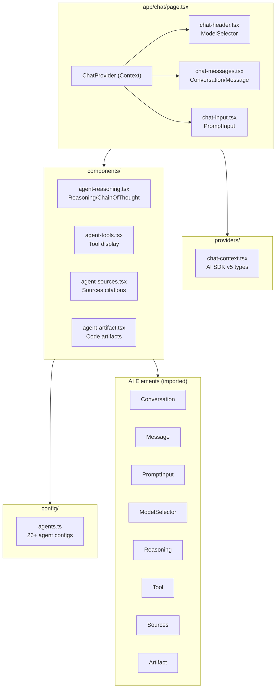

<!-- AGENTS-META {"title":"Chat App","version":"1.0.0","applies_to":"app/chat/","last_updated":"2025-11-29T00:00:00Z","status":"stable"} -->
# App/Chat

## Overview

The `/chat` route provides a rich AI chat interface built with **AI Elements** (30 components) integrated with **26+ Mastra agents**. Uses AI SDK v5 patterns with streaming, reasoning display, tool execution, and source citations.

## Architecture



## File Structure

```plaintext
app/chat/
├── page.tsx                    # Main chat page with ChatProvider
├── providers/
│   └── chat-context.tsx        # React Context with AI SDK v5 types
├── config/
│   └── agents.ts               # 26+ agent configurations with feature flags
└── components/
    ├── chat-header.tsx         # Header with ModelSelector
    ├── chat-messages.tsx       # Message list with streaming
    ├── chat-input.tsx          # PromptInput with submit
    ├── agent-reasoning.tsx     # Reasoning/ChainOfThought display
    ├── agent-tools.tsx         # Tool invocation display
    ├── agent-sources.tsx       # Sources citations for research
    └── agent-artifact.tsx      # Code/content artifacts
```

## Key Patterns

### AI SDK v5 Compatibility

The chat uses AI SDK v5 types and patterns:

```typescript
// Type imports
import type { UIMessage, DynamicToolUIPart, TextUIPart, ReasoningUIPart } from "ai"
import { isTextUIPart, isReasoningUIPart, isToolOrDynamicToolUIPart } from "ai"

// Message parts (NOT content)
const textPart = message.parts?.find(isTextUIPart)
const content = textPart?.text || ""

// Tool states: input-available, output-available, output-error
const tools = message.parts?.filter(isToolOrDynamicToolUIPart)
```

### Mastra Stream Chunk Types

```typescript
// From @mastra/core/stream ChunkType:
case "text-delta":      // Streaming text content
case "reasoning-delta": // Streaming reasoning (NOT "reasoning")
case "tool-call":       // Tool invocation started
case "tool-result":     // Tool execution complete
case "source":          // Research sources
case "finish":          // payload.output.usage.inputTokens
```

### Agent Configuration

```typescript
// config/agents.ts
export interface AgentConfig {
  id: string
  name: string
  description: string
  category: 'core' | 'research' | 'content' | 'data' | 'financial' | 'diagram' | 'utility'
  features: {
    reasoning: boolean      // Show Reasoning component
    chainOfThought: boolean // Show ChainOfThought steps
    tools: boolean          // Show Tool invocations
    sources: boolean        // Show Sources citations
    canvas: boolean         // Show Canvas (future)
    artifacts: boolean      // Show code artifacts
    fileUpload: boolean     // Enable file attachments
  }
}
```

## Agent Categories

| Category | Agents | Count |
|----------|--------|-------|
| **Core** | weatherAgent, a2aCoordinatorAgent | 2 |
| **Research** | researchAgent, researchPaperAgent, documentProcessingAgent, knowledgeIndexingAgent | 4 |
| **Content** | copywriterAgent, editorAgent, contentStrategistAgent, scriptWriterAgent, reportAgent | 5 |
| **Data** | dataExportAgent, dataIngestionAgent, dataTransformationAgent | 3 |
| **Financial** | stockAnalysisAgent, chartTypeAdvisorAgent, chartDataProcessorAgent, chartGeneratorAgent, chartSupervisorAgent | 5 |
| **Diagram** | csvToExcalidrawAgent, imageToCsvAgent, excalidrawValidatorAgent | 3 |
| **Utility** | evaluationAgent, learningExtractionAgent, dane, sqlAgent | 4 |

## AI Elements Used

| Component | File | Purpose |
|-----------|------|---------|
| `Conversation`, `ConversationContent`, `ConversationEmptyState`, `ConversationScrollButton` | chat-messages.tsx | Message container |
| `Message`, `MessageContent`, `MessageResponse`, `MessageToolbar`, `MessageActions`, `MessageAction` | chat-messages.tsx | Individual messages |
| `PromptInput`, `PromptInputTextarea`, `PromptInputFooter`, `PromptInputSubmit` | chat-input.tsx | Input form |
| `ModelSelector`, `ModelSelectorTrigger`, `ModelSelectorContent`, `ModelSelectorList`, `ModelSelectorGroup`, `ModelSelectorItem` | chat-header.tsx | Agent selection |
| `Reasoning`, `ReasoningTrigger`, `ReasoningContent` | agent-reasoning.tsx | AI thinking display |
| `Tool`, `ToolHeader`, `ToolContent`, `ToolInput`, `ToolOutput` | agent-tools.tsx | Tool execution |
| `Sources`, `SourcesTrigger`, `SourcesContent`, `Source` | agent-sources.tsx | Citations |
| `Artifact`, `ArtifactHeader`, `ArtifactContent`, `ArtifactActions` | agent-artifact.tsx | Code artifacts |
| `Loader` | chat-messages.tsx | Loading indicator |
| `CodeBlock`, `CodeBlockCopyButton` | agent-artifact.tsx | Syntax highlighting |

## Implementation Status

| Task | Status | Description |
|------|--------|-------------|
| AIEL-001 | ✅ | ChatContext provider with AI SDK v5 |
| AIEL-002 | ✅ | Agent config system (26+ agents) |
| AIEL-003 | ✅ | ChatHeader with ModelSelector |
| AIEL-004 | ✅ | ChatMessages with streaming |
| AIEL-005 | ✅ | ChatInput with PromptInput |
| AIEL-006 | ✅ | Reasoning display |
| AIEL-007 | ✅ | Tool execution display |
| AIEL-008 | ✅ | Sources citations |
| AIEL-009 | ✅ | Context (token usage) tracking |
| AIEL-010 | ✅ | File upload support |
| AIEL-011 | ✅ | Artifact display |
| AIEL-012 | ✅ | Page integration complete |
| AIEL-013 | ⬜ | E2E tests |

**Completion: 12/13 (92%)**

## Usage

```tsx
// app/chat/page.tsx
import { ChatProvider } from "./providers/chat-context"
import { ChatHeader } from "./components/chat-header"
import { ChatMessages } from "./components/chat-messages"
import { ChatInput } from "./components/chat-input"

export default function ChatPage() {
  return (
    <ChatProvider defaultAgent="researchAgent">
      <main className="flex h-screen flex-col bg-background">
        <ChatHeader />
        <ChatMessages />
        <ChatInput />
      </main>
    </ChatProvider>
  )
}
```

## Remaining Work

1. **AIEL-013**: Create `app/chat/__tests__/chat.test.tsx` with Vitest (optional)

---

*Last updated: 2025-11-29*
