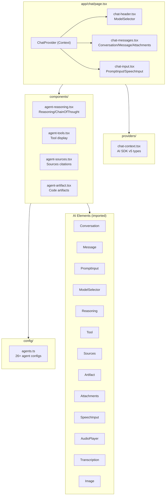

<!-- AGENTS-META {"title":"Chat App","version":"2.0.0","applies_to":"app/chat/","last_updated":"2026-02-16T00:00:00Z","status":"stable"} -->

# App/Chat

## Recent Update (2026-04-15)

- Settings pages are now modular route groups instead of two monolithic screens:
  - `/chat/user` overview + focused routes for profile, security, sessions, API keys, and danger zone
  - `/chat/admin` overview + focused routes for runtime and user operations
- Use `app/chat/components/chat-settings-shell.tsx` when a chat route needs the shared `ChatProvider` + `ChatPageShell` + `MainSidebar` composition plus an in-section settings nav.
- Use the same shared shell composition for non-settings dashboard surfaces that need the persistent chat sidebar; the current wrapped set includes datasets, evaluation, observability, tools, logs, harness, MCP/A2A, workflows, and workflow detail pages.
- `UserSettingsPanel` and `AdminSettingsPanel` now support section-based rendering so new routes can reuse the same Better Auth mutations without duplicating form logic.
- `useWorkspaces()` in `lib/hooks/use-mastra-query.ts` now returns normalized `WorkspaceItem[]`; new chat UI code should consume that array directly instead of re-decoding `{ workspaces: [...] }` response shapes in components.
- Prefer shared tooltip and scroll affordances on high-density chat surfaces:
  - add tooltip descriptions for navigation items and overview cards when a route’s purpose is not obvious
  - use `ScrollArea` for long sidebars, thread lists, or horizontally dense settings navs rather than letting layout overflow
  - keep shell spacing consistent through `ChatPageShell` instead of per-page padding drift

## Overview

The `/chat` route provides a rich AI chat interface built with **AI Elements** (52 components) integrated with **26+ Mastra agents**. Uses `@ai-sdk/react` with `useChat` and `DefaultChatTransport` to stream responses from Mastra's `/chat` route.

## AI SDK Integration

Uses `useChat` from `@ai-sdk/react` with `DefaultChatTransport`:

```tsx
import { useChat } from '@ai-sdk/react'
import { DefaultChatTransport } from 'ai'

const { messages, sendMessage, stop, status } = useChat({
    transport: new DefaultChatTransport({
        api: 'http://localhost:4111/chat',
        prepareSendMessagesRequest({ messages }) {
            return {
                body: {
                    messages,
                    resourceId: selectedAgent,
                    data: { agentId: selectedAgent },
                },
            }
        },
    }),
})
```

## Architecture


```mermaid
graph TB
    subgraph ChatPage["app/chat/page.tsx"]
        ChatProvider["ChatProvider (Context)"]
        ChatProvider --> ChatHeader
        ChatProvider --> ChatMessages
        ChatProvider --> ChatInput
    end

    subgraph Providers["providers/"]
        ChatContext["chat-context.tsx<br/>AI SDK v5 types"]
    end

    subgraph Components["components/"]
        ChatHeader["chat-header.tsx<br/>ModelSelector"]
        ChatMessages["chat-messages.tsx<br/>Conversation/Message/Attachments"]
        ChatInput["chat-input.tsx<br/>PromptInput/SpeechInput"]
        AgentReasoning["agent-reasoning.tsx<br/>Reasoning/ChainOfThought"]
        AgentTools["agent-tools.tsx<br/>Tool display"]
        AgentSources["agent-sources.tsx<br/>Sources citations"]
        AgentArtifact["agent-artifact.tsx<br/>Code artifacts"]
    end

    subgraph Config["config/"]
        AgentConfig["agents.ts<br/>26+ agent configs"]
    end

    subgraph AIElements["AI Elements (imported)"]
        Conversation
        Message
        PromptInput
        ModelSelector
        Reasoning
        Tool
        Sources
        Artifact
        Attachments
        SpeechInput
        AudioPlayer
        Transcription
        Image
    end

    ChatPage --> Providers
    ChatPage --> Components
    Components --> Config
    Components --> AIElements
```

## File Structure

```plaintext
app/chat/
├── page.tsx                    # Main chat page with ChatProvider
├── AGENTS.md                   # This documentation
├── providers/
│   ├── chat-context.tsx        # React Context with AI SDK v5 types
│   └── chat-context-types.ts   # Type definitions
├── config/
│   └── agents.ts               # 26+ agent configurations with feature flags
└── components/
    ├── chat-header.tsx         # Header with ModelSelector
    ├── chat-messages.tsx       # Message list with streaming, Attachments, AudioPlayer
    ├── chat-input.tsx          # PromptInput with SpeechInput integration
    ├── agent-reasoning.tsx     # Reasoning/ChainOfThought display
    ├── agent-tools.tsx         # Tool invocation display
    ├── agent-sources.tsx       # Sources citations for research
    └── agent-artifact.tsx      # Code/content artifacts
```

## Key Patterns

### AI SDK v5 Compatibility

The chat uses AI SDK v5 types and patterns:

```typescript
// Type imports - use ONLY from 'ai' package, no custom types
import type {
    UIMessage,
    UIMessagePart,
    DynamicToolUIPart,
    TextUIPart,
    ReasoningUIPart,
    ToolUIPart,
    FileUIPart,
    DataUIPart,
} from 'ai'
import {
    isTextUIPart,
    isReasoningUIPart,
    isToolOrDynamicToolUIPart,
    isFileUIPart,
    isDataUIPart,
} from 'ai'

// Message parts (NOT content)
const textPart = message.parts?.find(isTextUIPart)
const content = textPart?.text || ''

// Tool states: input-available, output-available, output-error
const tools = message.parts?.filter(isToolOrDynamicToolUIPart)

// File parts for Attachments
const fileParts = message.parts?.filter(isFileUIPart)
```

### Mastra Stream Chunk Types

```typescript
// From @mastra/core/stream ChunkType:
case "text-delta":      // Streaming text content
case "reasoning-delta": // Streaming reasoning (NOT "reasoning")
case "tool-call":       // Tool invocation started
case "tool-result":     // Tool execution complete
case "source":          // Research sources
case "finish":          // payload.output.usage.inputTokens
```

### Agent Configuration

```typescript
// config/agents.ts
export interface AgentConfig {
    id: string
    name: string
    description: string
    category:
        | 'core'
        | 'research'
        | 'content'
        | 'data'
        | 'financial'
        | 'diagram'
        | 'utility'
    features: {
        reasoning: boolean // Show Reasoning component
        chainOfThought: boolean // Show ChainOfThought steps
        tools: boolean // Show Tool invocations
        sources: boolean // Show Sources citations
        canvas: boolean // Show Canvas (future)
        artifacts: boolean // Show code artifacts
        fileUpload: boolean // Enable file attachments
        audio: boolean // Enable audio playback
        transcription: boolean // Show transcription for speech
    }
}
```

## AI Elements Integration Status

### Currently Integrated (24 components)

#### chat-messages.tsx

| Component                                                                                           | Status | Purpose                       |
| --------------------------------------------------------------------------------------------------- | ------ | ----------------------------- |
| `Conversation`, `ConversationContent`, `ConversationEmptyState`, `ConversationScrollButton`         | ✅     | Message container with scroll |
| `Message`, `MessageContent`, `MessageResponse`, `MessageToolbar`, `MessageActions`, `MessageAction` | ✅     | Individual message display    |
| `Loader`                                                                                            | ✅     | Loading indicator             |
| `CodeBlock`, `CodeBlockCopyButton`                                                                  | ✅     | Syntax highlighting           |
| `Image` (as AIImage)                                                                                | ✅     | Image rendering               |
| `Attachments`, `Attachment`, `AttachmentPreview`, `AttachmentInfo`, `AttachmentRemove`              | ✅     | File attachments display      |
| `AudioPlayer`, `AudioPlayerElement`, `AudioPlayerControlBar`                                        | ✅     | Audio playback                |
| `Transcription`, `TranscriptionSegment`                                                             | ✅     | Speech-to-text display        |

#### chat-input.tsx

| Component                                                                                                                       | Status | Purpose              |
| ------------------------------------------------------------------------------------------------------------------------------- | ------ | -------------------- |
| `PromptInput`, `PromptInputTextarea`, `PromptInputFooter`, `PromptInputSubmit`, `PromptInputActions`, `PromptInputAction`       | ✅     | Input form           |
| `Context`, `ContextContent`, `ContextItem`, `ContextItemIcon`, `ContextItemLabel`, `ContextItemValue`                           | ✅     | Token usage display  |
| `SpeechInput`, `SpeechInputButton`, `SpeechInputListening`                                                                      | ✅     | Speech-to-text input |
| `ModelSelector`, `ModelSelectorTrigger`, `ModelSelectorContent`, `ModelSelectorList`, `ModelSelectorGroup`, `ModelSelectorItem` | ✅     | Agent selection      |

#### agent-\*.tsx files

| Component                                                                          | File                | Status | Purpose                |
| ---------------------------------------------------------------------------------- | ------------------- | ------ | ---------------------- |
| `Reasoning`, `ReasoningTrigger`, `ReasoningContent`                                | agent-reasoning.tsx | ✅     | AI thinking display    |
| `ChainOfThought`, `ChainOfThoughtItem`                                             | agent-reasoning.tsx | ✅     | Step-by-step reasoning |
| `Tool`, `ToolHeader`, `ToolContent`, `ToolInput`, `ToolOutput`                     | agent-tools.tsx     | ✅     | Tool execution         |
| `Sources`, `SourcesTrigger`, `SourcesContent`, `Source`                            | agent-sources.tsx   | ✅     | Citations              |
| `Artifact`, `ArtifactHeader`, `ArtifactContent`, `ArtifactActions`, `ArtifactCode` | agent-artifact.tsx  | ✅     | Code artifacts         |

### Not Yet Integrated (28 components)

#### Input & Controls

| Component                                                   | Potential Use               | Priority |
| ----------------------------------------------------------- | --------------------------- | -------- |
| `Controls`, `ControlsPlay`, `ControlsPause`, `ControlsStop` | Playback controls for audio | Medium   |
| `MicSelector`                                               | Select microphone device    | Low      |
| `VoiceSelector`                                             | Select voice for TTS        | Low      |

#### Content Display

| Component                                                      | Potential Use                    | Priority |
| -------------------------------------------------------------- | -------------------------------- | -------- |
| `Sandbox`, `SandboxHeader`, `SandboxContent`, `SandboxPreview` | Code execution sandbox           | High     |
| `Terminal`, `TerminalHeader`, `TerminalContent`                | Terminal output display          | High     |
| `FileTree`, `FileTreeItem`                                     | Show file structure in artifacts | Medium   |
| `SchemaDisplay`, `SchemaProperty`, `SchemaType`                | JSON schema visualization        | Medium   |
| `Commit`, `CommitHeader`, `CommitContent`                      | Git commit display               | Low      |
| `PackageInfo`, `PackageInfoHeader`, `PackageInfoContent`       | Package metadata                 | Low      |
| `StackTrace`, `StackTraceItem`                                 | Error stack traces               | Medium   |
| `TestResults`, `TestResult`                                    | Test output display              | Medium   |

#### Canvas & Visualization

| Component                                 | Potential Use          | Priority |
| ----------------------------------------- | ---------------------- | -------- |
| `Canvas`, `CanvasHeader`, `CanvasContent` | Visual workflow canvas | High     |
| `Node`, `NodeHeader`, `NodeContent`       | Workflow nodes         | High     |
| `Edge`, `EdgeLabel`                       | Workflow connections   | High     |
| `Panel`, `PanelHeader`, `PanelContent`    | Side panels            | Medium   |
| `Connection`, `ConnectionIndicator`       | Connection status      | Medium   |

#### Agent & Task Management

| Component                                           | Potential Use       | Priority |
| --------------------------------------------------- | ------------------- | -------- |
| `Agent`, `AgentHeader`, `AgentContent`              | Agent details panel | Medium   |
| `Persona`, `PersonaHeader`, `PersonaContent`        | Persona management  | Low      |
| `Task`, `TaskHeader`, `TaskContent`                 | Task display        | Medium   |
| `Queue`, `QueueHeader`, `QueueContent`, `QueueItem` | Task queue          | Medium   |
| `Plan`, `PlanHeader`, `PlanContent`, `PlanItem`     | Execution plans     | Medium   |

#### UI Utilities

| Component                                             | Potential Use           | Priority |
| ----------------------------------------------------- | ----------------------- | -------- |
| `Shimmer`                                             | Loading skeletons       | Medium   |
| `Snippet`                                             | Code snippets           | Low      |
| `Suggestion`, `SuggestionItem`                        | Input suggestions       | Medium   |
| `OpenInChat`                                          | External link to chat   | Low      |
| `Toolbar`                                             | Message toolbar actions | Medium   |
| `Checkpoint`, `CheckpointHeader`, `CheckpointContent` | Save points             | Low      |

## Agent Categories

| Category      | Agents                                                                                                        | Count |
| ------------- | ------------------------------------------------------------------------------------------------------------- | ----- |
| **Core**      | weatherAgent, a2aCoordinatorAgent                                                                             | 2     |
| **Research**  | researchAgent, researchPaperAgent, documentProcessingAgent, knowledgeIndexingAgent                            | 4     |
| **Content**   | copywriterAgent, editorAgent, contentStrategistAgent, scriptWriterAgent, reportAgent                          | 5     |
| **Data**      | dataExportAgent, dataIngestionAgent, dataTransformationAgent                                                  | 3     |
| **Financial** | stockAnalysisAgent, chartTypeAdvisorAgent, chartDataProcessorAgent, chartGeneratorAgent, chartSupervisorAgent | 5     |
| **Diagram**   | csvToExcalidrawAgent, imageToCsvAgent, excalidrawValidatorAgent                                               | 3     |
| **Utility**   | evaluationAgent, learningExtractionAgent, dane, sqlAgent                                                      | 4     |

## Implementation Status

### Core Integration Tasks

| Task     | Status | Description                          |
| -------- | ------ | ------------------------------------ |
| AIEL-001 | ✅     | ChatContext provider with AI SDK v5  |
| AIEL-002 | ✅     | Agent config system (26+ agents)     |
| AIEL-003 | ✅     | ChatHeader with ModelSelector        |
| AIEL-004 | ✅     | ChatMessages with streaming          |
| AIEL-005 | ✅     | ChatInput with PromptInput           |
| AIEL-006 | ✅     | Reasoning display                    |
| AIEL-007 | ✅     | Tool execution display               |
| AIEL-008 | ✅     | Sources citations                    |
| AIEL-009 | ✅     | Context (token usage) tracking       |
| AIEL-010 | ✅     | File upload support                  |
| AIEL-011 | ✅     | Artifact display                     |
| AIEL-012 | ✅     | Page integration complete            |
| AIEL-013 | ✅     | SpeechInput integration              |
| AIEL-014 | ✅     | Attachments component integration    |
| AIEL-015 | ✅     | AudioPlayer integration              |
| AIEL-016 | ✅     | Transcription component integration  |
| AIEL-017 | ⬜     | Image component full integration     |
| AIEL-018 | ⬜     | Toolbar component integration        |
| AIEL-019 | ⬜     | Sandbox component integration        |
| AIEL-020 | ⬜     | Terminal component integration       |
| AIEL-021 | ⬜     | Canvas/Node/Edge for workflows       |
| AIEL-022 | ⬜     | FileTree for artifacts               |
| AIEL-023 | ⬜     | TestResults for code execution       |
| AIEL-024 | ⬜     | SchemaDisplay for data validation    |
| AIEL-025 | ⬜     | Task/Queue/Plan for agent management |

**Completion: 16/25 (64%)**

### Type Safety Tasks

| Task     | Status | Description                                         |
| -------- | ------ | --------------------------------------------------- |
| TYPE-001 | ✅     | All message types from 'ai' package                 |
| TYPE-002 | ✅     | isFileUIPart, isTextUIPart, isReasoningUIPart usage |
| TYPE-003 | ✅     | UIMessage, UIMessagePart imports                    |
| TYPE-004 | ⬜     | DynamicToolUIPart full utilization                  |
| TYPE-005 | ⬜     | DataUIPart integration for structured data          |

**Completion: 3/5 (60%)**

## Usage

```tsx
// app/chat/page.tsx
import { ChatProvider } from './providers/chat-context'
import { ChatHeader } from './components/chat-header'
import { ChatMessages } from './components/chat-messages'
import { ChatInput } from './components/chat-input'

export default function ChatPage() {
    return (
        <ChatProvider defaultAgent="researchAgent">
            <main className="flex h-screen flex-col bg-background">
                <ChatHeader />
                <ChatMessages />
                <ChatInput />
            </main>
        </ChatProvider>
    )
}
```

## Next Steps

### Phase 1: Enhanced Content Display (Priority: High)

1. **Sandbox/Terminal**: Integrate for code execution agents
2. **FileTree**: Show file structure in code artifacts
3. **TestResults**: Display test output for validation agents

### Phase 2: Workflow Visualization (Priority: High)

1. **Canvas/Node/Edge**: Visual workflow builder
2. **Panel**: Side panels for tool configurations
3. **Connection**: Real-time connection status

### Phase 3: Agent Management (Priority: Medium)

1. **Agent/Persona**: Agent detail panels
2. **Task/Queue/Plan**: Task execution tracking
3. **Checkpoint**: Conversation save points

### Phase 4: Polish (Priority: Low)

1. **Shimmer**: Loading skeletons
2. **Suggestion**: Input autocomplete
3. **MicSelector/VoiceSelector**: Audio device selection

---

_Last updated: 2026-02-16_
