<!-- AGENTS-META {"title":"Chat Components","version":"3.0.0","applies_to":"app/chat/components/","last_updated":"2026-02-17T00:00:00Z","status":"stable"} -->

# Chat Components

## Overview

The `/chat` route provides a rich AI chat interface built with **AI Elements** components integrated with **26+ Mastra agents**. Uses `@ai-sdk/react` with `useChat` and `DefaultChatTransport` to stream responses from Mastra's `/chat` route.

## Architecture

```mermaid
graph TB
    subgraph ChatPage["app/chat/page.tsx"]
        ChatProvider["ChatProvider (Context)"]
        ChatProvider --> ChatHeader
        ChatProvider --> ChatMessages
        ChatProvider --> ChatInput
    end

    subgraph Providers["providers/"]
        ChatContext["chat-context.tsx<br/>AI SDK types + Mastra RequestContext"]
    end

    subgraph CoreComponents["Core Components"]
        ChatHeader["chat-header.tsx<br/>ModelSelector"]
        ChatMessages["chat-messages.tsx<br/>Message rendering with streaming"]
        ChatInput["chat-input.tsx<br/>PromptInput + SpeechInput"]
    end

    subgraph AgentComponents["agent-*.tsx (19 components)"]
        AgentReasoning["agent-reasoning.tsx<br/>Reasoning + ChainOfThought"]
        AgentTools["agent-tools.tsx<br/>Tool display"]
        AgentSources["agent-sources.tsx<br/>Citations"]
        AgentArtifact["agent-artifact.tsx<br/>Code artifacts"]
        AgentSandbox["agent-sandbox.tsx<br/>Full sandbox with files/terminal"]
        AgentWebPreview["agent-web-preview.tsx<br/>CodeSandbox + WebPreview"]
        AgentWorkflow["agent-workflow.tsx<br/>Workflow visualization"]
        AgentPlan["agent-plan.tsx<br/>Plan display"]
        AgentQueue["agent-queue.tsx<br/>Queue display"]
        AgentTask["agent-task.tsx<br/>Task display"]
        AgentSuggestions["agent-suggestions.tsx<br/>Suggestions"]
        AgentCheckpoint["agent-checkpoint.tsx<br/>Checkpoint"]
        AgentInlineCitation["agent-inline-citation.tsx<br/>Inline citation"]
    end

    subgraph AIElements["AI Elements (imported from src/components/ai-elements/)"]
        Reasoning
        ChainOfThought
        Tool
        Sources
        Artifact
        Sandbox
        Terminal
        FileTree
        TestResults
        SchemaDisplay
        StackTrace
        Canvas
        Node
        Edge
        Plan
        Queue
        Task
    end

    ChatPage --> Providers
    ChatPage --> CoreComponents
    CoreComponents --> AgentComponents
    AgentComponents --> AIElements
```



## Component Categories

### Core Components (4)

| Component      | File                | Description                                     |
| -------------- | ------------------- | ----------------------------------------------- |
| `ChatHeader`   | `chat-header.tsx`   | Header with ModelSelector, agent switching      |
| `ChatMessages` | `chat-messages.tsx` | Message list with streaming, attachments, audio |
| `ChatInput`    | `chat-input.tsx`    | PromptInput with SpeechInput integration        |
| `ChatSidebar`  | `chat-sidebar.tsx`  | Sidebar for thread/history (if exists)          |

### Agent Components (19)

All agent-\* components wrap AI Elements and are used in `chat-messages.tsx` to render different message parts.

| Component             | File                        | AI Elements Used                                                                                                                                                                                                                        | Purpose                                                       |
| --------------------- | --------------------------- | --------------------------------------------------------------------------------------------------------------------------------------------------------------------------------------------------------------------------------------- | ------------------------------------------------------------- |
| `AgentReasoning`      | `agent-reasoning.tsx`       | `Reasoning`, `ReasoningTrigger`, `ReasoningContent`, `ChainOfThought`, `ChainOfThoughtItem`                                                                                                                                             | Display AI thinking/reasoning                                 |
| `AgentTools`          | `agent-tools.tsx`           | `Tool`, `ToolHeader`, `ToolContent`, `ToolInput`, `ToolOutput`                                                                                                                                                                          | Tool execution display                                        |
| `AgentSources`        | `agent-sources.tsx`         | `Sources`, `SourcesTrigger`, `SourcesContent`, `Source`                                                                                                                                                                                 | Research citations                                            |
| `AgentArtifact`       | `agent-artifact.tsx`        | `Artifact`, `ArtifactHeader`, `ArtifactContent`, `ArtifactActions`, `ArtifactCode`                                                                                                                                                      | Code/content artifacts                                        |
| `AgentSandbox`        | `agent-sandbox.tsx`         | `Sandbox`, `SandboxHeader`, `SandboxContent`, `FileTree`, `FileTreeItem`, `Terminal`, `TerminalHeader`, `TerminalContent`, `TestResults`, `TestResult`, `SchemaDisplay`, `SchemaProperty`, `SchemaType`, `StackTrace`, `StackTraceItem` | Full sandbox with files, terminal, tests, schema, stack trace |
| `AgentCodeSandbox`    | `agent-web-preview.tsx`     | `Sandbox`, `CodeBlock`                                                                                                                                                                                                                  | Simple code snippet sandbox (wrapper)                         |
| `AgentWebPreview`     | `agent-web-preview.tsx`     | Custom implementation                                                                                                                                                                                                                   | HTML/UI preview from code                                     |
| `AgentWorkflow`       | `agent-workflow.tsx`        | `Canvas`, `CanvasHeader`, `CanvasContent`, `Node`, `NodeHeader`, `NodeContent`, `Edge`, `EdgeLabel`, `Panel`, `PanelHeader`, `PanelContent`                                                                                             | Workflow visualization                                        |
| `AgentPlan`           | `agent-plan.tsx`            | `Plan`, `PlanHeader`, `PlanContent`, `PlanItem`                                                                                                                                                                                         | Execution plans                                               |
| `AgentQueue`          | `agent-queue.tsx`           | `Queue`, `QueueHeader`, `QueueContent`, `QueueItem`                                                                                                                                                                                     | Task queues                                                   |
| `AgentTask`           | `agent-task.tsx`            | `Task`, `TaskHeader`, `TaskContent`                                                                                                                                                                                                     | Task display                                                  |
| `AgentSuggestions`    | `agent-suggestions.tsx`     | `Suggestion`, `SuggestionItem`                                                                                                                                                                                                          | Input suggestions                                             |
| `AgentCheckpoint`     | `agent-checkpoint.tsx`      | `Checkpoint`, `CheckpointHeader`, `CheckpointContent`                                                                                                                                                                                   | Conversation save points                                      |
| `AgentInlineCitation` | `agent-inline-citation.tsx` | Custom implementation                                                                                                                                                                                                                   | Inline citations                                              |

## AI Elements Integration

### Currently Integrated (32 components)

#### From agent-reasoning.tsx

| AI Element           | Props                                 | Purpose                       |
| -------------------- | ------------------------------------- | ----------------------------- |
| `Reasoning`          | `thinking`, `trigger`, `triggerLabel` | Collapsible reasoning display |
| `ReasoningTrigger`   | `isOpen`, `onToggle`                  | Toggle button for reasoning   |
| `ReasoningContent`   | `children`                            | Reasoning content container   |
| `ChainOfThought`     | `steps`                               | Step-by-step reasoning        |
| `ChainOfThoughtItem` | `step`, `status`, `content`           | Individual reasoning step     |

#### From agent-tools.tsx

| AI Element   | Props                              | Purpose                 |
| ------------ | ---------------------------------- | ----------------------- |
| `Tool`       | `status`, `loading`, `description` | Tool invocation wrapper |
| `ToolHeader` | `name`, `status`                   | Tool name and status    |
| `ToolInput`  | `args`                             | Tool input parameters   |
| `ToolOutput` | `result`, `error`                  | Tool execution result   |

#### From agent-sources.tsx

| AI Element       | Props                         | Purpose              |
| ---------------- | ----------------------------- | -------------------- |
| `Sources`        | `citations`, `status`         | Sources container    |
| `SourcesTrigger` | `isOpen`, `count`, `onToggle` | Toggle sources panel |
| `SourcesContent` | `children`                    | Sources content      |
| `Source`         | `url`, `title`, `snippet`     | Individual source    |

#### From agent-artifact.tsx

| AI Element                 | Props                     | Purpose             |
| -------------------------- | ------------------ | ------------------ |
| `Artifact`                 | `type`, `title`, `status` | Artifact container |
| `ArtifactHeader`           | `title`, `actions` | Artifact header    |
| `ArtifactContent`          | `children`         | Artifact content   |
| `ArtifactActions`          | `children`         | Action buttons     |
| `ArtifactCode`             | `code`, `language` | Code display       |

#### From agent-sandbox.tsx (Full Sandbox)

| AI Element        | Props                                 | Purpose                   |
| ----------------- | ------------------------------------- | ------------------------- |
| `Sandbox`         | `files`, `activeFile`, `onFileSelect` | Code sandbox container    |
| `SandboxHeader`   | `title`, `tabs`                       | Sandbox header with tabs  |
| `SandboxContent`  | `children`                            | Sandbox content area      |
| `FileTree`        | `files`, `onFileSelect`               | File structure display    |
| `FileTreeItem`    | `name`, `type`, `isActive`            | Individual file           |
| `Terminal`        | `output`, `status`                    | Terminal output           |
| `TerminalHeader`  | `title`, `actions`                    | Terminal header           |
| `TerminalContent` | `children`                            | Terminal content          |
| `TestResults`     | `suites`, `summary`                   | Test results display      |
| `TestResult`      | `name`, `status`, `duration`          | Individual test           |
| `SchemaDisplay`   | `schema`, `title`                     | JSON schema visualization |
| `SchemaProperty`  | `name`, `type`, `required`            | Schema property           |
| `SchemaType`      | `type`, `properties`                  | Schema type               |
| `StackTrace`      | `frames`                              | Error stack trace         |
| `StackTraceItem`  | `file`, `line`, `column`, `code`      | Stack frame               |

#### From agent-workflow.tsx

| AI Element      | Props                             | Purpose         |
| --------------- | --------------------------------- | --------------- |
| `Canvas`        | `nodes`, `edges`, `onNodeClick`   | Workflow canvas |
| `CanvasHeader`  | `title`, `actions`                | Canvas header   |
| `CanvasContent` | `children`                        | Canvas content  |
| `Node`          | `id`, `type`, `data`, `selected`  | Workflow node   |
| `NodeHeader`    | `title`, `icon`                   | Node header     |
| `NodeContent`   | `children`                        | Node content    |
| `Edge`          | `id`, `source`, `target`, `label` | Connection edge |
| `EdgeLabel`     | `label`                           | Edge label      |
| `Panel`         | `title`, `position`               | Side panel      |
| `PanelHeader`   | `title`, `onClose`                | Panel header    |
| `PanelContent`  | `children`                        | Panel content   |

#### From agent-plan.tsx

| AI Element    | Props                           | Purpose              |
| ------------- | ------------------------------- | -------------------- |
| `Plan`        | `steps`, `currentStep`          | Plan container       |
| `PlanHeader`  | `title`, `status`               | Plan header          |
| `PlanContent` | `children`                      | Plan content         |
| `PlanItem`    | `step`, `status`, `description` | Individual plan step |

#### From agent-queue.tsx

| AI Element     | Props                         | Purpose               |
| -------------- | ----------------------------- | --------------------- |
| `Queue`        | `items`, `status`             | Queue container       |
| `QueueHeader`  | `title`, `count`              | Queue header          |
| `QueueContent` | `children`                    | Queue content         |
| `QueueItem`    | `id`, `status`, `description` | Individual queue item |

#### From agent-task.tsx

| AI Element    | Props                   | Purpose        |
| ------------- | ----------------------- | -------------- |
| `Task`        | `id`, `status`, `title` | Task container |
| `TaskHeader`  | `title`, `status`       | Task header    |
| `TaskContent` | `children`              | Task content   |

#### From agent-suggestions.tsx

| AI Element       | Props                   | Purpose               |
| ---------------- | ----------------------- | --------------------- |
| `Suggestion`     | `items`, `onSelect`     | Suggestions container |
| `SuggestionItem` | `id`, `text`, `onClick` | Individual suggestion |

#### From agent-checkpoint.tsx

| AI Element          | Props                      | Purpose              |
| ------------------- | -------------------------- | -------------------- |
| `Checkpoint`        | `id`, `timestamp`, `label` | Checkpoint container |
| `CheckpointHeader`  | `title`, `timestamp`       | Checkpoint header    |
| `CheckpointContent` | `messageCount`             | Checkpoint content   |

## Data Structures

### AgentSandboxData

```typescript
interface AgentSandboxData {
    files: Array<{
        name: string
        path: string
        type: 'file' | 'directory'
        content?: string
        language?: string
    }>
    activeFile?: string
    terminalOutput?: string
    testSuites?: Array<{
        name: string
        tests: Array<{
            name: string
            status: 'pass' | 'fail' | 'skip'
            duration?: number
            error?: string
        }>
    }>
    schema?: Record<string, unknown>
    stackTrace?: Array<{
        file: string
        line: number
        column: number
        code?: string
        function?: string
    }>
}
```

### WebPreviewData

```typescript
interface WebPreviewData {
    id: string
    url: string
    title: string
    code?: string
    language?: string
}
```

### Source

```typescript
interface Source {
    url: string
    title: string
}
```

### QueuedTask

```typescript
interface QueuedTask {
    id: string
    status: 'pending' | 'running' | 'completed' | 'failed'
    title: string
    description?: string
}
```

### Checkpoint

```typescript
interface Checkpoint {
    id: string
    messageIndex: number
    timestamp: Date
    messageCount: number
    label?: string
}
```

## Chat Context Integration

### RequestContext (Mastra)

The chat uses Mastra's `RequestContext` to pass request-specific values to agents and tools:

```typescript
import {
    RequestContext,
    MASTRA_RESOURCE_ID_KEY,
    MASTRA_THREAD_ID_KEY,
} from '@mastra/core/request-context'

const requestContext = new RequestContext<{
    'user-id': string
    'tenant-id': string
}>()

// Set reserved keys for multi-tenancy
requestContext.set(MASTRA_RESOURCE_ID_KEY, userId)
requestContext.set(MASTRA_THREAD_ID_KEY, threadId)

// Set custom context
requestContext.set('user-id', userId)
requestContext.set('tenant-id', tenantId)
```

### Context Value

```typescript
interface ChatContextValue {
    // Messages
    messages: UIMessage[]

    // Status
    status: 'ready' | 'streaming' | 'submitted' | 'error'
    isLoading: boolean
    error: string | null

    // Agent
    selectedAgent: string
    agentConfig: AgentConfig
    selectAgent: (agentId: string) => void

    // Streaming
    streamingContent: string
    streamingReasoning: string
    toolInvocations: ToolInvocationState[]

    // Sources
    sources: Source[]

    // Tasks
    queuedTasks: QueuedTask[]
    addTask: (task: Omit<QueuedTask, 'id'>) => string
    updateTask: (taskId: string, updates: Partial<QueuedTask>) => void
    removeTask: (taskId: string) => void

    // Confirmations
    pendingConfirmations: PendingConfirmation[]
    approveConfirmation: (confirmationId: string) => void
    rejectConfirmation: (confirmationId: string, reason?: string) => void

    // Checkpoints
    checkpoints: Checkpoint[]
    createCheckpoint: (messageIndex: number, label?: string) => string
    restoreCheckpoint: (checkpointId: string) => void
    removeCheckpoint: (checkpointId: string) => void

    // Web Preview
    webPreview: WebPreviewData | null
    setWebPreview: (preview: WebPreviewData | null) => void

    // Thread/Resource
    threadId: string
    resourceId: string
    setThreadId: (threadId: string) => void
    setResourceId: (resourceId: string) => void

    // Actions
    sendMessage: (text: string, files?: File[]) => void
    stopGeneration: () => void
    clearMessages: () => void
}
```

## Usage Examples

### Using AgentSandbox (Full Sandbox)

```typescript
import { AgentSandbox } from './agent-sandbox'

const sandboxData = {
  files: [
    { name: 'index.ts', path: '/src/index.ts', type: 'file', content: '...', language: 'typescript' },
    { name: 'utils.ts', path: '/src/utils.ts', type: 'file', content: '...', language: 'typescript' }
  ],
  activeFile: '/src/index.ts',
  terminalOutput: '> running...\ntest passed',
  testSuites: [
    {
      name: 'utils.test.ts',
      tests: [
        { name: 'should format date', status: 'pass', duration: 12 },
        { name: 'should handle invalid date', status: 'fail', duration: 5, error: 'Expected...' }
      ]
    }
  ],
  schema: {
    type: 'object',
    properties: {
      name: { type: 'string' },
      age: { type: 'number' }
    }
  },
  stackTrace: [
    { file: 'index.ts', line: 42, column: 5, code: 'const x = y.z()' }
  ]
}

<AgentSandbox data={sandboxData} />
```

### Using AgentCodeSandbox (Simple)

```typescript
import { AgentCodeSandbox } from './agent-web-preview'

<AgentCodeSandbox
  code={`function hello() {
  console.log("Hello World!")
}`}
  language="typescript"
  title="Hello World"
/>
```

### Using AgentWebPreview

```typescript
import { AgentWebPreview } from './agent-web-preview'

<AgentWebPreview
  url="data:text/html,..."
  title="Generated UI"
  code={htmlCode}
  language="html"
/>
```

## File Structure

```bash
app/chat/components/
├── chat-header.tsx           # Header with ModelSelector
├── chat-messages.tsx         # Message rendering (main component)
├── chat-input.tsx           # Input with SpeechInput
├── chat-sidebar.tsx         # Sidebar (if exists)
│
├── agent-reasoning.tsx      # Reasoning + ChainOfThought
├── agent-tools.tsx          # Tool invocations
├── agent-sources.tsx        # Citations
├── agent-artifact.tsx       # Code artifacts
│
├── agent-sandbox.tsx        # Full sandbox (files, terminal, tests, schema, stack)
├── agent-web-preview.tsx    # CodeSandbox + WebPreview
│
├── agent-workflow.tsx       # Canvas/Node/Edge visualization
├── agent-plan.tsx          # Plan display
├── agent-queue.tsx         # Queue display
├── agent-task.tsx          # Task display
│
├── agent-suggestions.tsx   # Suggestions
├── agent-checkpoint.tsx    # Checkpoints
└── agent-inline-citation.tsx # Inline citations
```

## Mastra Request Context

To use Mastra's `RequestContext` in the chat:

```typescript
// In chat-context.tsx
import {
    RequestContext,
    MASTRA_RESOURCE_ID_KEY,
    MASTRA_THREAD_ID_KEY,
} from '@mastra/core/request-context'

// Create context with proper typing
const requestContext = new RequestContext<{
    'user-id': string
    'agent-id': string
}>()

// Pass to agent/tool calls
requestContext.set(MASTRA_RESOURCE_ID_KEY, resourceId)
requestContext.set(MASTRA_THREAD_ID_KEY, threadId)
requestContext.set('agent-id', selectedAgent)

// In agent instructions - access via requestContext
const agent = new Agent({
    instructions: async ({ requestContext }) => {
        const agentId = requestContext.get('agent-id')
        // ...
    },
})
```

## Best Practices

1. **Use AgentCodeSandbox** for simple code snippets in chat messages
2. **Use AgentSandbox** for full development environments with files/terminal/tests
3. **Use AgentWebPreview** for rendering HTML/UI previews
4. **All agent-\* components** should wrap AI Elements for consistent styling
5. **RequestContext** should be used for multi-tenant isolation via reserved keys

---

_Last updated: 2026-02-17_
