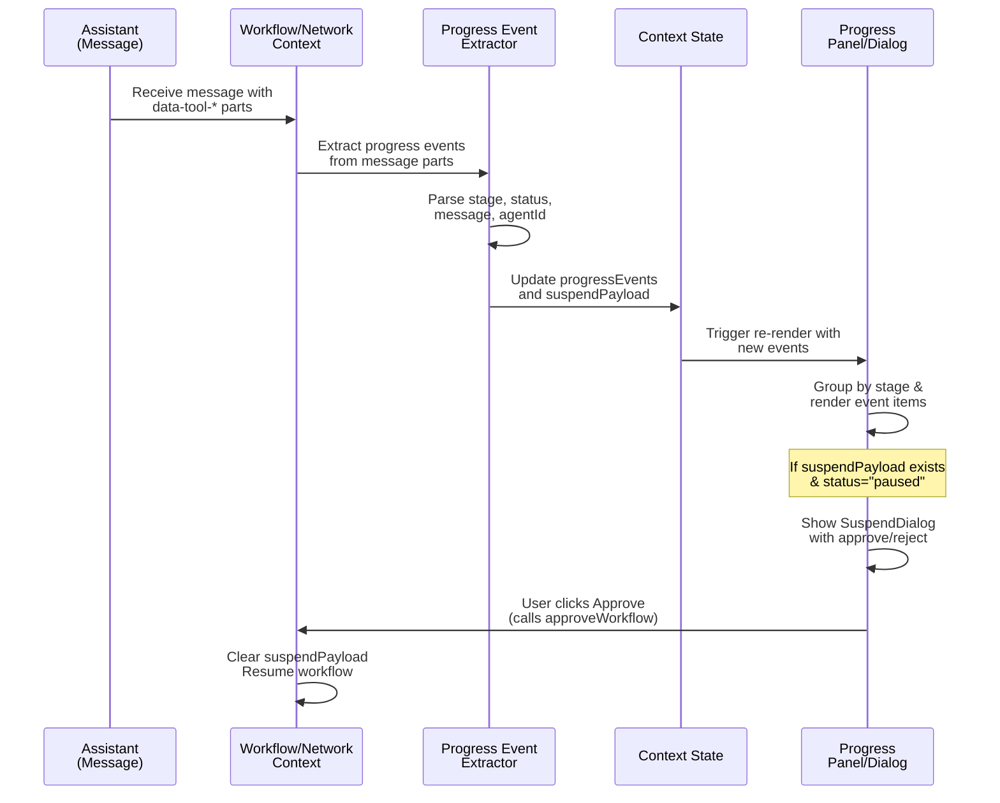

# Workflows Feature

<!-- AGENTS-META {"title":"Workflows Visualization","version":"1.1.0","applies_to":"app/workflows/","last_updated":"2025-12-04T00:00:00Z","status":"stable"} -->

## Overview

The workflows page provides an interactive visualization of Mastra workflows using AI Elements components (Canvas, Node, Edge, Panel, Controls, Toolbar, Connection) with real-time streaming via `@ai-sdk/react` and `@mastra/ai-sdk`.

## Architecture

Follows the same modular pattern as the chat feature:

```text
app/workflows/
├── page.tsx                      # Main page component (clean, minimal)
├── AGENTS.md                     # This documentation file
├── config/
│   └── workflows.ts              # Workflow definitions and types (10 workflows)
├── providers/
│   └── workflow-context.tsx      # State management with useChat + DefaultChatTransport
└── components/
    ├── workflow-header.tsx       # Header with workflow selector + status badges
    ├── workflow-canvas.tsx       # React Flow canvas wrapper
    ├── workflow-node.tsx         # Custom node component with status indicators
    ├── workflow-info-panel.tsx   # Info panel (top-left) - name, description, progress
    ├── workflow-legend.tsx       # Collapsible legend panel (top-right)
    ├── workflow-actions.tsx      # Actions panel (top-right) - fit view, export, code
    ├── workflow-input-panel.tsx  # Input panel (bottom-left) - query input + examples
    └── workflow-output.tsx       # Streaming output panel (bottom-right)
```

## Progress Event Handling



## AI SDK Integration

Uses `useChat` from `@ai-sdk/react` with `DefaultChatTransport` to connect to Mastra's `/workflow/:workflowId` routes:

```tsx
import { useChat } from "@ai-sdk/react"
import { DefaultChatTransport } from "ai"

const { messages, sendMessage, stop, status } = useChat({
  transport: new DefaultChatTransport({
    api: `http://localhost:4111/workflow/${selectedWorkflow}`,
    prepareSendMessagesRequest({ messages }) {
      const inputText = messages[messages.length - 1]?.parts?.[0]?.text ?? ""
      const inputData = buildWorkflowInputData(selectedWorkflow, inputText)
      return { body: { inputData } }
    },
  }),
})
```

### Input Data Mapping

Each workflow expects specific input fields:

| Workflow | Input Field | Example |
|----------|-------------|---------|
| weatherWorkflow | `{ city }` | "San Francisco" |
| contentStudioWorkflow | `{ topic }` | "AI trends 2025" |
| stockAnalysisWorkflow | `{ symbol }` | "AAPL" |
| financialReportWorkflow | `{ symbol }` | "TSLA" |
| researchSynthesisWorkflow | `{ topic }` | "ML best practices" |
| documentProcessingWorkflow | `{ documentPath }` | "./docs/report.pdf" |
| telephoneGameWorkflow | `{ message }` | "Hello world" |
| changelogWorkflow | `{ repository }` | "main..HEAD" |
| contentReviewWorkflow | `{ content }` | "Your content here" |
| learningExtractionWorkflow | `{ content }` | "Text to analyze" |

## AI Elements Components Used

| Component | Purpose |
|-----------|---------|
| **Canvas** | React Flow wrapper with pre-configured defaults |
| **Node** | Card-based node with header, content, footer |
| **Edge** | Animated (active) and temporary (pending) edge types |
| **Panel** | Positioned panels for UI overlays |
| **Controls** | Zoom/pan controls |
| **Toolbar** | Node-attached toolbar with actions |
| **Connection** | Custom bezier curve connection lines |

## Workflow Configuration

All 10 Mastra workflows are configured in `config/workflows.ts`:

| Workflow | Category | Steps |
|----------|----------|-------|
| weatherWorkflow | utility | 2 |
| contentStudioWorkflow | content | 8 |
| contentReviewWorkflow | content | 3 |
| documentProcessingWorkflow | data | 4 |
| financialReportWorkflow | financial | 4 |
| learningExtractionWorkflow | research | 3 |
| researchSynthesisWorkflow | research | 4 |
| stockAnalysisWorkflow | financial | 4 |
| telephoneGameWorkflow | utility | 5 |
| changelogWorkflow | utility | 3 |

## Context API

`useWorkflowContext()` provides:

```tsx
interface WorkflowContextValue {
  // State
  selectedWorkflow: WorkflowId
  workflowConfig: WorkflowConfig | undefined
  workflowStatus: "idle" | "running" | "paused" | "completed" | "error"
  currentRun: WorkflowRun | null
  activeStepIndex: number
  
  // Actions
  selectWorkflow: (workflowId: WorkflowId) => void
  runWorkflow: (inputData?: Record<string, unknown>) => void
  pauseWorkflow: () => void
  resumeWorkflow: () => void
  stopWorkflow: () => void
  runStep: (stepId: string) => Promise<void>
  getStepStatus: (stepId: string) => StepStatus
  
  // React Flow data
  nodes: WorkflowNode[]
  edges: WorkflowEdge[]
  
  // Streaming
  messages: UIMessage[]
  streamingOutput: string
}
```

## Panel Layout

```text
┌─────────────────────────────────────────────────────────────┐
│ [Info Panel]                              [Actions] [Legend] │
│  - Workflow name                           Fit / Export      │
│  - Description                             Code / Legend     │
│  - Progress & status                                         │
├─────────────────────────────────────────────────────────────┤
│                                                             │
│                    [Canvas with Nodes]                      │
│                                                             │
│    ┌─────┐      ┌─────┐      ┌─────┐      ┌─────┐          │
│    │Step │ ──── │Step │ ──── │Step │ ──── │Step │          │
│    │  1  │      │  2  │      │  3  │      │  N  │          │
│    └─────┘      └─────┘      └─────┘      └─────┘          │
│                                                             │
├─────────────────────────────────────────────────────────────┤
│ [Input Panel]                              [Output Panel]    │
│  - Placeholder by category                 - Status icon     │
│  - Example inputs                          - Streaming text  │
│  - Quick Run button                        - Message history │
└─────────────────────────────────────────────────────────────┘
```

## Usage

```tsx
import { WorkflowProvider } from "./providers/workflow-context"
import { WorkflowHeader } from "./components/workflow-header"
import { WorkflowCanvas } from "./components/workflow-canvas"

export default function WorkflowsPage() {
  return (
    <WorkflowProvider defaultWorkflow="contentStudioWorkflow">
      <main className="flex h-screen flex-col bg-background">
        <WorkflowHeader />
        <WorkflowCanvas />
      </main>
    </WorkflowProvider>
  )
}
```

## Server Routes (Mastra)

The workflows connect to these routes in `src/mastra/index.ts`:

```typescript
workflowRoute({
  path: "/workflow",
  workflow: "weatherWorkflow",
  includeTextStreamParts: true,
}),
// ... repeated for all 10 workflows
```

---
Last updated: 2025-12-04
