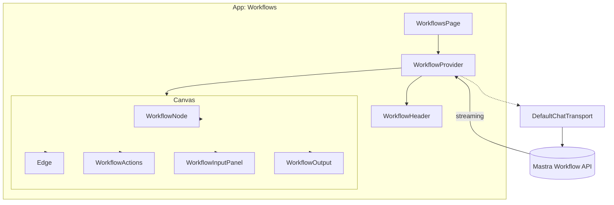

# Workflow Visualizer Documentation (app/workflows)

This document describes the Workflow Visualizer subsystem, including the provider, canvas, nodes and interaction primitives in `app/workflows`. The visualizer lets users select workflows, run pipelines step-by-step, observe streaming step output, and inspect routing/state for multi-step orchestration.

## 1. Component Overview

### Purpose / Responsibility

- Provide an interactive front-end UI for Mastra workflows: visualize steps, run workflows or single steps, observe streaming outputs, and inspect step-level progress/status.
- Centralize state for workflow runs via `WorkflowProvider`, exposing a typed API that other components consume.

### Scope

- In scope: `WorkflowProvider` (state + Mastra transport), `WorkflowsPage` (layout), UI composition: `WorkflowHeader`, `WorkflowCanvas` (nodes/edges), `WorkflowActions`, `WorkflowInputPanel`, `WorkflowOutput`, `WorkflowInfoPanel`, `WorkflowLegend`, and node renderers (`workflow-node`).
- Out of scope: backend orchestration; workflow definitions live in `app/workflows/config/workflows` and execution happens on the Mastra backend.

### Context & Relationships

- Frontend: Next.js 16 (app router), React 19, Tailwind CSS; uses AI Elements for canvas, nodes, and UI primitives.
- Integrates with Mastra via `@ai-sdk/react` + `DefaultChatTransport` to POST to `NEXT_PUBLIC_MASTRA_API_URL/workflow/{workflowId}`.

## 2. Architecture

- Pattern: Provider + presentational composition. `WorkflowProvider` exposes high-level state and actions; `WorkflowCanvas` and components render and interact with that state.
- Responsibilities separation:
  - Provider: manage runs, step progress, streaming output, nodes/edges generation and SDK transport.
  - Canvas/UI: visualization, user actions (run, pause, resume, step-run), and display.



## 3. Interface Documentation

Primary public API: `WorkflowContextValue` (defined in `providers/workflow-context.tsx`). Key methods and fields:

- selectedWorkflow: WorkflowId — current workflow selection.
- workflowConfig: WorkflowConfig | undefined — config containing steps and metadata.
- workflowStatus: WorkflowStatus — one of `idle|running|paused|completed|error`.
- currentRun: WorkflowRun | null — metadata about the current run, step progress and run id.
- activeStepIndex: number — index of the currently active step.
- nodes: WorkflowNode[] — computed node layout for the canvas.
- edges: WorkflowEdge[] — computed edges between nodes.
- messages & streamingOutput — streaming messages from the SDK (assistant messages).

Actions:

- selectWorkflow(workflowId: WorkflowId) — change selection (disabled during active run).
- runWorkflow(inputData?) — start a workflow run; triggers messages via SDK.
- pauseWorkflow(), resumeWorkflow(), stopWorkflow() — controls for run-level lifecycle.
- runStep(stepId) — execute a single step (updates run state & stepProgress).
- getStepStatus(stepId) — helper returning `StepStatus`.

## 4. Implementation Details

### WorkflowProvider

- Builds request payload using `buildWorkflowInputData` (maps workflowId to expected input schema).
- Creates a `DefaultChatTransport` endpoint: `${NEXT_PUBLIC_MASTRA_API_URL}/workflow/${selectedWorkflow}`.
- Uses `useChat` for streaming; `status === streaming` maps to `workflowStatus === running`.
- Manages `currentRun` record with `stepProgress` map. Each step progress contains status, timestamps and optional output.

### Node & Edge Generation

- Nodes computed with `generateNodes(workflow, stepProgress)`. Node spacing configured with `NODE_SPACING` constant.
- Edges computed with `generateEdges(workflow, stepProgress)` and carry `animated` or `temporary` type depending on step status.

### Step Execution

- `runStep(stepId)` sets `activeStepIndex`, updates `currentRun.stepProgress[stepId]` to `running`, simulates execution (1s delay) and marks `completed`. In production this would be coordinated with backend responses.

## 5. Usage Examples

### Page composition

```tsx
<WorkflowProvider defaultWorkflow="contentStudioWorkflow">
  <WorkflowHeader />
  <WorkflowCanvas />
</WorkflowProvider>
```

### Programmatically starting a workflow

```tsx
const { runWorkflow } = useWorkflowContext()
runWorkflow({ input: 'Write a blog post about TypeScript' })
```

### Triggering a single step

```tsx
const { runStep } = useWorkflowContext()
await runStep('step-id')
```

## 6. Quality Attributes

- Security: The provider does not contain secrets and only constructs request payloads — server-side API must validate and authorize workflow runs.
- Performance: Streaming messages require incremental rendering; nodes/edges generation is memoized. Node spacing and layout are client-side; large workflows may need pagination or clustering.
- Reliability: The provider tracks run lifecycle and stepProgress; UI must respond to partial failures and provide user controls (pause/resume/stop).
- Maintainability: Clear separation of workflow config (declarative in `config/workflows`) from provider logic; step logic centralized in provider and nodes.

## 7. Testing & Observability

- Unit tests (Vitest):
  - Provider: `buildWorkflowInputData` mappings, run lifecycle state transitions, `runStep` behavior and node/edge generation.
  - Canvas & Node components: rendering states for pending/running/completed/error/skipped.
  - Header controls: selection disabled while run is active; pause/resume/stop flows.

- Integration tests: mocked `useChat` streaming back assistant messages to simulate a full workflow run and assert `currentRun.stepProgress` updates and UI transitions.

- Observability: add telemetry and traces for run start/stop, per-step duration, and failures (use Arize/Langfuse if available).

## 8. Next Actions / Recommended Improvements

- Small: Add unit tests for `buildWorkflowInputData` and `runStep` behavior.
- Medium: Replace the simulated step-run delay with an end-to-end test using a mocked Mastra workflow endpoint streaming structured step events, and validate UI step progress mapping.
- High: Add support for very large workflows (virtualized canvas, paginated step views) and server-side persisted run history with retrieval in the provider.

## 9. References

- Relevant files:
  - `app/workflows/page.tsx`
  - `app/workflows/providers/workflow-context.tsx`
  - `app/workflows/components/*` (header, canvas, node, actions, input/output)
  - `app/workflows/config/workflows.ts` — workflow definitions and steps

## Change history

- 2025-12-06 — v1.0 — created by documentation agent
