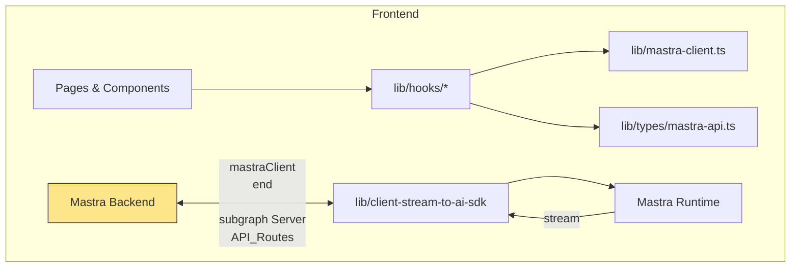

# lib/ — Utilities, Mastra client and hooks

This document describes the `lib/` package: lightweight frontend helpers, the client-side Mastra SDK wrapper, streaming helper for server-side APIs, typed runtime shapes, and convenience hooks used across the UI.

## 1. Component Overview

### Purpose / Responsibility

- Provide stable, well-typed utilities and client SDK primitives for the frontend.
- Offer small, focused hooks that encapsulate interaction with `mastraClient` and `@tanstack/react-query` for the dashboard and admin UI.
- Provide a server-side helper to convert Mastra server streams into the AI SDK UI message format.

### Scope

- In scope: `mastra-client.ts`, `client-stream-to-ai-sdk.ts`, `utils.ts`, `hooks/*`, and `types/mastra-api.ts`.
- Out of scope: backend Mastra runtime (src/mastra), UI components that consume these helpers (app/*).

### System relationships

- `mastraClient` wraps `@mastra/client-js` and is the single entry-point for frontend code to interact with Mastra REST and object clients (agents, tools, vectors, traces).
- Hooks in `lib/hooks` provide composable data access for the dashboard and other UI pages.

## 2. Architecture

- Pattern: small utility modules + centralized client instance + wrapping hooks.
- The code favors composition and re-use: hooks call `mastraClient` and return structured data or stateful utilities.



## 3. Interface Documentation

Key public exports:

- `mastraClient` (lib/mastra-client.ts)
  - Preconfigured frontend MastraClient instance; uses `NEXT_PUBLIC_MASTRA_API_URL`.

- `createAgentStreamResponse` (lib/client-stream-to-ai-sdk.ts)
  - Server-side utility that accepts a Mastra instance + agentId + messages + options, and returns a streaming `Response` compatible with the AI SDK UI format.
  - Input Options: { format?: 'aisdk'|'mastra', threadId?, resourceId?, memory?, maxSteps? }.

- `cn(...inputs)` (lib/utils.ts)
  - Small CSS class helper combining clsx + tailwind-merge for deterministic classname merging.

- Hooks (lib/hooks)
  - `useMastraFetch` — generic client-side fetch helper (data, loading, error, refetch).
  - `useAgents`, `useAgent`, `useAgentEvals`, `useWorkflows`, `useWorkflow`, etc. — shallow wrappers returning typed results from `mastraClient` (used outside React Query).

- Query layer (lib/hooks/use-dashboard-queries.ts)
  - Query keys exported by `queryKeys` for centralized cache usage.
  - Hooks using `@tanstack/react-query` for the UI (useAgentsQuery, useWorkflowsQuery, useTracesQuery, useMemoryThreadsQuery, useVectorIndexesQuery, etc.).
  - Mutation helpers for executing tools, creating threads, running vector queries, and scoring traces.

- Types (lib/types/mastra-api.ts)
  - Zod schemas for Agent, Workflow, Tool, Trace, Span, MemoryThread, Message, WorkingMemory, LogEntry, TelemetryEntry, VectorIndex, VectorQueryResult.

## 4. Implementation Details

### mastra-client.ts

- Exports a single `mastraClient` instance configured for frontend use with retry/backoff and same-origin credentials.

### client-stream-to-ai-sdk.ts

- `createAgentStreamResponse()` accepts a server-side Mastra instance and executes `agent.stream`.
- It prefers the agent output's native `toUIMessageStreamResponse()` method when available (optimised path), otherwise transforms the `MastraModelOutput` to the AI SDK format using `toAISdkFormat` and streams into a UI-friendly Response.
- Includes robust handling for both ReadableStream and AsyncIterable results and exports a deprecated `createMastraStreamResponse()` which throws.

### utils.cn

- `cn` is a tiny convenience wrapper combining `clsx` with `tailwind-merge` to safely merge Tailwind class names.

### hooks/use-dashboard-queries.ts

- Centralizes Query Keys and provides well-typed queries/mutations backed by `mastraClient`.
- Designed for React Query – used by dashboard pages and components for caching and background refresh.

### hooks/use-mastra.ts

- Simple, hook-based fetch runners for smaller UX flows. Useful where a full React Query lifecycle is unnecessary.

## 5. Usage Examples

### Client SDK usage

```ts
import { mastraClient } from '@/lib/mastra-client'

const agents = await mastraClient.getAgents()
```

### Server streaming API (example)

```ts
// app/api/chat/route.ts (server)
import { mastra } from '@/src/mastra'
import { createAgentStreamResponse } from '@/lib/client-stream-to-ai-sdk'

export async function POST(req: Request) {
  const payload = await req.json()
  return createAgentStreamResponse(mastra, payload.agentId, payload.messages, { threadId: payload.threadId })
}
```

### Hook usage

```tsx
import { useAgentsQuery } from '@/lib/hooks/use-dashboard-queries'

export default function Example() {
  const { data: agents, isLoading } = useAgentsQuery()
  // render
}
```

## 6. Quality Attributes

- Security: `mastraClient` should never include secrets. Credentials are `same-origin` and the front-end must rely on server-side auth decisioning.
- Performance: Query caching (in DashboardProviders) reduces redundant requests; streaming helper avoids buffering large results in memory on the server.
- Reliability: `createAgentStreamResponse` accepts both ReadableStream and async iterable responses and falls back to AISDK format consistently.
- Maintainability: Types in `lib/types/mastra-api.ts` use Zod for runtime validation—encourages safe deserialization when needed.

## 7. Testing & Observability

- Unit tests to add:
  - `createAgentStreamResponse` behavior for readable streams and async iterables.
  - `mastraClient` configuration sanity checks.
  - Hook tests for `useMastraFetch` and higher-level hooks using mocked `mastraClient`.

- Integration tests:
  - Mock Mastra server streaming outputs to verify `createAgentStreamResponse` produces a valid UI message stream response consumed by frontend streaming components.

## 8. Next actions / Recommendations

- Small: Add unit tests around `createAgentStreamResponse` to validate both preferred aisdk format and fallback streaming paths.
- Medium: Add a small E2E test for an API route using `createAgentStreamResponse` with a mocked Mastra instance.
- High: Consider exposing a clearer server-side streaming helper API that provides typed events and tracing hooks for observability.

## 9. References

- Files: `lib/mastra-client.ts`, `lib/client-stream-to-ai-sdk.ts`, `lib/utils.ts`, `lib/hooks/use-dashboard-queries.ts`, `lib/hooks/use-mastra.ts`, `lib/types/mastra-api.ts`.

## Change history

- 2025-12-06 — v1.0 — created by documentation agent
