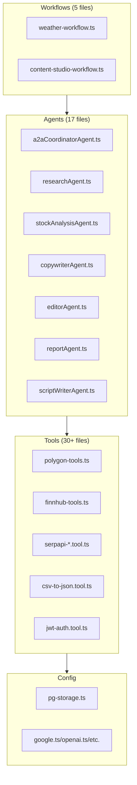

# Active Context

## Current Focus (Nov 2025)

- **[Synced Nov 22, 2025]** `/memory-bank` fully aligned with codebase: 17 agents (a2aCoordinator, researchAgent, stockAnalysisAgent, copywriterAgent, editorAgent, reportAgent, scriptWriterAgent, etc.); 30+ tools (polygon-tools, finnhub-tools, serpapi-*, csv-to-json, jwt-auth, etc.); 5 workflows (weather-workflow, content-studio-workflow, etc.); config/pg-storage active.
- Maintain `/memory-bank` sync for session continuity.
- Harden Mastra runtime (`src/mastra/index.ts`): A2A/MCP, Vitest coverage toward 97% per README.

## Key Decisions

- Use `LibSQLStore` for local `mastra.db` storage in the Mastra bootstrap, while PgVector/Postgres is configured separately in `src/mastra/config/pg-storage.ts` and registered via `vectors: { pgVector }`.
- Centralize all agents (weather, research, stock analysis, csv/excalidraw conversions, learning extraction, evaluation, report, editor, copywriter, A2A coordinator) in `src/mastra/index.ts` for a single Mastra instance.
- Rely on Arize/Phoenix (via `ArizeExporter`) plus `CloudExporter` and `DefaultExporter` for observability, with always-on sampling configured in `mastra` options.
- Adopt the Kiro-Lite workflow (`.github/prompts/kiro-lite.prompt.md`) and `/memory-bank` instructions as the default way to plan and implement new features (PRD → design → tasks → code), including the `/update memory bank` flow.

## Work in Progress

- Refining agent documentation (`src/mastra/agents/AGENTS.md`) and tool catalog (`src/mastra/tools/AGENTS.md`) to ensure they accurately reflect implemented files.
- Using the memory bank for project continuity and future feature planning (feature templates live under `memory-bank/feature-template/`).
- Iterating on the A2A coordinator and MCP server: current resource metadata and prompts are largely placeholders; future work will connect them more tightly to real workflows and agents.
- Implementing and wiring real JWT verification for the `jwt-auth` tool and ensuring RBAC policies in `src/mastra/policy/acl.yaml` are enforced where appropriate.
- **[Completed]** Implemented and verified data tools (`csv-to-json`, `json-to-csv`, `data-validator`) with `RuntimeContext` integration and comprehensive tests.
