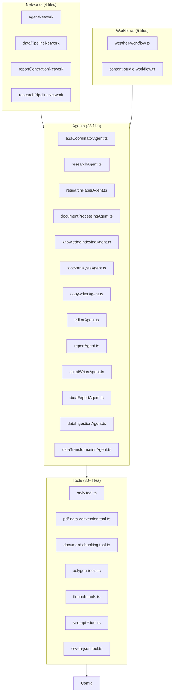

# Active Context

## Current Focus (Nov 2025)

- **[Synced Nov 25, 2025]** `/memory-bank` fully aligned with codebase: 23 agents; 30+ tools (including arxiv, pdf-data-conversion, document-chunking); 5 workflows; 4 networks; config/pg-storage active.
- Maintain `/memory-bank` sync for session continuity.
- Harden Mastra runtime (`src/mastra/index.ts`): A2A/MCP, Vitest coverage toward 97% per README.

## Key Decisions

- Use `LibSQLStore` for local `mastra.db` storage in the Mastra bootstrap, while PgVector/Postgres is configured separately in `src/mastra/config/pg-storage.ts` and registered via `vectors: { pgVector }`.
- Centralize all agents (weather, research, stock analysis, csv/excalidraw conversions, learning extraction, evaluation, report, editor, copywriter, A2A coordinator) in `src/mastra/index.ts` for a single Mastra instance.
- Rely on Arize/Phoenix (via `ArizeExporter`) plus `CloudExporter` and `DefaultExporter` for observability, with always-on sampling configured in `mastra` options.
- Adopt the Kiro-Lite workflow (`.github/prompts/kiro-lite.prompt.md`) and `/memory-bank` instructions as the default way to plan and implement new features (PRD → design → tasks → code), including the `/update memory bank` flow.

## Work in Progress

- Refining agent documentation (`src/mastra/agents/AGENTS.md`) and tool catalog (`src/mastra/tools/AGENTS.md`) to ensure they accurately reflect implemented files.
- Using the memory bank for project continuity and future feature planning (feature templates live under `memory-bank/feature-template/`).
- Iterating on the A2A coordinator and MCP server: current resource metadata and prompts are largely placeholders; future work will connect them more tightly to real workflows and agents.
- Implementing and wiring real JWT verification for the `jwt-auth` tool and ensuring RBAC policies in `src/mastra/policy/acl.yaml` are enforced where appropriate.
- **[Completed]** Implemented and verified data tools (`csv-to-json`, `json-to-csv`, `data-validator`) with `RuntimeContext` integration and comprehensive tests.

## Active Feature: CSV Agents & Data Pipeline Networks

**Status:** ✅ Implementation Complete  
**Location:** `/memory-bank/csv-agents/`

**Objective:** Create new agents that utilize underused CSV tools and coordinate them via agent networks.

**Implemented Components:**

| Component | Path | Status |
|-----------|------|--------|
| DataExportAgent | `src/mastra/agents/dataExportAgent.ts` | ✅ Created |
| DataIngestionAgent | `src/mastra/agents/dataIngestionAgent.ts` | ✅ Created |
| DataTransformationAgent | `src/mastra/agents/dataTransformationAgent.ts` | ✅ Created |
| DataPipelineNetwork | `src/mastra/networks/dataPipelineNetwork.ts` | ✅ Created |
| ReportGenerationNetwork | `src/mastra/networks/reportGenerationNetwork.ts` | ✅ Created |
| networks/index.ts | Export new networks | ✅ Updated |
| mastra/index.ts | Register agents & routes | ✅ Updated |

**Agent Capabilities:**

- **DataExportAgent**: JSON → CSV conversion, file writing, backup, validation
- **DataIngestionAgent**: CSV parsing, file reading, structure validation
- **DataTransformationAgent**: CSV↔JSON↔XML transformations (uses googleAI3)
- **DataPipelineNetwork**: Routes to Export/Ingestion/Transformation/Report agents
- **ReportGenerationNetwork**: Coordinates research → transform → report workflows

**API Routes Added:**

- `/chat` - includes dataExportAgent, dataIngestionAgent, dataTransformationAgent
- `/network` - includes dataPipelineNetwork, reportGenerationNetwork

**Next Steps:**

1. Run `npm run build` to verify compilation
2. Test agents via API endpoints
3. Add unit tests (optional enhancement)

## Active Feature: Research & Document Processing Pipeline

**Status:** ✅ Implementation Complete  
**Location:** New agents utilize `arxiv.tool.ts`, `pdf-data-conversion.tool.ts`, `document-chunking.tool.ts`

**Objective:** Create agents that use the powerful but underutilized arXiv, PDF parsing, and document chunking tools.

**Implemented Components:**

| Component | Path | Status |
|-----------|------|--------|
| ResearchPaperAgent | `src/mastra/agents/researchPaperAgent.ts` | ✅ Created |
| DocumentProcessingAgent | `src/mastra/agents/documentProcessingAgent.ts` | ✅ Created |
| KnowledgeIndexingAgent | `src/mastra/agents/knowledgeIndexingAgent.ts` | ✅ Created |
| ResearchPipelineNetwork | `src/mastra/networks/researchPipelineNetwork.ts` | ✅ Created |
| networks/index.ts | Export new network | ✅ Updated |
| mastra/index.ts | Register agents & routes | ✅ Updated |

**Agent Capabilities:**

- **ResearchPaperAgent**: Search arXiv, download papers, parse PDFs to markdown
  - Tools: `arxivTool`, `arxivPdfParserTool`, `arxivPaperDownloaderTool`
- **DocumentProcessingAgent**: Convert PDFs to markdown, chunk for RAG
  - Tools: `pdfToMarkdownTool`, `mastraChunker`, file management tools
- **KnowledgeIndexingAgent**: Index documents into PgVector, semantic search
  - Tools: `mdocumentChunker`, `documentRerankerTool`
- **ResearchPipelineNetwork**: Coordinates full research workflow
  - Agents: ResearchPaperAgent, DocumentProcessingAgent, KnowledgeIndexingAgent, ResearchAgent

**API Routes Updated:**

- `/chat` - includes researchPaperAgent, documentProcessingAgent, knowledgeIndexingAgent
- `/network` - includes researchPipelineNetwork

**Use Cases:**

1. Search arXiv for papers on a topic → download → parse to markdown
2. Index research papers into vector store for RAG
3. Semantic search over indexed research content
4. Build knowledge bases from academic literature
