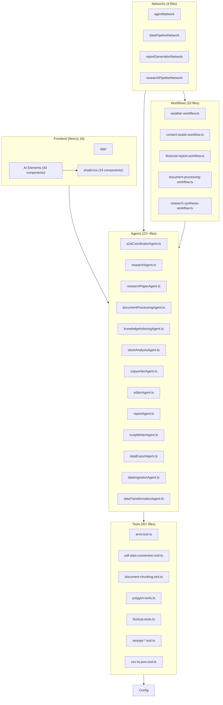

# Active Context

## Current Focus (Dec 2025)

- **[Synced Dec 5, 2025]** AI Elements Integration 92% complete (12/13 tasks). Chat interface fully functional.
- **[COMPLETED]** Workflows UI 100% complete - 10 workflows with Canvas visualization, input panels, streaming output.
- **[v1 - 50%]** Mastra Admin Dashboard v1 - MastraClient-based dashboard for observability, memory, logs, telemetry.
- **[v2 - PLANNED]** Dashboard v2 feature spec created - 33 tasks, modular components, React Query, auth prep.
- `/memory-bank` fully aligned with codebase: 22+ agents; 30+ tools; 10 workflows; 4 networks; config/pg-storage active.
- **AI Elements UI library**: 30 AI-focused components + 19 shadcn/ui base components integrated.
- **Next.js 16 frontend** with Vercel-style navigation and footer. Tailwind CSS 4, React 19, dark mode.
- Maintain `/memory-bank` sync for session continuity.

## Next Session Priority

**Feature:** Dashboard v2 (`/memory-bank/dashboard-v2/`)

1. Review and approve PRD, design, tasks
2. Start Phase 1: Foundation
   - DASH-001: Install TanStack Query
   - DASH-002: Create TypeScript Types
   - DASH-003: Create Query Client Provider
   - DASH-004: Create React Query Hooks



## Key Decisions

- Use `LibSQLStore` for local `mastra.db` storage in the Mastra bootstrap, while PgVector/Postgres is configured separately in `src/mastra/config/pg-storage.ts` and registered via `vectors: { pgVector }`.
- Centralize all agents (weather, research, stock analysis, csv/excalidraw conversions, learning extraction, evaluation, report, editor, copywriter, A2A coordinator) in `src/mastra/index.ts` for a single Mastra instance.
- Rely on Arize/Phoenix (via `ArizeExporter`) plus `CloudExporter` and `DefaultExporter` for observability, with always-on sampling configured in `mastra` options.
- Adopt the Kiro-Lite workflow (`.github/prompts/kiro-lite.prompt.md`) and `/memory-bank` instructions as the default way to plan and implement new features (PRD → design → tasks → code), including the `/update memory bank` flow.

## Work in Progress

- Refining agent documentation (`src/mastra/agents/AGENTS.md`) and tool catalog (`src/mastra/tools/AGENTS.md`) to ensure they accurately reflect implemented files.
- Using the memory bank for project continuity and future feature planning (feature templates live under `memory-bank/feature-template/`).
- Iterating on the A2A coordinator and MCP server: current resource metadata and prompts are largely placeholders; future work will connect them more tightly to real workflows and agents.
- Implementing and wiring real JWT verification for the `jwt-auth` tool and ensuring RBAC policies in `src/mastra/policy/acl.yaml` are enforced where appropriate.
- **[Completed]** Implemented and verified data tools (`csv-to-json`, `json-to-csv`, `data-validator`) with `RuntimeContext` integration and comprehensive tests.

## Active Feature: CSV Agents & Data Pipeline Networks

**Status:** ✅ Implementation Complete  
**Location:** `/memory-bank/csv-agents/`

**Objective:** Create new agents that utilize underused CSV tools and coordinate them via agent networks.

**Implemented Components:**

| Component | Path | Status |
|-----------|------|--------|
| DataExportAgent | `src/mastra/agents/dataExportAgent.ts` | ✅ Created |
| DataIngestionAgent | `src/mastra/agents/dataIngestionAgent.ts` | ✅ Created |
| DataTransformationAgent | `src/mastra/agents/dataTransformationAgent.ts` | ✅ Created |
| DataPipelineNetwork | `src/mastra/networks/dataPipelineNetwork.ts` | ✅ Created |
| ReportGenerationNetwork | `src/mastra/networks/reportGenerationNetwork.ts` | ✅ Created |
| networks/index.ts | Export new networks | ✅ Updated |
| mastra/index.ts | Register agents & routes | ✅ Updated |

**Agent Capabilities:**

- **DataExportAgent**: JSON → CSV conversion, file writing, backup, validation
- **DataIngestionAgent**: CSV parsing, file reading, structure validation
- **DataTransformationAgent**: CSV↔JSON↔XML transformations (uses googleAI3)
- **DataPipelineNetwork**: Routes to Export/Ingestion/Transformation/Report agents
- **ReportGenerationNetwork**: Coordinates research → transform → report workflows

**API Routes Added:**

- `/chat` - includes dataExportAgent, dataIngestionAgent, dataTransformationAgent
- `/network` - includes dataPipelineNetwork, reportGenerationNetwork

**Next Steps:**

1. Run `npm run build` to verify compilation
2. Test agents via API endpoints
3. Add unit tests (optional enhancement)

## Active Feature: AI Elements Integration with Agents

**Status:** 🔄 77% Complete (10/13 tasks)  
**Location:** `/memory-bank/ai-elements-integration/`

**Objective:** Integrate 30 AI Elements components with 26+ Mastra agents in the chat interface.

**Completed Tasks (Nov 28-29):**

| Task | Component | Status |
|------|-----------|--------|
| AIEL-001 | ChatContext provider (AI SDK v5) | ✅ |
| AIEL-002 | Agent config system (26+ agents) | ✅ |
| AIEL-003 | ChatHeader with ModelSelector | ✅ |
| AIEL-004 | ChatMessages with streaming | ✅ |
| AIEL-005 | ChatInput with PromptInput | ✅ |
| AIEL-006 | Reasoning display | ✅ |
| AIEL-007 | Tool execution display | ✅ |
| AIEL-008 | Sources citations | ✅ |
| AIEL-009 | Context (token usage) | ✅ |
| AIEL-010 | File upload | ✅ |
| AIEL-011 | Artifact display | ✅ |
| AIEL-012 | Page integration | ✅ |
| AIEL-013 | E2E tests | ⬜ Pending |

**Files Created:**

```plaintext
app/chat/
├── page.tsx                    # ChatProvider + ChatHeader + ChatMessages + ChatInput
├── providers/chat-context.tsx  # AI SDK v5 types, streaming handlers
├── config/agents.ts            # 26+ agent configs with feature flags
└── components/
    ├── chat-header.tsx         # ModelSelector + Context token display
    ├── chat-messages.tsx       # Conversation/Message components
    ├── chat-input.tsx          # PromptInput with file attachments
    ├── agent-reasoning.tsx     # Reasoning/ChainOfThought
    ├── agent-tools.tsx         # Tool invocations display
    ├── agent-sources.tsx       # Sources citations
    └── agent-artifact.tsx      # Code artifacts

app/components/
├── navbar.tsx                  # Vercel-style navigation bar
└── footer.tsx                  # Professional footer
```

**AI SDK v5 Patterns Applied:**

- Using `DynamicToolUIPart` (not deprecated `UIToolInvocation`)
- Extracting content from `parts` (not `message.content`)
- Mastra chunk types: `text-delta`, `reasoning-delta`, `tool-call`, `tool-result`
- Type guards: `isTextUIPart`, `isReasoningUIPart`, `isToolOrDynamicToolUIPart`

**Remaining Work:**

1. AIEL-013: Create E2E tests with Vitest (optional enhancement)

## Landing Page Update (Nov 29)

Added Vercel-style navigation and footer to `app/page.tsx`:

- **Navbar**: Sticky header with dropdown menus, mobile responsive
- **Hero Section**: Gradient text, live status badge, CTA buttons
- **Stats Section**: Clean horizontal stats display
- **Features Grid**: 4 capability cards with icons
- **Agents Grid**: Clickable agent cards with hover effects
- **Footer**: Multi-column links, social icons, copyright

---

## Active Feature: Research & Document Processing Pipeline

**Status:** ✅ Implementation Complete  
**Location:** New agents utilize `arxiv.tool.ts`, `pdf-data-conversion.tool.ts`, `document-chunking.tool.ts`

**Objective:** Create agents that use the powerful but underutilized arXiv, PDF parsing, and document chunking tools.

**Implemented Components:**

| Component | Path | Status |
|-----------|------|--------|
| ResearchPaperAgent | `src/mastra/agents/researchPaperAgent.ts` | ✅ Created |
| DocumentProcessingAgent | `src/mastra/agents/documentProcessingAgent.ts` | ✅ Created |
| KnowledgeIndexingAgent | `src/mastra/agents/knowledgeIndexingAgent.ts` | ✅ Created |
| ResearchPipelineNetwork | `src/mastra/networks/researchPipelineNetwork.ts` | ✅ Created |
| networks/index.ts | Export new network | ✅ Updated |
| mastra/index.ts | Register agents & routes | ✅ Updated |

**Agent Capabilities:**

- **ResearchPaperAgent**: Search arXiv, download papers, parse PDFs to markdown
  - Tools: `arxivTool`, `arxivPdfParserTool`, `arxivPaperDownloaderTool`
- **DocumentProcessingAgent**: Convert PDFs to markdown, chunk for RAG
  - Tools: `pdfToMarkdownTool`, `mastraChunker`, file management tools
- **KnowledgeIndexingAgent**: Index documents into PgVector, semantic search
  - Tools: `mdocumentChunker`, `documentRerankerTool`
- **ResearchPipelineNetwork**: Coordinates full research workflow
  - Agents: ResearchPaperAgent, DocumentProcessingAgent, KnowledgeIndexingAgent, ResearchAgent

**API Routes Updated:**

- `/chat` - includes researchPaperAgent, documentProcessingAgent, knowledgeIndexingAgent
- `/network` - includes researchPipelineNetwork

**Use Cases:**

1. Search arXiv for papers on a topic → download → parse to markdown
2. Index research papers into vector store for RAG
3. Semantic search over indexed research content
4. Build knowledge bases from academic literature
---

## Active Feature: Mastra Admin Dashboard

**Status:** 🔄 50% Complete  
**Location:** `/memory-bank/mastra-client-integration/` + `app/dashboard/`

**Objective:** Create a comprehensive admin dashboard using MastraClient for observability, memory management, logs, telemetry, and resource management - separate from AI SDK streaming pages.

**Implemented Components (Dec 5, 2025):**

| Component | Path | Status |
|-----------|------|--------|
| Dashboard Layout | `app/dashboard/layout.tsx` | ✅ Created |
| Dashboard Home | `app/dashboard/page.tsx` | ✅ Created |
| Agents Page | `app/dashboard/agents/page.tsx` | ✅ Created |
| Workflows Page | `app/dashboard/workflows/page.tsx` | ✅ Created |
| Tools Page | `app/dashboard/tools/page.tsx` | ✅ Created |
| Vectors Page | `app/dashboard/vectors/page.tsx` | ✅ Created |
| Memory Page | `app/dashboard/memory/page.tsx` | ✅ Created |
| Observability Page | `app/dashboard/observability/page.tsx` | ✅ Created |
| Logs Page | `app/dashboard/logs/page.tsx` | ✅ Created |
| Telemetry Page | `app/dashboard/telemetry/page.tsx` | ✅ Created |
| MastraClient Hooks | `lib/hooks/use-mastra.ts` | ✅ Created |
| Dashboard AGENTS.md | `app/dashboard/AGENTS.md` | ✅ Created |

**MastraClient Hooks Created:**

| Hook | Purpose |
|------|---------|
| `useAgents()` | List all agents |
| `useAgent(id)` | Get agent details |
| `useAgentEvals(id)` | Get CI/live evaluations |
| `useWorkflows()` | List all workflows |
| `useWorkflow(id)` | Get workflow details |
| `useTools()` | List all tools |
| `useTool(id)` | Get tool details |
| `useVectorIndexes(name)` | List vector indexes |
| `useMemoryThreads(resourceId, agentId)` | List memory threads |
| `useMemoryThread(threadId, agentId)` | Get thread messages |
| `useWorkingMemory(...)` | Get working memory |
| `useAITraces(params)` | List AI traces with filtering |
| `useAITrace(traceId)` | Get complete trace |
| `useLogs(transportId)` | Get system logs |
| `useTelemetry(params)` | Get telemetry data |

**Known Issues (To Fix Next Session):**

1. **href/Link Issues**: Some `Link` components need Next.js 16 compatible patterns
2. **Route Structure**: Verify all routes work with Next.js 16 App Router
3. **Component Modularity**: Pages need to be broken into smaller, reusable components
4. **Error Handling**: Add proper error boundaries and loading states
5. **Type Safety**: Improve TypeScript types for MastraClient responses
6. **Performance**: Add React Query or SWR for better caching/revalidation

**Architecture:**

```
┌─────────────────────────────────────────────────────────────┐
│                     Your Application                        │
├──────────────────────────┬──────────────────────────────────┤
│   Real-time Streaming    │      Data Management             │
│   (AI SDK)               │      (MastraClient)              │
├──────────────────────────┼──────────────────────────────────┤
│ /chat                    │ /dashboard                       │
│ /workflows               │ /dashboard/agents                │
│ /networks                │ /dashboard/workflows             │
│                          │ /dashboard/tools                 │
│ useChat()                │ /dashboard/vectors               │
│ DefaultChatTransport     │ /dashboard/memory                │
│                          │ /dashboard/observability         │
│                          │ /dashboard/logs                  │
│                          │ /dashboard/telemetry             │
└──────────────────────────┴──────────────────────────────────┘
```

**Next Session Tasks:**

1. Break pages into modular components (extract list views, detail panels, forms)
2. Fix Next.js 16 routing issues (href, Link components)
3. Add proper error boundaries
4. Implement React Query for data fetching
5. Add loading skeletons throughout
6. Type MastraClient responses properly
7. Add unit tests for hooks