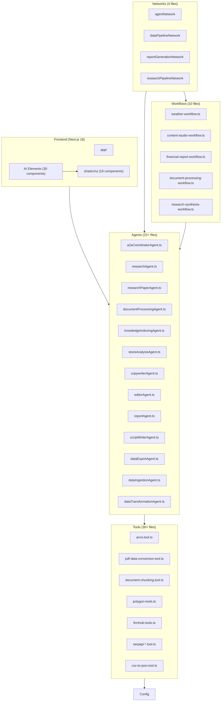

## Active Context Update (2026-02-17 - Landing Components Complete)

- All homepage landing sections (`landing-*`) received visual polish and GSAP SVG accent integration.
- New SVG options were expanded beyond the initial 3 to 8 newly-created variants in this cycle.
- `landing-svg-lab.tsx` now showcases 18 SVG systems total.
- Landing visual state is now consistent section-to-section with stage framing, sizing, and motion-safe accents.

## Active Context Update (2026-02-17 - Public Components SVG Pass)

- Scope locked to `app/components/**` public-surface visual quality (no dashboard changes in this pass).
- Completed shared visual system upgrade for GSAP accents:
  - added 3 new SVG options (Shield Matrix, Quantum Lattice, Token Stream)
  - expanded SVG lab to 13 options
  - upgraded `PublicPageHero` stage sizing + framing + optional accent caption
  - propagated contextual `accentCaption` usage across all 13 hero-accent public components
  - increased global SVG sizing clamps in `app/globals.css`
- Current outcome: stronger, more consistent hero accents across public components with clearer semantic mapping by page purpose.

## Active Context Update (2026-02-17)

- Current focus: stabilize dashboard/chat path with strict typing and no `unknown`/`any` state leaks in edited files.
- Completed now:
  - `app/dashboard/workflows/page.tsx` run-result state migrated to `Record<string, JsonValue> | null` with runtime guard.
  - `app/dashboard/observability/page.tsx` score-result state migrated similarly; JSX regression fixed.
- Validation pass (targeted grep): no `any` / `as unknown as` / `Record<string, unknown>` remain in those two pages.
- Next immediate step: continue remaining GSAP + dashboard fixes and verify agent deep-link chat flow end-to-end.

# Active Context

## [NEW 2026-02-17] Dashboard strict-typing + backend catalog alignment

- In-progress hardening pass focused on two user-critical requirements:
  1. remove `any`/unsafe cast patterns from dashboard runtime pages,
  2. ensure public catalog components (agents/workflows/tools/networks) are backend-fed, not hardcoded.
- Completed this pass so far:
  - dashboard overview trace row rendering uses typed span fields directly.
  - observability route migrated to typed dashboard hooks and strict span rendering.
  - workflows route fixed for step union handling and input-schema display.
  - telemetry route rebuilt to typed traces view.
  - agent tab/tools tab removed `any` casts.
  - tools/workflows/networks public list components now pull backend data.
- Remaining hardening still needed in this stream: memory/logs/vectors routes still contain legacy cast patterns and require the same strict typing cleanup.

## Current Focus (Jan 2026)

- **[NEW 2026-02-16]** Skill system update: `generative-ui-architect` now covers both chat GenUI and public design architecture.
  - Includes public primitives/motion guidance (`SectionLayout`, `PublicPageHero`, `useSectionReveal`, GSAP SVG suite).
  - Includes a new 10-15 minute blog framework for "current state + product roadmap" updates.
  - References are now split by responsibility with chat/networks/workflows backend interaction marked as the primary contract path.

- **[NEW 2026-02-16]** Public subpage premium polish completed (components + wrappers):
  - Upgraded the remaining public content components (`blog-list`, `changelog-list`, `examples-list`, `api-reference-content`, `pricing-tiers`, `contact-form`) to use shared `PublicPageHero` with animated GSAP SVG accents for consistent premium visuals.
  - Added accessibility/UX polish: explicit keyboard focus-visible rings on interactive cards/links and robust empty states for examples/blog/changelog/API reference lists.
  - Normalized public route wrappers (`app/about`, `app/careers`, `app/pricing`, `app/contact`, `app/changelog`, `app/blog`, `app/examples`, `app/api-reference`) by removing duplicate `Navbar` rendering and relying on root layout composition.
  - Re-ran targeted ESLint on all touched public subpage components + wrappers with a clean result (no errors).

- **[NEW 2026-02-16]** Public subpage component modernization completed (component-only scope, no route-wrapper changes):
  - Upgraded all core public subpage components to shared primitives (`SectionLayout`, typography tokens, `useSectionReveal`) for consistency:
    - `about-content.tsx`
    - `careers-content.tsx`
    - `changelog-list.tsx`
    - `blog-list.tsx`
    - `examples-list.tsx`
    - `api-reference-content.tsx`
    - `pricing-tiers.tsx`
    - `contact-form.tsx`
  - Replaced scattered per-block `whileInView` entrance patterns with unified GSAP section-level reveals.
  - Per-component lint pass executed and fixed (strict boolean checks, clipboard floating promise, fallback map typing).
  - Project-wide TypeScript check remains blocked by external dependency declaration errors under `node_modules` (`@crawlee/http`, `@mdx-js/loader`) unrelated to these component edits.

- **[NEW 2026-02-16]** GSAP public phase extension completed:
  - Resolved review issues (`gsap/registry.ts` plugin registration + `useSectionReveal` dynamic dependencies)
  - Fixed root layout composition bug (`children` duplicated) and moved `TooltipProvider` under `ThemeProvider`
  - Added a 10-component GSAP SVG suite (`app/components/gsap/svg-suite/*`)
  - Added new public showcase section `app/components/landing-svg-lab.tsx` and wired it into `app/page.tsx`
  - Added GSAP global CSS tokens/utilities in `app/globals.css`

- **[NEW 2026-02-15]** Public frontend GSAP SVG polish: added reusable animated orbital SVG logo and integrated it into shared `navbar`, `landing-hero`, and `footer` components with reduced-motion safeguards.

- **[NEW]** Enhanced Task Manager and Spec Generator skills with persona-driven logic and automation scripts.
- **[Synced Dec 8, 2025]** Chat Components Production Grade - 11 components improved with enhanced UX.
- **[Synced Dec 8, 2025]** Workflow System Audit complete - 12 workflows verified, 2 added to frontend config.
- **[Synced Dec 5, 2025]** AI Elements Integration 92% complete (12/13 tasks). Chat interface fully functional.
- **[NEW]** Models Configuration System: 150+ models from 6 providers, shared between `/chat` and `/networks`.
- **[COMPLETED]** Workflows UI 100% complete - 12 workflows with Canvas visualization, input panels, streaming output.
- **[COMPLETED]** Unified Tool Exports: Consolidated 40+ tools into `src/mastra/tools/index.ts` and updated `src/components/ai-elements/tools/types.ts` with all tool types.
- **[v1 - 50%]** Mastra Admin Dashboard v1 - MastraClient-based dashboard for observability, memory, logs, telemetry.
- **[v2 - PLANNED]** Dashboard v2 feature spec created - 33 tasks, modular components, React Query, auth prep.
- `/memory-bank` fully aligned with codebase: 22+ agents; 30+ tools; 12 workflows; 4 networks; config/pg-storage active.
- **AI Elements UI library**: 30 AI-focused components + 19 shadcn/ui base components integrated.
- **Next.js 16 frontend** with Vercel-style navigation and footer. Tailwind CSS 4, React 19, dark mode.
- Maintain `/memory-bank` sync for session continuity.

## Chat Components Production Grade (Dec 8, 2025)

**Status:** ✅ Complete
**Session:** Production-grade improvements to 11 chat components

**Recent Changes:**

- 2026-01-06: Upgraded `generative-ui-architect`, `multi-agent-orchestrator`, and `webapp-testing` with automation scripts (`scaffold_genui.py`, `visualize_network.py`, `generate_test_plan.py`).
- 2026-01-06: Added Multi-Perspective Review and Quality Scorecards to `spec-generator`.
- 2026-01-06: Added Dependency Mapping and Complexity Estimation into `task-manager`.
- 2026-01-06: Enhanced `task-manager` and `spec-generator` skills with persona-driven logic and automation scripts (`persona_engine.py`, `task_generator.py`).
- 2026-01-06: Created `skills/task-manager/` with `SKILL.md` and `TASK-TEMPLATE.md`.
- 2026-01-06: Created `skills/spec-generator/` with `SKILL.md`, `PRD-TEMPLATE.md`, and `DESIGN-TEMPLATE.md`.
- 2025-12-08: Improved 11 chat components with production-grade enhancements and fixed input background noise.

**Components Improved:**

| Component                    | Changes                                                                          |
| ---------------------------- | -------------------------------------------------------------------------------- |
| `agent-task.tsx`             | Fixed pending icon bug (was throwing error)                                      |
| `agent-tools.tsx`            | Readable names, auto-open on error, streaming indicator                          |
| `agent-reasoning.tsx`        | Proper ai-elements integration with ReasoningContent                             |
| `agent-chain-of-thought.tsx` | Progress badge, step categorization (search/analysis/decision)                   |
| `agent-plan.tsx`             | Step completion tracking, progress bar, current step highlight                   |
| `agent-sources.tsx`          | Favicons, domain grouping, deduplication                                         |
| `agent-suggestions.tsx`      | Agent-specific suggestions, className prop                                       |
| `agent-queue.tsx`            | Relative time, TaskSection extraction, status badges                             |
| `agent-confirmation.tsx`     | Severity levels (info/warning/danger), styled status                             |
| `agent-checkpoint.tsx`       | Relative time, message count badge                                               |
| `chat-input.tsx`             | Compact status bar showing agent/model/tokens. **Fixed background/noise issue.** |

## Workflow System Audit (Dec 8, 2025)

**Status:** ✅ Complete

**Findings:**

- `writer?.custom` used in **tools** (87+ occurrences) but NOT in workflow steps
- Workflow steps use `createStep` with `tracingContext` for tracing
- Routes: `/workflow/:workflowId` properly configured in index.ts
- Frontend WorkflowProvider uses `useChat` with correct API endpoint

**Bug Fixed:**

- `workflow-node.tsx`: `getStatusIcon()` and `getStatusBadgeVariant()` threw errors for pending/skipped status. **Fixed blurriness issue by removing liquid-glass effect.**

**Workflows Added to Frontend Config:**

1. `repoIngestionWorkflow` - 2 steps: scan-repo, ingest-files
2. `specGenerationWorkflow` - 4 steps: create-plan, generate-prd, generate-architecture, generate-tasks

**Total Workflows:** 12 (was 10)

## Models Configuration System (Dec 5, 2025)

**Status:** ✅ Complete  
**Location:** `app/chat/config/`

**Shared by:**

- `app/chat/` - Chat interface with model selector
- `app/networks/` - Network interface with model selector

**Provider Files Created:**

| File                   | Provider                 | Models                                                    |
| ---------------------- | ------------------------ | --------------------------------------------------------- |
| `models.ts`            | Core types & aggregation | Imports all providers                                     |
| `google-models.ts`     | Google AI                | 25 models (Gemini 1.5/2.0/2.5/3.0, Live, TTS, Embedding)  |
| `openai-models.ts`     | OpenAI                   | 28 models (GPT-4o/4.1/5/5.1, o1/o3/o4, Codex, Embeddings) |
| `anthropic-models.ts`  | Anthropic                | 20 models (Claude 3/3.5/3.7/4/4.5, Opus/Sonnet/Haiku)     |
| `openrouter-models.ts` | OpenRouter               | 60+ models (Aggregated from all providers + free models)  |
| `ollama-models.ts`     | Ollama                   | 25 models (Local: Llama, Mistral, Qwen, DeepSeek, Gemma)  |

**Type Definitions:**

```typescript
type ModelProvider =
    | 'google'
    | 'openai'
    | 'anthropic'
    | 'openrouter'
    | 'google-vertex'
    | 'ollama'
type ModelCapability =
    | 'chat'
    | 'reasoning'
    | 'vision'
    | 'embedding'
    | 'code'
    | 'audio'

interface ModelConfig {
    id: string
    name: string
    provider: ModelProvider
    contextWindow: number
    capabilities: ModelCapability[]
    description?: string
    isDefault?: boolean
    pricing?: { input: number; output: number }
}
```

**Key Functions:**

- `getModelsByProvider()` - Groups models by provider for UI
- `getModelConfig(id)` - Get specific model config
- `getDefaultModel()` - Returns default model (Gemini 2.5 Flash)
- `formatContextWindow(tokens)` - Format "1M" or "128K"

## Next Session Priority

**Feature:** Dashboard v2 (`/memory-bank/dashboard-v2/`)

1. Review and approve PRD, design, tasks
2. Start Phase 1: Foundation
    - DASH-001: Install TanStack Query
    - DASH-002: Create TypeScript Types
    - DASH-003: Create Query Client Provider
    - DASH-004: Create React Query Hooks


```mermaid
graph TB
    subgraph Frontend["Frontend (Next.js 16)"]
        App[app/]
        AIElements["AI Elements (30 components)"]
        ShadcnUI["shadcn/ui (19 components)"]
    end
    subgraph Agents["Agents (22+ files)"]
        A2A[a2aCoordinatorAgent.ts]
        Research[researchAgent.ts]
        ResearchPaper[researchPaperAgent.ts]
        DocProc[documentProcessingAgent.ts]
        KnowIdx[knowledgeIndexingAgent.ts]
        Stock[stockAnalysisAgent.ts]
        Copy[copywriterAgent.ts]
        Edit[editorAgent.ts]
        Report[reportAgent.ts]
        Script[scriptWriterAgent.ts]
        DataExp[dataExportAgent.ts]
        DataIng[dataIngestionAgent.ts]
        DataTrans[dataTransformationAgent.ts]
    end
    subgraph Tools["Tools (30+ files)"]
        ArXiv[arxiv.tool.ts]
        PDF[pdf-data-conversion.tool.ts]
        Chunk[document-chunking.tool.ts]
        Poly[polygon-tools.ts]
        Fin[finnhub-tools.ts]
        Serp[serpapi-*.tool.ts]
        CSV[csv-to-json.tool.ts]
    end
    subgraph Networks["Networks (4 files)"]
        AgentNet[agentNetwork]
        DataPipe[dataPipelineNetwork]
        ReportGen[reportGenerationNetwork]
        ResearchPipe[researchPipelineNetwork]
    end
    subgraph Workflows["Workflows (10 files)"]
        Weather[weather-workflow.ts]
        Content[content-studio-workflow.ts]
        Financial[financial-report-workflow.ts]
        DocWf[document-processing-workflow.ts]
        ResearchWf[research-synthesis-workflow.ts]
    end
    Frontend --> Agents
    AIElements --> ShadcnUI
    Agents --> Tools
    Networks --> Agents
    Networks --> Workflows
    Tools --> Config
    Workflows --> Agents
```

## Key Decisions

- Use `LibSQLStore` for local `mastra.db` storage in the Mastra bootstrap, while PgVector/Postgres is configured separately in `src/mastra/config/pg-storage.ts` and registered via `vectors: { pgVector }`.
- Centralize all agents (weather, research, stock analysis, csv/excalidraw conversions, learning extraction, evaluation, report, editor, copywriter, A2A coordinator) in `src/mastra/index.ts` for a single Mastra instance.
- Rely on Arize/Phoenix (via `ArizeExporter`) plus `CloudExporter` and `DefaultExporter` for observability, with always-on sampling configured in `mastra` options.
- Adopt the Kiro-Lite workflow (`.github/prompts/kiro-lite.prompt.md`) and `/memory-bank` instructions as the default way to plan and implement new features (PRD → design → tasks → code), including the `/update memory bank` flow.

## Work in Progress

- Refining agent documentation (`src/mastra/agents/AGENTS.md`) and tool catalog (`src/mastra/tools/AGENTS.md`) to ensure they accurately reflect implemented files.
- Using the memory bank for project continuity and future feature planning (feature templates live under `memory-bank/feature-template/`).
- Iterating on the A2A coordinator and MCP server: current resource metadata and prompts are largely placeholders; future work will connect them more tightly to real workflows and agents.
- Implementing and wiring real JWT verification for the `jwt-auth` tool and ensuring RBAC policies in `src/mastra/policy/acl.yaml` are enforced where appropriate.
- **[Completed]** Implemented and verified data tools (`csv-to-json`, `json-to-csv`, `data-validator`) with `RuntimeContext` integration and comprehensive tests.

## Active Feature: Semantic Code Analysis Tools

**Status:** ✅ Implementation Complete
**Location:** `/memory-bank/semantic-code-tools/`

**Objective:** Implement high-performance `find-references` and `find-symbol` tools using `ts-morph` and a `ProjectCache` singleton to enable intelligent agent navigation.

**Implemented Components:**

| Component          | Path                                       | Status     |
| ------------------ | ------------------------------------------ | ---------- |
| ProjectCache       | `src/mastra/tools/semantic-utils.ts`       | ✅ Created |
| PythonParser       | `src/mastra/tools/semantic-utils.ts`       | ✅ Created |
| FindReferencesTool | `src/mastra/tools/find-references.tool.ts` | ✅ Created |
| FindSymbolTool     | `src/mastra/tools/find-symbol.tool.ts`     | ✅ Created |
| Tool Registration  | `src/mastra/tools/index.ts`                | ✅ Created |
| Agent Integration  | `src/mastra/agents/codingAgents.ts`        | ✅ Updated |

**Next Steps:**

1. Verify tools with manual testing (optional)
2. Proceed to next feature

## Active Feature: CSV Agents & Data Pipeline Networks

**Status:** ✅ Implementation Complete  
**Location:** `/memory-bank/csv-agents/`

**Objective:** Create new agents that utilize underused CSV tools and coordinate them via agent networks.

**Implemented Components:**

| Component               | Path                                             | Status     |
| ----------------------- | ------------------------------------------------ | ---------- |
| DataExportAgent         | `src/mastra/agents/dataExportAgent.ts`           | ✅ Created |
| DataIngestionAgent      | `src/mastra/agents/dataIngestionAgent.ts`        | ✅ Created |
| DataTransformationAgent | `src/mastra/agents/dataTransformationAgent.ts`   | ✅ Created |
| DataPipelineNetwork     | `src/mastra/networks/dataPipelineNetwork.ts`     | ✅ Created |
| ReportGenerationNetwork | `src/mastra/networks/reportGenerationNetwork.ts` | ✅ Created |
| networks/index.ts       | Export new networks                              | ✅ Updated |
| mastra/index.ts         | Register agents & routes                         | ✅ Updated |

**Agent Capabilities:**

- **DataExportAgent**: JSON → CSV conversion, file writing, backup, validation
- **DataIngestionAgent**: CSV parsing, file reading, structure validation
- **DataTransformationAgent**: CSV↔JSON↔XML transformations (uses googleAI3)
- **DataPipelineNetwork**: Routes to Export/Ingestion/Transformation/Report agents
- **ReportGenerationNetwork**: Coordinates research → transform → report workflows

**API Routes Added:**

- `/chat` - includes dataExportAgent, dataIngestionAgent, dataTransformationAgent
- `/network` - includes dataPipelineNetwork, reportGenerationNetwork

**Next Steps:**

1. Run `npm run build` to verify compilation
2. Test agents via API endpoints
3. Add unit tests (optional enhancement)

## Active Feature: AI Elements Integration with Agents

**Status:** 🔄 77% Complete (10/13 tasks)  
**Location:** `/memory-bank/ai-elements-integration/`

**Objective:** Integrate 30 AI Elements components with 26+ Mastra agents in the chat interface.

**Completed Tasks (Nov 28-29):**

| Task     | Component                        | Status     |
| -------- | -------------------------------- | ---------- |
| AIEL-001 | ChatContext provider (AI SDK v5) | ✅         |
| AIEL-002 | Agent config system (26+ agents) | ✅         |
| AIEL-003 | ChatHeader with ModelSelector    | ✅         |
| AIEL-004 | ChatMessages with streaming      | ✅         |
| AIEL-005 | ChatInput with PromptInput       | ✅         |
| AIEL-006 | Reasoning display                | ✅         |
| AIEL-007 | Tool execution display           | ✅         |
| AIEL-008 | Sources citations                | ✅         |
| AIEL-009 | Context (token usage)            | ✅         |
| AIEL-010 | File upload                      | ✅         |
| AIEL-011 | Artifact display                 | ✅         |
| AIEL-012 | Page integration                 | ✅         |
| AIEL-013 | E2E tests                        | ⬜ Pending |

**Files Created:**

```plaintext
app/chat/
├── page.tsx                    # ChatProvider + ChatHeader + ChatMessages + ChatInput
├── providers/chat-context.tsx  # AI SDK v5 types, streaming handlers
├── config/agents.ts            # 26+ agent configs with feature flags
└── components/
    ├── chat-header.tsx         # ModelSelector + Context token display
    ├── chat-messages.tsx       # Conversation/Message components
    ├── chat-input.tsx          # PromptInput with file attachments
    ├── agent-reasoning.tsx     # Reasoning/ChainOfThought
    ├── agent-tools.tsx         # Tool invocations display
    ├── agent-sources.tsx       # Sources citations
    └── agent-artifact.tsx      # Code artifacts

app/components/
├── navbar.tsx                  # Vercel-style navigation bar
└── footer.tsx                  # Professional footer
```

**AI SDK v5 Patterns Applied:**

- Using `DynamicToolUIPart` (not deprecated `UIToolInvocation`)
- Extracting content from `parts` (not `message.content`)
- Mastra chunk types: `text-delta`, `reasoning-delta`, `tool-call`, `tool-result`
- Type guards: `isTextUIPart`, `isReasoningUIPart`, `isToolOrDynamicToolUIPart`

**Remaining Work:**

1. AIEL-013: Create E2E tests with Vitest (optional enhancement)

## Landing Page Update (Nov 29)

Added Vercel-style navigation and footer to `app/page.tsx`:

- **Navbar**: Sticky header with dropdown menus, mobile responsive
- **Hero Section**: Gradient text, live status badge, CTA buttons
- **Stats Section**: Clean horizontal stats display
- **Features Grid**: 4 capability cards with icons
- **Agents Grid**: Clickable agent cards with hover effects
- **Footer**: Multi-column links, social icons, copyright

---

## Active Feature: Research & Document Processing Pipeline

**Status:** ✅ Implementation Complete  
**Location:** New agents utilize `arxiv.tool.ts`, `pdf-data-conversion.tool.ts`, `document-chunking.tool.ts`

**Objective:** Create agents that use the powerful but underutilized arXiv, PDF parsing, and document chunking tools.

**Implemented Components:**

| Component               | Path                                             | Status     |
| ----------------------- | ------------------------------------------------ | ---------- |
| ResearchPaperAgent      | `src/mastra/agents/researchPaperAgent.ts`        | ✅ Created |
| DocumentProcessingAgent | `src/mastra/agents/documentProcessingAgent.ts`   | ✅ Created |
| KnowledgeIndexingAgent  | `src/mastra/agents/knowledgeIndexingAgent.ts`    | ✅ Created |
| ResearchPipelineNetwork | `src/mastra/networks/researchPipelineNetwork.ts` | ✅ Created |
| networks/index.ts       | Export new network                               | ✅ Updated |
| mastra/index.ts         | Register agents & routes                         | ✅ Updated |

**Agent Capabilities:**

- **ResearchPaperAgent**: Search arXiv, download papers, parse PDFs to markdown
  - Tools: `arxivTool`, `arxivPdfParserTool`, `arxivPaperDownloaderTool`
- **DocumentProcessingAgent**: Convert PDFs to markdown, chunk for RAG
  - Tools: `pdfToMarkdownTool`, `mastraChunker`, file management tools
- **KnowledgeIndexingAgent**: Index documents into PgVector, semantic search
  - Tools: `mdocumentChunker`, `documentRerankerTool`
- **ResearchPipelineNetwork**: Coordinates full research workflow
  - Agents: ResearchPaperAgent, DocumentProcessingAgent, KnowledgeIndexingAgent, ResearchAgent

**API Routes Updated:**

- `/chat` - includes researchPaperAgent, documentProcessingAgent, knowledgeIndexingAgent
- `/network` - includes researchPipelineNetwork

**Use Cases:**

1. Search arXiv for papers on a topic → download → parse to markdown
2. Index research papers into vector store for RAG
3. Semantic search over indexed research content
4. Build knowledge bases from academic literature

---

## Active Feature: Mastra Admin Dashboard

**Status:** 🔄 50% Complete  
**Location:** `/memory-bank/mastra-client-integration/` + `app/dashboard/`

**Objective:** Create a comprehensive admin dashboard using MastraClient for observability, memory management, logs, telemetry, and resource management - separate from AI SDK streaming pages.

**Implemented Components (Dec 5, 2025):**

| Component           | Path                                   | Status     |
| ------------------- | -------------------------------------- | ---------- |
| Dashboard Layout    | `app/dashboard/layout.tsx`             | ✅ Created |
| Dashboard Home      | `app/dashboard/page.tsx`               | ✅ Created |
| Agents Page         | `app/dashboard/agents/page.tsx`        | ✅ Created |
| Workflows Page      | `app/dashboard/workflows/page.tsx`     | ✅ Created |
| Tools Page          | `app/dashboard/tools/page.tsx`         | ✅ Created |
| Vectors Page        | `app/dashboard/vectors/page.tsx`       | ✅ Created |
| Memory Page         | `app/dashboard/memory/page.tsx`        | ✅ Created |
| Observability Page  | `app/dashboard/observability/page.tsx` | ✅ Created |
| Logs Page           | `app/dashboard/logs/page.tsx`          | ✅ Created |
| Telemetry Page      | `app/dashboard/telemetry/page.tsx`     | ✅ Created |
| MastraClient Hooks  | `lib/hooks/use-mastra.ts`              | ✅ Created |
| Dashboard AGENTS.md | `app/dashboard/AGENTS.md`              | ✅ Created |

**MastraClient Hooks Created:**

| Hook                                    | Purpose                       |
| --------------------------------------- | ----------------------------- |
| `useAgents()`                           | List all agents               |
| `useAgent(id)`                          | Get agent details             |
| `useAgentEvals(id)`                     | Get CI/live evaluations       |
| `useWorkflows()`                        | List all workflows            |
| `useWorkflow(id)`                       | Get workflow details          |
| `useTools()`                            | List all tools                |
| `useTool(id)`                           | Get tool details              |
| `useVectorIndexes(name)`                | List vector indexes           |
| `useMemoryThreads(resourceId, agentId)` | List memory threads           |
| `useMemoryThread(threadId, agentId)`    | Get thread messages           |
| `useWorkingMemory(...)`                 | Get working memory            |
| `useAITraces(params)`                   | List AI traces with filtering |
| `useAITrace(traceId)`                   | Get complete trace            |
| `useLogs(transportId)`                  | Get system logs               |
| `useTelemetry(params)`                  | Get telemetry data            |

**Known Issues (To Fix Next Session):**

1. **href/Link Issues**: Some `Link` components need Next.js 16 compatible patterns
2. **Route Structure**: Verify all routes work with Next.js 16 App Router
3. **Component Modularity**: Pages need to be broken into smaller, reusable components
4. **Error Handling**: Add proper error boundaries and loading states
5. **Type Safety**: Improve TypeScript types for MastraClient responses
6. **Performance**: Add React Query or SWR for better caching/revalidation

**Architecture:**

```bash
┌─────────────────────────────────────────────────────────────┐
│                     Your Application                        │
├──────────────────────────┬──────────────────────────────────┤
│   Real-time Streaming    │      Data Management             │
│   (AI SDK)               │      (MastraClient)              │
├──────────────────────────┼──────────────────────────────────┤
│ /chat                    │ /dashboard                       │
│ /workflows               │ /dashboard/agents                │
│ /networks                │ /dashboard/workflows             │
│                          │ /dashboard/tools                 │
│ useChat()                │ /dashboard/vectors               │
│ DefaultChatTransport     │ /dashboard/memory                │
│                          │ /dashboard/observability         │
│                          │ /dashboard/logs                  │
│                          │ /dashboard/telemetry             │
└──────────────────────────┴──────────────────────────────────┘
```

**Next Session Tasks:**

1. Break pages into modular components (extract list views, detail panels, forms)
2. Fix Next.js 16 routing issues (href, Link components)
3. Add proper error boundaries
4. Implement React Query for data fetching
5. Add loading skeletons throughout
6. Type MastraClient responses properly
7. Add unit tests for hooks
