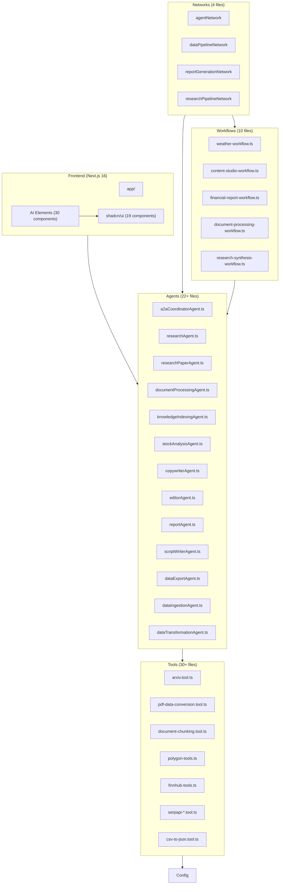

# Active Context Update (2026-04-20 - calendar tool cross-platform refactor)

- Refactored `src/mastra/tools/calendar-tool.ts` from a macOS-only AppleScript reader into a platform-aware calendar source selector.
- Auto-selection now supports `macos-calendar`, `windows-outlook`, and `ics-file` sources via `process.platform` and the `CALENDAR_SOURCE` / `CALENDAR_ICS_PATH` env vars.
- Added a Linux-compatible ICS fallback reader plus a Windows Outlook PowerShell reader, while preserving the existing macOS Calendar path.
- Added `src/mastra/tools/tests/calendar-tool.test.ts` covering source selection and ICS parsing; the targeted vitest run passed.

# Active Context Update (2026-04-20 - tools folder crash scan)

- Scanned `src/mastra/tools` for the same unsafe direct `.length` pattern that caused the earlier runtime crash.
- Hardened additional tool hooks and model-output helpers in `arxiv.tool.ts`, `calendar-tool.ts`, `downsample.tool.ts`, `editor-agent-tool.ts`, `extractLearningsTool.ts`, `git-local.tool.ts`, `github.ts`, `image-tool.ts`, `polygon-tools.ts`, `serpapi-academic-local.tool.ts`, `serpapi-images.tool.ts`, `serpapi-local-maps.tool.ts`, `serpapi-news-trends.tool.ts`, and `url-tool.ts`.
- The remaining direct `.length` scans in the folder are mostly `messages.length` reads, which are a broader follow-up pass rather than the same output-null crash class.

# Active Context Update (2026-04-20 - weather temperature-unit narrowed)

- Removed the global `temperature-unit` injection from `src/mastra/index.ts` so the shared agent request context no longer carries a celsius/fahrenheit default for every agent.
- `weatherTool` still defaults to `celsius` locally when the weather request context does not provide a temperature unit, so weather lookups continue to work without exposing the unit globally.
- `weatherAgent` remains the only agent wired to `weatherTool` in the current codebase.
- Hardened the weather tool lifecycle hooks so missing `messages` or `output` values cannot crash the callback path.

# Active Context Update (2026-04-20 - SerpAPI googleSearchTool crash fix)

- The repeated Mastra runtime crash was traced to `src/mastra/tools/serpapi-search.tool.ts`, specifically `googleSearchTool.onOutput` dereferencing nested output fields without guards.
- `googleSearchTool` now accepts SerpAPI's numeric `searchInfo.totalResults` response shape and uses optional chaining for all `onOutput` nested reads.
- `googleAiOverviewTool.onOutput` was hardened at the same time so a missing output payload cannot trip the same `length` error again.
- The failing stack traces were coming from generated `.mastra/output/tools/*.mjs` files, but the source fix is in the checked-in SerpAPI tool module.

# Active Context Update (2026-04-18 - Blender MCP / FPV research)

- Blender 5.1 is compatible with the official Blender MCP server page, which requires Blender 5.1 or newer and warns that LLM-generated code executes in Blender without guards.
- The third-party Blender MCP tutorial flow confirms the practical setup loop: install the add-on, configure an API key, start one MCP server instance, and use the BlenderMCP sidebar tab for connection and commands.
- The Thingiverse reference `The Rocket Drone` is a 3" FPV rocket-style build, not a 5" frame, but it is useful as a shape and packaging reference: 3" props, 14xx motors, 20x20 stack, 14 mm camera, about 850 mAh 4S, and PLA/PLA+/PETG at 20–30% infill.
- Fiber-optic FPV references found so far point to a 5–10" universal mount with spool diameter up to 118 mm, zip-tie attachment, and a separate ABS 3D-printed fiber reel approach for long-range FPV systems.
- The verified SoloGood F722 stack uses the standard 30.5x30.5 mm M3 hole pattern; listings show the FC board area around 41.5x42 mm, 3–6S input, and a 5V/10V dual BEC plus 60A 4in1 ESC, so the Rocket Drone STLs need a 5"-frame-specific structural fit pass rather than a simple uniform scale-up.
- The current target hardware also includes a YoungRC 1800TVL micro FPV camera (19x19x20 mm, 2.1 mm lens, 5–40V) and a Readytosky 250 mm / 5" carbon-fiber frame with 4 mm arms and 30.5x30.5 FC mount holes, so the Rocket Drone nose and camera mount should be rebuilt for a 19 mm camera footprint and a 250 mm-class frame layout.
- `blender.md` is now rewritten into a reusable between-chat FPV build note that captures the current hardware, Blender MCP workflow, and 3D-print/export best practices.
- Blender is connected again; the Rocket Drone STL pack is imported into the scene, and the current integration status is: PolyHaven enabled, Sketchfab disabled, Hyper3D Rodin enabled (free_trial, MAIN_SITE), Hunyuan3D disabled.
- Redesign has started in Blender: originals were backed up to `Rocket_Original_Backup`, scaled working copies were created in `Rocket_Redesign_v1`, `FitGuides_5inch` was added for frame/stack/camera/VTX/motor envelopes, and initial custom parts `Cam_Mount_19mm_R1` and `Stack_Mount_30p5_R1` were created.
- A second Blender redesign pass now exists in `Rocket_Redesign_v2`: the main body was hollowed, arm-clearance tunnels were cut, the rear/bottom shell received a cavity and service slot, the nose received a camera cavity and lens opening, and an interim STL set was exported to `The Rocket Drone/redesign-r2`.
- A precision `R3` pass corrected custom mount dimensions to exact targets (camera mount 28x4x28 and stack plate 52x52x3), resolved a detected VTX overlap by adding clearance, and achieved zero-overlap checks for stack/VTX/camera guides before exporting `The Rocket Drone/redesign-r3`.
- A full all-parts `R4` set is now available at `The Rocket Drone/redesign-r4`, including updated counterparts for main body, bottom part, nose, motor covers, and camera mount, plus the stack mount add-on; key R4 parts report zero non-manifold edges.
- Scene placement was cleaned to address duplicate/misaligned visual clutter: older revisions and guides are hidden for review, a clean `R4` assembly view is shown, and motor covers were placed at motor positions (`Motor_Cover_RS2205_ASM_1..4`) while keeping print-layout objects separate.
- A targeted `R5` pass specifically repaired camera/nose/bottom/main fit by removing split-joint overlap and exporting only the corrected four parts to `The Rocket Drone/redesign-r5-targeted` for immediate fit testing.
- A follow-up `R6` optimization pass smoothed buggy outer shell surfaces (conservative remesh+smoothing), reinforced the bottom for stability, and exported the updated four-part test set to `The Rocket Drone/redesign-r6-stable`.
- Multiple experimental main-body closure variants (`R10`-`R14`) were tested and then rolled back; the current stable visible/selected main is `02_Main_Body_R8`, exported as `02_Main_Body_FINAL.stl` in `The Rocket Drone/redesign-r6-stable`.
- Final body section was updated to `Main_Body_SECTION_FINAL_v2` with integrated frame-mount optimization: added reinforced central frame interface and 30.5 mm M3 mount-hole pattern, then exported as canonical `FINAL-BODY-SECTION/Main_Body_SECTION_FINAL.stl`.
- User-reported protruding-bar issue was fixed by rebuilding from clean sources into a new set: `RocketBody_Main_CleanRearMount_v3` + `RocketBody_Bottom_RearMount_v3`, with corrected rear 30mm join and relocated `RocketBody_ControlFin_Left_v2/Right_v2` in `FINAL-BODY-SECTION/v3-clean-join-controlfins`.
- A production-oriented `RocketDrone_PrintRelease_R01` package was created with normalized file names, standardized M3 hole sizing (Ø3.40), v5-derived main/bottom + actuator mounts + 2205 motor plate exports, QC coupon STLs, and release runbook/checklist docs.
- For reference-shape fidelity, latest active set is `FINAL-BODY-SECTION/reference-match-r06-final` with `RocketBody_Main_ReferenceMatch_R06_Final.stl`, `RocketBody_Bottom_ReferenceMatch_R06_Final.stl`, and `RocketBody_Nose_ReferenceMatch_R06_Final.stl` (cleaned from prior protrusion-heavy reinforcement variants).
- R08 production pass introduced defects in bottom-only variant (`RocketBody_Bottom_ReferenceMatch_R08_Production` nonmanifold/boundary). Hotfix release now uses clean-bottom swap in `FINAL-BODY-SECTION/reference-match-r08-production-hotfix` with `RocketBody_Main_ReferenceMatch_R08_Hotfix.stl` + `RocketBody_Bottom_ReferenceMatch_R08_Hotfix.stl` (from clean R06 bottom) + `RocketBody_Nose_ReferenceMatch_R08_Hotfix.stl`.
- User provided reference images and required strict visual match; scene was force-cleaned to hide all experimental/QC extras and rebuilt/exported from original geometry as `reference-match-r01-clean` (`RocketBody_Main_ReferenceMatch_R01`, `RocketBody_Bottom_ReferenceMatch_R01`, `RocketBody_Nose_ReferenceMatch_R01`).

# Active Context Update (2026-04-17 - weavingapi TBC timing cleanup)

- Reworked `src/mastra/public/workspace/weavingapi.md` to use Vanilla/TBC-only shaman spell ranks, removing WotLK-only `Lava Burst` / `Hex` IDs from the weaving path.
- The weaving timing logic now caches resolved spell ranks, keeps the explicit spell-ID table as the first hot-path gate, uses `GetTimePreciseSec()` when available, refreshes `GetNetStats()` on every prediction pass, and keeps world latency as the primary offset with home/realm latency as fallback.
- Spell haste is refreshed from `UnitSpellHaste()` on every prediction pass, and the active tracked spell is re-predicted during casts so aura and rating changes update immediately.
- The swing-timer contract through `aura_env.setSwingState(...)` remains unchanged, and `SWING_TIMER_WILL_CLIPPED` still receives the original cast-duration payload.
- The shared spellcast handler now tracks the current spell during casts and clears stale casting state on stop/interrupt paths, including an explicit clear update when an untracked cast starts, so the aura does not get stuck in a false casting state when a spell ID is missing.

# Active Context Update (2026-04-17 - swingtimer precise-clock and aura refresh)

- `src/mastra/public/workspace/swingtimer.md` now primes `_G.GetTimePreciseSec` (with `GetTime` fallback) and uses that precise clock together with the frame-cached latency value for melee swing timing; the changelog/version was bumped to reflect the final delta-correction and reset-safe behavior.
- The swing timer now seeds latency on load, refreshes latency every frame, and prefers world latency over home latency so combat timing tracks the world connection first.
- `UNIT_AURA` now drives direct swing-speed rescaling immediately, `PLAYER_TALENT_UPDATE` resyncs melee speed after talent swaps, the swing delta event is now wired into real swing resets/speed changes, the main/off delta correction now tracks the observed swing error instead of staying at zero and zeros itself during equipment resets, `ResetTimers()` now exists for equipment changes, the duplicate latency helper/shadowed cache path was removed, and the parry-specific handling was left unchanged.

# Active Context Update (2026-04-16 - technical-analysis diagnostics fully clean)

- `src/mastra/tools/technical-analysis.tool.ts` is now clean under VS Code `get_errors` after correcting the accidentally leaked return-type annotations and forcing the MACD/ADX result mappings to return explicit local types.
- The technical-analysis hook blocks remain in the correct tool objects, with shared lifecycle logging helpers still in place.
- `src/mastra/agents/researchAgent.ts` remains clean and still includes the full technical-analysis suite.

# Active Context Update (2026-04-16 - technical-analysis hook and research-agent expansion)

- `src/mastra/tools/technical-analysis.tool.ts` now uses shared hook-logging helpers for the repeated tool lifecycle hooks, with `messages` counts handled safely and the noisy `messages.length` reads removed.
- The technical-analysis tool outputs now use explicit result interfaces instead of broad `Record<string, unknown>` / `as unknown as` casts for:
  - Ichimoku cloud
  - trend analysis
  - momentum analysis
  - volatility analysis
  - volume analysis
  - statistical analysis
  - market summary
  - final aggregated technical-analysis output
- `src/mastra/agents/researchAgent.ts` now imports and exposes the full technical-analysis suite:
  - `ichimokuCloudTool`, `fibonacciTool`, `pivotPointsTool`, `trendAnalysisTool`, `momentumAnalysisTool`, `volatilityAnalysisTool`, `volumeAnalysisTool`, `statisticalAnalysisTool`, `heikinAshiTool`, `marketSummaryTool`, `candlestickPatternTool`, and `technicalAnalysisTool`
- Targeted ESLint validation on `src/mastra/tools/technical-analysis.tool.ts` and `src/mastra/agents/researchAgent.ts` is clean.

# Active Context Update (2026-04-16 - SerpAPI production-grade expansion)

- The shopping tool file `src/mastra/tools/serpapi-shopping.tool.ts` is now clean again after a targeted `get_errors` refresh.
- Added three new SerpAPI tool surfaces for higher-value production use:
  - `googleLocalTool` and `googleMapsReviewsTool` in `src/mastra/tools/serpapi-local-maps.tool.ts`
  - `googleImagesTool` in `src/mastra/tools/serpapi-images.tool.ts`
- Wired the new tools into `src/mastra/tools/index.ts` and `src/mastra/agents/researchAgent.ts` so they can be used by the agent runtime.
- Targeted diagnostics are clean for the new tool files and the integration points.

# Active Context Update (2026-04-16 - SerpAPI schema alignment)

- `src/mastra/tools/serpapi-shopping.tool.ts` now uses the documented SerpAPI request/response fields for Amazon, Walmart, and eBay:
  - Amazon search uses `k` for the query and `s` for sort values.
  - Walmart links now fall back to `product_page_url` when present.
  - eBay item ids now accept `product_id` with a fallback to `item_id`, and malformed listings are filtered out before returning.
- `src/mastra/tools/serpapi-news-trends.tool.ts` now models richer Google News and Google Trends sections instead of flattening them away:
  - Google News now preserves `position`, `sourceDetails`, `menuLinks`, and a normalized numeric `totalResults`.
  - Google Trends now preserves detailed `interestOverTime`, `averages`, `relatedQueries`, and `relatedTopics` objects.
- The stray `mathjs` import was removed from the SerpAPI news/trends module.
- Targeted ESLint validation on the edited SerpAPI tool files is clean.

# Active Context Update (2026-04-16 - FastEmbed warmup and dimension alignment)

- `src/mastra/config/libsql.ts` now imports `warmup()` from `@mastra/fastembed` and preloads the base embed model before `LibsqlMemory` can issue semantic recall calls.
- The LibSQL vector index remains aligned to `fastembed.base` at 768 dimensions; the setup itself was not reworked, only the embedder bootstrap and shared index constant were kept in sync.
- The tokenizer cache error should now be treated as a stale-cache bootstrap issue if it appears again; the runtime should no longer hit a cold-start missing-tokenizer path during normal startup.

# Active Context Update (2026-04-16 - shared chat shell redesign)

- The main chat design-system cleanup is now driven through shared primitives instead of per-route chrome:
  - `app/chat/components/chat-page-shell.tsx` is the primary shared shell and now supports `fullBleed` mode for immersive routes like workflows.
  - `app/chat/components/chat-settings-shell.tsx` and `app/chat/components/main-sidebar.tsx` now share the calmer chat panel/sidebar treatment from `app/globals.css`.
- `app/chat/builder/page.tsx` and `app/chat/workflows/page.tsx` were the last two major shell outliers; both now mount inside the shared chat shell with `MainSidebar`.
- The greenish theme source was confirmed to be global rather than route-local:
  - `app/layout.tsx` had been applying `mesh-gradient` to the entire `<body>`
  - `app/globals.css` had a mesh utility with a green/yellow radial stop and several heavier glass/glow/bento utilities
  - that global background has now been replaced with a calmer indigo/slate shell treatment, and the old glass/glow utilities were toned down instead of left as-is
- The immersive shells also received consistency updates:
  - `app/chat/components/chat-layout.tsx`
  - `app/chat/components/code-layout.tsx`
  - `app/chat/workflows/_components/workflow-header.tsx`
  - `app/chat/workflows/_components/workflow-canvas.tsx`
- Runtime verification uncovered and fixed two chat-runtime assumptions:
  - `lib/mastra-client.ts` must export `MASTRA_API_BASE_URL` because `chat-context.tsx` imports it directly
  - `ChatProvider` must derive agent ids from the `useAgents()` array values rather than `Object.keys(...)`, otherwise array indexes like `"0"` are mistaken for runtime agent ids
- Current live-runtime caveat remains unchanged: pages that depend on Mastra data still show expected connection failures when `http://localhost:4111` is not running, but the frontend shell/build errors introduced during this pass have been cleared.

# Active Context Update (2026-04-15 - live chat metadata and capability surfacing)

- `app/chat/lib/runtime-chat-catalog.ts` is now the chat-facing runtime adapter for live Mastra agent metadata.
- `ChatProvider` no longer depends on `app/chat/config/agents.ts` for the active chat agent surface; it derives `agentConfig` from `useAgent(selectedAgent)` and the runtime adapter instead.
- `chat-header.tsx` now builds:
  - agent selector groups from `useAgents()`
  - model selector groups from `useAgentModelProviders()` plus the active agent `modelList`
- `chat-sidebar.tsx` now shows runtime-derived category labels plus browser/workspace/skill counts from the active agent payload.
- The static config files under `app/chat/config/agents.ts` and `app/chat/config/models.ts` still exist, but the main chat shell is no longer using them as the source of truth for agent/model presentation.
- The currently installed `@mastra/client-js` surface still appears to lack a dedicated browser/editor runtime-control resource; the active UI now exposes runtime capability metadata already present in agent payloads, but deeper browser/editor controls would still need additional server exposure if required.
- Targeted IDE diagnostics are clean for the updated runtime adapter, provider, and downstream chat consumers, with only pre-existing button-type hints remaining in header/sidebar UI.

# Active Context Update (2026-04-15 - strict Mastra hook parity pass)

- `lib/hooks/use-mastra-query.ts` has been hardened against the installed `@mastra/client-js` resource signatures instead of local approximations.
- `useToolProvider(providerId)` now returns the real tool-provider resource handle via `mastraClient.getToolProvider(providerId)`; toolkit/tool/schema reads should continue to flow through the dedicated hooks rather than treating `useToolProvider` as a disguised `listToolkits()` query.
- Stored-resource update/version mutation hooks now thread optional request context through the resource methods where the client supports it, with explicit mutation variable typing instead of loose inferred variables.
- Workspace skill hooks now accept `skillPath?: string` to match `Workspace.getSkill(skillName, skillPath?)`.
- `useCompareStoredScorerVersions(...)` now returns the scorer-specific compare response type.
- `useWorkspaces()` remains an intentional repo-level adapter that normalizes to `WorkspaceItem[]`; this is still the one deliberate divergence from raw client response shape because current chat surfaces depend on the normalized array contract.
- Hook-file lint validation is clean; repo-wide typecheck is currently blocked by existing TypeScript/toolchain issues outside this hook work.

# Active Context Update (2026-04-15 - chat provider status and builder runtime contract)

- The main chat provider surface now exposes live provider readiness from `useAgentModelProviders()` into `ChatContext` instead of making downstream UI infer it locally.
- The active chat model list is now constrained to the runtime models the current agent actually exposes for the selected provider, which prevents the composer from presenting dead provider-level options that the agent cannot use.
- The chat composer and message surface now both render provider readiness state directly:
  - green/amber readiness indicator
  - env-var hint when a provider is disconnected
  - model/provider/runtime capability badges in the conversation header and empty state
- `app/chat/builder/page.tsx` now creates stored agents using the exact `CreateStoredAgentParams` payload shape from `@mastra/client-js`; it no longer relies on `unknown` casts or hardcoded Gemini-specific provider/model defaults.
- `src/mastra/tools/fetch.tool.ts` now forwards the live tool execution `abortSignal` into each search/page fetch helper, so the chat stop action can cancel downstream network work instead of just stopping the UI stream.
- `lib/mastra-client.ts` now provides `createMastraClient(abortSignal?)` instead of a single shared abort controller, which avoids freezing cancellation at startup.
- Browser verification confirms `/chat/builder` loads with the new runtime builder UI. Full `/chat` verification still depends on the Mastra backend at `http://localhost:4111`; if that service is down, provider/model queries fail even though the frontend files lint and diagnose cleanly.

# Active Context Update (2026-04-15 - chat settings routing and workspace hook cleanup)

- `app/chat/user/*` and `app/chat/admin/*` now use route-level layouts (`layout.tsx`) built on `app/chat/components/chat-settings-shell.tsx`, which centralizes `ChatProvider`, `ChatPageShell`, and `MainSidebar` for modular settings routes.
- `/chat/user` and `/chat/admin` are now overview landing pages, and focused settings subpages exist for:
  - `/chat/user/profile`
  - `/chat/user/security`
  - `/chat/user/sessions`
  - `/chat/user/api-keys`
  - `/chat/user/danger-zone`
  - `/chat/admin/runtime`
  - `/chat/admin/users`
- `UserSettingsPanel` and `AdminSettingsPanel` now accept a section prop so the new routes can render focused slices of the existing Better Auth management surfaces instead of duplicating mutation logic.
- `lib/hooks/use-mastra-query.ts` now normalizes `useWorkspaces()` to return `WorkspaceItem[]` directly, which removed duplicate raw-response normalization from `app/chat/workspaces/page.tsx` and `app/chat/components/chat-sidebar.tsx`.
- The active vector-store default in the chat-facing hook layer remains `libsqlvector`.
- Additional chat routes now also run inside the shared chat shell (`ChatProvider` + `ChatPageShell` + `MainSidebar`) instead of bypassing the sidebar:
  - `app/chat/dataset/page.tsx`
  - `app/chat/evaluation/page.tsx`
  - `app/chat/observability/page.tsx`
  - `app/chat/tools/page.tsx`
  - `app/chat/logs/page.tsx`
  - `app/chat/harness/page.tsx`
  - `app/chat/mcp-a2a/page.tsx`
  - `app/chat/workflows/page.tsx`
  - `app/chat/workflows/[workflowId]/page.tsx`
- The last chat-facing `PgVector` label in `app/chat/config/agents.ts` was replaced with vector-store-neutral wording.
- Shared chat UX was further refined:
  - `app/chat/components/main-sidebar.tsx` now uses denser route metadata, tooltip guidance, and `ScrollArea` for long page/thread lists.
  - `app/chat/components/chat-settings-shell.tsx` now uses horizontal scrolling plus tooltip-backed section cards for settings navigation.
  - `app/chat/components/chat-page-shell.tsx` now uses tighter responsive shell spacing.
  - `app/chat/user/page.tsx` and `app/chat/admin/page.tsx` now use tooltip-backed overview cards.
- Targeted IDE diagnostics are clean for the updated settings routes, panels, workspace page, chat sidebar, and Mastra hook file.
- `app/chat/components/main-sidebar.tsx` still shows a stale ESLint diagnostic in the editor even after the flagged line no longer contains any effect or state-setting logic; the current file contents suggest this is a cached lint/server issue rather than a live code problem.

# Active Context Update (2026-04-15 - research agent model fallback)

- `src/mastra/agents/researchAgent.ts` no longer pins the route to `google/gemma-4-31b-it:free`.
- The research agent now uses role-aware runtime model selection:
  - admin requests use `google.chat('gemini-3.1-pro-preview')`
  - standard requests use `google.chat('gemini-3.1-flash-lite-preview')`
- This aligns `researchAgent` with the repo's production-oriented research-agent pattern and avoids the failing free-model default that was breaking `/chat/agents/researchAgent`.

# Active Context Update (2026-04-15 - supervisor split, GitHub channel, browser hooks)

- The shared supervisor scorer layer is now split into two tiers:
  - `createSupervisorPatternScorer(...)` remains the lower-level coordinator primitive
  - `createSupervisorAgentPatternScorer(...)` is the higher-level shared helper for supervisor-style agents
- Additional future-facing shared helpers now exist for channel-oriented and structured-output-oriented supervisors:
  - `createSupervisorChannelPatternScorer(...)`
  - `createStructuredOutputSupervisorPatternScorer(...)`
- `src/mastra/browsers.ts` is now the central browser policy surface for:
  - deterministic `agentBrowser`
  - adaptive `stagehandBrowser`
  - lifecycle logging hooks
  - environment-driven viewport, timeout, and screencast settings
- `browserAgent` now has a much stricter verification prompt focused on evidence, deterministic tool sequencing, and non-destructive browsing.
- `researchAgent` now supports an optional GitHub channel adapter when `GITHUB_WEBHOOK_SECRET` plus PAT or GitHub App credentials are configured; Discord remains enabled as before.
- `researchAgent` channel handling now uses valid Mastra handler overrides (`onDirectMessage`, `onMention`, `onSubscribedMessage`) instead of a non-existent per-platform `github` handler key.
- The subscribed-thread path intentionally ignores acknowledgement-only follow-ups to reduce wasted research cycles in long channel threads.
- The hook layer is now centralized through `handleResearchChannelEvent(...)`, which adds consistent logging and GitHub-thread awareness to the research channel surface.
- Better Auth Google sign-in now routes through the correct Better Auth callback path (`/api/auth/callback/google`), and the auth client no longer depends on client-side access to private env vars.
- The login and signup routes now wrap their `useSearchParams()` usage in `Suspense`, which cleared the Next.js 16 blocking-route runtime error and made browser-based auth testing viable again.
- CLI lint/test execution is still blocked in this session because `pwsh` is unavailable, so browser/research validation relied on targeted IDE diagnostics.

# Active Context Update (2026-04-15 - supervisor/browser rollout)

- `src/mastra/scorers/supervisor-scorers.ts` now exposes `createSupervisorPatternScorer(...)` as the shared primitive for supervisor/coordinator completion scoring.
- The current supervisor-style agent set and coordinator-network set now use local scorer wrappers on top of that shared primitive instead of duplicating the full scorer preprocessing pipeline in each file.
- `browserAgent` is now part of the main supervisor surface:
  - exported from `src/mastra/agents/index.ts`
  - registered in `src/mastra/index.ts`
  - mounted in `src/mastra/agents/supervisor-agent.ts`
- `supervisor-agent` delegation guidance now treats browser work as an opt-in verification path for live claims, page behavior, and browser-state evidence rather than a default research step.
- Validation could not be executed from the CLI runtime in this session because `pwsh` is unavailable, so follow-up validation should be run in a shell-enabled environment.

# Active Context Update (2026-04-14 - strict typing and inferred tool cleanup)

- `BinanceAvgPrice` is now used in the Binance spot tool via the `BinanceSpotAvgPriceData` type.
- Added `InferUITool` exports for all four market-data tools:
  - `BinanceSpotMarketDataUITool`
  - `CoinbaseExchangeMarketDataUITool`
  - `StooqStockQuotesUITool`
  - `YahooFinanceStockQuotesUITool`
- The market-data helper layer and all four tools remain free of broad `any`/`unknown` usage in their own code.
- Validation remains green after the cleanup.

# Active Context Update (2026-04-14 - strict typing pass)

- Tightened the market-data tool layer to remove broad `any`/`unknown` usage from the shared helper and all four source-specific tools.
- Final tools now use explicit typed payload models for:
  - Binance spot crypto
  - Coinbase Exchange crypto
  - Stooq stock quotes
  - Yahoo Finance stock quotes
- Runtime validation and tests remain green after the typing pass.

# Active Context Update (2026-04-14 - hook order corrected)

- Corrected the market-data tools to follow the repo’s hook ordering pattern from `fetch.tool.ts`.
- `onOutput` now appears at the end of each tool definition for:
  - `binanceSpotMarketDataTool`
  - `coinbaseExchangeMarketDataTool`
  - `stooqStockQuotesTool`
  - `yahooFinanceStockQuotesTool`
- Also tightened `onOutput` counts to use the returned payload shape rather than assuming array roots.
- Validation completed successfully on the four updated tool files.

# Active Context Update (2026-04-14 - final optimization pass)

- Wired the new production-grade market-data tools into `researchAgent` so the agent can use them directly:
  - `binanceSpotMarketDataTool`
  - `coinbaseExchangeMarketDataTool`
  - `stooqStockQuotesTool`
  - `yahooFinanceStockQuotesTool`
- Cleaned the Coinbase Exchange tool by removing an unnecessary `limit` parameter from the public trades request.
- `researchAgent` tool guidance now points to the free/public market-data tools for crypto and stock research when paid feeds are not needed.
- Validation completed successfully on the updated `researchAgent` and Coinbase tool files.

# Active Context Update (2026-04-14 - production-grade market-data tool pass)

- The market-data implementation is now source-specific and production-oriented.
- Final exported tools:
  - `binanceSpotMarketDataTool`
  - `coinbaseExchangeMarketDataTool`
  - `stooqStockQuotesTool`
  - `yahooFinanceStockQuotesTool`
- Shared helpers live in `src/mastra/tools/market-data.helpers.ts` and handle symbol normalization plus Binance/Coinbase/Stooq/Yahoo candle conversion.
- Binance now exposes additional public market-data options (`quote`, `stats24hr`, `candles`, `uiKlines`, `orderbook`, `trades`, `aggTrades`, `avgPrice`, `exchangeInfo`) with optional time filters.
- Coinbase Exchange now exposes public ticker/stats/candles/orderbook/trades/products options with candle time filters.
- Yahoo Finance now exposes quote/history plus `includePrePost` and `events` controls.
- Every tool includes `onOutput` hooks and the standard input/progress/span/error pattern.
- Validation completed successfully on the renamed tools, the shared helpers, and the helper tests.

# Active Context Update (2026-04-14 - modular market-data refactor)

- Replaced the bloated `free-market-data.tool.ts` with four source-specific tools and a shared helper module:
  - `binance-crypto-market.tool.ts`
  - `coinbase-exchange-crypto.tool.ts`
  - `stooq-stock-market-data.tool.ts`
  - `yahoo-finance-stock.tool.ts`
  - shared helpers in `market-data.helpers.ts`
- All four tool files now include `onOutput` hooks plus the existing input/progress patterns used elsewhere in the repo.
- Crypto sources are now truly free/no-key for the main path and fallback path:
  - Binance public market-data API
  - Coinbase Exchange public market-data API
- Stock sources are also no-key:
  - Stooq
  - Yahoo Finance
- Validation completed successfully:
  - targeted VS Code error checks on all new modular market-data files, shared helpers, tests, and `src/mastra/tools/index.ts`
  - `vitest run src/mastra/tools/tests/market-data.helpers.test.ts`

# Active Context Update (2026-04-14 - free market-data tools added)

- Added `src/mastra/tools/free-market-data.tool.ts` with two new tools:
  - `freeCryptoMarketDataTool`: Binance public market data as the primary crypto source, plus CoinCap as a second crypto source that requires a free API key.
  - `freeStockMarketDataTool`: Stooq and Yahoo Finance as free stock sources that do not require an API key.
- Added helper exports for symbol normalization and CSV/chart normalization so the tool behavior is testable.
- Exported the new tool module from `src/mastra/tools/index.ts`.
- Validation completed successfully:
  - targeted VS Code error check on `src/mastra/tools/free-market-data.tool.ts`
  - targeted VS Code error check on `src/mastra/tools/index.ts`
  - targeted VS Code error check on `src/mastra/tools/tests/free-market-data.test.ts`
  - `vitest run src/mastra/tools/tests/free-market-data.test.ts`

# Active Context Update (2026-04-14 - crypto API research shortlist)

- Binance offers market-data-only public endpoints with no authentication required; useful endpoints include `/api/v3/ticker/price`, `/api/v3/ticker/24hr`, `/api/v3/klines`, `/api/v3/depth`, and `/api/v3/exchangeInfo`.
- CoinGecko’s current docs support a free/demo path with a free API key and strong coverage for prices, markets, historical charts, and trending coins.
- CoinCap API 3.0 is another viable crypto data source for real-time pricing/market cap/exchange data across 1,000+ assets.
- CryptoCompare remains a useful fallback for a free tier with historical market data and news, but it does require an API key.
- Existing repo coverage already includes `alphaVantageCryptoTool` and Polygon crypto tools, so the next addition should focus on free/public providers rather than duplicating paid-market feeds.

# Active Context Update (2026-04-14 - SerpAPI Scholar/trends repair)

- Fixed the Google Scholar tool in `src/mastra/tools/serpapi-academic-local.tool.ts` so its `onOutput`/input hooks no longer assume `messages` or `output.papers` are always defined.
- Normalized the Scholar progress events to match the rest of the SerpAPI tools with explicit `status`, `stage`, `id`, and a completion event on success.
- Fixed Google Trends in `src/mastra/tools/serpapi-news-trends.tool.ts` by translating the internal hyphenated time-range enum into the SerpAPI date format (`today 12-m`, `now 7-d`, etc.).
- Added focused regression tests in `src/mastra/tools/tests/serpapi-tools.test.ts` for the trends date mapper and Scholar paper-count helper.
- Validation: targeted ESLint passed for the two edited tool files plus the new test file, and the new Vitest suite passed.

# Active Context Update (2026-04-13 - research synthesis workflow repair)

- Repaired `src/mastra/workflows/research-synthesis-workflow.ts` after a broken merge introduced duplicate `stream` declarations and malformed structured-output syntax in the topic research and synthesis steps.
- Restored both steps to the repo's established Mastra pattern: `agent.stream(..., { structuredOutput: { schema } })`, pipe `fullStream` chunks to the workflow writer, then await `stream.object`.
- Validated the edited workflow file with targeted ESLint; it is clean.

# Active Context Update (2026-04-03 - Mastra client-js hook parity cleanup)

- `lib/hooks/use-mastra-query.ts` now includes hooks for the newer `@mastra/client-js` observability surface: `useTraceTrajectory()` and `useObservabilityLogs()`.
- The temporary legacy trace wrapper was removed; no new legacy hook names remain in the file.
- The new logs hook and its cache key now use clearer observability-focused names.
- Added concise TSDoc to the new hooks so their intent is self-explanatory.
- Stale references to the removed hook names were checked and none were found in the workspace.

# Active Context Update (2026-04-03 - Copilot agent graph cleanup)

- Normalized the new SWE Copilot agents so their frontmatter uses explicit subagent allowlists instead of wildcard access.
- Fixed the handoff prompts so they name the next specialist agent directly, which makes the routing intent clearer in Copilot.
- Rewrote `voidbeast-gpt41enhanced.agent.md` into a clean Copilot orchestration agent with no model field and a concise routing prompt.
- Validated the new SWE/VoidBeast agent files for tab-free frontmatter, no wildcard `agents: ["*"]`, and no stray `model:` declarations.

# Active Context Update (2026-04-03 - Copilot agent frontmatter correction)

- Updated the new SWE Copilot agents so they all include `disable-model-invocation: false`, `user-invocable: true`, `agents: ["*"]`, full tool allowlists, and handoffs.
- Removed the stray model declaration from `swe-beast-mode.agent.md` so the suite stays model-free in frontmatter as requested.
- Fixed the only frontmatter parsing issue that surfaced during validation by normalizing the implementer handoff indentation to spaces.

# Active Context Update (2026-04-03 - GitHub Copilot SWE agent suite)

- Confirmed `.github/agents` is populated and that `.github/agents/*.md` is gitignored in this repository, so ignored-file search (`includeIgnoredFiles: true`) is required to inspect those profiles.
- Reworked `swe-subagent.agent.md` into a Copilot-native generalist agent and added a new SWE suite: planner, researcher, reviewer, implementer, devops, documentation writer, browser tester, orchestrator, and beast mode.
- The new agents are scoped to GitHub Copilot custom agents, not Claude Code hooks; the orchestrator now routes to the specialist agents instead of relying on Claude-style hook behavior.
- `swe-beast-mode.agent.md` now uses a GPT-5-first model preference and the suite emphasizes current Copilot agent best practices: concise persona, task-specific guidance, and handoff-friendly workflows.

# Active Context Update (2026-04-02 - agent launchpad workspace badge retry)

- `app/chat/components/agent-launchpad.tsx` now shows provider, model, workspace, and tool count badges on each agent card, with tooltip guidance and the selected-agent detail panel kept in sync.
- Targeted ESLint on `app/chat/components/agent-launchpad.tsx` is clean after the retry.

# Active Context Update (2026-04-01 - dataset and evaluation tooltip/panel/artifact pass)

- `app/chat/dataset/page.tsx` now includes a floating help `Panel`, tooltip-guided key actions, and an `Artifact`-backed code display for the selected item preview.
- `app/chat/evaluation/page.tsx` now includes a floating help `Panel`, tooltip-guided controls, and an `Artifact`-backed code display for the selected dataset summary.
- Targeted ESLint on `app/chat/dataset/page.tsx` and `app/chat/evaluation/page.tsx` is clean.

# Active Context Update (2026-04-01 - workspace sandbox terminal + artifact preview)

- `app/chat/workspaces/page.tsx` now uses sandbox hooks for live file operations and renders an interactive workspace studio with a workspace dropdown, floating help panel, artifact-backed file preview, and a sandbox terminal log with clear support.
- The workspace page now uses `Artifact` for code-display previews, `Terminal` for sandbox output, `Panel` for an open/close help panel, and `Tooltip`/`Select` to explain and switch workspaces more easily.
- `app/chat/tools/page.tsx` was cleaned up to use `@/` alias imports and now shows tooltip guidance in the header.
- Targeted lint on `app/chat/workspaces/page.tsx` and `app/chat/tools/page.tsx` is clean.

# Active Context Update (2026-04-01 - live agent launchpad + interactive memory editor)

- `app/chat/components/agent-launchpad.tsx` now uses live `useAgents()` data instead of the deprecated static agent config file.
- The agent cards now support a real `useCreateThreadMutation()` action and route fresh sessions into `/chat/agents/[agentId]?threadId=...`.
- `app/chat/agents/[agentId]/page.tsx` now accepts `threadId` and `resourceId` search params and forwards them into `ChatProvider`.
- `app/chat/memory/page.tsx` is now an interactive memory workspace with live config, memory status, search, editable working memory, memory-note saving, thread creation, and thread deletion.
- Validation: targeted `get_errors` is clean for the edited chat dashboard, launchpad, memory page, and agent workspace route.

# Active Context Update (2026-04-01 - chat workspace route refactor)

- Reworked the chat area so `/chat` is now a dashboard home, `/chat/agents` is the agent directory, and `/chat/agents/[agentId]` is the full chat workspace for the selected agent.
- Reworked the code flow so `/chat/Code` is now the code launchpad and `/chat/Code/[agentId]` remains the IDE surface for the selected agent.
- Added a new `app/chat/memory/page.tsx` memory surface and updated the chat sidebar to link to dashboard, agents, code, workspaces, memory, evaluation, dataset, observability, workflows, tools, logs, harness, and MCP/A2A.
- The shared `ChatPageShell` is now sidebar-agnostic and receives the sidebar node from each page, which avoided the unresolved shell import issue while keeping the UI reusable.
- Validation: targeted `get_errors` is clean for the edited chat routes, shell, sidebar, launchpad, and memory page.

# Active Context Update (2026-04-01 - code agent IDE inspector)

- Removed the file-system read/stat hooks from `app/chat/components/code-agent-chat.tsx`; the component now renders a fully typed selected-file snapshot passed in from `code-layout` instead of fetching file data itself.
- `app/chat/components/code-layout.tsx` now owns the workspace/sandbox read/stat hooks and builds the `SelectedFileSnapshot` prop for the code agent pane.
- The chat pane now includes a richer IDE-style inspector using `Artifact`, `PackageInfo`, `Snippet`, `Sandbox`, `CodeBlock`, `JSXPreview`, and `StackTrace` components.
- `app/chat/components/chat-header.tsx` now computes used tokens from separately narrowed AI SDK usage fields, avoiding undefined arithmetic.
- Targeted `get_errors` is clean for `code-agent-chat.tsx`, `code-layout.tsx`, and `chat-header.tsx`.

# Active Context Update (2026-04-01 - chat provider contract cleanup)

- `app/chat/providers/chat-context.tsx` now owns the chat contract types locally and no longer imports the shared `chat-context-types.ts` file.
- `app/chat/providers/chat-context-hooks.ts` now imports `ChatContextValue` as a type-only export from the provider file, keeping the runtime dependency stable while removing the old alias-file dependency.
- `app/chat/components/chat-messages.tsx` still uses prop-derived types for the remaining renderer aliases and remains clean in targeted diagnostics.

# Active Context Update (2026-04-01 - chat renderer prop-type cleanup)

- `app/chat/components/chat-messages.tsx` now uses exact prop-derived types from the rendered ai-elements wrappers for the remaining internal aliases it needs (`WebPreviewData`, `ToolInvocationState`, `AgentTaskData`, `ArtifactData`, and `TaskStep`).
- Removed the direct `chat-context-types.ts` imports from `chat-messages.tsx`; the file now infers the needed shapes from the actual component props instead of local aliases.
- `app/chat/providers/chat-context.tsx` and `app/chat/components/chat-input.tsx` remain clean in targeted diagnostics.

# Active Context Update (2026-04-01 - chat usage-type cleanup)

- Updated `app/chat/providers/chat-context.tsx` to derive usage as the AI SDK `LanguageModelUsage` shape from the streamed finish data, while keeping the existing chat context contract stable at the return boundary.
- Updated `app/chat/components/chat-input.tsx` to read the footer token counter from `LanguageModelUsage.totalTokens` instead of the older local sum.
- Updated `app/chat/components/chat-messages.tsx` to render a concise usage summary badge from `LanguageModelUsage` in the chat header.
- Left `app/chat/providers/chat-context-types.ts` untouched as requested.
- Validation: targeted `get_errors` on the three edited chat files is clean.

## Active Context Update (2026-03-30 - live harness workspace panel)

- Replaced the mock examples deck in `app/chat/harness/page.tsx` with a live workspace panel driven by the harness snapshot and route-provided repository metadata.
- The page now renders real file tree, package info, commit/git snapshot, safe environment variables, terminal output, stack traces, schema display, artifact, sandbox, JSX preview, and preview-console data instead of static example values.
- Extended `app/api/chat/harness/route.ts` and `lib/hooks/use-harness-query.ts` so the dashboard snapshot includes workspace files, package metadata, git metadata, env vars, terminal output, and preview URL data.
- Validation: targeted ESLint on `app/api/chat/harness/route.ts`, `lib/hooks/use-harness-query.ts`, and `app/chat/harness/page.tsx` completes cleanly after the live-data refactor.

## Active Context Update (2026-03-30 - ai-elements harness refactor)

- Refactored `app/chat/harness/page.tsx` to use working ai-elements primitives for the main chat experience: `Conversation`, `Message`, `PromptInput`, and `ToolExecutionList`.
- The message pane now renders harness messages with ai-elements message/tool cards, and the composer now uses the prompt-input form with enter-to-send behavior and abort support while the harness is streaming.
- The right sidebar now shows live tool runs via the ai-elements tool execution list, while the pending question / plan / approval panels remain intact.
- Validation: `npx eslint app/chat/harness/page.tsx` and the full targeted harness lint (`app/api/chat/harness/route.ts`, `lib/hooks/use-harness-query.ts`, `app/chat/harness/page.tsx`) both complete cleanly.

## Active Context Update (2026-03-30 - harness dashboard wiring)

- Added a dedicated harness API route at `app/api/chat/harness/route.ts` that initializes the shared Mastra harness once per server process and returns a serializable dashboard snapshot.
- Added TanStack Query hooks in `lib/hooks/use-harness-query.ts` for loading the harness dashboard and posting harness actions.
- Built the working harness dashboard UI in `app/chat/harness/page.tsx` with mode switching, thread switching/creation/rename, message sending/follow-ups, and pending question / plan / tool approval handling.
- Validation: targeted ESLint on `app/api/chat/harness/route.ts`, `lib/hooks/use-harness-query.ts`, and `app/chat/harness/page.tsx` exits cleanly.

## Active Context Update (2026-03-30 - chat type consolidation)

- Consolidated chat module types into `app/chat/providers/chat-context-types.ts` as the canonical source of truth.
- Turned `app/chat/components/chat.types.ts` into a pure re-export barrel for compatibility.
- Added the missing shared `AgentToolsProps` type to the canonical file so `agent-tools.tsx` no longer depends on a separate duplicate definition.
- Cleaned up `app/chat/components/chat-messages.tsx` and `app/chat/components/agent-plan.tsx` to remove remaining console/inline-style diagnostics.
- Validation: targeted `get_errors` is now clean for the chat provider, shared type files, and the main chat components.

## Active Context Update (2026-03-30 - empty output-schema scan + chat provider cleanup)

- Scanned `src/mastra/tools/**/*.ts` for empty `z.object({})` schemas.
- Result: no empty `outputSchema` remains; the only matches are intentional empty `inputSchema` declarations in `calendar-tool.ts` and `jwt-auth.tool.ts`.
- Finished the chat provider cleanup in `app/chat/providers/chat-context.tsx` by keeping the exported AI SDK tool guards and `getToolName`/tool-call completion helper in use, with diagnostics clean.

## Active Context Update (2026-03-30 - stream typing + workflow log cleanup)

- Added structured streaming / chunk capture to `src/mastra/tools/editor-agent-tool.ts` and all four stream branches in `src/mastra/tools/financial-chart-tools.ts` using `ChunkType`.
- Restored and validated `src/mastra/tools/extractLearningsTool.ts` output schema.
- Broadened `src/mastra/config/logger.ts` so `logError` accepts unknown errors, then normalized workflow catch sites to pass `Error` instances.
- Targeted diagnostics are clean on the edited tool and chat-provider files; remaining workflow diagnostics are unrelated pre-existing issues in `document-processing-workflow.ts` and `governed-rag-answer.workflow.ts`.

## Active Context Update (2026-03-30 - structured tool output + chat provider SDK typing)

- Upgraded `src/mastra/tools/extractLearningsTool.ts` and `src/mastra/tools/evaluateResultTool.ts` to use schema-backed `structuredOutput` with chunk-aware fallback parsing.
- Added `toModelOutput` to the structured wrapper tools so the model sees readable text while the app keeps the structured schema output.
- Expanded `app/chat/providers/chat-context.tsx` to rely on imported AI SDK types and helpers for text/reasoning parts, source derivation, validation, error normalization, and web-preview state comparison.
- Kept the chat provider aligned with the current `app/chat/components/chat-messages.tsx` part-handling patterns instead of local ad hoc parsing.
- Validation: targeted ESLint on the touched tool and chat-provider files now exits cleanly.

## Active Context Update (2026-03-29 - parallel GitHub workflows + exported simple-git type surface)

- Reworked the GitHub repo-overview, code-context, and issue-triage workflows into multi-step parallel flows instead of single-step wrappers.
- Added `SimpleGitTypeSurface` and switched `src/mastra/tools/git-local.tool.ts` to import and use the exported `simple-git` type surface instead of local client declarations.
- Updated the git-local helpers to use the native `simple-git` branch/config/stash log fields (`label`, `listConfig()`, `author_name`, etc.) so the file compiles cleanly with the package typings.
- Validation: targeted `get_errors` is clean for `src/mastra/tools/git-local.tool.ts`, `src/mastra/workflows/github/github-repo-overview.workflow.ts`, `src/mastra/workflows/github/github-code-context.workflow.ts`, and `src/mastra/workflows/github/github-issue-triage.workflow.ts`.

## Active Context Update (2026-03-29 - simple-git git-local refactor + github workflows)

- Replaced the `execa`-based runner in `src/mastra/tools/git-local.tool.ts` with a `simple-git`-backed compatibility shim so the existing git tool surface now executes through `simple-git` instead of direct process spawning.
- Added `simple-git` as a direct dependency in `package.json`.
- Added five new tool-only streaming workflows under `src/mastra/workflows/github` with explicit schemas and barrel exports:
  - `github-repo-overview.workflow.ts`
  - `github-pull-request-digest.workflow.ts`
  - `github-issue-triage.workflow.ts`
  - `github-code-context.workflow.ts`
  - `github-release-prep.workflow.ts`
- Wired the new GitHub workflow barrel into `src/mastra/workflows/index.ts` and registered the workflows in `src/mastra/index.ts`.
- Validation: targeted `get_errors` is clean for the git tool, the GitHub workflows, the workflow barrels, and the Mastra entrypoint.

## Active Context Update (2026-03-29 - modular streaming workflows for coding/gen/research/utilities)

- Added modular, tool-only streaming workflows under four new folders:
  - `src/mastra/workflows/coding`
  - `src/mastra/workflows/gen`
  - `src/mastra/workflows/research`
  - `src/mastra/workflows/utilities`
- Each folder now has its own barrel file and five workflows that emit `data-tool-progress` updates while calling real tools directly.
- Updated `src/mastra/workflows/index.ts` to re-export the new folders and wired the workflows into `src/mastra/index.ts` so they are registered in Mastra.
- Validation: targeted `get_errors` is clean for the new workflow folders and the Mastra entrypoint after fixing the automated reporting import split.

## Active Context Update (2026-03-28 - use-mastra-query-only backend + typed request context)

- Confirmed the chat surfaces already import `lib/hooks/use-mastra-query.ts`; no chat page/component currently needs `lib/hooks/use-mastra.ts`.
- Reverted the accidental legacy-hook edit and will leave `lib/hooks/use-mastra.ts` untouched unless explicitly requested.
- Tightened `use-mastra-query` to use the repo's shared request-context payload type from `src/mastra/agents/request-context.ts` instead of a generic `Record<string, unknown>` alias.
- Verified the installed `@mastra/client-js` SDK exposes workspace file/info/search hooks, but not the core sandbox execution/process/mount APIs that live in `@mastra/core`.
- The current sandbox hook surface in `use-mastra-query` is therefore intentionally file-oriented only; any real execute/process/mount support would need a backend/API addition.

## Active Context Update (2026-03-28 - request-context-aware supervisor agents + full supported hook usage)

- Reworked the active supervisor-style agents so they now use request-context-aware instruction functions instead of static instruction strings.
- Verified the installed Mastra agent hook surface directly from `node_modules/@mastra/core/dist/agent/agent.types.d.ts` and aligned the active supervisor-style agents with the supported execution hooks:
  - `onDelegationStart`
  - `onDelegationComplete`
  - `messageFilter`
  - `onIterationComplete`
  - `isTaskComplete`
- Updated these agents to use the supported hook surface more fully:
  - `src/mastra/agents/supervisor-agent.ts`
  - `src/mastra/agents/customerSupportAgent.ts`
  - `src/mastra/agents/projectManagementAgent.ts`
  - `src/mastra/agents/seoAgent.ts`
  - `src/mastra/agents/socialMediaAgent.ts`
  - `src/mastra/agents/translationAgent.ts`
- Improvements in this pass:
  - request-context-aware system instructions using shared helpers from `src/mastra/agents/request-context.ts`
  - `requestContextSchema` added so these agents validate the shared request-context shape
  - `onDelegationStart` now uses `modifiedInstructions` and `modifiedMaxSteps` in addition to `modifiedPrompt`
  - `onIterationComplete` now injects domain-specific feedback when the answer shape is weak
  - `isTaskComplete.onComplete` now logs all scorer results safely for observability
- Validation:
  - targeted `get_errors` returned **No errors found** for all six touched agent files

## Active Context Update (2026-03-28 - dual completion scorers + stronger final-answer contracts)

- Expanded the active supervisor-style agents and coordinator networks so they now have multiple completion paths instead of relying on a single heuristic scorer.
- Updated the active supervisor-style agents with a second local scorer and stronger final-answer contracts:
  - `src/mastra/agents/supervisor-agent.ts`
  - `src/mastra/agents/customerSupportAgent.ts`
  - `src/mastra/agents/projectManagementAgent.ts`
  - `src/mastra/agents/seoAgent.ts`
  - `src/mastra/agents/socialMediaAgent.ts`
  - `src/mastra/agents/translationAgent.ts`
- Updated the coordinator networks with a second local scorer plus explicit final-answer contracts in their instructions:
  - `src/mastra/networks/index.ts`
  - `src/mastra/networks/dataPipelineNetwork.ts`
  - `src/mastra/networks/reportGenerationNetwork.ts`
  - `src/mastra/networks/researchPipelineNetwork.ts`
  - `src/mastra/networks/contentCreationNetwork.ts`
  - `src/mastra/networks/marketingAutomationNetwork.ts`
  - `src/mastra/networks/codingTeamNetwork.ts`
  - `src/mastra/networks/devopsNetwork.ts`
  - `src/mastra/networks/businessIntelligenceNetwork.ts`
  - `src/mastra/networks/financialIntelligenceNetwork.ts`
  - `src/mastra/networks/learningNetwork.ts`
  - `src/mastra/networks/securityNetwork.ts`
- Corrected the `calendarAgent` regression from the earlier pass by restoring its original typed shape and removing it from nested registration inside `projectManagementAgent`.
- Validation:
  - targeted `get_errors` returned **No errors found** for every touched agent and network file in this pass

## Active Context Update (2026-03-27 - per-network hooks + local completion scorers)

- Reworked the active network coordinators under `src/mastra/networks` so they now use inline delegation hooks and network-local completion scorers rather than plain coordinator prompts only.
- Updated these network files with local `createScorer(...)` heuristics, `defaultOptions.delegation`, prompt refinements, delegation failure feedback, and filtered message handoff:
  - `src/mastra/networks/index.ts`
  - `src/mastra/networks/dataPipelineNetwork.ts`
  - `src/mastra/networks/reportGenerationNetwork.ts`
  - `src/mastra/networks/researchPipelineNetwork.ts`
  - `src/mastra/networks/contentCreationNetwork.ts`
  - `src/mastra/networks/marketingAutomationNetwork.ts`
  - `src/mastra/networks/codingTeamNetwork.ts`
  - `src/mastra/networks/devopsNetwork.ts`
  - `src/mastra/networks/businessIntelligenceNetwork.ts`
  - `src/mastra/networks/financialIntelligenceNetwork.ts`
  - `src/mastra/networks/learningNetwork.ts`
  - `src/mastra/networks/securityNetwork.ts`
- Constraints preserved for this pass:
  - no new files created
  - no shared helper abstraction introduced
  - no logger implementation changes
- Validation:
  - targeted `get_errors` is clean for 11 of the 12 edited network files
  - `src/mastra/networks/index.ts` still showed a stale/misaligned VS Code diagnostic, but the edited network file set passed targeted ESLint validation

## Active Context Update (2026-03-27 - per-agent supervisor hooks + local completion scorers)

- Reworked the active supervisor-style agents under `src/mastra/agents` so delegation behavior now lives directly inside each agent instead of depending on a shared completion pattern for this migration.
- Updated these agent files with inline `defaultOptions.delegation` hooks and agent-local `isTaskComplete` scorers:
  - `src/mastra/agents/supervisor-agent.ts`
  - `src/mastra/agents/customerSupportAgent.ts`
  - `src/mastra/agents/projectManagementAgent.ts`
  - `src/mastra/agents/seoAgent.ts`
  - `src/mastra/agents/socialMediaAgent.ts`
  - `src/mastra/agents/translationAgent.ts`
- Prompting is now specialized at the delegation boundary per subagent role, delegation failures return explicit parent feedback, and message filters trim tool-invocation noise before subagent handoff.
- Constraints preserved for this pass:
  - no new files created
  - no logger/config refactor
  - implementation stayed inside the affected agent files
- Validation:
  - targeted `get_errors` returned **No errors found** for all six edited agents

## Active Context Update (2026-03-24 - ESLint parser fix)

- Added the installed `@typescript-eslint/parser` and `@typescript-eslint/eslint-plugin` directly into `eslint.config.js` so `.ts/.tsx` files parse correctly again under ESLint 10 flat config.
- Kept the Next flat-config stack intact for JS/Next files, but added a dedicated TS/TSX config block using the installed parser/plugin.
- Fixed `src/mastra/tools/image-tool.ts` by restoring the missing workspace path resolution + Node imports (`node:fs`, `node:path`).
- Validation:
  - `eslint.config.js` passes ESLint.
  - `src/mastra/tools/image-tool.ts` passes ESLint.
  - Remaining notice is only the TypeScript 6.0.2 compatibility warning from `@typescript-eslint/typescript-estree`.

## Active Context Update (2026-03-22 - workspace variants restore)

- Repaired `src/mastra/workspaces.ts` after the file was left in a broken intermediate state.
- Restored provider-native workspace exports for local filesystem + local sandbox, AgentFS filesystem, and Daytona sandbox without changing unrelated files.
- Kept the existing workspace-related imports in use by exporting typed settings objects (`LSPConfig`, `LSPServerDef`, `LSPDiagnostic`, `LocalFilesystemOptions`, `LocalSandboxOptions`, `Lifecycle`) instead of deleting them.
- Added explicit selectable workspace variants so the repo now has multiple ready-to-use workspace configurations in one place:
  - `mainWorkspace`
  - `localFilesystemOnlyWorkspace`
  - `localSandboxOnlyWorkspace`
  - `localReadOnlyWorkspace`
  - `localApprovalWorkspace`
  - `localLspWorkspace`
  - `agentFsWorkspace`
  - `agentFsReadOnlyWorkspace`
  - `daytonaWorkspace`
  - `daytonaLspWorkspace`
- Validation:
  - `src/mastra/workspaces.ts` passes targeted ESLint with exit code `0`.

## Active Context Update (2026-03-22 - Mastra tool lint cleanup)

- Fixed the parse error in `src/mastra/lib/http-client.ts` and kept the shared HTTP client wrapper lint-clean.
- Cleaned the targeted diagnostics in:
  - `src/mastra/tools/calculator.tool.ts`
  - `src/mastra/tools/calendar-tool.ts`
  - `src/mastra/tools/chartjs.tool.ts`
  - `src/mastra/tools/code-analysis.tool.ts`
  - `src/components/ai-elements/tools/browser-tool.tsx`
- Confirmed the targeted ESLint pass is now clean for the touched files.
- `npx tsc --noEmit` still fails due an upstream declaration syntax error in `node_modules/@mdx-js/loader/index.d.cts`.

## Active Context Update (2026-03-21 - cron-backed fetch tool + http-client cleanup)

- `src/mastra/tools/fetch.tool.ts`
  - added a cron-backed scheduled fetch helper that can reuse the existing fetch tool input shape
  - introduced `scheduledFetchTool`, `scheduleFetchJob`, `stopScheduledFetchJob`, and `listScheduledFetchJobs`
  - used `node-cron` so other Mastra tools can reuse the same scheduling pattern later if needed
- `src/mastra/lib/http-client.ts`
  - removed the stray `any`-driven retry typing and kept the response wrapper Promise-based
  - normalized the response helper methods so VS Code / ESLint stop flagging `require-await` and unsafe assignment noise
- Validation:
  - targeted `get_errors` on `src/mastra/lib/http-client.ts` and `src/mastra/tools/fetch.tool.ts` returned clean

# Active Context Update (2026-03-21 - cron-backed fetch tool + http-client cleanup)

- `src/mastra/tools/fetch.tool.ts`
  - added a cron-backed scheduled fetch helper that reuses the existing fetch tool input shape
  - introduced `scheduledFetchTool`, `scheduleFetchJob`, `stopScheduledFetchJob`, and `listScheduledFetchJobs`
  - used `node-cron` so other Mastra tools can reuse the same scheduling pattern later if needed
- `src/mastra/lib/http-client.ts`
  - removed the stray `any`-driven retry typing and kept the response wrapper Promise-based
  - normalized the response helper methods so VS Code / ESLint stop flagging `require-await` and unsafe assignment noise
- Validation:
  - targeted `get_errors` on `src/mastra/lib/http-client.ts` and `src/mastra/tools/fetch.tool.ts` returned clean

## Active Context Update (2026-03-20 - chat sidebar trace drawer + hook cleanup)

- `app/chat/components/chat-sidebar.tsx`
  - replaced the minimal trace list with clickable, professional-looking trace cards
  - added a right-side detail drawer for traces that shows status, duration, timestamps, lineage, attributes, and all events
  - trace detail content is modeled after the existing observability sheet so the UI feels consistent across chat and observability views
- `app/components/networks-list.tsx`
  - removed the deprecated `useMastraQuery` wrapper import and switched to direct `useAgents`
- `app/components/tools-list.tsx`
  - removed the deprecated `useMastraQuery` wrapper import and switched to direct `useTools`
- `app/components/workflows-list.tsx`
  - removed the deprecated `useMastraQuery` wrapper import and switched to direct `useWorkflows`
- Validation:
  - `get_errors` is clean for `chat-sidebar.tsx`, `networks-list.tsx`, `tools-list.tsx`, and `workflows-list.tsx`

## Active Context Update (2026-03-20 - Mastra supervisor/fetch/doc-chunker lint cleanup)

- `src/mastra/agents/supervisor-agent.ts`
  - async callbacks now include real awaits
  - `onDelegationStart` / `onDelegationComplete` use structured logging and keep delegation behavior intact
  - `context.bail()` is called as a standalone statement before an awaited boundary
- `src/mastra/tools/fetch.tool.ts`
  - replaced the static `ValidationUtils` class with a top-level `validateUrl` helper
  - removed redundant `String(...)` coercions and unnecessary optional chaining on guaranteed values
  - converted numeric template literals and `catch` callbacks to lint-safe forms
- `src/mastra/tools/document-chunking.tool.ts`
  - normalized `unknown` errors before `logError(...)`, span recording, and rethrowing
  - fixed unsafe context access and template-literal diagnostics in chunking/reranking progress paths
  - removed the remaining lint-triggering type assertions in the reranker text extraction flow
- Validation:
  - `npx eslint "src/mastra/agents/supervisor-agent.ts" "src/mastra/tools/document-chunking.tool.ts" "src/mastra/tools/fetch.tool.ts" --max-warnings=0` passed with exit code `0`

## Active Context Update (2026-03-20 - chat sidebar / route hook cleanup)

- `app/chat/components/main-sidebar.tsx` now only lists agents plus the current agent's threads.
- `app/chat/components/chat-sidebar.tsx` now imports direct Mastra hooks instead of the removed `useMastraQuery` factory.
- Updated chat route pages to use direct hook imports:
  - `app/chat/dataset/page.tsx`
  - `app/chat/build/page.tsx`
  - `app/chat/logs/page.tsx`
  - `app/chat/observability/page.tsx`
  - `app/chat/mcp-a2a/page.tsx`
  - `app/chat/workspaces/page.tsx`
- Added new chat route pages:
  - `app/chat/tools/page.tsx`
  - `app/chat/workflows/page.tsx`
- Validation:
  - `get_errors` clean for the edited sidebar files and the new route pages.

## Active Context Update (2026-03-19 - ESLint strict config recovery)

- Repaired the broken ESLint refactor by reverting to a production-safe flat config that matches the installed package shapes.
- Current lint stack now uses:
  - `eslint-config-next/core-web-vitals` for Next.js/React/Next plugin rules
  - `typescript-eslint` strict type-checked + stylistic type-checked configs for TypeScript source
  - `eslint-config-prettier/flat` to keep formatting out of ESLint
  - `includeIgnoreFile(.gitignore)` plus explicit global ignores for docs, memory-bank, hidden AI folders, markdown, and other non-source content
- Removed the earlier over-broad lint surface that caused markdown / hidden-folder diagnostics.
- Added workspace-level VS Code ESLint settings to restrict validation/probing to JS/TS only and silence ignored-file warnings.
- Validation:
  - `npx eslint eslint.config.js --max-warnings=0` passed
  - `.vscode/settings.json` JSON parsed successfully

## Active Context Update (2026-03-18 - landing GSAP/SVG runtime fix)

- Fixed two landing-page runtime issues surfaced from `app/page.tsx`:
  - `app/components/gsap/svg-suite/animated-quantum-lattice.tsx`
  - `app/components/network-background.tsx`
- Fixes applied:
  - removed unsupported SVG JSX prop usage (`transform-origin` / `transformOrigin` on `<g>`) and relied on GSAP's runtime `transformOrigin` config instead
  - imported `gsap` explicitly in `network-background.tsx` before calling it inside `useGSAP`
- Validation:
  - targeted `get_errors` returned **No errors found** for:
    - `app/components/gsap/svg-suite/animated-quantum-lattice.tsx`
    - `app/components/network-background.tsx`
    - `app/components/landing-hero.tsx`
    - `app/components/landing-svg-lab.tsx`
    - `app/page.tsx`

## Active Context Update (2026-03-18 - embedding model migration + PostgresStore init race fix)

- Updated the active Mastra embedding model references under `src/mastra/**` from `gemini-embedding-001` to `gemini-embedding-2-preview`.
- Touched primary runtime/config paths:
  - `src/mastra/config/google.ts`
  - `src/mastra/config/pg-storage.ts`
  - `src/mastra/tools/document-chunking.tool.ts`
  - `src/mastra/services/EmbeddingService.ts`
  - `src/mastra/services/ChunkingService.ts`
  - `src/mastra/services/VectorQueryService.ts`
  - alternative vector configs under `src/mastra/config/{libsql,upstash,mongodb,lance,qdrant,convex}.ts`
  - `src/mastra/workflows/repo-ingestion-workflow.ts`
  - `src/mastra/workflows/governed-rag-index.workflow.ts`
- Fixed the startup error `column "requestContext" of relation "mastra_dataset_items" already exists` by removing the duplicate `PostgresStore` construction in `src/mastra/index.ts` and reusing the shared singleton `pgStore` from `src/mastra/config/pg-storage.ts`.
- This avoids concurrent Mastra PG dataset migrations against the same schema during boot.
- Additional cleanup completed in touched files:
  - removed now-unused imports / strict-null checks in `src/mastra/index.ts`
  - corrected the governed RAG workflow index dimension messaging from the old `1568` typo to `1536`
  - fixed touched-file validation issues in `qdrant.ts`, `libsql.ts`, and `repo-ingestion-workflow.ts`
- Validation:
  - targeted `get_errors` returned **No errors found** for all edited files in this pass.

## Active Context Update (2026-03-17 - browser tool preview integration)

- Completed a browser-tool UX/backend hardening pass across the chat tool rendering path:
  - `src/mastra/tools/browser-tool.ts`
  - `src/components/ai-elements/tools/browser-tool.tsx`
  - `app/chat/components/agent-tools.tsx`
  - `src/components/ai-elements/web-preview.tsx`
- Browser-family Mastra tools now emit richer structured outputs for frontend rendering:
  - `browserTool` returns success/url/finalUrl/title/text/html/sections/contentLength/previewUrl/message
  - `screenshotTool` returns url/finalUrl/title/media metadata plus base64 screenshot
  - `pdfGeneratorTool` returns url/finalUrl/title/media metadata plus base64 PDF
  - `clickAndExtractTool` returns source/final URL, preview URL, extracted selector, html/text content
  - `fillFormTool` returns source/final URL and preview URL metadata
  - `googleSearch` now returns structured `results[]`
  - `monitorPageTool` now returns source/final URL metadata
- Chat UI routing now explicitly maps browser-family tool ids in `app/chat/components/agent-tools.tsx` instead of falling back to generic tool JSON rendering.
- Browser-family tool cards now:
  - use `src/components/ai-elements/image.tsx` for screenshots
  - use `src/components/ai-elements/web-preview.tsx` for inline browser/html previews
  - use safer record guards instead of brittle inferred output access in `browser-tool.tsx`
- Validation:
  - targeted `get_errors` returned **No errors found** for all touched browser/chat preview files.

## Active Context Update (2026-03-17 - codingAgents explicit tool-generic cleanup)

- User flagged that `codingAgents.ts` still contained an explicit `new Agent<...>` constructor and that the per-agent tool objects had been disturbed.
- Fixed `src/mastra/agents/codingAgents.ts` by:
  - removing the remaining explicit generic constructor from `codeReviewerAgent`
  - restoring the local per-agent tool objects (`codeArchitectTools`, `codeReviewerTools`, `testEngineerTools`, `refactoringTools`) with concrete tool names
  - normalizing `codeArchitectAgent` model selection back to shared request-context helper usage rather than raw string access
  - removing the stray unused `scrapingSchedulerTool` import
- Validation:
  - targeted `get_errors` on `src/mastra/agents/codingAgents.ts` returned **No errors found**
  - folder-level `get_errors` on `src/mastra/agents` returned **No errors found**

## Active Context Update (2026-03-17 - networks/a2a nested-agent cleanup completed without ToolsInput adaptering)

- Completed the follow-up fix pass for the remaining `src/mastra/networks` and `src/mastra/a2a` nested child-agent assignment failures.
- User direction was explicit: do **not** rely on any shared adapter or `as Record<string, Agent>` cast, and do **not** introduce gratuitous `ToolsInput` typing into agents.
- Source-level fix applied across the remaining child agents by:
  - removing narrowed `RequestContext<SpecificContext>` instruction callback annotations from public agent surfaces
  - pinning affected child agents to public `new Agent<..., unknown>(...)` request-context generics
  - keeping specialized runtime-context parsing local inside instruction bodies via explicit narrowing/constants
  - removing the extra `ToolsInput` usage introduced in the touched agents; tool maps now use direct inferred object types (`typeof toolMap`) or `Record<string, never>` for tool-less agents
- Additional cleanup included:
  - `codingAgents.ts` refactoring-tool typing cleanup
  - `codingA2ACoordinator.ts` / `a2aCoordinatorAgent.ts` unused-parameter cleanup
  - `codingTeamNetwork.ts` synchronous quality gate fix
- Source agents updated in this pass:
  - `dataExportAgent.ts`
  - `dataIngestionAgent.ts`
  - `dataTransformationAgent.ts`
  - `reportAgent.ts`
  - `stockAnalysisAgent.ts`
  - `recharts.ts`
  - `researchPaperAgent.ts`
  - `documentProcessingAgent.ts`
  - `learningExtractionAgent.ts`
  - `scriptWriterAgent.ts`
  - `package-publisher.ts`
  - plus cleanup in previously touched `editorAgent.ts`, `copywriterAgent.ts`, `knowledgeIndexingAgent.ts`, `researchAgent.ts`, `contentStrategistAgent.ts`, `evaluationAgent.ts`, and `codingAgents.ts`
- Validation result:
  - targeted `get_errors` returned clean for all edited agent files
  - targeted `get_errors` for `src/mastra/a2a` and `src/mastra/networks` no longer surfaced the earlier nested-agent assignment failures

## Active Context Update (2026-03-17 - nested agent typing without adapter)

- Resolved the `seoAgent.ts` nested child-agent type errors without using a shared adapter or local cast.
- Root cause: Mastra inferred narrower child `Agent<..., TRequestContext>` generics from `researchAgent`, `contentStrategistAgent`, and `evaluationAgent`, which made them fail assignment to parent `agents: Record<string, Agent<..., unknown>>` slots.
- Fix applied:
  - centralized shared request-context keys in `src/mastra/agents/request-context.ts`
  - replaced raw string usage in touched agents with declared constants/helpers
  - explicitly pinned the public child-agent generic to `unknown` via `new Agent<..., unknown>(...)`
  - kept runtime-safe parsing of specialized context values inside the agent instruction bodies
- Files updated:
  - `src/mastra/agents/request-context.ts`
  - `src/mastra/agents/researchAgent.ts`
  - `src/mastra/agents/contentStrategistAgent.ts`
  - `src/mastra/agents/evaluationAgent.ts`
- Validation: targeted `get_errors` is clean for all edited files and `src/mastra/agents/seoAgent.ts`.

## Active Context Update (2026-03-16 - use-mastra-query full client-js surface expansion)

- Expanded `lib/hooks/use-mastra-query.ts` beyond dataset/eval coverage to expose the remaining installed `@mastra/client-js` surfaces needed by the frontend hook factory.
- Added query coverage for:
  - tool providers + provider toolkits/tools/schema
  - processors + processor providers
  - workflow schema
  - memory thread detail, working memory, memory search, observational memory, await-buffer status
  - stored prompt blocks/scorers/MCP clients/skills plus stored-agent version/compare queries
  - vector/embedder discovery
  - workspace skill detail/reference queries
  - A2A streaming message + Agent Builder action/run queries
- Added mutation coverage for:
  - workflow delete/resume/cancel/restart/time-travel lifecycle
  - save-message-to-memory, delete-thread-messages, clone-thread
  - processor execute
  - stored agent/prompt block/scorer/MCP client/skill CRUD + version lifecycle where supported
  - Agent Builder create/start/resume/cancel mutations
- Validation: targeted `get_errors` on `lib/hooks/use-mastra-query.ts` returned **No errors found**.

## Active Context Update (2026-03-16 - Mastra evals production-grade typing cleanup)

- Cleaned `src/mastra/evals/**` to a targeted `get_errors` clean state.
- Verified current Mastra eval behavior against installed typings/docs:
  - scorer authoring remains `createScorer` from `@mastra/core/evals`
  - built-in/reference scorer packages live under `@mastra/evals`
  - agents support live scorer attachment directly in agent config
  - local eval experiments in this repo now use `agent.generate(..., { returnScorerData: true })` + `scorer.run(...)` instead of the previously failing `runEvals(...)` calls
  - installed `runEvals` agent overload still exists and accepts dataset-style items shaped like `{ input, groundTruth?, requestContext?: RequestContext }`
- Hardened eval utilities/scorers to remove unsafe `any` patterns and object-stringification lint issues:
  - `src/mastra/evals/scorers/utils.ts`
  - `src/mastra/evals/scorers/keyword-coverage.ts`
  - `src/mastra/evals/scorers/prebuilt.ts`
  - `src/mastra/evals/scorers/custom-scorers.ts`
  - `src/mastra/evals/scorers/financial-scorers.ts`
  - `src/mastra/evals/agent-experiments.ts`
- Judge-backed eval scorers were normalized to the explicit model string `google/gemini-3.1-flash-lite-preview`.
- Eval tests no longer rely on `(scorer as any).run(...)`; the local harness now returns agent-typed scorer payloads.
- `seoAgent.ts` was aligned with the same convention by removing the stale unused `googleAI3` import while keeping the inline model string already present there.

## Active Context Update (2026-03-16 - Frontend dataset/eval hook coverage)

- Extended both frontend Mastra hook layers to expose installed dataset/eval APIs without touching `lib/mastra-client.ts`:
  - `lib/hooks/use-mastra-query.ts`
  - `lib/hooks/use-mastra.ts`
- Added dataset CRUD, dataset item CRUD/history/version access, experiment listing/detail/results/compare, scorer listing/detail, score listing, trigger-experiment, and save-score hooks.
- Validation: targeted `get_errors` on both hook files returned **No errors found**.

## Active Context Update (2026-03-16 - Mastra nested agent typing cleanup)

- Fixed `src/mastra/agents`, `src/mastra/a2a`, and `src/mastra/networks` folder errors using targeted VS Code `get_errors` validation only.
- Root cause verified in installed Mastra types: `@mastra/core/dist/agent/types.d.ts` defines nested `agents?: DynamicArgument<Record<string, Agent>>`, which rejects valid child agents with narrower request-context generics.
- Added `src/mastra/agents/nestedAgents.ts` as the single boundary adapter for nested sub-agent registration.
- Updated all affected A2A/network/agent registries to use `asNestedAgents(...)` and removed the earlier `agentRegistry.ts` helper.
- Cleaned adjacent issues found by `get_errors` during the same pass:
  - removed unused imports in `researchAgent.ts` and `customerSupportAgent.ts`
  - fixed markdown fence language in `src/mastra/networks/AGENTS.md`

## Active Context Update (2026-03-16 - Tools production typing/hook hardening)

- Hardened the Mastra tools layer using targeted `get_errors` validation and folder-level revalidation on `src/mastra/tools`.
- Fixed strict typing and nullable handling in:
  - `pdf-data-conversion.tool.ts`
  - `url-tool.ts`
  - `color-change-tool.ts`
  - `chartjs.tool.ts`
  - `data-processing-tools.ts`
  - `image-tool.ts`
- Also cleaned concrete folder diagnostics exposed during the pass in:
  - `e2b.ts`
  - `find-references.tool.ts`
  - `extractLearningsTool.ts`
  - `document-chunking.tool.ts`
  - `technical-analysis.tool.ts`
- Normalized hook placement in touched tool definitions so hook declarations sit alongside schema definitions before `execute` where appropriate.
- Final verification: `get_errors` on `src/mastra/tools` returned **No errors found**.

## Active Context Update (2026-03-05 - Workspace/Sandbox Hook Expansion)

- Mastra workspace docs were reviewed for frontend integration (`local-filesystem`, `local-sandbox`, `sandbox`, `workspace-class`, `workspace/search`).
- `lib/hooks/use-mastra-query.ts` now includes workspace-facing hooks for sandbox-style UI workflows:
  - Queries: `useWorkspaceInfo`, `useWorkspaceFiles`, `useWorkspaceReadFile`, `useWorkspaceStat`, `useWorkspaceSearch`, `useWorkspaceSkills`, `useWorkspaceSearchSkills`
  - Mutations: `useWorkspaceWriteFileMutation`, `useWorkspaceDeleteMutation`, `useWorkspaceMkdirMutation`, `useWorkspaceIndexMutation`
- Added granular query keys under `mastraQueryKeys.workspaces` to support cache-safe UI invalidation after file/index mutations.

## Active Context Update (2026-03-05 - Hook Error Cleanup)

- `lib/hooks/use-mastra-query.ts` was corrected after partial MCP/A2A integration left type errors.
- Sandbox was split into its own hook set (`useSandbox*`) instead of helper verification hooks.
- MCP/A2A hooks are now included in the returned hook object and can be consumed in frontend UI components.

## Active Context Update (2026-02-17 - Landing Components Complete)

- All homepage landing sections (`landing-*`) received visual polish and GSAP SVG accent integration.
- New SVG options were expanded beyond the initial 3 to 8 newly-created variants in this cycle.
- `landing-svg-lab.tsx` now showcases 18 SVG systems total.
- Landing visual state is now consistent section-to-section with stage framing, sizing, and motion-safe accents.

## Active Context Update (2026-02-17 - Public Components SVG Pass)

- Scope locked to `app/components/**` public-surface visual quality (no dashboard changes in this pass).
- Completed shared visual system upgrade for GSAP accents:
  - added 3 new SVG options (Shield Matrix, Quantum Lattice, Token Stream)
  - expanded SVG lab to 13 options
  - upgraded `PublicPageHero` stage sizing + framing + optional accent caption
  - propagated contextual `accentCaption` usage across all 13 hero-accent public components
  - increased global SVG sizing clamps in `app/globals.css`
- Current outcome: stronger, more consistent hero accents across public components with clearer semantic mapping by page purpose.

## Active Context Update (2026-02-17)

- Current focus: stabilize dashboard/chat path with strict typing and no `unknown`/`any` state leaks in edited files.
- Completed now:
  - `app/dashboard/workflows/page.tsx` run-result state migrated to `Record<string, JsonValue> | null` with runtime guard.
  - `app/dashboard/observability/page.tsx` score-result state migrated similarly; JSX regression fixed.
- Validation pass (targeted grep): no `any` / `as unknown as` / `Record<string, unknown>` remain in those two pages.
- Next immediate step: continue remaining GSAP + dashboard fixes and verify agent deep-link chat flow end-to-end.

# Active Context

## Active Context Update (2026-04-17 - weavingapi nil-safety and haste-aware prediction)
- Reworked `src/mastra/public/workspace/weavingapi.md` so it now resolves the highest valid rank per spell family, avoiding nil `castTime` crashes when a WotLK-only rank is missing on a TBC/Classic client.
- Added live cast prediction based on `GetSpellHaste()` / `UnitSpellHaste()` with `GetHaste()` fallback, plus latency-aware timing, while keeping `swingtimer.md` untouched.
- Kept the WeakAuras event contract intact (`WEAVING_UPDATE_STATUS` / `SWING_TIMER_WILL_CLIPPED`) and added safe guards around `GetSpellInfo`, `UnitAttackSpeed`, and swing-state updates.

## Active Context Update (2026-04-05 - auth event typing and premium auth UI)
- `app/login/page.tsx` and `app/login/signup/page.tsx` now use the native submit-event typing via `SyntheticEvent<HTMLFormElement, SubmitEvent>` instead of the deprecated `FormEvent` alias.
- Both auth screens were redesigned into split-layout, glassmorphism-style views with stronger hierarchy, clearer onboarding copy, and better large-screen presentation.
- Login now keeps a remembered identifier toggle that stores only the email/username locally, while the browser/password manager can still handle password memory.
- Signup now includes clearer password guidance and confirmation, plus a more polished first-run experience.
- `auth.ts` was intentionally left untouched per the user's instruction.
- Targeted `get_errors` on the edited auth pages is clean.

## Active Context Update (2026-04-05 - auth UI refinement)
- `app/login/page.tsx` and `app/login/signup/page.tsx` were updated to replace deprecated `FormEvent` usage with `SyntheticEvent`, improving compatibility with the current React typings.
- The login screen now includes a remembered identifier option that stores only the email/username locally, plus refreshed premium styling and clearer helper copy.
- The signup screen now includes confirm-password handling, stronger validation hints, and more polished onboarding visuals.
- `auth.ts` was intentionally left untouched in this pass per user request.
- Targeted `get_errors` on the edited login/signup files is clean.

## [NEW 2026-02-17] Dashboard strict-typing + backend catalog alignment

- In-progress hardening pass focused on two user-critical requirements:
  1. remove `any`/unsafe cast patterns from dashboard runtime pages,
  2. ensure public catalog components (agents/workflows/tools/networks) are backend-fed, not hardcoded.
- Completed this pass so far:
  - dashboard overview trace row rendering uses typed span fields directly.
  - observability route migrated to typed dashboard hooks and strict span rendering.
  - workflows route fixed for step union handling and input-schema display.
  - telemetry route rebuilt to typed traces view.
  - agent tab/tools tab removed `any` casts.
  - tools/workflows/networks public list components now pull backend data.
- Remaining hardening still needed in this stream: memory/logs/vectors routes still contain legacy cast patterns and require the same strict typing cleanup.

## Current Focus (Jan 2026)

- **[NEW 2026-02-16]** Skill system update: `generative-ui-architect` now covers both chat GenUI and public design architecture.
  - Includes public primitives/motion guidance (`SectionLayout`, `PublicPageHero`, `useSectionReveal`, GSAP SVG suite).
  - Includes a new 10-15 minute blog framework for "current state + product roadmap" updates.
  - References are now split by responsibility with chat/networks/workflows backend interaction marked as the primary contract path.

- **[NEW 2026-02-16]** Public subpage premium polish completed (components + wrappers):
  - Upgraded the remaining public content components (`blog-list`, `changelog-list`, `examples-list`, `api-reference-content`, `pricing-tiers`, `contact-form`) to use shared `PublicPageHero` with animated GSAP SVG accents for consistent premium visuals.
  - Added accessibility/UX polish: explicit keyboard focus-visible rings on interactive cards/links and robust empty states for examples/blog/changelog/API reference lists.
  - Normalized public route wrappers (`app/about`, `app/careers`, `app/pricing`, `app/contact`, `app/changelog`, `app/blog`, `app/examples`, `app/api-reference`) by removing duplicate `Navbar` rendering and relying on root layout composition.
  - Re-ran targeted ESLint on all touched public subpage components + wrappers with a clean result (no errors).

- **[NEW 2026-02-16]** Public subpage component modernization completed (component-only scope, no route-wrapper changes):
  - Upgraded all core public subpage components to shared primitives (`SectionLayout`, typography tokens, `useSectionReveal`) for consistency:
    - `about-content.tsx`
    - `careers-content.tsx`
    - `changelog-list.tsx`
    - `blog-list.tsx`
    - `examples-list.tsx`
    - `api-reference-content.tsx`
    - `pricing-tiers.tsx`
    - `contact-form.tsx`
  - Replaced scattered per-block `whileInView` entrance patterns with unified GSAP section-level reveals.
  - Per-component lint pass executed and fixed (strict boolean checks, clipboard floating promise, fallback map typing).
  - Project-wide TypeScript check remains blocked by external dependency declaration errors under `node_modules` (`@crawlee/http`, `@mdx-js/loader`) unrelated to these component edits.

- **[NEW 2026-02-16]** GSAP public phase extension completed:
  - Resolved review issues (`gsap/registry.ts` plugin registration + `useSectionReveal` dynamic dependencies)
  - Fixed root layout composition bug (`children` duplicated) and moved `TooltipProvider` under `ThemeProvider`
  - Added a 10-component GSAP SVG suite (`app/components/gsap/svg-suite/*`)
  - Added new public showcase section `app/components/landing-svg-lab.tsx` and wired it into `app/page.tsx`
  - Added GSAP global CSS tokens/utilities in `app/globals.css`

- **[NEW 2026-02-15]** Public frontend GSAP SVG polish: added reusable animated orbital SVG logo and integrated it into shared `navbar`, `landing-hero`, and `footer` components with reduced-motion safeguards.

- **[NEW]** Enhanced Task Manager and Spec Generator skills with persona-driven logic and automation scripts.
- **[Synced Dec 8, 2025]** Chat Components Production Grade - 11 components improved with enhanced UX.
- **[Synced Dec 8, 2025]** Workflow System Audit complete - 12 workflows verified, 2 added to frontend config.
- **[Synced Dec 5, 2025]** AI Elements Integration 92% complete (12/13 tasks). Chat interface fully functional.
- **[NEW]** Models Configuration System: 150+ models from 6 providers, shared between `/chat` and `/networks`.
- **[COMPLETED]** Workflows UI 100% complete - 12 workflows with Canvas visualization, input panels, streaming output.
- **[COMPLETED]** Unified Tool Exports: Consolidated 40+ tools into `src/mastra/tools/index.ts` and updated `src/components/ai-elements/tools/types.ts` with all tool types.
- **[v1 - 50%]** Mastra Admin Dashboard v1 - MastraClient-based dashboard for observability, memory, logs, telemetry.
- **[v2 - PLANNED]** Dashboard v2 feature spec created - 33 tasks, modular components, React Query, auth prep.
- `/memory-bank` fully aligned with codebase: 22+ agents; 30+ tools; 12 workflows; 4 networks; config/pg-storage active.
- **AI Elements UI library**: 30 AI-focused components + 19 shadcn/ui base components integrated.
- **Next.js 16 frontend** with Vercel-style navigation and footer. Tailwind CSS 4, React 19, dark mode.
- Maintain `/memory-bank` sync for session continuity.

## Chat Components Production Grade (Dec 8, 2025)

**Status:** ✅ Complete
**Session:** Production-grade improvements to 11 chat components

**Recent Changes:**

- 2026-01-06: Upgraded `generative-ui-architect`, `multi-agent-orchestrator`, and `webapp-testing` with automation scripts (`scaffold_genui.py`, `visualize_network.py`, `generate_test_plan.py`).
- 2026-01-06: Added Multi-Perspective Review and Quality Scorecards to `spec-generator`.
- 2026-01-06: Added Dependency Mapping and Complexity Estimation into `task-manager`.
- 2026-01-06: Enhanced `task-manager` and `spec-generator` skills with persona-driven logic and automation scripts (`persona_engine.py`, `task_generator.py`).
- 2026-01-06: Created `skills/task-manager/` with `SKILL.md` and `TASK-TEMPLATE.md`.
- 2026-01-06: Created `skills/spec-generator/` with `SKILL.md`, `PRD-TEMPLATE.md`, and `DESIGN-TEMPLATE.md`.
- 2025-12-08: Improved 11 chat components with production-grade enhancements and fixed input background noise.

**Components Improved:**

| Component                    | Changes                                                                          |
| ---------------------------- | -------------------------------------------------------------------------------- |
| `agent-task.tsx`             | Fixed pending icon bug (was throwing error)                                      |
| `agent-tools.tsx`            | Readable names, auto-open on error, streaming indicator                          |
| `agent-reasoning.tsx`        | Proper ai-elements integration with ReasoningContent                             |
| `agent-chain-of-thought.tsx` | Progress badge, step categorization (search/analysis/decision)                   |
| `agent-plan.tsx`             | Step completion tracking, progress bar, current step highlight                   |
| `agent-sources.tsx`          | Favicons, domain grouping, deduplication                                         |
| `agent-suggestions.tsx`      | Agent-specific suggestions, className prop                                       |
| `agent-queue.tsx`            | Relative time, TaskSection extraction, status badges                             |
| `agent-confirmation.tsx`     | Severity levels (info/warning/danger), styled status                             |
| `agent-checkpoint.tsx`       | Relative time, message count badge                                               |
| `chat-input.tsx`             | Compact status bar showing agent/model/tokens. **Fixed background/noise issue.** |

## Workflow System Audit (Dec 8, 2025)

**Status:** ✅ Complete

**Findings:**

- `writer?.custom` used in **tools** (87+ occurrences) but NOT in workflow steps
- Workflow steps use `createStep` with `tracingContext` for tracing
- Routes: `/workflow/:workflowId` properly configured in index.ts
- Frontend WorkflowProvider uses `useChat` with correct API endpoint

**Bug Fixed:**

- `workflow-node.tsx`: `getStatusIcon()` and `getStatusBadgeVariant()` threw errors for pending/skipped status. **Fixed blurriness issue by removing liquid-glass effect.**

**Workflows Added to Frontend Config:**

1. `repoIngestionWorkflow` - 2 steps: scan-repo, ingest-files
2. `specGenerationWorkflow` - 4 steps: create-plan, generate-prd, generate-architecture, generate-tasks

**Total Workflows:** 12 (was 10)

## Models Configuration System (Dec 5, 2025)

**Status:** ✅ Complete  
**Location:** `app/chat/config/`

**Shared by:**

- `app/chat/` - Chat interface with model selector
- `app/networks/` - Network interface with model selector

**Provider Files Created:**

| File                   | Provider                 | Models                                                    |
| ---------------------- | ------------------------ | --------------------------------------------------------- |
| `models.ts`            | Core types & aggregation | Imports all providers                                     |
| `google-models.ts`     | Google AI                | 25 models (Gemini 1.5/2.0/2.5/3.0, Live, TTS, Embedding)  |
| `openai-models.ts`     | OpenAI                   | 28 models (GPT-4o/4.1/5/5.1, o1/o3/o4, Codex, Embeddings) |
| `anthropic-models.ts`  | Anthropic                | 20 models (Claude 3/3.5/3.7/4/4.5, Opus/Sonnet/Haiku)     |
| `openrouter-models.ts` | OpenRouter               | 60+ models (Aggregated from all providers + free models)  |
| `ollama-models.ts`     | Ollama                   | 25 models (Local: Llama, Mistral, Qwen, DeepSeek, Gemma)  |

**Type Definitions:**

```typescript
type ModelProvider =
    | 'google'
    | 'openai'
    | 'anthropic'
    | 'openrouter'
    | 'google-vertex'
    | 'ollama'
type ModelCapability =
    | 'chat'
    | 'reasoning'
    | 'vision'
    | 'embedding'
    | 'code'
    | 'audio'

interface ModelConfig {
    id: string
    name: string
    provider: ModelProvider
    contextWindow: number
    capabilities: ModelCapability[]
    description?: string
    isDefault?: boolean
    pricing?: { input: number; output: number }
}
```

**Key Functions:**

- `getModelsByProvider()` - Groups models by provider for UI
- `getModelConfig(id)` - Get specific model config
- `getDefaultModel()` - Returns default model (Gemini 2.5 Flash)
- `formatContextWindow(tokens)` - Format "1M" or "128K"

## Next Session Priority

**Feature:** Dashboard v2 (`/memory-bank/dashboard-v2/`)

1. Review and approve PRD, design, tasks
2. Start Phase 1: Foundation
    - DASH-001: Install TanStack Query
    - DASH-002: Create TypeScript Types
    - DASH-003: Create Query Client Provider
    - DASH-004: Create React Query Hooks


```mermaid
graph TB
    subgraph Frontend["Frontend (Next.js 16)"]
        App[app/]
        AIElements["AI Elements (30 components)"]
        ShadcnUI["shadcn/ui (19 components)"]
    end
    subgraph Agents["Agents (22+ files)"]
        A2A[a2aCoordinatorAgent.ts]
        Research[researchAgent.ts]
        ResearchPaper[researchPaperAgent.ts]
        DocProc[documentProcessingAgent.ts]
        KnowIdx[knowledgeIndexingAgent.ts]
        Stock[stockAnalysisAgent.ts]
        Copy[copywriterAgent.ts]
        Edit[editorAgent.ts]
        Report[reportAgent.ts]
        Script[scriptWriterAgent.ts]
        DataExp[dataExportAgent.ts]
        DataIng[dataIngestionAgent.ts]
        DataTrans[dataTransformationAgent.ts]
    end
    subgraph Tools["Tools (30+ files)"]
        ArXiv[arxiv.tool.ts]
        PDF[pdf-data-conversion.tool.ts]
        Chunk[document-chunking.tool.ts]
        Poly[polygon-tools.ts]
        Fin[finnhub-tools.ts]
        Serp[serpapi-*.tool.ts]
        CSV[csv-to-json.tool.ts]
    end
    subgraph Networks["Networks (4 files)"]
        AgentNet[agentNetwork]
        DataPipe[dataPipelineNetwork]
        ReportGen[reportGenerationNetwork]
        ResearchPipe[researchPipelineNetwork]
    end
    subgraph Workflows["Workflows (10 files)"]
        Weather[weather-workflow.ts]
        Content[content-studio-workflow.ts]
        Financial[financial-report-workflow.ts]
        DocWf[document-processing-workflow.ts]
        ResearchWf[research-synthesis-workflow.ts]
    end
    Frontend --> Agents
    AIElements --> ShadcnUI
    Agents --> Tools
    Networks --> Agents
    Networks --> Workflows
    Tools --> Config
    Workflows --> Agents
```

## Key Decisions

- Use `LibSQLStore` for local `mastra.db` storage in the Mastra bootstrap, while PgVector/Postgres is configured separately in `src/mastra/config/pg-storage.ts` and registered via `vectors: { pgVector }`.
- Centralize all agents (weather, research, stock analysis, csv/excalidraw conversions, learning extraction, evaluation, report, editor, copywriter, A2A coordinator) in `src/mastra/index.ts` for a single Mastra instance.
- Rely on Arize/Phoenix (via `ArizeExporter`) plus `CloudExporter` and `DefaultExporter` for observability, with always-on sampling configured in `mastra` options.
- Adopt the Kiro-Lite workflow (`.github/prompts/kiro-lite.prompt.md`) and `/memory-bank` instructions as the default way to plan and implement new features (PRD → design → tasks → code), including the `/update memory bank` flow.

## Work in Progress

- Refining agent documentation (`src/mastra/agents/AGENTS.md`) and tool catalog (`src/mastra/tools/AGENTS.md`) to ensure they accurately reflect implemented files.
- Using the memory bank for project continuity and future feature planning (feature templates live under `memory-bank/feature-template/`).
- Iterating on the A2A coordinator and MCP server: current resource metadata and prompts are largely placeholders; future work will connect them more tightly to real workflows and agents.
- Implementing and wiring real JWT verification for the `jwt-auth` tool and ensuring RBAC policies in `src/mastra/policy/acl.yaml` are enforced where appropriate.
- **[Completed]** Implemented and verified data tools (`csv-to-json`, `json-to-csv`, `data-validator`) with `RuntimeContext` integration and comprehensive tests.

## Active Feature: Semantic Code Analysis Tools

**Status:** ✅ Implementation Complete
**Location:** `/memory-bank/semantic-code-tools/`

**Objective:** Implement high-performance `find-references` and `find-symbol` tools using `ts-morph` and a `ProjectCache` singleton to enable intelligent agent navigation.

**Implemented Components:**

| Component          | Path                                       | Status     |
| ------------------ | ------------------------------------------ | ---------- |
| ProjectCache       | `src/mastra/tools/semantic-utils.ts`       | ✅ Created |
| PythonParser       | `src/mastra/tools/semantic-utils.ts`       | ✅ Created |
| FindReferencesTool | `src/mastra/tools/find-references.tool.ts` | ✅ Created |
| FindSymbolTool     | `src/mastra/tools/find-symbol.tool.ts`     | ✅ Created |
| Tool Registration  | `src/mastra/tools/index.ts`                | ✅ Created |
| Agent Integration  | `src/mastra/agents/codingAgents.ts`        | ✅ Updated |

**Next Steps:**

1. Verify tools with manual testing (optional)
2. Proceed to next feature

## Active Feature: CSV Agents & Data Pipeline Networks

**Status:** ✅ Implementation Complete  
**Location:** `/memory-bank/csv-agents/`

**Objective:** Create new agents that utilize underused CSV tools and coordinate them via agent networks.

**Implemented Components:**

| Component               | Path                                             | Status     |
| ----------------------- | ------------------------------------------------ | ---------- |
| DataExportAgent         | `src/mastra/agents/dataExportAgent.ts`           | ✅ Created |
| DataIngestionAgent      | `src/mastra/agents/dataIngestionAgent.ts`        | ✅ Created |
| DataTransformationAgent | `src/mastra/agents/dataTransformationAgent.ts`   | ✅ Created |
| DataPipelineNetwork     | `src/mastra/networks/dataPipelineNetwork.ts`     | ✅ Created |
| ReportGenerationNetwork | `src/mastra/networks/reportGenerationNetwork.ts` | ✅ Created |
| networks/index.ts       | Export new networks                              | ✅ Updated |
| mastra/index.ts         | Register agents & routes                         | ✅ Updated |

**Agent Capabilities:**

- **DataExportAgent**: JSON → CSV conversion, file writing, backup, validation
- **DataIngestionAgent**: CSV parsing, file reading, structure validation
- **DataTransformationAgent**: CSV↔JSON↔XML transformations (uses googleAI3)
- **DataPipelineNetwork**: Routes to Export/Ingestion/Transformation/Report agents
- **ReportGenerationNetwork**: Coordinates research → transform → report workflows

**API Routes Added:**

- `/chat` - includes dataExportAgent, dataIngestionAgent, dataTransformationAgent
- `/network` - includes dataPipelineNetwork, reportGenerationNetwork

**Next Steps:**

1. Run `npm run build` to verify compilation
2. Test agents via API endpoints
3. Add unit tests (optional enhancement)

## Active Feature: AI Elements Integration with Agents

**Status:** 🔄 77% Complete (10/13 tasks)  
**Location:** `/memory-bank/ai-elements-integration/`

**Objective:** Integrate 30 AI Elements components with 26+ Mastra agents in the chat interface.

**Completed Tasks (Nov 28-29):**

| Task     | Component                        | Status     |
| -------- | -------------------------------- | ---------- |
| AIEL-001 | ChatContext provider (AI SDK v5) | ✅         |
| AIEL-002 | Agent config system (26+ agents) | ✅         |
| AIEL-003 | ChatHeader with ModelSelector    | ✅         |
| AIEL-004 | ChatMessages with streaming      | ✅         |
| AIEL-005 | ChatInput with PromptInput       | ✅         |
| AIEL-006 | Reasoning display                | ✅         |
| AIEL-007 | Tool execution display           | ✅         |
| AIEL-008 | Sources citations                | ✅         |
| AIEL-009 | Context (token usage)            | ✅         |
| AIEL-010 | File upload                      | ✅         |
| AIEL-011 | Artifact display                 | ✅         |
| AIEL-012 | Page integration                 | ✅         |
| AIEL-013 | E2E tests                        | ⬜ Pending |

**Files Created:**

```plaintext
app/chat/
├── page.tsx                    # ChatProvider + ChatHeader + ChatMessages + ChatInput
├── providers/chat-context.tsx  # AI SDK v5 types, streaming handlers
├── config/agents.ts            # 26+ agent configs with feature flags
└── components/
    ├── chat-header.tsx         # ModelSelector + Context token display
    ├── chat-messages.tsx       # Conversation/Message components
    ├── chat-input.tsx          # PromptInput with file attachments
    ├── agent-reasoning.tsx     # Reasoning/ChainOfThought
    ├── agent-tools.tsx         # Tool invocations display
    ├── agent-sources.tsx       # Sources citations
    └── agent-artifact.tsx      # Code artifacts

app/components/
├── navbar.tsx                  # Vercel-style navigation bar
└── footer.tsx                  # Professional footer
```

**AI SDK v5 Patterns Applied:**

- Using `DynamicToolUIPart` (not deprecated `UIToolInvocation`)
- Extracting content from `parts` (not `message.content`)
- Mastra chunk types: `text-delta`, `reasoning-delta`, `tool-call`, `tool-result`
- Type guards: `isTextUIPart`, `isReasoningUIPart`, `isToolOrDynamicToolUIPart`

**Remaining Work:**

1. AIEL-013: Create E2E tests with Vitest (optional enhancement)

## Landing Page Update (Nov 29)

Added Vercel-style navigation and footer to `app/page.tsx`:

- **Navbar**: Sticky header with dropdown menus, mobile responsive
- **Hero Section**: Gradient text, live status badge, CTA buttons
- **Stats Section**: Clean horizontal stats display
- **Features Grid**: 4 capability cards with icons
- **Agents Grid**: Clickable agent cards with hover effects
- **Footer**: Multi-column links, social icons, copyright

---

## Active Feature: Research & Document Processing Pipeline

**Status:** ✅ Implementation Complete  
**Location:** New agents utilize `arxiv.tool.ts`, `pdf-data-conversion.tool.ts`, `document-chunking.tool.ts`

**Objective:** Create agents that use the powerful but underutilized arXiv, PDF parsing, and document chunking tools.

**Implemented Components:**

| Component               | Path                                             | Status     |
| ----------------------- | ------------------------------------------------ | ---------- |
| ResearchPaperAgent      | `src/mastra/agents/researchPaperAgent.ts`        | ✅ Created |
| DocumentProcessingAgent | `src/mastra/agents/documentProcessingAgent.ts`   | ✅ Created |
| KnowledgeIndexingAgent  | `src/mastra/agents/knowledgeIndexingAgent.ts`    | ✅ Created |
| ResearchPipelineNetwork | `src/mastra/networks/researchPipelineNetwork.ts` | ✅ Created |
| networks/index.ts       | Export new network                               | ✅ Updated |
| mastra/index.ts         | Register agents & routes                         | ✅ Updated |

**Agent Capabilities:**

- **ResearchPaperAgent**: Search arXiv, download papers, parse PDFs to markdown
  - Tools: `arxivTool`, `arxivPdfParserTool`, `arxivPaperDownloaderTool`
- **DocumentProcessingAgent**: Convert PDFs to markdown, chunk for RAG
  - Tools: `pdfToMarkdownTool`, `mastraChunker`, file management tools
- **KnowledgeIndexingAgent**: Index documents into PgVector, semantic search
  - Tools: `mdocumentChunker`, `documentRerankerTool`
- **ResearchPipelineNetwork**: Coordinates full research workflow
  - Agents: ResearchPaperAgent, DocumentProcessingAgent, KnowledgeIndexingAgent, ResearchAgent

**API Routes Updated:**

- `/chat` - includes researchPaperAgent, documentProcessingAgent, knowledgeIndexingAgent
- `/network` - includes researchPipelineNetwork

**Use Cases:**

1. Search arXiv for papers on a topic → download → parse to markdown
2. Index research papers into vector store for RAG
3. Semantic search over indexed research content
4. Build knowledge bases from academic literature

---

## Active Feature: Mastra Admin Dashboard

**Status:** 🔄 50% Complete  
**Location:** `/memory-bank/mastra-client-integration/` + `app/dashboard/`

**Objective:** Create a comprehensive admin dashboard using MastraClient for observability, memory management, logs, telemetry, and resource management - separate from AI SDK streaming pages.

**Implemented Components (Dec 5, 2025):**

| Component           | Path                                   | Status     |
| ------------------- | -------------------------------------- | ---------- |
| Dashboard Layout    | `app/dashboard/layout.tsx`             | ✅ Created |
| Dashboard Home      | `app/dashboard/page.tsx`               | ✅ Created |
| Agents Page         | `app/dashboard/agents/page.tsx`        | ✅ Created |
| Workflows Page      | `app/dashboard/workflows/page.tsx`     | ✅ Created |
| Tools Page          | `app/dashboard/tools/page.tsx`         | ✅ Created |
| Vectors Page        | `app/dashboard/vectors/page.tsx`       | ✅ Created |
| Memory Page         | `app/dashboard/memory/page.tsx`        | ✅ Created |
| Observability Page  | `app/dashboard/observability/page.tsx` | ✅ Created |
| Logs Page           | `app/dashboard/logs/page.tsx`          | ✅ Created |
| Telemetry Page      | `app/dashboard/telemetry/page.tsx`     | ✅ Created |
| MastraClient Hooks  | `lib/hooks/use-mastra.ts`              | ✅ Created |
| Dashboard AGENTS.md | `app/dashboard/AGENTS.md`              | ✅ Created |

**MastraClient Hooks Created:**

| Hook                                    | Purpose                       |
| --------------------------------------- | ----------------------------- |
| `useAgents()`                           | List all agents               |
| `useAgent(id)`                          | Get agent details             |
| `useAgentEvals(id)`                     | Get CI/live evaluations       |
| `useWorkflows()`                        | List all workflows            |
| `useWorkflow(id)`                       | Get workflow details          |
| `useTools()`                            | List all tools                |
| `useTool(id)`                           | Get tool details              |
| `useVectorIndexes(name)`                | List vector indexes           |
| `useMemoryThreads(resourceId, agentId)` | List memory threads           |
| `useMemoryThread(threadId, agentId)`    | Get thread messages           |
| `useWorkingMemory(...)`                 | Get working memory            |
| `useAITraces(params)`                   | List AI traces with filtering |
| `useAITrace(traceId)`                   | Get complete trace            |
| `useLogs(transportId)`                  | Get system logs               |
| `useTelemetry(params)`                  | Get telemetry data            |

**Known Issues (To Fix Next Session):**

1. **href/Link Issues**: Some `Link` components need Next.js 16 compatible patterns
2. **Route Structure**: Verify all routes work with Next.js 16 App Router
3. **Component Modularity**: Pages need to be broken into smaller, reusable components
4. **Error Handling**: Add proper error boundaries and loading states
5. **Type Safety**: Improve TypeScript types for MastraClient responses
6. **Performance**: Add React Query or SWR for better caching/revalidation

**Architecture:**

```bash
┌─────────────────────────────────────────────────────────────┐
│                     Your Application                        │
├──────────────────────────┬──────────────────────────────────┤
│   Real-time Streaming    │      Data Management             │
│   (AI SDK)               │      (MastraClient)              │
├──────────────────────────┼──────────────────────────────────┤
│ /chat                    │ /chat                            │
│ /workflows               │ /chat/agents                     │
│ /networks                │ /chat/workflows                  │
│                          │ /chat/tools                      │
│ useChat()                │ /chat/vectors                    │
│ DefaultChatTransport     │ /chat/memory                     │
│                          │ /chat/observability              │
│                          │ /chat/[agentId]                  │
│                          │ /chat/dataset                    │
└──────────────────────────┴──────────────────────────────────┘
```

**Next Session Tasks:**

1. Break pages into modular components (extract list views, detail panels, forms)
2. Fix Next.js 16 routing issues (href, Link components)
3. Add proper error boundaries
4. Implement React Query for data fetching
5. Add loading skeletons throughout
6. Type MastraClient responses properly
7. Add unit tests for hooks
# Active Context Update (2026-04-15 - chat route hardening)

- `app/chat/components/chat.utils.ts` now exposes provider-agnostic thought-summary extraction so chat surfaces no longer assume `providerMetadata.google`.
- `app/chat/components/chat-messages.tsx` and `app/chat/providers/chat-context.tsx` now tolerate arbitrary provider metadata shapes and suppress validation while streamed assistant messages are still incomplete.
- `app/chat/providers/chat-context.tsx` no longer raises a false `Messages array must not be empty` error on empty initial chat state.
- `app/chat/providers/chat-context.tsx`, `app/networks/providers/network-context.tsx`, `app/workflows/providers/workflow-context.tsx`, and `app/chat/components/nested-agent-chat.tsx` now set `credentials: 'include'` on `DefaultChatTransport` so the frontend can authenticate to the cross-origin Mastra server on `http://localhost:4111`.
- `/chat/agents/researchAgent` was reproduced in a real authenticated browser session by creating a Better Auth test user directly against `/api/auth/sign-up/email`.
- The protected research-agent route no longer reproduces the original provider-metadata crash or the initial empty-message error; direct browser fetches confirmed the Mastra backend now returns a valid SSE stream start and tool-input chunks when credentials are included.
- `app/login/page.tsx`, `app/login/signup/page.tsx`, and `app/chat/components/main-sidebar.tsx` now use hydration guards so client-only auth/session/thread UI does not mismatch server HTML during hydration.
- Final browser re-verification after the last chat-message validation patch is blocked in this session because the local Next.js dev server stopped and this environment cannot restart it without `pwsh` or another shell tool.
