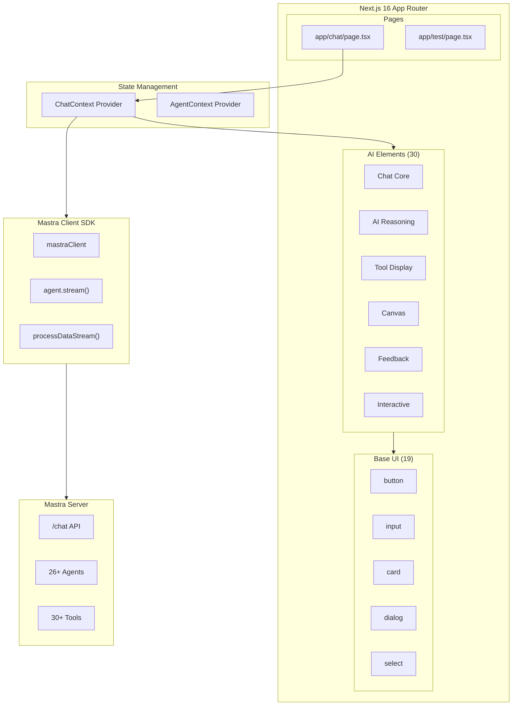
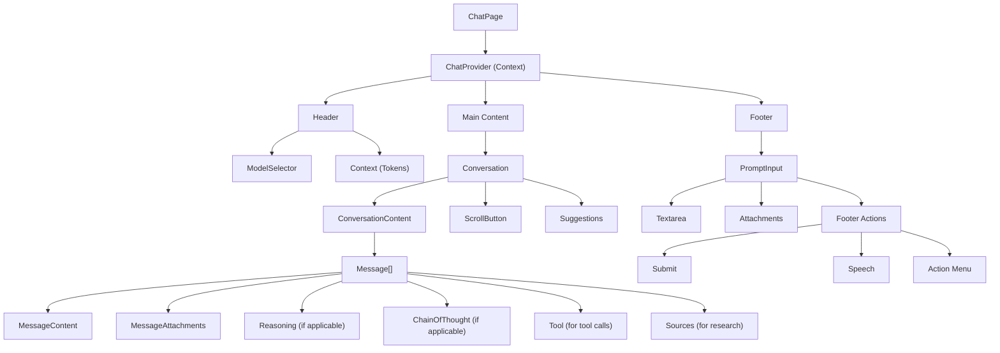
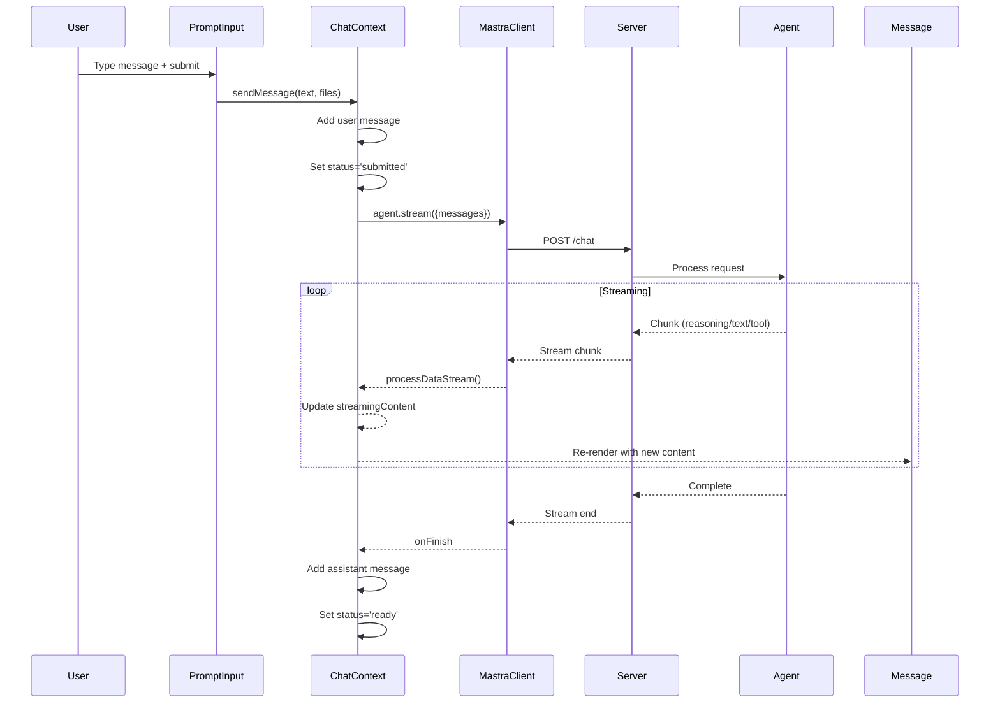

# AI Elements Integration with Agents - Design Document

## Architecture Overview

This document outlines the technical design for integrating the AI Elements UI library with all 26+ Mastra agents, based on comprehensive analysis of:

- **AI Elements Components**: 30 components from `src/components/ai-elements/`
- **Base UI Components**: 19 components from `ui/`
- **Existing Agents**: 26+ agents from `src/mastra/agents/`
- **Mastra Client SDK**: `lib/mastra-client.ts`
- **Current Chat Page**: `app/chat/page.tsx`

## Component Architecture

### System Diagram



### Component Hierarchy



## AI Elements Component Specifications

### 1. Chat Core Components

#### Message Component
**File:** `src/components/ai-elements/message.tsx`

**Exports:**

- `Message` - Container with `from: 'user' | 'assistant'`
- `MessageContent` - Content wrapper with role-based styling
- `MessageActions` - Action buttons container
- `MessageAction` - Individual action button with tooltip
- `MessageBranch` - Multi-branch conversation support
- `MessageResponse` - Streamdown-based markdown renderer
- `MessageAttachment` - File/image attachment display
- `MessageAttachments` - Attachments container
- `MessageToolbar` - Bottom toolbar for actions

**Integration Pattern:**

```typescript
<Message from={message.role}>
  <MessageContent>
    {message.reasoning && <Reasoning isStreaming={isStreaming}>...</Reasoning>}
    <MessageResponse>{message.content}</MessageResponse>
    {message.toolInvocations && <Tool>...</Tool>}
    {message.sources && <Sources>...</Sources>}
  </MessageContent>
  <MessageToolbar>
    <MessageActions>
      <MessageAction tooltip="Copy" onClick={handleCopy}>
        <CopyIcon />
      </MessageAction>
    </MessageActions>
  </MessageToolbar>
</Message>
```

#### Conversation Component
**File:** `src/components/ai-elements/conversation.tsx`

**Exports:**

- `Conversation` - Scroll container with stick-to-bottom
- `ConversationContent` - Messages container with gap
- `ConversationEmptyState` - Empty state display
- `ConversationScrollButton` - Scroll-to-bottom button

**Integration Pattern:**

```typescript
<Conversation>
  <ConversationContent>
    {messages.length === 0 ? (
      <ConversationEmptyState 
        title="Start a conversation"
        description={`Chat with ${selectedAgent}`}
      />
    ) : (
      messages.map((m) => <Message key={m.id} {...m} />)
    )}
  </ConversationContent>
  <ConversationScrollButton />
</Conversation>
```

#### PromptInput Component
**File:** `src/components/ai-elements/prompt-input.tsx`

**Exports:**

- `PromptInputProvider` - Global state provider (optional)
- `PromptInput` - Form container with file handling
- `PromptInputTextarea` - Auto-growing textarea
- `PromptInputHeader` - Header section
- `PromptInputFooter` - Footer with actions
- `PromptInputTools` - Tool buttons container
- `PromptInputButton` - Generic action button
- `PromptInputSubmit` - Submit button with status
- `PromptInputSpeechButton` - Voice input button
- `PromptInputActionMenu` - Dropdown action menu
- `PromptInputAttachment` - Attachment preview
- `PromptInputAttachments` - Attachments list
- `PromptInputSelect` - Inline select for options

**Integration Pattern:**

```typescript
<PromptInput
  onSubmit={handleSubmit}
  accept="image/*,.pdf,.csv"
  multiple
>
  <PromptInputAttachments>
    {(attachment) => <PromptInputAttachment data={attachment} />}
  </PromptInputAttachments>
  <PromptInputTextarea placeholder={`Ask ${selectedAgent}...`} />
  <PromptInputFooter>
    <PromptInputTools>
      <PromptInputActionMenu>
        <PromptInputActionMenuTrigger />
        <PromptInputActionMenuContent>
          <PromptInputActionAddAttachments />
        </PromptInputActionMenuContent>
      </PromptInputActionMenu>
    </PromptInputTools>
    <PromptInputSubmit status={status} />
  </PromptInputFooter>
</PromptInput>
```

### 2. AI Reasoning Components

#### Reasoning Component
**File:** `src/components/ai-elements/reasoning.tsx`

**Exports:**

- `Reasoning` - Collapsible container with auto-close
- `ReasoningTrigger` - Trigger with duration display
- `ReasoningContent` - Streamdown content

**Use Cases:** Research agents, stock analysis, complex reasoning

**Integration Pattern:**

```typescript
<Reasoning isStreaming={part.isStreaming} duration={part.duration}>
  <ReasoningTrigger />
  <ReasoningContent>{part.reasoning}</ReasoningContent>
</Reasoning>
```

#### ChainOfThought Component
**File:** `src/components/ai-elements/chain-of-thought.tsx`

**Exports:**

- `ChainOfThought` - Container with open state
- `ChainOfThoughtHeader` - Collapsible header
- `ChainOfThoughtContent` - Steps container
- `ChainOfThoughtStep` - Individual step with icon/status
- `ChainOfThoughtSearchResults` - Search results display
- `ChainOfThoughtSearchResult` - Individual result badge
- `ChainOfThoughtImage` - Image with caption

**Use Cases:** Multi-step research, data pipeline execution

**Integration Pattern:**

```typescript
<ChainOfThought>
  <ChainOfThoughtHeader>Analyzing data...</ChainOfThoughtHeader>
  <ChainOfThoughtContent>
    <ChainOfThoughtStep label="Step 1: Parse CSV" status="complete" />
    <ChainOfThoughtStep label="Step 2: Validate" status="active" />
    <ChainOfThoughtStep label="Step 3: Transform" status="pending" />
  </ChainOfThoughtContent>
</ChainOfThought>
```

#### Plan Component
**File:** `src/components/ai-elements/plan.tsx`

**Exports:**

- `Plan` - Card-based collapsible plan
- `PlanHeader` - Header with title/description
- `PlanTitle` - Title with shimmer on streaming
- `PlanDescription` - Description text
- `PlanContent` - Collapsible content
- `PlanFooter` - Footer area
- `PlanTrigger` - Toggle button
- `PlanAction` - Action button

**Use Cases:** Task planning, workflow execution

### 3. Tool Display Components

#### Tool Component
**File:** `src/components/ai-elements/tool.tsx`

**Exports:**

- `Tool` - Collapsible tool container
- `ToolHeader` - Header with title, type, status badge
- `ToolContent` - Collapsible content
- `ToolInput` - Input parameters display
- `ToolOutput` - Output/error display

**Status Badges:** `input-streaming`, `input-available`, `approval-requested`, `approval-responded`, `output-available`, `output-error`, `output-denied`

**Integration Pattern:**

```typescript
{message.toolInvocations?.map((tool) => (
  <Tool key={tool.toolCallId}>
    <ToolHeader 
      title={tool.toolName}
      type={tool.type}
      state={tool.state}
    />
    <ToolContent>
      <ToolInput input={tool.args} />
      <ToolOutput output={tool.result} errorText={tool.error} />
    </ToolContent>
  </Tool>
))}
```

#### CodeBlock Component
**File:** `src/components/ai-elements/code-block.tsx`

**Exports:**

- `CodeBlock` - Syntax highlighted code with Shiki
- `CodeBlockCopyButton` - Copy to clipboard button

**Features:** Light/dark theme, line numbers, language detection

#### Artifact Component
**File:** `src/components/ai-elements/artifact.tsx`

**Exports:**

- `Artifact` - Container for generated content
- `ArtifactHeader` - Header with title/actions
- `ArtifactTitle` - Title text
- `ArtifactDescription` - Description
- `ArtifactActions` - Action buttons
- `ArtifactAction` - Individual action with tooltip
- `ArtifactClose` - Close button
- `ArtifactContent` - Scrollable content area

**Use Cases:** Generated code, diagrams, reports

### 4. Sources & Citations

#### Sources Component
**File:** `src/components/ai-elements/sources.tsx`

**Exports:**

- `Sources` - Collapsible sources container
- `SourcesTrigger` - Trigger showing count
- `SourcesContent` - Sources list
- `Source` - Individual source link

**Integration Pattern:**

```typescript
{message.sources && (
  <Sources>
    <SourcesTrigger count={message.sources.length} />
    <SourcesContent>
      {message.sources.map((source) => (
        <Source key={source.url} href={source.url} title={source.title} />
      ))}
    </SourcesContent>
  </Sources>
)}
```

#### InlineCitation Component
**File:** `src/components/ai-elements/inline-citation.tsx`

**Use Case:** Citations within message text

### 5. Interactive Components

#### ModelSelector Component
**File:** `src/components/ai-elements/model-selector.tsx`

**Exports:**

- `ModelSelector` - Dialog wrapper
- `ModelSelectorTrigger` - Trigger button
- `ModelSelectorContent` - Dialog content
- `ModelSelectorInput` - Search input
- `ModelSelectorList` - Scrollable list
- `ModelSelectorGroup` - Grouped items
- `ModelSelectorItem` - Individual model/agent
- `ModelSelectorLogo` - Provider logo
- `ModelSelectorLogoGroup` - Multiple logos
- `ModelSelectorName` - Model/agent name

**Agent Categories for Grouping:**

```typescript
const AGENT_CATEGORIES = {
  core: ['weatherAgent', 'a2aCoordinatorAgent'],
  research: ['researchAgent', 'researchPaperAgent', 'documentProcessingAgent', 'knowledgeIndexingAgent'],
  content: ['copywriterAgent', 'editorAgent', 'contentStrategistAgent', 'scriptWriterAgent', 'reportAgent'],
  data: ['dataExportAgent', 'dataIngestionAgent', 'dataTransformationAgent'],
  financial: ['stockAnalysisAgent', 'chartTypeAdvisorAgent', 'chartDataProcessorAgent', 'chartGeneratorAgent', 'chartSupervisorAgent'],
  diagram: ['csvToExcalidrawAgent', 'imageToCsvAgent', 'excalidrawValidatorAgent'],
  utility: ['evaluationAgent', 'learningExtractionAgent', 'dane', 'sqlAgent'],
}
```

#### Confirmation Component
**File:** `src/components/ai-elements/confirmation.tsx`

**Exports:**

- `Confirmation` - Alert wrapper
- `ConfirmationTitle` - Title text
- `ConfirmationRequest` - Pending approval content
- `ConfirmationAccepted` - Approved content
- `ConfirmationRejected` - Rejected content
- `ConfirmationActions` - Action buttons
- `ConfirmationAction` - Individual action

**Use Cases:** Tool approval, destructive actions

#### Context Component
**File:** `src/components/ai-elements/context.tsx`

**Exports:**

- `Context` - Hover card wrapper
- `ContextTrigger` - Progress ring button
- `ContextContent` - Hover card content
- `ContextContentHeader` - Progress bar section
- `ContextContentBody` - Usage details
- `ContextContentFooter` - Cost summary
- `ContextInputUsage` - Input token usage
- `ContextOutputUsage` - Output token usage
- `ContextReasoningUsage` - Reasoning token usage
- `ContextCacheUsage` - Cache hit usage

**Integration Pattern:**

```typescript
<Context
  usedTokens={usage.totalTokens}
  maxTokens={128000}
  usage={usage}
  modelId="gemini-2.5-flash"
>
  <ContextTrigger />
  <ContextContent>
    <ContextContentHeader />
    <ContextContentBody>
      <ContextInputUsage />
      <ContextOutputUsage />
      <ContextReasoningUsage />
    </ContextContentBody>
    <ContextContentFooter />
  </ContextContent>
</Context>
```

### 6. Feedback Components

#### Loader Component
**File:** `src/components/ai-elements/loader.tsx`

**Exports:**

- `Loader` - Spinning loader icon

#### Shimmer Component
**File:** `src/components/ai-elements/shimmer.tsx`

**Use Case:** Text loading placeholder with animation

#### Checkpoint Component
**File:** `src/components/ai-elements/checkpoint.tsx`

**Exports:**

- `Checkpoint` - Checkpoint marker with separator
- `CheckpointIcon` - Bookmark icon
- `CheckpointTrigger` - Clickable trigger

**Use Cases:** Conversation milestones, save points

### 7. Canvas Components

#### Canvas Component
**File:** `src/components/ai-elements/canvas.tsx`

**Exports:**

- `Canvas` - React Flow wrapper

**Features:** Fit view, selection, pan/scroll, delete keys

**Use Cases:** Excalidraw agents, diagram visualization

#### Supporting Canvas Components

- `node.tsx` - Custom node types
- `edge.tsx` - Custom edge types
- `connection.tsx` - Connection lines
- `controls.tsx` - Zoom/pan controls

## Agent-to-Component Mapping

### Component Matrix

| Agent | Message | Reasoning | ChainOfThought | Tool | Sources | Canvas | Artifact |
|-------|---------|-----------|----------------|------|---------|--------|----------|
| weatherAgent | ✓ | | | ✓ | | | |
| researchAgent | ✓ | ✓ | ✓ | ✓ | ✓ | | |
| researchPaperAgent | ✓ | ✓ | ✓ | ✓ | ✓ | | ✓ |
| documentProcessingAgent | ✓ | | ✓ | ✓ | ✓ | | ✓ |
| knowledgeIndexingAgent | ✓ | | ✓ | ✓ | | | |
| copywriterAgent | ✓ | ✓ | | | | | ✓ |
| editorAgent | ✓ | ✓ | | | | | ✓ |
| contentStrategistAgent | ✓ | ✓ | ✓ | | | | |
| scriptWriterAgent | ✓ | ✓ | | | | | ✓ |
| reportAgent | ✓ | | ✓ | ✓ | ✓ | | ✓ |
| dataExportAgent | ✓ | | ✓ | ✓ | | | ✓ |
| dataIngestionAgent | ✓ | | ✓ | ✓ | | | |
| dataTransformationAgent | ✓ | | ✓ | ✓ | | | |
| stockAnalysisAgent | ✓ | ✓ | ✓ | ✓ | ✓ | | ✓ |
| chartTypeAdvisorAgent | ✓ | ✓ | | | | | |
| chartDataProcessorAgent | ✓ | | ✓ | ✓ | | | |
| chartGeneratorAgent | ✓ | | | ✓ | | | ✓ |
| chartSupervisorAgent | ✓ | ✓ | ✓ | ✓ | | | ✓ |
| csvToExcalidrawAgent | ✓ | | ✓ | ✓ | | ✓ | ✓ |
| imageToCsvAgent | ✓ | | ✓ | ✓ | | | ✓ |
| excalidrawValidatorAgent | ✓ | | | ✓ | | ✓ | |
| evaluationAgent | ✓ | ✓ | ✓ | ✓ | | | ✓ |
| learningExtractionAgent | ✓ | ✓ | | ✓ | | | |
| a2aCoordinatorAgent | ✓ | | ✓ | ✓ | | | |
| dane | ✓ | | | ✓ | | | |
| sqlAgent | ✓ | | | ✓ | | | ✓ |

## State Management

### Chat Context Provider

```typescript
// app/chat/providers/chat-context.tsx
import { createContext, useContext, ReactNode } from 'react'
import { UIMessage, LanguageModelUsage } from 'ai'

interface ChatState {
  messages: UIMessage[]
  isLoading: boolean
  status: 'ready' | 'submitted' | 'streaming' | 'error'
  selectedAgent: string
  streamingContent: string
  usage: LanguageModelUsage | null
}

interface ChatActions {
  sendMessage: (text: string, files?: File[]) => Promise<void>
  stopGeneration: () => void
  clearMessages: () => void
  selectAgent: (agentId: string) => void
}

interface ChatContextValue extends ChatState, ChatActions {}

const ChatContext = createContext<ChatContextValue | null>(null)

export const useChatContext = () => {
  const context = useContext(ChatContext)
  if (!context) throw new Error('useChatContext must be used within ChatProvider')
  return context
}

export function ChatProvider({ children }: { children: ReactNode }) {
  // Implementation
}
```

### Agent Configuration

```typescript
// app/chat/config/agents.ts
export interface AgentConfig {
  id: string
  name: string
  description: string
  category: 'core' | 'research' | 'content' | 'data' | 'financial' | 'diagram' | 'utility'
  features: {
    reasoning: boolean
    chainOfThought: boolean
    tools: boolean
    sources: boolean
    canvas: boolean
    artifacts: boolean
    fileUpload: boolean
  }
  icon?: string
}

export const AGENT_CONFIGS: Record<string, AgentConfig> = {
  weatherAgent: {
    id: 'weatherAgent',
    name: 'Weather Agent',
    description: 'Get weather forecasts and activity suggestions',
    category: 'core',
    features: {
      reasoning: false,
      chainOfThought: false,
      tools: true,
      sources: false,
      canvas: false,
      artifacts: false,
      fileUpload: false,
    },
  },
  researchAgent: {
    id: 'researchAgent',
    name: 'Research Agent',
    description: 'Conduct web research with source citations',
    category: 'research',
    features: {
      reasoning: true,
      chainOfThought: true,
      tools: true,
      sources: true,
      canvas: false,
      artifacts: false,
      fileUpload: false,
    },
  },
  // ... more agents
}
```

## File Structure

```bash
app/
├── chat/
│   ├── page.tsx                    # Main chat page
│   ├── layout.tsx                  # Chat layout (optional)
│   ├── providers/
│   │   └── chat-context.tsx        # Chat state provider
│   ├── config/
│   │   └── agents.ts               # Agent configurations
│   ├── components/
│   │   ├── chat-header.tsx         # Header with agent selector
│   │   ├── chat-messages.tsx       # Message list component
│   │   ├── chat-input.tsx          # Input component wrapper
│   │   ├── agent-message.tsx       # Agent-specific message
│   │   └── agent-selector.tsx      # Agent selection modal
│   └── hooks/
│       ├── use-chat.ts             # Chat hook with Mastra SDK
│       └── use-agent-features.ts   # Agent feature detection
```

## Data Flow

### Message Streaming Flow



### Stream Chunk Types

```typescript
interface StreamChunk {
  type: 'text-delta' | 'reasoning' | 'tool-call' | 'tool-result' | 'source' | 'finish'
  payload: {
    text?: string
    reasoning?: string
    toolName?: string
    toolArgs?: object
    toolResult?: object
    source?: { url: string; title: string }
    usage?: LanguageModelUsage
  }
}
```

## Error Handling

| Error Type | Component | Handling |
|------------|-----------|----------|
| Stream error | ChatContext | Show error message, allow retry |
| Tool error | Tool | Display error in ToolOutput |
| File upload error | PromptInput | Show error via onError callback |
| Agent not found | ChatContext | Fallback to default agent |
| Token limit | Context | Show warning, suggest truncation |

## Testing Strategy

### Unit Tests

- Component rendering with various props
- Hook behavior (useChatContext, useAgentFeatures)
- Agent configuration validation

### Integration Tests

- Full chat flow with mock Mastra client
- Streaming message rendering
- Tool execution display
- File upload flow

### E2E Tests

- Complete conversation with real agents
- Agent switching
- Error recovery

---

**Next Step:** `/approve design` to proceed to tasks phase
