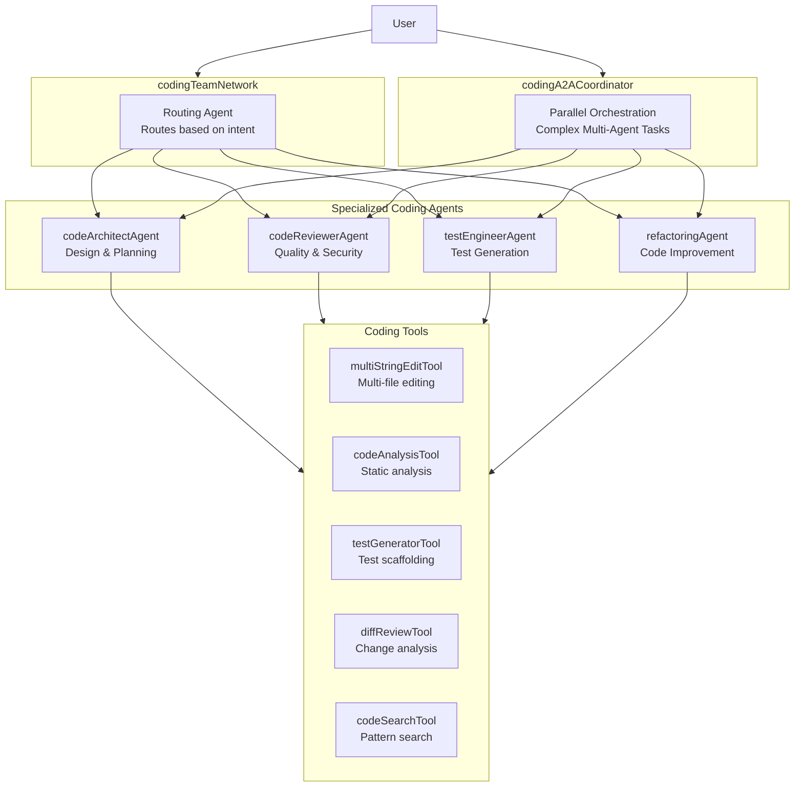

# Design: Coding Team Network & Agents

## Overview

The Coding Team feature implements a multi-agent system for software development tasks using Mastra's agent network pattern for routing and A2A protocol for parallel orchestration.

### Goals
- Create 4 specialized coding agents following existing patterns
- Build 5 coding-specific tools with Zod schemas
- Implement a CodingTeamNetwork for intelligent routing
- Add CodingA2ACoordinator for parallel task execution

### Constraints
- Must follow existing agent patterns (businessLegalAgents.ts)
- Tools must use createTool with Zod input/output schemas
- Network follows dataPipelineNetwork.ts pattern
- Uses pgMemory and googleAI/googleAI3 from config

## Architecture



## Data Models

### MultiStringEdit Input/Output

```typescript
// inputSchema
const multiStringEditInput = z.object({
  edits: z.array(z.object({
    filePath: z.string().describe("Absolute path to the file"),
    oldString: z.string().describe("Exact text to replace"),
    newString: z.string().describe("Replacement text"),
    description: z.string().optional().describe("Why this change")
  })),
  dryRun: z.boolean().default(false).describe("Preview without applying"),
  createBackup: z.boolean().default(true).describe("Create .bak files")
})

// outputSchema
const multiStringEditOutput = z.object({
  success: z.boolean(),
  results: z.array(z.object({
    filePath: z.string(),
    status: z.enum(["applied", "skipped", "failed"]),
    reason: z.string().optional(),
    backup: z.string().optional()
  })),
  summary: z.object({
    total: z.number(),
    applied: z.number(),
    skipped: z.number(),
    failed: z.number()
  })
})
```

### CodeAnalysis Output

```typescript
const codeAnalysisOutput = z.object({
  files: z.array(z.object({
    path: z.string(),
    language: z.string(),
    loc: z.number(),
    complexity: z.number(),
    issues: z.array(z.object({
      type: z.enum(["error", "warning", "info"]),
      line: z.number(),
      message: z.string(),
      rule: z.string().optional()
    }))
  })),
  summary: z.object({
    totalFiles: z.number(),
    totalLoc: z.number(),
    avgComplexity: z.number(),
    issueCount: z.record(z.string(), z.number())
  })
})
```

### TestGeneration Output

```typescript
const testGenerationOutput = z.object({
  tests: z.array(z.object({
    testFile: z.string(),
    sourceFile: z.string(),
    framework: z.literal("vitest"),
    content: z.string(),
    coverage: z.object({
      functions: z.array(z.string()),
      branches: z.number().optional()
    })
  })),
  runCommand: z.string()
})
```

## API Contracts

### Agent Instructions Pattern

Each coding agent follows the RuntimeContext pattern from businessLegalAgents.ts:

```typescript
instructions: ({ runtimeContext }) => {
  const userTier = runtimeContext.get('user-tier') ?? 'free'
  const language = runtimeContext.get('language') ?? 'en'
  return {
    role: 'system',
    content: `...`,
    providerOptions: {
      google: {
        structuredOutput: true,
        thinkingConfig: {
          thinkingLevel: userTier === 'enterprise' ? 'high' : 'medium',
          includeThoughts: true,
        }
      }
    }
  }
}
```

### Network Routing Pattern

Following dataPipelineNetwork.ts structure:

```typescript
// Routing triggers
- Architecture: "design", "architect", "plan", "structure"
- Review: "review", "check", "analyze", "audit"  
- Testing: "test", "coverage", "spec", "unit test"
- Refactoring: "refactor", "improve", "optimize", "clean"
```

## Tech Decisions

| Decision | Choice | Rationale |
|----------|--------|-----------|
| Code Analysis | AST-free, regex-based | Simpler, language-agnostic, no heavy parser deps |
| Multi-edit Atomicity | All-or-nothing with backup | Safer for batch operations |
| Test Framework | Vitest only | Already project standard |
| Model Selection | googleAI3 for complex, googleAIFlashLite for simple | Cost/quality balance |
| File Operations | fs-extra + existing fsTool patterns | Consistency with existing tools |
| Search | grep-based via execa | Leverage existing execaTool |

## Risks & Mitigations

| Risk | Likelihood | Impact | Mitigation |
|------|------------|--------|------------|
| Multi-edit conflicts | Medium | High | Backup files, dry-run mode, atomic operations |
| Large file handling | Medium | Medium | File size limits, chunked processing |
| Path traversal | Low | High | Strict path validation, project boundary checks |
| API rate limits | Medium | Low | Caching, request throttling |

## File Structure

```
src/mastra/
├── tools/
│   ├── multi-string-edit.tool.ts      # Multi-file editing
│   ├── code-analysis.tool.ts          # Static analysis
│   ├── test-generator.tool.ts         # Vitest generation
│   ├── diff-review.tool.ts            # Change analysis
│   └── code-search.tool.ts            # Pattern search
├── agents/
│   └── codingAgents.ts                # All 4 coding agents
├── networks/
│   └── codingTeamNetwork.ts           # Network router
└── a2a/
    └── codingA2ACoordinator.ts        # Parallel orchestrator
```

## Dependencies (New Packages)

| Package | Purpose | Version |
|---------|---------|---------|
| `diff` | Generate unified diffs | ^7.0.0 |
| `glob` | File pattern matching | ^11.0.0 |

Existing packages to leverage:
- `fs-extra` - File operations
- `execa` - Shell commands  
- `zod` - Schema validation

## Integration Points

- **Existing Tools**: fsTool, execaTool, pnpmTool, githubTool
- **Existing Networks**: Can be called from agentNetwork as sub-network
- **Storage**: pgMemory for conversation history
- **Scorers**: Reuse existing (relevancy, toxicity, sourceDiversity)

