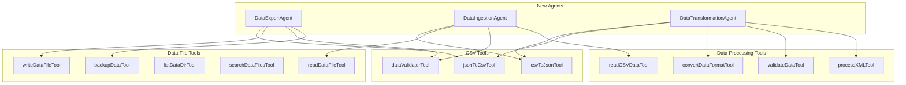
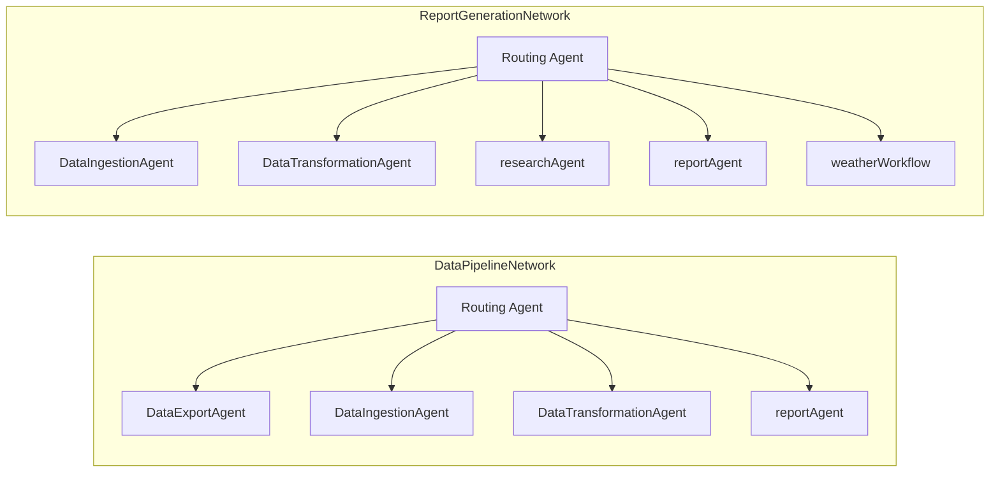
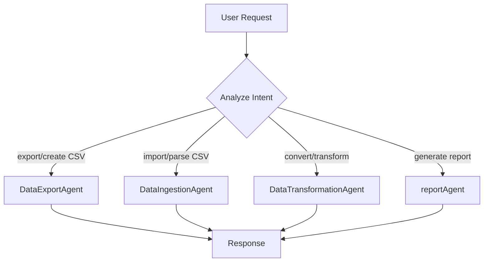
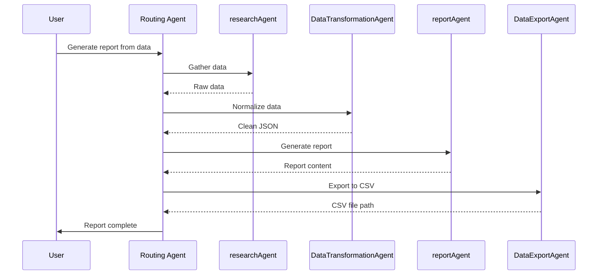
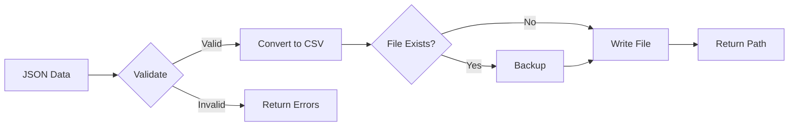
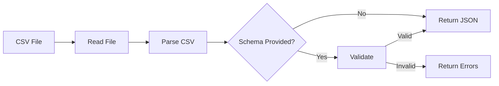

# CSV Agents & Data Pipeline Networks - Design Document

## Architecture Overview

This document outlines the technical design for implementing CSV-focused agents and data pipeline networks in the Mastra framework, based on comprehensive analysis of existing patterns from:

- **Mastra Documentation**: Agents, Networks, Memory, Workflows, Tools APIs
- **Existing Agents**: `researchAgent.ts`, `reportAgent.ts`, `weatherAgent.ts`
- **Existing Tools**: `csv-to-json.tool.ts`, `json-to-csv.tool.ts`, `data-validator.tool.ts`, `document-chunking.tool.ts`
- **Existing Networks**: `networks/index.ts` (agentNetwork pattern)
- **Configuration**: `pg-storage.ts` (Memory, PgVector, pgMemory setup)

## Agent Architecture

### Component Diagram



### Network Architecture



## Agent Specifications

### 1. DataExportAgent

**Purpose:** Convert structured data to CSV format and manage file output

**Model:** `googleAI` (Gemini 2.5 Flash - fast, cost-effective)

**Pattern Reference:** Based on `reportAgent.ts` structure with memory and RuntimeContext

**Tools:**

| Tool | Purpose |
|------|---------|
| `jsonToCsvTool` | Convert JSON arrays to CSV |
| `writeDataFileTool` | Write CSV to data directory |
| `dataValidatorTool` | Validate input data before conversion |
| `backupDataTool` | Create backup before overwriting |

**Agent Implementation Pattern:**

```typescript
export const dataExportAgent = new Agent({
  id: 'data-export-agent',
  name: 'Data Export Agent',
  description: 'Converts structured data to CSV format and manages file output. Use for creating CSV exports, formatting data tables, and saving structured data to files.',
  instructions: `You are a data export specialist...`,
  model: googleAI,
  memory: pgMemory,
  tools: {
    jsonToCsvTool,
    writeDataFileTool,
    dataValidatorTool,
    backupDataTool
  },
  options: {
    tracingPolicy: { internal: InternalSpans.ALL }
  }
});
```

**Instructions:**

```txt
You are a data export specialist. Your role is to convert structured data into clean, valid CSV files.

Workflow:
1. Validate input data structure using dataValidatorTool
2. Convert JSON/objects to CSV using jsonToCsvTool
3. Optionally backup existing files using backupDataTool
4. Write CSV output using writeDataFileTool
5. Confirm success with file path and row count

Always:
- Validate data before conversion
- Handle arrays of objects as rows
- Escape special characters properly
- Report any validation errors clearly
```

**RuntimeContext:**

```typescript
interface DataExportContext {
  userId?: string
  outputDirectory?: string
  overwriteExisting?: boolean
  delimiter?: string
}
```

### 2. DataIngestionAgent

**Purpose:** Parse CSV files, validate structure, and convert to JSON

**Model:** `googleAI` (Gemini 2.5 Flash)

**Tools:**

| Tool | Purpose |
|------|---------|
| `csvToJsonTool` | Parse CSV to JSON |
| `readDataFileTool` | Read CSV from data directory |
| `dataValidatorTool` | Validate parsed data against schema |
| `readCSVDataTool` | Alternative CSV reader with headers |

**Instructions:**

```txt
You are a data ingestion specialist. Your role is to safely import and validate CSV data.

Workflow:
1. Read CSV file using readDataFileTool or readCSVDataTool
2. Parse CSV to JSON using csvToJsonTool
3. Validate structure using dataValidatorTool (if schema provided)
4. Return validated JSON data with metadata

Always:
- Check file exists before reading
- Handle encoding issues gracefully
- Report row count and column names
- Flag validation errors per row
```

**RuntimeContext:**

```typescript
interface DataIngestionContext {
  userId?: string
  sourceDirectory?: string
  validationSchema?: object
  maxRows?: number
}
```

### 3. DataTransformationAgent

**Purpose:** Complex format transformations (CSV↔JSON↔XML)

**Model:** `googleAIPro` (Gemini Pro - complex reasoning)

**Tools:**

| Tool | Purpose |
|------|---------|
| `csvToJsonTool` | CSV → JSON |
| `jsonToCsvTool` | JSON → CSV |
| `convertDataFormatTool` | Multi-format conversion |
| `validateDataTool` | Format-specific validation |
| `processXMLTool` | XML processing |

**Instructions:**

```txt
You are a data transformation expert. Your role is to convert data between different formats while preserving integrity.

Supported transformations:
- CSV → JSON
- JSON → CSV
- CSV → XML
- XML → CSV
- JSON → XML

Workflow:
1. Identify source format
2. Validate source data
3. Apply transformation using appropriate tool
4. Validate output format
5. Return transformed data with metadata

Always:
- Preserve data types where possible
- Handle nested structures appropriately
- Report any data loss or type coercion
- Provide transformation summary
```

**RuntimeContext:**

```typescript
interface DataTransformationContext {
  userId?: string
  preserveTypes?: boolean
  flattenNested?: boolean
  xmlRootElement?: string
}
```

## Network Specifications

### 1. DataPipelineNetwork

**Purpose:** Route data processing requests to appropriate specialist agent

**Implementation Pattern:** Based on `networks/index.ts` - Uses Agent class with `agents` property (NOT AgentNetwork class)

**Critical Requirements:**
1. Network is an `Agent` with `agents`, `workflows`, `tools` properties
2. **MUST** have `memory: pgMemory` to enable `.network()` method
3. All member agents need **clear descriptions** for routing decisions
4. Uses routing instructions to delegate to appropriate agent

**Routing Logic:**



**Configuration:**

```typescript
export const dataPipelineNetwork = new Agent({
  id: 'data-pipeline-network',
  name: 'Data Pipeline Network',
  description: 'A routing agent that coordinates data processing agents for CSV/JSON operations.',
  instructions: `You are a routing agent for data processing requests.
    Analyze the user's request and delegate to the appropriate specialist:
    
    - DataExportAgent: Creating CSV files, exporting data, converting JSON to CSV
    - DataIngestionAgent: Reading CSV files, parsing CSV data, importing data
    - DataTransformationAgent: Converting between formats (CSV/JSON/XML), complex transformations
    - reportAgent: Generating reports and summaries from data
    
    Always explain which agent you're delegating to and why.`,
  model: googleAI,
  memory: pgMemory, // REQUIRED for network functionality
  options: { tracingPolicy: { internal: InternalSpans.ALL } },
  agents: { dataExportAgent, dataIngestionAgent, dataTransformationAgent, reportAgent },
  tools: {},
  workflows: {}
});
```

### 2. ReportGenerationNetwork

**Purpose:** Coordinate multi-step report generation workflows

**Implementation Pattern:** Based on `networks/index.ts` - Combines agents AND workflows

**Workflow:**



**Configuration:**

```typescript
export const reportGenerationNetwork = new Agent({
  id: 'report-generation-network',
  name: 'Report Generation Network',
  description: 'A routing agent that coordinates research, data transformation, and report generation.',
  instructions: `You are a routing agent for report generation workflows.
    Coordinate the following agents to create comprehensive reports:
    
    - researchAgent: Research and gather raw data from various sources
    - DataIngestionAgent: Import and parse data files
    - DataTransformationAgent: Clean, normalize, and transform data
    - reportAgent: Generate formatted reports and summaries
    
    For weather-related reports, use weatherWorkflow.
    
    Workflow pattern:
    1. Gather data (researchAgent or DataIngestionAgent)
    2. Transform/normalize (DataTransformationAgent)
    3. Generate report (reportAgent)`,
  model: googleAIPro,
  memory: pgMemory,
  options: { tracingPolicy: { internal: InternalSpans.ALL } },
  agents: { dataIngestionAgent, dataTransformationAgent, researchAgent, reportAgent },
  tools: {},
  workflows: { weatherWorkflow }
});
```

## Data Flow Patterns

### Export Pipeline



### Ingestion Pipeline



## File Structure

```bash
src/mastra/
├── agents/
│   ├── dataExportAgent.ts      # NEW
│   ├── dataIngestionAgent.ts   # NEW
│   └── dataTransformationAgent.ts  # NEW
├── networks/
│   ├── index.ts                # UPDATE - add new networks
│   ├── dataPipelineNetwork.ts  # NEW
│   └── reportGenerationNetwork.ts  # NEW
└── index.ts                    # UPDATE - register agents
```

## Dependencies

### Import Requirements (Based on Existing Codebase Patterns)

```typescript
// Core
import { Agent } from '@mastra/core/agents'
import { InternalSpans } from '@mastra/core/ai-tracing'

// Models (from config/google.ts)
import { googleAI, googleAI3, googleAIFlashLite } from '../config/google'

// Memory (from config/pg-storage.ts - REQUIRED for networks)
import { pgMemory, pgVector, pgStore } from '../config/pg-storage'

// CSV Tools (from tools/)
import { csvToJsonTool } from '../tools/csv-to-json.tool'
import { jsonToCsvTool } from '../tools/json-to-csv.tool'
import { dataValidatorTool } from '../tools/data-validator.tool'

// Data File Tools (from tools/data-file-manager.ts)
import { 
  readDataFileTool, 
  writeDataFileTool, 
  listDataDirTool,
  searchDataFilesTool,
  backupDataTool 
} from '../tools/data-file-manager'

// Data Processing Tools (from tools/data-processing-tools.ts)
import {
  readCSVDataTool,
  convertDataFormatTool,
  validateDataTool,
  processXMLTool
} from '../tools/data-processing-tools'

// Existing Agents (for networks)
import { reportAgent } from './reportAgent'
import { researchAgent } from './researchAgent'

// Workflows (for networks)
import { weatherWorkflow } from '../workflows/weather-workflow'
```

### Key Config Exports Used

From `pg-storage.ts`:

- `pgMemory`: Memory instance with PostgresStore + PgVector + semantic recall
- `pgVector`: PgVector instance for embeddings (3072 dimensions, gemini-embedding-001)
- `pgStore`: PostgresStore for message storage

From `google.ts`:

- `googleAI`: Gemini 2.5 Flash (fast, cost-effective)
- `googleAI3`: Gemini Pro (complex reasoning)
- `googleAIFlashLite`: Gemini Flash Lite (ultra-fast, simple tasks)

## Error Handling

| Error Type | Handling |
|------------|----------|
| File not found | Return clear error with expected path |
| Parse error | Return row/column location of error |
| Validation failure | Return field-level error messages |
| Transformation failure | Return partial results if possible |

## Testing Strategy

1. **Unit Tests**: Individual tool usage per agent
2. **Integration Tests**: Multi-agent network flows
3. **Smoke Tests**: Basic happy path verification

---

**Next Step:** `/approve design` to proceed to tasks phase
