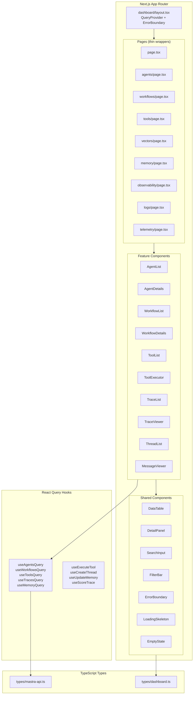

# Design: Mastra Admin Dashboard v2

## Overview

Refactor the dashboard from monolithic pages to a modular component architecture with React Query for data management, proper TypeScript types, and Next.js 16 patterns.

## Architecture



## Component Structure

```plaintext
app/dashboard/
├── layout.tsx              # QueryClientProvider, ErrorBoundary, Sidebar
├── page.tsx                # <DashboardHome />
├── loading.tsx             # Page-level loading
├── error.tsx               # Page-level error boundary
├── not-found.tsx           # 404 handler
│
├── _components/            # Shared dashboard components
│   ├── sidebar.tsx         # Navigation sidebar (extracted from layout)
│   ├── header.tsx          # Page header with breadcrumbs
│   ├── data-table.tsx      # Generic table with sorting/filtering
│   ├── detail-panel.tsx    # Side panel for details view
│   ├── search-input.tsx    # Debounced search input
│   ├── filter-bar.tsx      # Filter controls
│   ├── empty-state.tsx     # Empty state display
│   ├── error-fallback.tsx  # Error boundary fallback UI
│   └── stat-card.tsx       # Stats card component
│
├── agents/
│   ├── page.tsx            # <AgentsPage /> wrapper
│   ├── loading.tsx         # Agents loading skeleton
│   ├── error.tsx           # Agents error boundary
│   └── _components/
│       ├── agent-list.tsx
│       ├── agent-list-item.tsx
│       ├── agent-details.tsx
│       ├── agent-tools-tab.tsx
│       └── agent-evals-tab.tsx
│
├── workflows/
│   ├── page.tsx
│   ├── loading.tsx
│   ├── error.tsx
│   └── _components/
│       ├── workflow-list.tsx
│       ├── workflow-details.tsx
│       ├── workflow-runner.tsx
│       └── workflow-steps.tsx
│
├── tools/
│   ├── page.tsx
│   ├── loading.tsx
│   ├── error.tsx
│   └── _components/
│       ├── tool-list.tsx
│       ├── tool-details.tsx
│       ├── tool-executor.tsx
│       └── tool-schema-viewer.tsx
│
├── vectors/
│   ├── page.tsx
│   ├── loading.tsx
│   ├── error.tsx
│   └── _components/
│       ├── index-list.tsx
│       ├── index-details.tsx
│       ├── vector-query-form.tsx
│       └── query-results.tsx
│
├── memory/
│   ├── page.tsx
│   ├── loading.tsx
│   ├── error.tsx
│   └── _components/
│       ├── thread-list.tsx
│       ├── thread-details.tsx
│       ├── message-list.tsx
│       └── working-memory-editor.tsx
│
├── observability/
│   ├── page.tsx
│   ├── loading.tsx
│   ├── error.tsx
│   └── _components/
│       ├── trace-list.tsx
│       ├── trace-filters.tsx
│       ├── trace-details.tsx
│       ├── span-tree.tsx
│       └── trace-scorer.tsx
│
├── logs/
│   ├── page.tsx
│   ├── loading.tsx
│   ├── error.tsx
│   └── _components/
│       ├── log-list.tsx
│       ├── log-filters.tsx
│       └── log-entry.tsx
│
└── telemetry/
    ├── page.tsx
    ├── loading.tsx
    ├── error.tsx
    └── _components/
        ├── telemetry-list.tsx
        ├── telemetry-stats.tsx
        └── telemetry-entry.tsx
```

## Data Models

### TypeScript Types (`lib/types/mastra-api.ts`)

```typescript
import { z } from "zod"

// Agent Types
export const AgentSchema = z.object({
  id: z.string(),
  name: z.string().optional(),
  description: z.string().optional(),
  model: z.string().optional(),
  instructions: z.string().optional(),
  tools: z.array(z.union([z.string(), z.object({ id: z.string(), name: z.string().optional() })])).optional(),
  config: z.record(z.unknown()).optional(),
})
export type Agent = z.infer<typeof AgentSchema>

export const AgentEvalsSchema = z.object({
  ci: z.array(z.object({
    name: z.string().optional(),
    score: z.number().optional(),
    passed: z.boolean().optional(),
  })),
  live: z.array(z.object({
    name: z.string().optional(),
    score: z.number().optional(),
    status: z.string().optional(),
  })),
})
export type AgentEvals = z.infer<typeof AgentEvalsSchema>

// Workflow Types
export const WorkflowSchema = z.object({
  id: z.string(),
  name: z.string().optional(),
  description: z.string().optional(),
  steps: z.array(z.object({
    id: z.string(),
    name: z.string().optional(),
    type: z.string().optional(),
    description: z.string().optional(),
  })).optional(),
  inputSchema: z.record(z.unknown()).optional(),
})
export type Workflow = z.infer<typeof WorkflowSchema>

// Tool Types
export const ToolSchema = z.object({
  id: z.string(),
  name: z.string().optional(),
  description: z.string().optional(),
  inputSchema: z.record(z.unknown()).optional(),
  outputSchema: z.record(z.unknown()).optional(),
})
export type Tool = z.infer<typeof ToolSchema>

// Trace Types
export const SpanSchema = z.object({
  spanId: z.string(),
  traceId: z.string(),
  name: z.string().optional(),
  spanType: z.string().optional(),
  duration: z.number().optional(),
  startTime: z.string().optional(),
  endTime: z.string().optional(),
  status: z.string().optional(),
  attributes: z.record(z.unknown()).optional(),
  depth: z.number().optional(),
})
export type Span = z.infer<typeof SpanSchema>

export const TraceSchema = z.object({
  traceId: z.string(),
  name: z.string().optional(),
  spanType: z.string().optional(),
  duration: z.number().optional(),
  startTime: z.string().optional(),
  status: z.string().optional(),
  spans: z.array(SpanSchema).optional(),
  attributes: z.record(z.unknown()).optional(),
})
export type Trace = z.infer<typeof TraceSchema>

export const TracesResponseSchema = z.object({
  spans: z.array(SpanSchema),
  pagination: z.object({
    page: z.number(),
    perPage: z.number(),
    totalPages: z.number(),
    total: z.number().optional(),
  }),
})
export type TracesResponse = z.infer<typeof TracesResponseSchema>

// Memory Types
export const MemoryThreadSchema = z.object({
  id: z.string(),
  title: z.string().optional(),
  resourceId: z.string().optional(),
  agentId: z.string().optional(),
  createdAt: z.string().optional(),
  updatedAt: z.string().optional(),
  metadata: z.record(z.unknown()).optional(),
})
export type MemoryThread = z.infer<typeof MemoryThreadSchema>

export const MessageSchema = z.object({
  id: z.string(),
  role: z.enum(["user", "assistant", "system"]),
  content: z.string(),
  threadId: z.string().optional(),
  createdAt: z.string().optional(),
  type: z.string().optional(),
})
export type Message = z.infer<typeof MessageSchema>

export const WorkingMemorySchema = z.object({
  workingMemory: z.string().nullable(),
  source: z.enum(["thread", "resource"]).optional(),
  workingMemoryTemplate: z.string().optional(),
  threadExists: z.boolean().optional(),
})
export type WorkingMemory = z.infer<typeof WorkingMemorySchema>

// Log Types
export const LogEntrySchema = z.object({
  id: z.string().optional(),
  level: z.string(),
  message: z.string(),
  timestamp: z.string().optional(),
  source: z.string().optional(),
  metadata: z.record(z.unknown()).optional(),
})
export type LogEntry = z.infer<typeof LogEntrySchema>
```

## React Query Setup

### Query Client Provider (`app/dashboard/providers.tsx`)

```typescript
"use client"

import { QueryClient, QueryClientProvider } from "@tanstack/react-query"
import { ReactQueryDevtools } from "@tanstack/react-query-devtools"
import { useState, type ReactNode } from "react"

export function DashboardProviders({ children }: { children: ReactNode }) {
  const [queryClient] = useState(
    () =>
      new QueryClient({
        defaultOptions: {
          queries: {
            staleTime: 30 * 1000, // 30 seconds
            gcTime: 5 * 60 * 1000, // 5 minutes (formerly cacheTime)
            retry: 3,
            retryDelay: (attemptIndex) => Math.min(1000 * 2 ** attemptIndex, 30000),
            refetchOnWindowFocus: false,
          },
        },
      })
  )

  return (
    <QueryClientProvider client={queryClient}>
      {children}
      <ReactQueryDevtools initialIsOpen={false} />
    </QueryClientProvider>
  )
}
```

### Query Hooks (`lib/hooks/use-dashboard-queries.ts`)

```typescript
import { useQuery, useMutation, useQueryClient } from "@tanstack/react-query"
import { mastraClient } from "@/lib/mastra-client"
import type { Agent, Workflow, Tool, Trace, TracesResponse } from "@/lib/types/mastra-api"

// Query Keys
export const queryKeys = {
  agents: ["agents"] as const,
  agent: (id: string) => ["agents", id] as const,
  agentEvals: (id: string) => ["agents", id, "evals"] as const,
  workflows: ["workflows"] as const,
  workflow: (id: string) => ["workflows", id] as const,
  tools: ["tools"] as const,
  tool: (id: string) => ["tools", id] as const,
  traces: (filters?: Record<string, unknown>) => ["traces", filters] as const,
  trace: (id: string) => ["traces", id] as const,
  threads: (resourceId: string, agentId: string) => ["threads", resourceId, agentId] as const,
  thread: (id: string, agentId: string) => ["threads", id, agentId] as const,
  logs: (transportId?: string) => ["logs", transportId] as const,
  telemetry: (params?: Record<string, unknown>) => ["telemetry", params] as const,
}

// Agents
export function useAgentsQuery() {
  return useQuery({
    queryKey: queryKeys.agents,
    queryFn: async (): Promise<Agent[]> => {
      const agents = await mastraClient.getAgents()
      return Object.entries(agents).map(([id, agent]) => ({ id, ...agent }))
    },
  })
}

export function useAgentQuery(agentId: string | null) {
  return useQuery({
    queryKey: queryKeys.agent(agentId ?? ""),
    queryFn: async (): Promise<Agent | null> => {
      if (!agentId) return null
      const agent = mastraClient.getAgent(agentId)
      const details = await agent.details()
      return { id: agentId, ...details }
    },
    enabled: !!agentId,
  })
}

// Workflows
export function useWorkflowsQuery() {
  return useQuery({
    queryKey: queryKeys.workflows,
    queryFn: async () => {
      const workflows = await mastraClient.listWorkflows()
      return Object.entries(workflows).map(([id, wf]) => ({ id, ...wf }))
    },
  })
}

// Tools
export function useToolsQuery() {
  return useQuery({
    queryKey: queryKeys.tools,
    queryFn: async (): Promise<Tool[]> => {
      const tools = await mastraClient.getTools()
      return Object.entries(tools).map(([id, tool]) => ({ id, ...tool }))
    },
  })
}

// Traces
export function useTracesQuery(params?: {
  page?: number
  perPage?: number
  filters?: Record<string, unknown>
}) {
  return useQuery({
    queryKey: queryKeys.traces(params),
    queryFn: async (): Promise<TracesResponse> => {
      const traces = await mastraClient.getAITraces({
        pagination: {
          page: params?.page ?? 1,
          perPage: params?.perPage ?? 20,
        },
        filters: params?.filters,
      })
      return traces as TracesResponse
    },
  })
}

// Mutations
export function useExecuteToolMutation() {
  const queryClient = useQueryClient()
  
  return useMutation({
    mutationFn: async ({ toolId, args }: { toolId: string; args: Record<string, unknown> }) => {
      const tool = mastraClient.getTool(toolId)
      return tool.execute({ args })
    },
    onSuccess: () => {
      // Optionally invalidate related queries
    },
  })
}

export function useCreateThreadMutation() {
  const queryClient = useQueryClient()
  
  return useMutation({
    mutationFn: async (params: {
      title: string
      resourceId: string
      agentId: string
      metadata?: Record<string, unknown>
    }) => {
      return mastraClient.createMemoryThread(params)
    },
    onSuccess: (_, variables) => {
      queryClient.invalidateQueries({
        queryKey: queryKeys.threads(variables.resourceId, variables.agentId),
      })
    },
  })
}
```

## Error Handling

### Error Boundary (`app/dashboard/error.tsx`)

```typescript
"use client"

import { useEffect } from "react"
import { Button } from "@/ui/button"
import { AlertCircle, RefreshCw } from "lucide-react"

export default function DashboardError({
  error,
  reset,
}: {
  error: Error & { digest?: string }
  reset: () => void
}) {
  useEffect(() => {
    console.error("Dashboard error:", error)
  }, [error])

  return (
    <div className="flex h-full items-center justify-center">
      <div className="text-center max-w-md">
        <AlertCircle className="mx-auto h-12 w-12 text-destructive mb-4" />
        <h2 className="text-xl font-semibold mb-2">Something went wrong</h2>
        <p className="text-muted-foreground mb-4">
          {error.message || "An unexpected error occurred"}
        </p>
        <Button onClick={reset}>
          <RefreshCw className="h-4 w-4 mr-2" />
          Try again
        </Button>
      </div>
    </div>
  )
}
```

## Tech Decisions

| Decision | Choice | Rationale |
|----------|--------|-----------|
| Data fetching | TanStack Query v5 | Caching, deduplication, devtools, industry standard |
| Schema validation | Zod | Already in project, TypeScript inference |
| Component extraction | Co-located `_components` | Next.js convention, clear ownership |
| Error boundaries | Per-route + component-level | Graceful degradation |
| Loading states | `loading.tsx` + Suspense | Next.js 16 streaming |
| State management | React Query + URL state | Server state in RQ, UI state in URL |

## Risks & Mitigations

| Risk | Likelihood | Impact | Mitigation |
|------|------------|--------|------------|
| Breaking changes during refactor | Medium | High | Feature flags, incremental rollout |
| React Query learning curve | Low | Medium | Team documentation, examples |
| Type definition maintenance | Medium | Medium | Zod schemas as source of truth |
| Performance regression | Low | Medium | Lighthouse benchmarks before/after |

---

**Created:** Dec 5, 2025  
**Status:** Draft - Awaiting Approval
