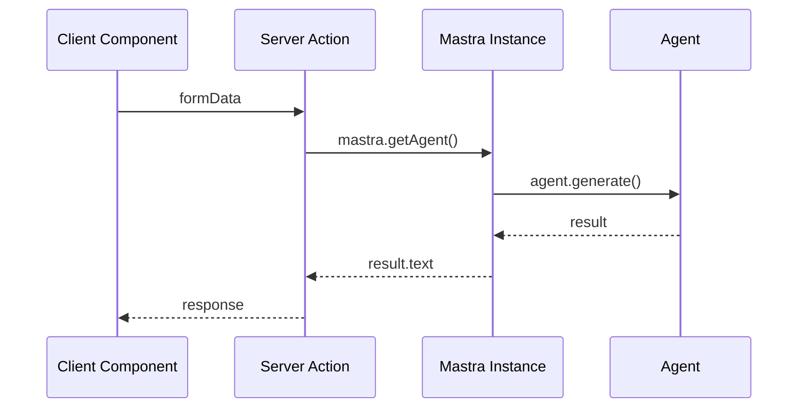
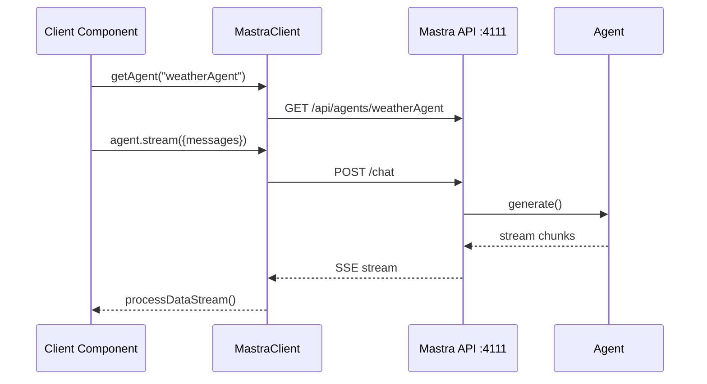

# Design: Mastra Client SDK Integration

## Overview

Integrate Mastra's backend (agents, tools, workflows) with the Next.js 16 frontend using two patterns:
1. **Server Actions** - Direct Mastra calls from server components
2. **Client SDK** - REST API calls via `@mastra/client-js` from client components

## Architecture

```mermaid
graph TB
    subgraph "Next.js 16 Frontend"
        subgraph "App Router"
            Layout[layout.tsx<br/>Providers]
            Page[page.tsx<br/>Landing]
            TestPage[test/page.tsx<br/>Server Action Demo]
            ChatPage[chat/page.tsx<br/>Client SDK Demo]
        end
        
        subgraph "Client SDK"
            MastraClient[lib/mastra-client.ts<br/>MastraClient instance]
        end
        
        subgraph "AI Elements"
            Message[message.tsx]
            Conversation[conversation.tsx]
            PromptInput[prompt-input.tsx]
            Reasoning[reasoning.tsx]
        end
    end
    
    subgraph "Mastra Backend"
        subgraph "Entry Point"
            MastraIndex[src/mastra/index.ts<br/>Mastra instance]
        end
        
        subgraph "API Routes"
            ChatRoute[/chat - chatRoute]
            WorkflowRoute[/workflow - workflowRoute]
            NetworkRoute[/network - networkRoute]
        end
        
        subgraph "Agents (22+)"
            WeatherAgent[weatherAgent]
            ResearchAgent[researchAgent]
            OtherAgents[...]
        end
    end
    
    Layout --> Page
    Layout --> TestPage
    Layout --> ChatPage
    
    TestPage -->|Server Action| MastraIndex
    ChatPage --> MastraClient
    MastraClient -->|REST API :4111| ChatRoute
    
    ChatRoute --> WeatherAgent
    ChatRoute --> ResearchAgent
    ChatRoute --> OtherAgents
    
    ChatPage --> Message
    ChatPage --> Conversation
    ChatPage --> PromptInput
```

## Tech Stack

| Layer | Technology | Purpose |
|-------|------------|---------|
| Frontend | Next.js 16, React 19 | App Router, Server Actions |
| Styling | Tailwind CSS 4, CSS Variables | oklch colors, dark mode |
| UI Components | AI Elements (30), shadcn/ui (19) | Chat, reasoning, base primitives |
| Client SDK | @mastra/client-js | Client-side agent calls |
| Backend | Mastra | Agent orchestration |
| Database | LibSQL (local), PgVector | Storage, embeddings |

## Key Decisions

### D-1: Dual Integration Pattern
**Decision:** Support both server actions AND client SDK patterns.

**Rationale:**
- Server actions for SSR-critical paths (SEO, initial load)
- Client SDK for interactive features (streaming, real-time)
- Flexibility for different use cases

### D-2: Embedded vs Standalone Mastra
**Decision:** Use standalone Mastra dev server (`:4111`) during development.

**Rationale:**
- Cleaner separation of concerns
- Swagger UI for API exploration
- Matches production deployment pattern
- Client SDK requires running server

### D-3: Theme Provider at Root
**Decision:** Add `next-themes` ThemeProvider in root layout.

**Rationale:**
- Dark mode support for AI Elements
- CSS variables (oklch) already defined in globals.css
- Consistent theme across all pages

## Data Flow

### Server Action Flow


### Client SDK Flow


## File Structure

```
app/
├── layout.tsx          # Root layout with providers (FIX)
├── page.tsx            # Landing page (FIX)
├── globals.css         # Tailwind + CSS variables (EXISTS)
├── test/               # Server action demo (EXISTS)
│   ├── action.ts
│   ├── form.tsx
│   └── page.tsx
└── chat/               # Client SDK demo (NEW)
    ├── page.tsx
    └── chat-form.tsx

lib/
├── utils.ts            # Tailwind utils (EXISTS)
└── mastra-client.ts    # MastraClient instance (NEW)

src/mastra/
└── index.ts            # Mastra instance (EXISTS, well-configured)
```

## API Endpoints (Mastra Server :4111)

| Endpoint | Method | Purpose |
|----------|--------|---------|
| `/chat` | POST | Chat with agents (streaming) |
| `/workflow` | POST | Execute workflows |
| `/network` | POST | Route to agent networks |
| `/api/agents` | GET | List all agents |
| `/api/agents/:id` | GET | Get agent details |
| `/swagger-ui` | GET | API documentation |

## Security Considerations

- API keys stored in `.env`, never committed
- Client SDK calls go to localhost in dev
- No auth required for local development
- Production will need CORS and auth configuration
