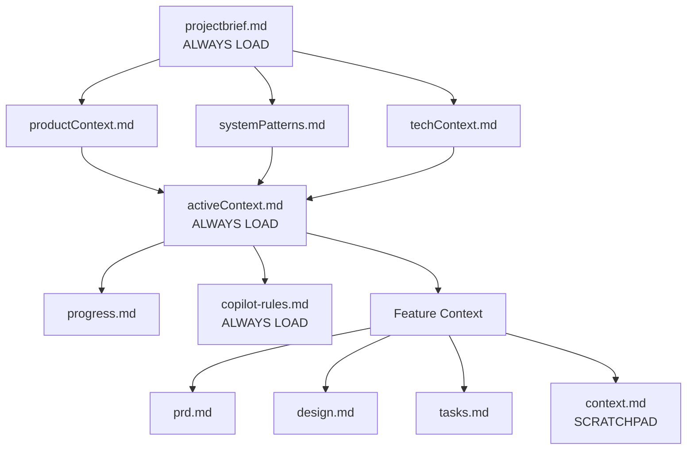
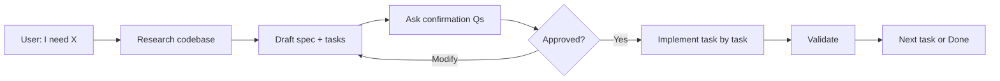

# Memory Bank & Context Engineering Instructions

## Purpose

This document instructs GitHub Copilot on how to:

1. **Maintain memory** across sessions using persistent Markdown files
2. **Load context efficiently** using progressive loading (not all files upfront)
3. **Recover from resets** by reading structured state files
4. **Manage tokens** by compressing and isolating context

**Key Insight:** Copilot's memory resets between sessions. The Memory Bank (`/memory-bank/`) is the single source of truth.

---

## Quick Start: What to Do First

### On Every New Task

```markdown
1. ALWAYS READ:
   - projectbrief.md    → What is this project?
   - activeContext.md   → What are we working on NOW?
   - copilot-rules.md   → What rules must I follow?

2. THEN READ (based on task):
   - Requirements work  → + productContext.md
   - Architecture work  → + systemPatterns.md, techContext.md
   - Implementation     → + /memory-bank/<feature>/*.md
   - Status check       → + progress.md
```

### On Context Reset (New Session)

```markdown
1. Read activeContext.md     → "Where did we leave off?"
2. Read feature context.md   → "What decisions were made?"
3. Read progress.md          → "What's done, what's pending?"
4. Resume from last task
```

---

## Memory Bank Structure

```markdown
/memory-bank/
├── `projectbrief.md`      ← ALWAYS LOAD: scope, goals
├── `activeContext.md`     ← ALWAYS LOAD: current focus
├── `copilot-rules.md`     ← ALWAYS LOAD: safety rules
│
├── `productContext.md`    ← ON DEMAND: user problems, UX goals
├── `systemPatterns.md`    ← ON DEMAND: architecture patterns
├── `techContext.md`       ← ON DEMAND: tech stack, constraints
├── `progress.md`          ← ON DEMAND: completion status
│
└── <feature>/           ← PER-FEATURE CONTEXT
    ├── `prd.md`           # Requirements (user stories, acceptance criteria)
    ├── `design.md`        # Architecture (diagrams, data models, APIs)
    ├── `tasks.md`         # Task breakdown (TASK_ID, effort, dependencies)
    └── `context.md`       # SCRATCHPAD: decisions, blockers, notes
```

### File Dependency Hierarchy



---

## The Four Context Strategies

### 1. WRITE: Persist Decisions

**What:** Save information that must survive context resets.
**Where:** `/memory-bank/<feature>/context.md` (the scratchpad)
**When:** After every significant decision or blocker.

**Scratchpad Format:**

```markdown
# Feature Context: notifications

## Phase: IMPLEMENTATION

## Session: 2025-11-28

### Decisions Made
| Decision | Choice | Rationale |
|----------|--------|-----------|
| Validation library | Zod | Better TypeScript inference than TypeBox |
| Queue type | Database | Persistence required per NFR-3 |
| Rate limit | 100/min/user | Balance UX with system load |

### Blockers
- [ ] Waiting on email API credentials from DevOps

### Completed Tasks
- [x] NOTIFY-1: Service scaffold
- [x] NOTIFY-2: Email channel
- [ ] NOTIFY-3: Push channel (in progress)

### Open Questions
- Should we batch notifications? (ask user)
- WebSocket vs SSE for real-time? (research needed)
```

### 2. SELECT: Load Only What You Need

**What:** Pull context relevant to current task type.
**How:** Match task type to required files.

| Task Type | Load These Files |
|-----------|------------------|
| **Requirements** | projectbrief + productContext |
| **Architecture** | projectbrief + systemPatterns + techContext |
| **Implementation** | projectbrief + activeContext + feature/*.md |
| **Status Update** | activeContext + progress.md |
| **Debugging** | activeContext + feature/context.md + related code |

**Example:** Implementing NOTIFY-3

```markdown
Load:
✅ projectbrief.md (always)
✅ activeContext.md (always)
✅ copilot-rules.md (always)
✅ /memory-bank/notifications/design.md (architecture)
✅ /memory-bank/notifications/tasks.md (task details)
✅ /memory-bank/notifications/context.md (decisions)

Skip:
❌ productContext.md (not doing requirements)
❌ progress.md (not updating status)
❌ /memory-bank/other-feature/* (unrelated)
```

### 3. COMPRESS: Reduce Token Usage

**What:** Summarize conversation history to fit context window.
**When:**

- After 50+ conversation turns
- When context window is 80%+ full
- Before starting a new major phase

**How to Compress:**

```markdown
## Compressed: Session 2025-11-28

### Summary
Implemented NOTIFY-1 through NOTIFY-3 (email and push channels).

### Key Outcomes
- Created: src/mastra/tools/notifications.ts
- Created: src/mastra/tools/tests/notifications.test.ts
- Integrated with existing event bus

### Decisions Locked
- Database queue (not in-memory) — persistence required
- Resend for email — already in project dependencies
- Rate limit: 100/min/user

### Pending
- NOTIFY-4: Event bus integration
- NOTIFY-5: User preferences
- NOTIFY-6: Admin config UI

### Open Questions (still unresolved)
- Batch notifications? (user to decide)
```

**Compression Rules:**

1. Keep: Decisions, outcomes, file paths, blockers
2. Remove: Intermediate reasoning, exploration, failed attempts
3. Preserve: Open questions, pending tasks

### 4. ISOLATE: One Task = One Focus

**What:** Each task implementation operates in isolated context.
**How:**

- Load ONLY files relevant to current TASK_ID
- Do NOT cross-reference unrelated features
- Use scratchpad to pass state between tasks

**Example Flow:**

```markdown
/implement NOTIFY-3
├── Load: notifications/design.md, notifications/tasks.md
├── Focus: NOTIFY-3 acceptance criteria only
├── Implement: Push channel
├── Validate: Run tests, lint, types
├── Write: Update notifications/context.md with decisions
└── Isolate: Do NOT touch NOTIFY-4,5,6 code

/implement NOTIFY-4
├── Load: notifications/context.md (read NOTIFY-3 decisions)
├── Focus: NOTIFY-4 acceptance criteria only
└── Continue...
```

---

## Workflows

### Automatic Workflow (Preferred)

When user describes a feature:



### Manual Workflow (Slash Commands)

When user wants explicit control:

```markdown
/start feature <name>  → Create feature folder + templates
/approve               → Confirm current phase, proceed
/implement <TASK_ID>   → Implement one specific task
/status                → Show phase, progress, blockers
/pause                 → Stop automatic progression
/context summary       → Compress current session
```

---

## Validation Hooks

After EVERY implementation:

```bash
# 1. Run tests
npm test -- --grep <pattern>
# or: npx vitest -t <pattern>

# 2. Run lint
npx eslint <affected-files> --max-warnings=0

# 3. Run type check
npx tsc --noEmit
```

**Output Format:**

```markdown
✅ Tests: 12/12 passing
✅ Lint: 0 warnings, 0 errors
✅ Types: No errors
→ NOTIFY-3 complete. Proceeding to NOTIFY-4...

# OR if failure:
❌ Tests: 10/12 passing (2 failed)
   - notifications.test.ts:45 - Expected push to be called
   - notifications.test.ts:67 - Timeout exceeded
→ Fix required before proceeding.
```

---

## Self-Consistency Protocol

For architectural or security decisions:

```markdown
## Decision: Notification Queue Storage

### Option A: In-Memory Queue
+ Fast, simple implementation
- Lost on restart (unacceptable for notifications)
- Not horizontally scalable

### Option B: Database Queue ← SELECTED
+ Persistent across restarts
+ Scales horizontally with read replicas
- Slightly more complex setup

### Option C: External Message Broker (RabbitMQ/Redis)
+ Industry standard, battle-tested
- Overkill for current scale (< 10k users)
- Additional infrastructure to maintain

### Decision
**Option B: Database Queue**

Rationale: NFR-3 requires notification persistence. Database approach balances simplicity with reliability. Can migrate to Option C if scale exceeds 100k users.
```

---

## File Templates

### activeContext.md

```markdown
# Active Context

## Current Focus
Implementing notification system (NOTIFY-3: Push channel)

## Recent Changes
- 2025-11-28: Completed NOTIFY-1 (service scaffold)
- 2025-11-28: Completed NOTIFY-2 (email channel with Resend)

## Next Steps
1. Complete NOTIFY-3 push implementation
    - Web-push integration
    - Native notification handling
    - Apply rate limiting
2. Integrate with event bus (NOTIFY-4)
    - Database queue setup
    - Event listener implementation
    - Write
    - What 4
3. User preference UI (NOTIFY-5)
    - Simple toggle interface
    - Store preferences in user profile
    - Admin config UI (NOTIFY-6)
    - Basic settings page
    - Save to database
    - Admin auth
    - Write mechanism


## Active Decisions
- Batch vs immediate notifications: Waiting for user input
```

### Feature context.md

```markdown
# Feature Context: notifications

## Phase: IMPLEMENTATION

## Decisions
| Decision | Choice | Rationale |
|----------|--------|-----------|
| Email provider | Resend | Already in project deps |
| Queue storage | PostgreSQL | Persistence required |
| Rate limit | 100/min/user | Balance UX + load |

## Blockers
- [ ] Need email API key from DevOps

## Session: 2025-11-28
- Implemented NOTIFY-1,2,3
- Chose database queue over in-memory
- Rate limiting added at service layer
```

---

## Anti-Patterns to Avoid

| ❌ Don't Do This | ✅ Do This Instead |
|------------------|-------------------|
| Load ALL memory bank files at start | Load only what current task needs |
| Keep all conversation history | Compress after 50+ turns |
| Mix multiple task implementations | Isolate: one task per focus |
| Forget decisions after reset | Write to context.md immediately |
| Skip validation hooks | Always run tests, lint, types |
| Make assumptions | Ask targeted confirmation questions |

---

## Quick Reference Card

```markdown
┌─────────────────────────────────────────────────────────────┐
│ ALWAYS LOAD: projectbrief + activeContext + copilot-rules   │
├─────────────────────────────────────────────────────────────┤
│ WRITE decisions → context.md (scratchpad)                   │
│ SELECT context → based on task type                         │
│ COMPRESS → after 50 turns or 80% window                     │
│ ISOLATE → one TASK_ID at a time                             │
├─────────────────────────────────────────────────────────────┤
│ VALIDATE: eslint → tsc --noEmit                             │
├─────────────────────────────────────────────────────────────┤
│ RECOVERY: activeContext → context.md → progress → resume    │
└─────────────────────────────────────────────────────────────┘
```

---

*Last updated: 2025-11-28*
*Version: 2.1.0*
