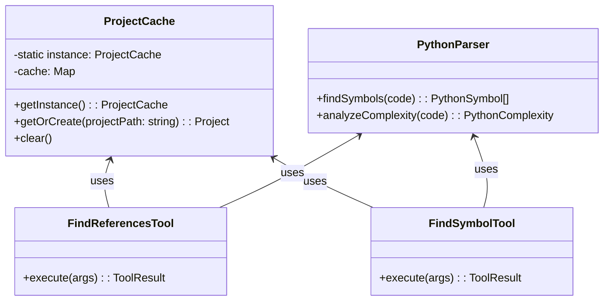

# Design: Semantic Code Analysis Tools

## Overview
The system uses `ts-morph` to provide semantic analysis capabilities. To mitigate the high cost of parsing TypeScript projects, a `ProjectCache` singleton maintains `Project` instances in memory.

## Architecture



## Data Models

### CachedProject
```typescript
interface CachedProject {
  project: Project; // ts-morph Project
  lastAccess: number;
  fileCount: number;
}
```

### Tool Inputs (Zod)

**find-references**
```typescript
z.object({
  symbolName: z.string(),
  projectPath: z.string().default(process.cwd()),
  filePath: z.string().optional(),
  line: z.number().optional(),
})
```

**find-symbol**
```typescript
z.object({
  symbolName: z.string(),
  projectPath: z.string().default(process.cwd()),
  symbolType: z.enum(['all', 'function', 'class', 'interface', 'variable', 'type']).default('all'),
})
```

## Tech Decisions
| Decision | Choice | Rationale |
|----------|--------|-----------|
| Library | `ts-morph` | Powerful wrapper around TS Compiler API, easier to use. |
| Caching | Singleton `ProjectCache` | Parsing a project takes seconds; caching makes subsequent lookups milliseconds. |
| Scope | TS/JS & Python | TS/JS via `ts-morph`, Python via `ast` module (child_process). |

## Risks & Mitigations
| Risk | Mitigation |
|------|------------|
| Memory Leaks | Implement LRU or simple size limit in `ProjectCache`. |
| Stale Cache | `ts-morph` can refresh source files, or we can provide a `refresh` flag. |
