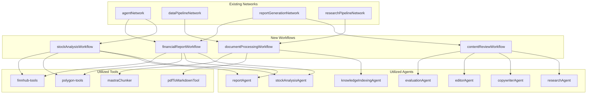
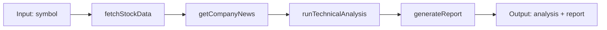
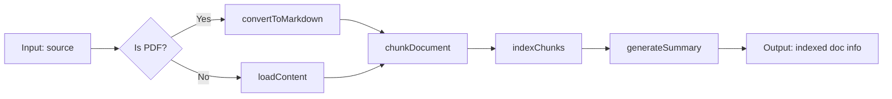
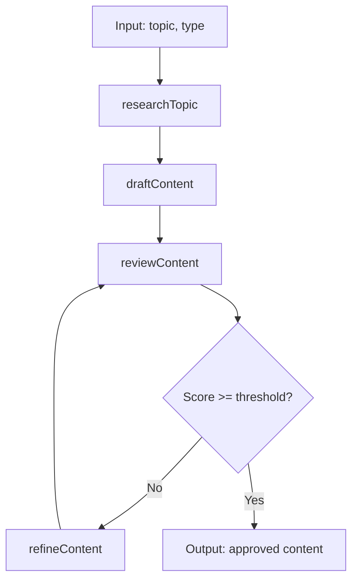
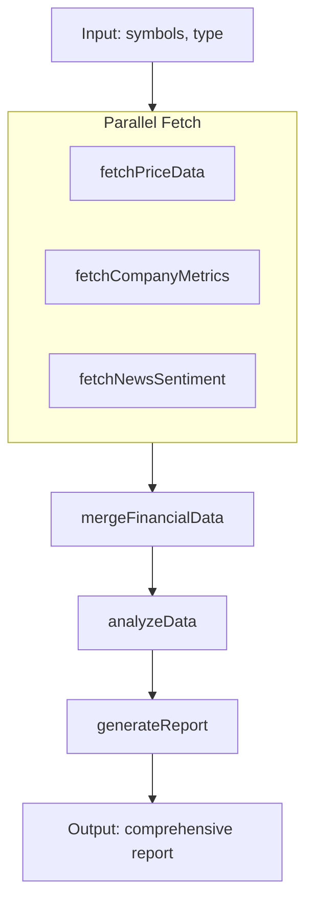

# Design Document: Network-Ready Workflows

## Architecture Overview



## Workflow Designs

### 1. Stock Analysis Workflow

**Flow:** Sequential with data enrichment



**Schemas:**

```typescript
inputSchema: z.object({
  symbol: z.string().describe('Stock ticker symbol'),
  analysisDepth: z.enum(['quick', 'standard', 'deep']).default('standard')
})

outputSchema: z.object({
  symbol: z.string(),
  analysis: z.object({
    technicalIndicators: z.record(z.any()),
    sentiment: z.string(),
    recommendation: z.string(),
    confidence: z.number()
  }),
  report: z.string()
})
```

### 2. Document Processing Workflow

**Flow:** Sequential pipeline with conditional PDF handling



**Schemas:**

```typescript
inputSchema: z.object({
  source: z.object({
    type: z.enum(['url', 'path', 'content']),
    value: z.string()
  }),
  chunkStrategy: z.enum(['paragraph', 'sentence', 'recursive']).default('recursive'),
  indexName: z.string().default('documents')
})

outputSchema: z.object({
  documentId: z.string(),
  chunksCount: z.number(),
  indexed: z.boolean(),
  summary: z.string()
})
```

### 3. Content Review Workflow

**Flow:** Loop until quality threshold met



**Schemas:**

```typescript
inputSchema: z.object({
  topic: z.string(),
  contentType: z.enum(['blog', 'report', 'script', 'social']),
  targetAudience: z.string().optional(),
  qualityThreshold: z.number().min(0).max(100).default(80)
})

outputSchema: z.object({
  content: z.string(),
  score: z.number(),
  iterations: z.number(),
  feedback: z.array(z.string())
})
```

### 4. Financial Report Workflow

**Flow:** Parallel data fetching, then merge and report



**Schemas:**

```typescript
inputSchema: z.object({
  symbols: z.array(z.string()).min(1),
  reportType: z.enum(['daily', 'weekly', 'quarterly']),
  includeNews: z.boolean().default(true),
  includeTechnicals: z.boolean().default(true)
})

outputSchema: z.object({
  reportId: z.string(),
  generatedAt: z.string(),
  summary: z.string(),
  report: z.string(),
  data: z.record(z.any())
})
```

## Technical Decisions

### 1. Agent Access Pattern
Use `mastra.getAgent()` within step execute functions to ensure proper context injection and access to shared resources.

### 2. Tool Integration
Import tools directly from `src/mastra/tools` and call via `.execute()` within steps.

### 3. Error Handling
Use step-level retries for API calls (polygon, finnhub) with `retries` parameter.

### 4. State Management
Pass data through step outputs; use `.map()` for transformations between incompatible schemas.

### 5. Network Compatibility

- Clear descriptions for routing decisions
- Well-defined inputSchema/outputSchema
- Descriptive step IDs for debugging

## File Structure

```bash
src/mastra/workflows/
├── index.ts (updated with exports)
├── stock-analysis-workflow.ts
├── document-processing-workflow.ts
├── content-review-workflow.ts
└── financial-report-workflow.ts
```

## Integration Points

### Network Updates Required

1. **agentNetwork** - Add stockAnalysisWorkflow, financialReportWorkflow
2. **dataPipelineNetwork** - Add documentProcessingWorkflow
3. **reportGenerationNetwork** - Add contentReviewWorkflow, financialReportWorkflow
4. **researchPipelineNetwork** - Add documentProcessingWorkflow

### Registration in mastra/index.ts

```typescript
workflows: {
  // existing
  weatherWorkflow,
  contentStudioWorkflow,
  changelogWorkflow,
  telephoneGameWorkflow,
  // new
  stockAnalysisWorkflow,
  documentProcessingWorkflow,
  contentReviewWorkflow,
  financialReportWorkflow,
}
```
