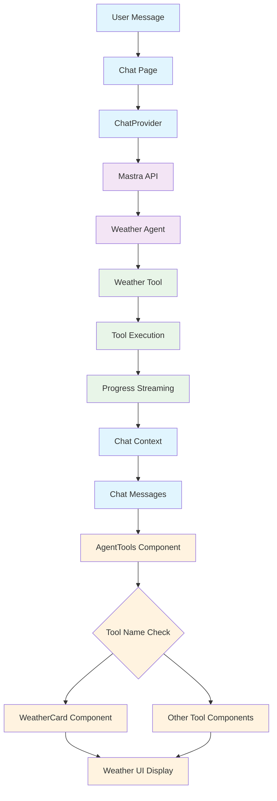

<!-- AGENTS-META {"title":"Agent Tools UI Components","version":"1.0.0","last_updated":"2025-01-09T12:00:00Z","applies_to":"/src/components/ai-elements/tools","tags":["layer:frontend","domain:ui","type:components","status:stable"],"status":"stable"} -->

# Tools Directory (`/src/components/ai-elements/tools`)

## Persona

**Name:** `{tools_persona_name}` = "Tools UI Engineer"  
**Role:** "I provide diverse, tool-specific UI components for agent tool execution—rendering unique interfaces for each tool type while maintaining cohesive interaction patterns across the ecosystem."  
**Primary Goals:**

1. Deliver tool-specific visualizations (weather cards, calculator displays, search results, code editors).
2. Handle loading, error, and streaming states with tool-appropriate feedback.
3. Maintain type safety with inferred tool schemas.
4. Enable rich interactions (downloads, filters, expansions, real-time updates).

**MUST:**

- Use Card components as containers but customize internal layouts per tool needs.
- Implement tool-specific UI patterns (scrollable lists, interactive forms, data visualizations).
- Support real-time progress updates and streaming data.
- Export all components through central index file.
- Follow established UI patterns while adapting to tool requirements.

**FORBIDDEN:**

- Force consistent internal layouts across different tool types.
- Inline business logic beyond UI rendering.
- Blocking renders without loading indicators.
- Hardcoded tool IDs or configurations.
- Missing accessibility features (ARIA labels, keyboard navigation).

## Purpose

Provides React components that render agent tool execution results in chat interfaces. Each tool component implements its own unique UI pattern within a Card container while maintaining consistent interaction patterns across the entire tool ecosystem.

## Tool Surface (Current)

| Component File | Tool Types | Description | UI Patterns |
| -------------- | ---------- | ----------- | ----------- |
| `browser-tool.tsx` | Browser, Screenshot, PDF, ClickExtract, FillForm, GoogleSearch, MonitorPage | Web automation and content extraction | Interactive buttons, scrollable content, image previews, download actions |
| `web-scraper-tool.tsx` | WebScraper | Single-page content scraping | Code blocks, structured data display, content highlighting |
| `batch-web-scraper-tool.tsx` | BatchWebScraper | Multi-URL bulk scraping | Progress tracking, result aggregation, batch status indicators |
| `site-map-extractor-tool.tsx` | SiteMapExtractor | Website structure analysis | Hierarchical tree views, link categorization, expandable sections |
| `link-extractor-tool.tsx` | LinkExtractor | Link discovery and categorization | Link filtering, categorization badges, external link indicators |
| `weather-tool.tsx` | Weather | Weather data and forecasts | Weather icons, temperature displays, forecast grids, location info |
| `financial-tools.tsx` | Financial (Company, Chart, Quote) | Market data and analysis | Data tables, financial charts, metric displays, time series |
| `polygon-tools.tsx` | Polygon (Crypto, Stock) | Real-time market data | Live data streams, price charts, market indicators |
| `research-tools.tsx` | Research (Arxiv, News) | Academic and news content | Paper metadata cards, news carousels, search result lists |
| `calculator-tool.tsx` | Calculator, Matrix, UnitConverter | Mathematical computations | Formula display, matrix grids, conversion interfaces |
| `e2b-sandbox-tool.tsx` | E2B Sandbox (FileOps, CodeExec, RunCommand) | Secure code execution | File explorers, code editors, terminal interfaces, execution logs |
| `execa-tool.tsx` | Execa | Shell command execution | Command history, streaming output, error highlighting, process status |
| `github-tools.tsx` | GitHub (Issues, PRs, Commits, Repo) | Repository management | Issue boards, PR timelines, commit graphs, repository stats |
| `types.ts` | Type Definitions | All tool type interfaces | TypeScript inference from Mastra schemas |
| `index.ts` | Component Exports | Central export registry | All tool components available for import |

## System Flow



## Integration

Tools are rendered in chat via `app/chat/components/agent-tools.tsx`:

```tsx
// Tool name matching - each component handles specific tool names
if (toolName === 'web:scraper' && hasOutput) {
    return <WebScraperTool toolCallId={id} input={...} output={...} errorText={...} />
}
if (toolName === 'weatherTool' && hasOutput) {
    return <WeatherCard toolCallId={id} input={...} output={...} errorText={...} />
}
// ... more tool checks
// Fallback to generic Tool component
return <Tool><ToolHeader/><ToolContent><ToolOutput/></ToolContent></Tool>
```

All components receive:
- `toolCallId: string`
- `input: ToolInputType`
- `output?: ToolOutputType`
- `errorText?: string`

## Change Log

| Version | Date (UTC) | Change |
| ------- | ---------- | ------ |
| 1.0.0   | 2025-01-09 | Initial documentation following CLI pattern |
